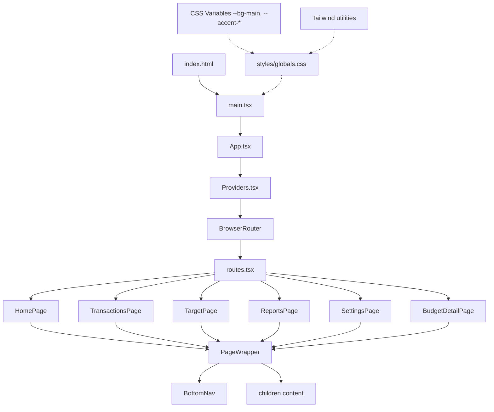
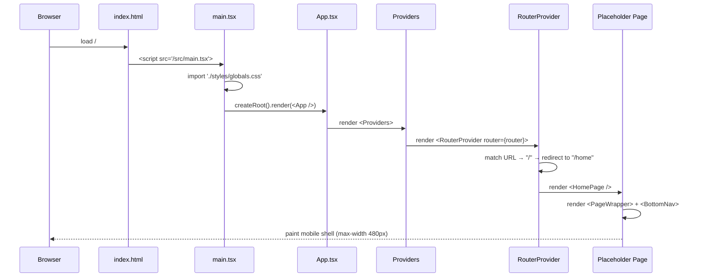
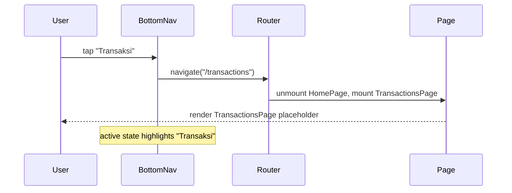
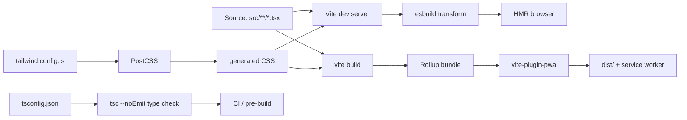
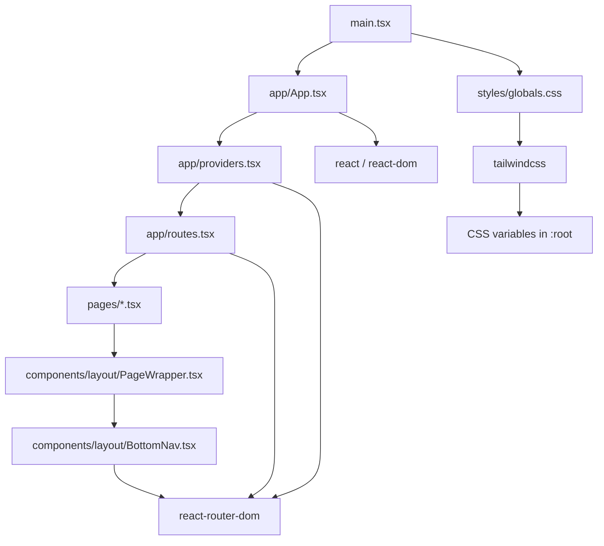

# Design Document: Sprint 0 — Project Setup

## Overview

Sprint 0 menyiapkan fondasi teknis Luma sebagai mobile-first PWA: Vite + React + TypeScript app dengan Tailwind CSS (CSS variables driven), React Router, dan struktur folder sesuai `docs/TECHNICAL_ARCHITECTURE.md` section 3. Sprint ini hanya scaffolding — tidak ada business logic, IndexedDB akses, atau Zustand store yang berfungsi. Tujuannya: app jalan lokal, semua route render placeholder page, bottom nav muncul di route yang sesuai, dan struktur folder siap diisi sprint berikutnya.

Pendekatan: install seluruh dependency yang dibutuhkan sepanjang roadmap (sampai Sprint 12) sekaligus supaya sprint berikutnya tidak perlu menyentuh `package.json` lagi, tapi hanya scaffold yang dipakai sekarang yang diimport. Folder `features/`, `stores/`, `db/`, `lib/`, `types/` dibuat dengan `index.ts` kosong/placeholder agar siap diisi tanpa restrukturisasi.

## Architecture

### High-Level Folder Structure

```txt
luma/
├── AGENTS.md                          (existing)
├── docs/                              (existing — PRD, BUILD_PLAN, etc.)
├── public/
│   ├── manifest.webmanifest           (placeholder, finalized in Sprint 12)
│   └── icons/                         (placeholder)
├── src/
│   ├── app/
│   │   ├── App.tsx                    (root, mounts router)
│   │   ├── routes.tsx                 (route table)
│   │   └── providers.tsx              (provider composition)
│   ├── pages/
│   │   ├── HomePage.tsx               (placeholder)
│   │   ├── TransactionsPage.tsx       (placeholder)
│   │   ├── TargetPage.tsx             (placeholder)
│   │   ├── ReportsPage.tsx            (placeholder)
│   │   ├── SettingsPage.tsx           (placeholder)
│   │   └── BudgetDetailPage.tsx       (placeholder)
│   ├── components/
│   │   ├── layout/
│   │   │   ├── PageWrapper.tsx        (placeholder shell)
│   │   │   └── BottomNav.tsx          (placeholder, 4 tabs)
│   │   ├── cards/                     (empty, .gitkeep)
│   │   ├── sheets/                    (empty, .gitkeep)
│   │   ├── forms/                     (empty, .gitkeep)
│   │   ├── charts/                    (empty, .gitkeep)
│   │   ├── character/                 (empty, .gitkeep)
│   │   ├── theme/                     (empty, .gitkeep)
│   │   └── ui/                        (empty, .gitkeep)
│   ├── features/
│   │   ├── transactions/              (empty, .gitkeep)
│   │   ├── budgets/                   (empty, .gitkeep)
│   │   ├── savings/                   (empty, .gitkeep)
│   │   ├── reports/                   (empty, .gitkeep)
│   │   ├── customization/             (empty, .gitkeep)
│   │   └── ai/                        (empty, .gitkeep)
│   ├── stores/                        (empty, .gitkeep)
│   ├── db/                            (empty, .gitkeep)
│   ├── lib/                           (empty, .gitkeep)
│   ├── types/                         (empty, .gitkeep)
│   ├── styles/
│   │   └── globals.css                (Tailwind + CSS variables)
│   └── main.tsx                       (Vite entry)
├── index.html
├── package.json
├── tsconfig.json
├── tsconfig.node.json
├── vite.config.ts
├── tailwind.config.ts
├── postcss.config.js
└── .gitignore
```

### Architecture Diagram



### Sequence Diagram — App Boot



### Sequence Diagram — Bottom Nav Navigation



### Build Pipeline



Pipeline rules for Sprint 0:
- `npm run dev` → Vite dev server, HMR, on `http://localhost:5173`
- `npm run build` → type check (`tsc -b`) then `vite build` → `dist/`
- `npm run preview` → serve `dist/` locally
- `vite-plugin-pwa` configured but service worker registration is deferred (set to `registerType: 'prompt'`, `injectRegister: false`) — actual SW activation is Sprint 12 work. Plugin is wired so build artifact validates without errors.

### Dependency Graph



External libraries installed in Sprint 0 but **not imported yet**: `zustand`, `idb`, `nanoid`, `date-fns`, `framer-motion`, `recharts`, `xlsx`, `jspdf`, `html2canvas`, `vite-plugin-pwa`. These are reserved for future sprints; importing them now would be premature.

## Components and Interfaces

### Component: PageWrapper

**Purpose**: Mobile-first shell that wraps every page. Enforces max-width 480px, applies background layer, and conditionally renders `BottomNav`.

```ts
interface PageWrapperProps {
  children: React.ReactNode;
  /** Whether to show the bottom nav. Default true. Set false for routes outside the 4-tab nav (e.g., /settings, /budget). */
  showBottomNav?: boolean;
  /** Optional title for placeholder/dev visibility. */
  title?: string;
}
```

**Responsibilities**:
- Apply `max-w-[480px]` mobile container, centered
- Apply background color from `--bg-main` CSS variable
- Reserve bottom padding when `showBottomNav` is true
- Render `<BottomNav />` when `showBottomNav` is true

### Component: BottomNav

**Purpose**: Fixed bottom navigation showing exactly 4 tabs: Home, Transaksi, Target, Laporan. Highlights active route. Settings and Budget routes do NOT appear here.

```ts
interface BottomNavItem {
  to: string;          // route path
  label: string;       // Indonesian label
  testId: string;      // for future tests
}

interface BottomNavProps {
  // no props — items are static
}
```

**Static items** (in order):
```ts
const NAV_ITEMS: BottomNavItem[] = [
  { to: "/home",         label: "Home",     testId: "nav-home" },
  { to: "/transactions", label: "Transaksi", testId: "nav-transactions" },
  { to: "/target",       label: "Target",   testId: "nav-target" },
  { to: "/reports",      label: "Laporan",  testId: "nav-reports" },
];
```

**Responsibilities**:
- Render 4 fixed nav items
- Highlight active item via `useLocation()` from `react-router-dom`
- Use `<NavLink>` for navigation
- Sprint 0 uses placeholder text icons (e.g., "🏠"); real icons come in Sprint 1

### Component: Providers

**Purpose**: Compose all top-level providers. Sprint 0 only includes router; future sprints add theme, store hydration, error boundary, etc.

```ts
interface ProvidersProps {
  children?: React.ReactNode;
}
```

**Responsibilities**:
- Wrap `<RouterProvider router={router} />` (router from `routes.tsx`)
- Future-ready for `<ThemeProvider>`, `<ErrorBoundary>`, `<ToastProvider>`

### Component: Placeholder Pages

All six placeholder pages share the same shape — they are scaffolding only.

```ts
// HomePage, TransactionsPage, TargetPage, ReportsPage:
//   render inside PageWrapper with showBottomNav={true}
// SettingsPage, BudgetDetailPage:
//   render inside PageWrapper with showBottomNav={false}
```

Each placeholder shows the page title and a short caption like `"Coming soon — Sprint X"` so devs can verify routing visually.

## Data Models

Sprint 0 defines **no runtime data models**. The `src/types/` folder is created empty (with `.gitkeep`); domain types from `docs/TECHNICAL_ARCHITECTURE.md` section 7 (Transaction, MonthlyBudget, SavingGoal, etc.) land in Sprint 2.

The only "data" in Sprint 0 is the static route table:

```ts
// app/routes.tsx
type RoutePath =
  | "/"
  | "/home"
  | "/transactions"
  | "/target"
  | "/reports"
  | "/settings"
  | "/budget";
```

**Validation Rules**:
- `/` MUST redirect to `/home`
- All 6 listed routes MUST resolve to a page component
- Unknown routes MUST resolve to `/home` (catch-all redirect, simple fallback for Sprint 0; a real 404 page lands later)

## Algorithmic Pseudocode

### Algorithm: App Bootstrap

```pascal
ALGORITHM bootstrapApp()
INPUT: none
OUTPUT: rendered React app mounted at #root

BEGIN
  ASSERT document.getElementById("root") IS NOT NULL

  // Step 1: import side-effect CSS
  IMPORT "./styles/globals.css"
  // postcondition: Tailwind base + CSS variables active in :root

  // Step 2: create root and render
  rootElement ← document.getElementById("root")
  reactRoot ← ReactDOM.createRoot(rootElement)
  reactRoot.render(<StrictMode><App /></StrictMode>)

  ASSERT rootElement.children.length > 0
END
```

**Preconditions:**
- `index.html` contains `<div id="root"></div>`
- `globals.css` is importable from `src/styles/globals.css`

**Postconditions:**
- React tree mounted
- CSS variables (`--bg-main`, `--accent-primary`, etc.) defined on `:root`
- Tailwind utility classes resolvable

**Loop Invariants:** N/A (no loops)

### Algorithm: Route Resolution

```pascal
ALGORITHM resolveRoute(currentPath)
INPUT: currentPath of type string (browser location.pathname)
OUTPUT: pageComponent of type ReactElement

BEGIN
  ASSERT currentPath IS string

  routeTable ← [
    { path: "/",             element: <Navigate to="/home" replace /> },
    { path: "/home",         element: <HomePage /> },
    { path: "/transactions", element: <TransactionsPage /> },
    { path: "/target",       element: <TargetPage /> },
    { path: "/reports",      element: <ReportsPage /> },
    { path: "/settings",     element: <SettingsPage /> },
    { path: "/budget",       element: <BudgetDetailPage /> },
    { path: "*",             element: <Navigate to="/home" replace /> }
  ]

  FOR each route IN routeTable DO
    IF matches(currentPath, route.path) THEN
      RETURN route.element
    END IF
  END FOR

  // unreachable due to "*" catch-all
  RETURN <Navigate to="/home" replace />
END
```

**Preconditions:**
- React Router v6 is installed and `createBrowserRouter` is available
- All page components import successfully

**Postconditions:**
- Exactly one page component is rendered for any given path
- `/` always redirects to `/home`
- Unknown paths always redirect to `/home`

**Loop Invariants:**
- At most one route in `routeTable` matches a given path before the catch-all

### Algorithm: Bottom Nav Visibility

```pascal
ALGORITHM shouldShowBottomNav(currentPath)
INPUT: currentPath of type string
OUTPUT: boolean

BEGIN
  navRoutes ← {"/home", "/transactions", "/target", "/reports"}

  IF currentPath IN navRoutes THEN
    RETURN true
  ELSE
    RETURN false
  END IF
END
```

**Preconditions:**
- `currentPath` is a normalized pathname

**Postconditions:**
- Returns `true` only for the 4 nav-tab routes
- Returns `false` for `/settings`, `/budget`, and any unknown path

**Loop Invariants:** N/A

Note: in implementation this is encoded via the `showBottomNav` prop on each page rather than a runtime function — the prop value is fixed per page.

## Key Functions with Formal Specifications

### File: `src/main.tsx`

```ts
// signature: side-effect module, no exports needed
// imports: React, ReactDOM, App, './styles/globals.css'
function main(): void
```

**Preconditions:**
- DOM is ready (script loaded with `type="module"` at end of body, or via Vite's standard `index.html`)
- `#root` element exists

**Postconditions:**
- React app mounted in StrictMode
- Global stylesheet applied

**Loop Invariants:** N/A

### File: `src/app/App.tsx`

```ts
export function App(): JSX.Element
```

**Preconditions:**
- React is loaded
- `Providers` and route table can be imported

**Postconditions:**
- Returns a tree wrapping the router inside providers
- Pure: no side effects on first render

**Loop Invariants:** N/A

### File: `src/app/providers.tsx`

```ts
interface ProvidersProps {
  children?: React.ReactNode;
}
export function Providers(props: ProvidersProps): JSX.Element
```

**Preconditions:**
- React Router v6 `RouterProvider` and the configured `router` are importable

**Postconditions:**
- Returns a single React element composing the router (and any future providers)
- `props.children` may be ignored in Sprint 0 because router takes over rendering — kept in signature for forward compatibility

**Loop Invariants:** N/A

### File: `src/app/routes.tsx`

```ts
import { createBrowserRouter, RouteObject } from "react-router-dom";

export const routeObjects: RouteObject[]; // static, exported for tests
export const router: ReturnType<typeof createBrowserRouter>;
```

**Preconditions:**
- All 6 page components export a default or named React component
- `react-router-dom` v6+ is installed

**Postconditions:**
- `router` matches all 7 declared paths plus catch-all
- `/` and `*` redirect to `/home`
- `routeObjects` is a frozen-shape array suitable for unit testing

**Loop Invariants:** N/A

### File: `src/components/layout/BottomNav.tsx`

```ts
export function BottomNav(): JSX.Element
```

**Preconditions:**
- Rendered inside a React Router context (`<RouterProvider>` ancestor)
- `useLocation()` returns a valid location

**Postconditions:**
- Renders exactly 4 `<NavLink>` items in this order: Home, Transaksi, Target, Laporan
- The `NavLink` corresponding to the current pathname has `aria-current="page"`
- Component is fixed to bottom of viewport via Tailwind classes

**Loop Invariants:**
- During the items map, every iteration produces exactly one `<NavLink>`; total output count equals `NAV_ITEMS.length` (4)

### File: `src/components/layout/PageWrapper.tsx`

```ts
interface PageWrapperProps {
  children: React.ReactNode;
  showBottomNav?: boolean; // default: true
  title?: string;
}
export function PageWrapper(props: PageWrapperProps): JSX.Element
```

**Preconditions:**
- `children` is renderable React content

**Postconditions:**
- Returns a `<div>` with `max-width: 480px`, centered horizontally
- When `showBottomNav !== false`, renders `<BottomNav />` and adds bottom padding for the nav height
- When `showBottomNav === false`, no `<BottomNav />` rendered and no bottom padding reserved

**Loop Invariants:** N/A

### File: `vite.config.ts`

```ts
import { defineConfig } from "vite";
import react from "@vitejs/plugin-react";
import { VitePWA } from "vite-plugin-pwa";

export default defineConfig({
  plugins: [
    react(),
    VitePWA({
      registerType: "prompt",
      injectRegister: false,        // Sprint 12 will flip this on
      manifest: {
        name: "Luma",
        short_name: "Luma",
        description: "Cozy customizable finance space",
        theme_color: "#1A1410",
        background_color: "#1A1410",
        display: "standalone",
        start_url: "/home",
        icons: [],                  // populated in Sprint 12
      },
      workbox: { globPatterns: ["**/*.{js,css,html,svg,png,webp}"] },
    }),
  ],
  server: { port: 5173, host: true },
  build: { target: "es2020", outDir: "dist", sourcemap: true },
});
```

**Preconditions:**
- `vite`, `@vitejs/plugin-react`, `vite-plugin-pwa` installed

**Postconditions:**
- `npm run dev` starts dev server with HMR on port 5173
- `npm run build` produces `dist/` with PWA manifest stub
- Build does not fail because PWA plugin is in non-registering mode

**Loop Invariants:** N/A

### File: `tailwind.config.ts`

```ts
import type { Config } from "tailwindcss";

const config: Config = {
  content: ["./index.html", "./src/**/*.{ts,tsx}"],
  theme: {
    extend: {
      maxWidth: { app: "480px" },
      colors: {
        // CSS variables, not literal hex — themes swap at runtime
        "bg-main":       "var(--bg-main)",
        "bg-card":       "var(--bg-card)",
        "bg-card-soft":  "var(--bg-card-soft)",
        "text-primary":  "var(--text-primary)",
        "text-secondary":"var(--text-secondary)",
        "text-muted":    "var(--text-muted)",
        "accent-primary":  "var(--accent-primary)",
        "accent-secondary":"var(--accent-secondary)",
        "accent-soft":     "var(--accent-soft)",
      },
      fontFamily: {
        display: ["Fraunces", "serif"],
        body:    ["DM Sans", "system-ui", "sans-serif"],
      },
      borderRadius: {
        card: "24px",
        hero: "28px",
        sheet:"28px",
      },
    },
  },
  plugins: [],
};

export default config;
```

**Preconditions:**
- `tailwindcss`, `postcss`, `autoprefixer` installed

**Postconditions:**
- Tailwind picks up classes from `index.html` and `src/**/*.{ts,tsx}`
- Color utilities like `bg-bg-main`, `text-text-primary`, `bg-accent-primary` resolve via CSS variables
- Theme switching at runtime works by mutating CSS variables on `:root` (deferred to Sprint 9)

**Loop Invariants:** N/A

### File: `src/styles/globals.css`

```css
@tailwind base;
@tailwind components;
@tailwind utilities;

:root {
  /* Default: Cozy Dark — full token set per docs/DESIGN_SYSTEM.md §3 */
  --bg-main: #1A1410;
  --bg-card: #2A211B;
  --bg-card-soft: #342A22;
  --text-primary: #FFF3DC;
  --text-secondary: #CDBEA8;
  --text-muted: #9C8D7B;
  --accent-primary: #E8A857;
  --accent-secondary: #8FB896;
  --accent-soft: #F4D6A0;
  --danger-soft: #D96C5F;
  --success-soft: #8FB896;
  --warning-soft: #E8A857;
}

html, body, #root {
  height: 100%;
  margin: 0;
  background: var(--bg-main);
  color: var(--text-primary);
  font-family: "DM Sans", system-ui, sans-serif;
}
```

**Preconditions:**
- Imported once from `main.tsx`

**Postconditions:**
- Tailwind layers active
- All design tokens defined on `:root`
- Body uses `--bg-main` and `--text-primary` so app has correct base look immediately

**Loop Invariants:** N/A

### File: `package.json` (relevant excerpt)

```json
{
  "name": "luma",
  "private": true,
  "version": "0.0.0",
  "type": "module",
  "scripts": {
    "dev": "vite",
    "build": "tsc -b && vite build",
    "preview": "vite preview",
    "type-check": "tsc -b --pretty"
  },
  "dependencies": {
    "react": "^18.3.0",
    "react-dom": "^18.3.0",
    "react-router-dom": "^6.26.0",
    "zustand": "^4.5.0",
    "idb": "^8.0.0",
    "nanoid": "^5.0.0",
    "date-fns": "^3.6.0",
    "framer-motion": "^11.0.0",
    "recharts": "^2.12.0",
    "xlsx": "^0.18.5",
    "jspdf": "^2.5.1",
    "html2canvas": "^1.4.1"
  },
  "devDependencies": {
    "@types/react": "^18.3.0",
    "@types/react-dom": "^18.3.0",
    "@vitejs/plugin-react": "^4.3.0",
    "autoprefixer": "^10.4.0",
    "postcss": "^8.4.0",
    "tailwindcss": "^3.4.0",
    "typescript": "^5.5.0",
    "vite": "^5.4.0",
    "vite-plugin-pwa": "^0.20.0"
  }
}
```

**Preconditions:**
- Node 18+ available

**Postconditions:**
- `npm install` resolves all dependencies
- `npm run dev`, `npm run build`, `npm run preview` all execute without error on a fresh clone

**Loop Invariants:** N/A

## Example Usage

### Example 1: `src/main.tsx`

```ts
import React from "react";
import ReactDOM from "react-dom/client";
import { App } from "./app/App";
import "./styles/globals.css";

ReactDOM.createRoot(document.getElementById("root")!).render(
  <React.StrictMode>
    <App />
  </React.StrictMode>
);
```

### Example 2: `src/app/App.tsx`

```ts
import { Providers } from "./providers";

export function App(): JSX.Element {
  return <Providers />;
}
```

### Example 3: `src/app/providers.tsx`

```ts
import { RouterProvider } from "react-router-dom";
import { router } from "./routes";

export function Providers(): JSX.Element {
  // Future: wrap with ThemeProvider, ErrorBoundary, ToastProvider, etc.
  return <RouterProvider router={router} />;
}
```

### Example 4: `src/app/routes.tsx`

```ts
import { createBrowserRouter, Navigate, type RouteObject } from "react-router-dom";
import { HomePage } from "../pages/HomePage";
import { TransactionsPage } from "../pages/TransactionsPage";
import { TargetPage } from "../pages/TargetPage";
import { ReportsPage } from "../pages/ReportsPage";
import { SettingsPage } from "../pages/SettingsPage";
import { BudgetDetailPage } from "../pages/BudgetDetailPage";

export const routeObjects: RouteObject[] = [
  { path: "/",             element: <Navigate to="/home" replace /> },
  { path: "/home",         element: <HomePage /> },
  { path: "/transactions", element: <TransactionsPage /> },
  { path: "/target",       element: <TargetPage /> },
  { path: "/reports",      element: <ReportsPage /> },
  { path: "/settings",     element: <SettingsPage /> },
  { path: "/budget",       element: <BudgetDetailPage /> },
  { path: "*",             element: <Navigate to="/home" replace /> },
];

export const router = createBrowserRouter(routeObjects);
```

### Example 5: `src/components/layout/BottomNav.tsx`

```ts
import { NavLink } from "react-router-dom";

const NAV_ITEMS = [
  { to: "/home",         label: "Home",      testId: "nav-home" },
  { to: "/transactions", label: "Transaksi", testId: "nav-transactions" },
  { to: "/target",       label: "Target",    testId: "nav-target" },
  { to: "/reports",      label: "Laporan",   testId: "nav-reports" },
] as const;

export function BottomNav(): JSX.Element {
  return (
    <nav
      className="fixed bottom-0 left-1/2 -translate-x-1/2 w-full max-w-app
                 bg-bg-card border-t border-black/10
                 flex justify-around py-3 z-50"
      aria-label="Bottom navigation"
    >
      {NAV_ITEMS.map((item) => (
        <NavLink
          key={item.to}
          to={item.to}
          data-testid={item.testId}
          className={({ isActive }) =>
            `flex-1 text-center text-sm ${
              isActive ? "text-accent-primary font-bold" : "text-text-muted"
            }`
          }
        >
          {item.label}
        </NavLink>
      ))}
    </nav>
  );
}
```

### Example 6: `src/components/layout/PageWrapper.tsx`

```ts
import { BottomNav } from "./BottomNav";

interface PageWrapperProps {
  children: React.ReactNode;
  showBottomNav?: boolean;
  title?: string;
}

export function PageWrapper({
  children,
  showBottomNav = true,
  title,
}: PageWrapperProps): JSX.Element {
  return (
    <div className="mx-auto w-full max-w-app min-h-screen bg-bg-main text-text-primary">
      <main className={`px-5 pt-6 ${showBottomNav ? "pb-24" : "pb-6"}`}>
        {title && (
          <h1 className="font-display text-2xl mb-4">{title}</h1>
        )}
        {children}
      </main>
      {showBottomNav && <BottomNav />}
    </div>
  );
}
```

### Example 7: Placeholder Page

```ts
// src/pages/HomePage.tsx
import { PageWrapper } from "../components/layout/PageWrapper";

export function HomePage(): JSX.Element {
  return (
    <PageWrapper title="Home" showBottomNav>
      <p className="text-text-secondary">Coming soon — Sprint 4</p>
    </PageWrapper>
  );
}
```

`SettingsPage` and `BudgetDetailPage` use `showBottomNav={false}`. All other placeholder pages mirror `HomePage`.

## Correctness Properties

These are universal assertions verifiable by inspection, build pipeline, or simple integration tests added in later sprints. They are written as "for all X, condition Y holds" so each is testable as a property once a test runner exists.

### Property 1: Route coverage is total

For every declared path `p ∈ {"/", "/home", "/transactions", "/target", "/reports", "/settings", "/budget"}`, `routeObjects` contains exactly one entry whose `path` matches `p`. Verifiable by iterating the declared set against `routeObjects`.

### Property 2: Root path redirects to home

For any navigation that resolves the path `/`, the router resolves the rendered element to `HomePage` after redirect. Verifiable via React Router's `matchRoutes` plus following `Navigate` elements.

### Property 3: Unknown paths redirect to home

For all strings `p` not in the declared path set, the router resolves to `HomePage` via the `*` catch-all. Verifiable by sampling arbitrary path strings and asserting the resolved element.

### Property 4: Bottom nav items are exactly the four primary tabs in order

`NAV_ITEMS.length === 4` and `NAV_ITEMS.map(i => i.to)` equals `["/home", "/transactions", "/target", "/reports"]` in this exact order. Verifiable by direct equality assertion.

### Property 5: Settings and Budget are excluded from bottom nav

For all `i ∈ NAV_ITEMS`, `i.to !== "/settings"` and `i.to !== "/budget"`. Verifiable by filter assertion.

### Property 6: Mobile container width

For every page rendered through `PageWrapper`, the rendered DOM tree's outermost wrapper has computed `max-width` of `480px`. Verifiable in a DOM test by mounting each page and reading `getComputedStyle`.

### Property 7: CSS variables present after stylesheet loads

After `globals.css` is loaded, `getComputedStyle(document.documentElement).getPropertyValue('--bg-main')` returns a non-empty string. Same property holds for `--bg-card`, `--text-primary`, `--accent-primary`. Verifiable in a JSDOM or browser test.

### Property 8: Production build succeeds

On a fresh clone with no source modifications beyond Sprint 0 scaffolding, `npm run build` exits with code 0. Verifiable in CI.

### Property 9: No direct IndexedDB access from UI layer

For every file under `src/components/**` and `src/pages/**`, the file does not import from `idb` and does not reference the global `indexedDB`. Verifiable by static grep / AST scan. Trivially holds in Sprint 0 since these modules aren't imported anywhere yet; the property exists to be enforced from Sprint 2 onward.

### Property 10: Type check is clean

`tsc -b --pretty` exits with code 0 for the entire workspace. Verifiable in CI.

## Error Handling

### Error Scenario 1: Page component fails to import

**Condition**: A placeholder page file is missing or has a syntax error.
**Response**: Vite dev server displays the overlay error; build fails with TypeScript / Rollup error. No silent fallback — Sprint 0 is scaffolding so a missing page must fail loudly.
**Recovery**: Fix the import / file. No runtime recovery needed.

### Error Scenario 2: Unknown route

**Condition**: User navigates to `/foo` (any undeclared path).
**Response**: Catch-all `*` route redirects to `/home`.
**Recovery**: Automatic — user lands on Home.

### Error Scenario 3: CSS variables not loaded

**Condition**: `globals.css` import is removed or fails.
**Response**: App still renders but background and text colors fall back to browser defaults. Visually obvious during dev.
**Recovery**: Restore the `import "./styles/globals.css"` in `main.tsx`. Sprint 0 has no programmatic recovery.

### Error Scenario 4: PWA plugin build error

**Condition**: `vite-plugin-pwa` config is malformed or icon assets referenced but missing.
**Response**: `vite build` fails with plugin error message.
**Recovery**: Sprint 0 keeps `icons: []` and `injectRegister: false` to minimize surface area. Real PWA wiring is Sprint 12; if this becomes blocking, the plugin can be temporarily disabled.

## Testing Strategy

### Unit Testing Approach

Sprint 0 deliberately introduces **no test runner** — Vitest setup belongs to Sprint 1 or Sprint 2 when there's actual logic to test. The Sprint 0 quality gate is:

- `npm run type-check` exits 0
- `npm run build` exits 0
- `npm run dev` starts and `/home`, `/transactions`, `/target`, `/reports`, `/settings`, `/budget` all render their placeholder

Manual smoke checklist (executed once at sprint completion):
1. Open `/` → redirects to `/home`, BottomNav visible.
2. Tap each of the 4 BottomNav items → URL and active highlight update; correct placeholder renders.
3. Open `/settings` directly → page renders, BottomNav hidden.
4. Open `/budget` directly → page renders, BottomNav hidden.
5. Open `/anything-else` → redirects to `/home`.
6. Resize viewport to 360px, 390px, 430px, 480px, 600px → content stays within 480px column, centered.
7. Inspect `<html>` in DevTools → `--bg-main` and other CSS variables present on `:root`.

### Property-Based Testing Approach

Not applicable to Sprint 0. No business logic exists to derive properties from. PBT becomes relevant from Sprint 2 onward (repository CRUD, budget calculations, parsers).

**Property Test Library**: deferred (likely `fast-check` paired with Vitest, decided in Sprint 2).

### Integration Testing Approach

Deferred. The integration test surface for Sprint 0 is the build itself: if `vite build` produces a working `dist/` and `vite preview` serves it, integration is green.

## Performance Considerations

- Sprint 0 has no measurable perf workload. The first build should comfortably finish under a few seconds on a modern machine.
- All heavy libraries (`recharts`, `xlsx`, `jspdf`, `html2canvas`, `framer-motion`) are installed but **not imported anywhere**, so initial bundle size stays minimal.
- Dev server target is `http://localhost:5173` with HMR; no proxy configuration needed in Sprint 0.

## Security Considerations

- No secrets are committed in Sprint 0. Gemini API key handling is a Sprint 10 concern.
- `.gitignore` MUST include `node_modules`, `dist`, `.env*`, and `coverage` from day one to prevent accidental leaks later.
- PWA manifest is a stub; no service worker is actively registered yet, so there is no early caching of stale assets during development.

## Dependencies

### Runtime dependencies (in `package.json`)

| Package | Used in Sprint 0 | First active usage |
|---|---|---|
| `react`, `react-dom` | yes | Sprint 0 |
| `react-router-dom` | yes | Sprint 0 |
| `zustand` | installed only | Sprint 2 |
| `idb` | installed only | Sprint 2 |
| `nanoid` | installed only | Sprint 2 |
| `date-fns` | installed only | Sprint 2/3 |
| `framer-motion` | installed only | Sprint 1 |
| `recharts` | installed only | Sprint 8 |
| `xlsx` | installed only | Sprint 8 |
| `jspdf` | installed only | Sprint 8 |
| `html2canvas` | installed only | Sprint 8 |

### Dev dependencies

| Package | Used in Sprint 0 |
|---|---|
| `vite` | yes |
| `@vitejs/plugin-react` | yes |
| `typescript` | yes |
| `@types/react`, `@types/react-dom` | yes |
| `tailwindcss`, `postcss`, `autoprefixer` | yes |
| `vite-plugin-pwa` | configured (stub mode) |

### External services

None in Sprint 0. The app is fully local: no API, no auth, no analytics.

## Sprint 0 Done Criteria (recap)

- [ ] `npm install` succeeds on a fresh clone
- [ ] `npm run dev` boots Vite on port 5173
- [ ] `npm run build` produces `dist/` with no errors
- [ ] All 7 routes render their placeholder page
- [ ] BottomNav renders exactly 4 items: Home, Transaksi, Target, Laporan
- [ ] `/settings` and `/budget` render WITHOUT the BottomNav
- [ ] Tailwind utilities and CSS variables are wired and applied to `body`
- [ ] Folder structure matches `docs/TECHNICAL_ARCHITECTURE.md` §3 exactly (with `.gitkeep` placeholders for empty directories)
- [ ] `AGENTS.md` and `docs/` remain at repo root, untouched
- [ ] No IndexedDB, store, or feature logic is implemented yet
