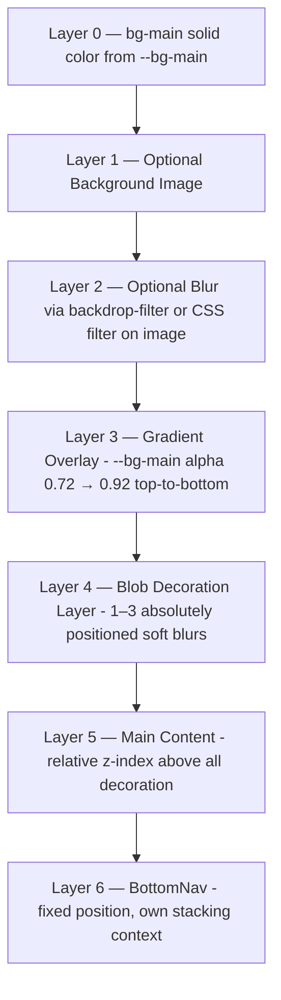
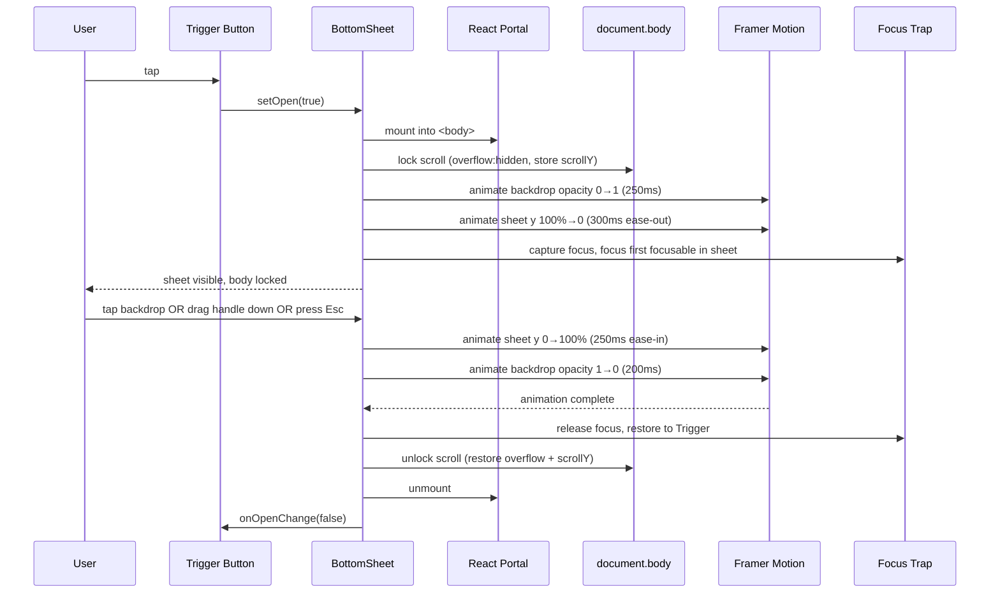
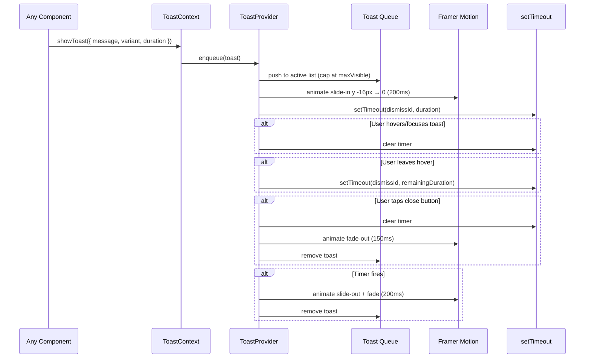

# Design Document: Sprint 1 — Design Foundation

## Overview

Sprint 1 builds the visual shell of Luma on top of the Sprint 0 scaffolding. It finalizes `PageWrapper` (background image → blur → gradient overlay → blob decorations → content), polishes `BottomNav` with active pill animations, and introduces the reusable UI primitive set: `Header`, `Card`, `Button`, `Input`, `BottomSheet`, `Toast`. All components are presentation-only — no IndexedDB access, no Zustand stores, no business logic. They consume props and CSS variables only, so they can be wired up to real data in Sprint 2 onward without rewriting markup or motion.

The design follows `docs/DESIGN_SYSTEM.md` strictly: radius 24px on cards, 999px on primary buttons, 28px top radius on bottom sheets, `bg-card-soft` for inputs, max-width 480px mobile container, soft Indonesian copy, motion timings 150–450ms grouped by interaction class. Framer Motion drives sheet enter/exit, toast slide-in, and card reveals; reduced-motion users get instant transitions. Tailwind utility classes map to CSS variables (`bg-bg-main`, `text-text-primary`, `bg-accent-primary`, etc.) — no hardcoded hex values appear in component code.

The two new compound primitives that need careful design are `BottomSheet` (body scroll lock, focus trap, backdrop dismiss, drag handle) and `Toast` (queue management, auto-dismiss timer, pause-on-hover, max visible). Both ship with formal pseudocode and correctness properties so Sprint 2 implementations cannot regress accessibility or motion behavior.

## Architecture

### Component Inventory

```txt
components/
├── layout/
│   ├── PageWrapper.tsx        ← finalized: bg image + blur + gradient overlay + blobs
│   ├── BottomNav.tsx          ← polished: active pill animation, real (text) icons
│   └── Header.tsx             ← NEW: greeting + settings icon (Home variant)
└── ui/
    ├── Card.tsx               ← NEW: base card (radius 24, padding 20, soft shadow)
    ├── Button.tsx             ← NEW: variants primary | secondary | fab
    ├── Input.tsx              ← NEW: label-above, height 52–56, radius 16
    ├── BottomSheet.tsx        ← NEW: portal + backdrop + handle + framer motion
    ├── Toast.tsx              ← NEW: presentation only
    └── ToastProvider.tsx      ← NEW: queue + auto-dismiss timers + portal
```

Sprint 0 left `components/ui/` and parts of `components/layout/` empty (with `.gitkeep`). Sprint 1 fills those folders. Folder structure stays identical — no restructuring.

### Composition / Inheritance Diagram

```mermaid
graph TD
    PW[PageWrapper]
    PW --> BG[Background Layer]
    PW --> BL[Blur Layer]
    PW --> GO[Gradient Overlay]
    PW --> BLOB[Blob Decoration Layer]
    PW --> MAIN[Main Content Slot]
    PW --> BN[BottomNav]

    HOME[HomePage] --> PW
    HOME --> HDR[Header]
    HOME --> CARD1[Card: HeroBudgetCard slot]
    HOME --> CARD2[Card: RecentTransactions slot]
    HOME --> FAB[Button variant=fab]

    SHEET_ANY[Any feature sheet] --> BS[BottomSheet]
    BS --> BACKDROP[Backdrop]
    BS --> HANDLE[Drag Handle]
    BS --> CONTENT[children slot]
    BS --> BTN_PRIMARY[Button primary]

    APP[App Root] --> TP[ToastProvider]
    TP --> TOAST[Toast x N]
    TP --> CTX[ToastContext: showToast]

    FORM[Any form slot] --> INP[Input]
    FORM --> BTN_S[Button secondary]
    FORM --> BTN_P[Button primary]

    classDef new fill:#E8A857,stroke:#1A1410,color:#1A1410
    classDef polished fill:#8FB896,stroke:#1A1410,color:#1A1410
    class HDR,CARD1,CARD2,FAB,BS,BACKDROP,HANDLE,CONTENT,BTN_PRIMARY,TP,TOAST,CTX,INP,BTN_S,BTN_P new
    class PW,BG,BL,GO,BLOB,MAIN,BN polished
```



### Background Layer Architecture (PageWrapper)



Layer rules:
- Layer 0 always present, prevents flash-of-empty-bg.
- Layer 1 only renders when `backgroundUrl` prop provided. In Sprint 1 this prop is wired but always `undefined` until Sprint 9 customization ships.
- Layer 2 (blur) applied via CSS `filter: blur(Npx)` on the image element, NOT on a parent (avoids blurring children).
- Layer 3 gradient overlay is **mandatory** when Layer 1 is present — readability rule from DESIGN_SYSTEM §9 and §19.
- Layer 4 blobs are decorative SVG/`div` with large border-radius and high blur, positioned `pointer-events: none`.
- Layer 5 content sits in normal flow, z-index 10.
- Layer 6 `BottomNav` is `position: fixed`, z-index 50, has its own backdrop blur for legibility over content.

### Sequence Diagram — BottomSheet Open/Close



### Sequence Diagram — Toast Show / Auto-Dismiss



## Components and Interfaces

### Component: PageWrapper (finalized)

**Purpose**: Mobile shell with full background layering and conditional bottom nav. Sprint 0 had a placeholder version; Sprint 1 replaces it with the layered implementation.

```ts
interface PageWrapperProps {
  children: React.ReactNode;
  /** Show the 4-tab bottom nav. Default: true. */
  showBottomNav?: boolean;
  /** Optional Indonesian title rendered above content. */
  title?: string;
  /** Optional <Header /> rendered as page header. Mutually exclusive with `title`. */
  header?: React.ReactNode;
  /** Optional URL to user-uploaded background. Sprint 1: wired but always undefined. */
  backgroundUrl?: string;
  /** Blur amount in px applied to backgroundUrl. Default: 0. Range 0–24. */
  backgroundBlur?: number;
  /** Overlay opacity 0–1. Default 0.85. Mandatory ≥ 0.3 when backgroundUrl is present. */
  overlayOpacity?: number;
  /** Render decorative blobs. Default: true. Set false for low-decoration screens (Transaksi). */
  decorativeBlobs?: boolean;
  /** Test id for E2E. */
  "data-testid"?: string;
}
```

**Responsibilities**:
- Render the 6 background layers in order (see Background Layer Architecture).
- Apply `max-width: 480px` mobile container, centered horizontally.
- Reserve `pb-24` when `showBottomNav` is true so content does not hide under nav.
- Mount `<BottomNav />` when `showBottomNav` is true.
- Respect `prefers-reduced-motion` (no decorative animation on blobs when reduced).

**Accessibility**:
- The wrapper itself is a `<div>` with no implicit ARIA role.
- Decorative blobs and background image are `aria-hidden="true"`.
- Skip links and landmarks come from page content (`<main>`, `<header>`, `<nav>`), not from PageWrapper.

### Component: BottomNav (polished)

**Purpose**: Fixed bottom nav with 4 tabs. Polished from Sprint 0 placeholder: real (text-emoji) icons, active pill background, smooth Framer Motion transitions.

```ts
interface BottomNavItem {
  to: string;
  label: string;        // Indonesian
  icon: string;         // text-icon or emoji for MVP
  testId: string;
}

interface BottomNavProps {
  // No props. NAV_ITEMS is static.
}

const NAV_ITEMS: readonly BottomNavItem[] = [
  { to: "/home",         label: "Home",      icon: "🏠", testId: "nav-home" },
  { to: "/transactions", label: "Transaksi", icon: "📒", testId: "nav-transactions" },
  { to: "/target",       label: "Target",    icon: "🎯", testId: "nav-target" },
  { to: "/reports",      label: "Laporan",   icon: "📊", testId: "nav-reports" },
];
```

**Responsibilities**:
- Render 4 `<NavLink>` items in fixed order.
- Animate the active pill across items using Framer Motion `layoutId="bottom-nav-pill"` for smooth shared-layout transition.
- Active item: `text-accent-primary`, soft pill background `bg-accent-primary/12` behind icon+label.
- Inactive item: `text-text-muted`.
- Each item is at minimum 44×44px tap target (a11y).

**Accessibility**:
- Outer `<nav aria-label="Navigasi utama">`.
- Active link gets `aria-current="page"`.
- Icons are decorative (`aria-hidden="true"`); label text is the accessible name.
- Reduced motion: disable layout animation, just snap active pill.

### Component: Header

**Purpose**: Page header for Home (greeting + settings icon). Generic enough to be reused on other pages with different right-slot actions.

```ts
interface HeaderProps {
  /** Main greeting line. e.g., "Halo, Patoni" */
  greeting?: string;
  /** Subtitle line. e.g., "Selasa, 12 November" */
  subtitle?: string;
  /** Optional left-slot, replaces greeting+subtitle pair. */
  leftSlot?: React.ReactNode;
  /** Right-slot. On Home, pass <SettingsIconButton />. */
  rightSlot?: React.ReactNode;
}
```

**Responsibilities**:
- Render greeting (Fraunces, 24–28px, weight 700) and subtitle (DM Sans, 13–14px, `text-text-muted`).
- Render right-slot aligned end.
- No background — sits above content within `PageWrapper`.

**Accessibility**:
- Wrapped in `<header>` landmark.
- Greeting renders inside an `<h1>`.
- Right-slot button (e.g., settings) must have an `aria-label`.

### Component: Card

**Purpose**: Base presentational card. Reused as wrapper for HeroBudgetCard, RecentTransactionsCard, AIReflectionCard, etc.

```ts
type CardVariant = "base" | "hero" | "soft";
type CardPadding = "sm" | "md" | "lg" | "none";

interface CardProps {
  children: React.ReactNode;
  variant?: CardVariant;       // default "base"
  padding?: CardPadding;       // default "md" → 20px (per design system)
  /** Render as a button when interactive. Default: false → <div>. */
  asButton?: boolean;
  onClick?: () => void;
  className?: string;
  /** Animate on mount (250–350ms card reveal). Default true; respects reduced motion. */
  animateOnMount?: boolean;
  "aria-label"?: string;
  "data-testid"?: string;
}
```

**Variants**:
- `base`: radius 24px, padding 20px, `bg-bg-card`, soft 1px translucent border, soft shadow.
- `hero`: radius 28px, larger padding, optional decorative blob inside (rendered by parent); used for HeroBudgetCard.
- `soft`: same radius 24, but `bg-bg-card-soft`, no shadow — used for nested/secondary cards.

**Padding map**:
- `sm`: 12px
- `md`: 20px (default)
- `lg`: 24px
- `none`: 0

**Responsibilities**:
- Render the right element (`<div>` or `<button>` when `asButton`).
- Apply variant + padding utility classes.
- Animate on mount with Framer Motion (`opacity 0→1`, `y 8→0`, 280ms `ease-out`).

**Accessibility**:
- When `asButton`, must include accessible name via children text or `aria-label`.
- Minimum interactive height 44px when `asButton` (enforced by tap-target rule).

### Component: Button

**Purpose**: Reusable button covering primary, secondary, and FAB shapes.

```ts
type ButtonVariant = "primary" | "secondary" | "fab" | "ghost";
type ButtonSize = "md" | "lg";

interface ButtonProps {
  children: React.ReactNode;
  variant?: ButtonVariant;     // default "primary"
  size?: ButtonSize;           // default "md" (52px); "lg" 56px
  type?: "button" | "submit" | "reset";  // default "button"
  disabled?: boolean;
  loading?: boolean;
  /** Icon left of label. */
  leftIcon?: React.ReactNode;
  /** Icon right of label. */
  rightIcon?: React.ReactNode;
  /** FAB only: icon-only button (no children). Use `aria-label` instead. */
  iconOnly?: boolean;
  onClick?: (e: React.MouseEvent<HTMLButtonElement>) => void;
  className?: string;
  fullWidth?: boolean;
  "aria-label"?: string;
  "data-testid"?: string;
}
```

**Variant specs** (per `DESIGN_SYSTEM.md` §11):

| Variant   | Height | Radius | BG                 | Color              | Weight | Notes                          |
|-----------|--------|--------|--------------------|--------------------|--------|--------------------------------|
| primary   | 52px   | 999px  | bg-accent-primary  | text-bg-main       | 700    | Pill, soft shadow              |
| secondary | 52px   | 999px  | bg-bg-card-soft    | text-text-primary  | 700    | Translucent border             |
| ghost     | 44px   | 16px   | transparent        | text-text-secondary| 600    | For inline text actions        |
| fab       | 56–64  | 999px  | bg-accent-primary  | text-bg-main       | 700    | Center bottom, fixed positioning handled by caller |

**Responsibilities**:
- Apply variant styles via Tailwind classes mapped to CSS variables.
- Render `loading` state (spinner or 3-dot pulse) inline; preserves width to prevent layout jump.
- Disable interaction when `disabled || loading`.
- Tap feedback: `whileTap={{ scale: 0.97 }}` via Framer Motion (200ms).

**Accessibility**:
- Native `<button>` element — keyboard, focus, screen reader names handled by browser.
- Minimum 44px tap target on all variants (`md` is already 52px, `ghost` enforced via padding).
- `loading` toggles `aria-busy="true"`.
- `iconOnly` requires `aria-label` (validated at runtime in dev with `console.warn`).
- Visible focus ring: 2px outline using `--accent-soft`.

### Component: Input

**Purpose**: Form input with label-above pattern. Used by manual transaction form, budget form, saving goal form.

```ts
type InputType = "text" | "number" | "tel" | "search" | "email";
type InputSize = "md" | "lg";

interface InputProps {
  /** Visible label above the field. Indonesian. */
  label: string;
  /** Hide label visually but keep for screen readers. */
  labelHidden?: boolean;
  id?: string;                 // auto-generated if missing
  name?: string;
  type?: InputType;            // default "text"
  size?: InputSize;            // "md" 52px | "lg" 56px (default "md")
  value?: string | number;
  defaultValue?: string | number;
  placeholder?: string;
  helperText?: string;         // hint or formatting note
  errorText?: string;          // if set, overrides helperText and adds error styling
  leftAdornment?: React.ReactNode;   // e.g., "Rp"
  rightAdornment?: React.ReactNode;  // e.g., clear icon
  disabled?: boolean;
  required?: boolean;
  autoFocus?: boolean;
  inputMode?: React.HTMLAttributes<HTMLInputElement>["inputMode"];
  onChange?: (e: React.ChangeEvent<HTMLInputElement>) => void;
  onBlur?: (e: React.FocusEvent<HTMLInputElement>) => void;
  className?: string;
  "data-testid"?: string;
}
```

**Visual spec** (per `DESIGN_SYSTEM.md` §12):
- Height: 52px (`md`) or 56px (`lg`).
- Radius: 16px.
- Background: `bg-bg-card-soft`.
- Label: above, 13–14px, `text-text-secondary`, weight 600.
- Padding: 16px horizontal, 14px vertical.
- Error state: 1px border `border-danger-soft`, error text below in `text-danger-soft`.
- Focus: 2px outline `accent-soft`.

**Responsibilities**:
- Render `<label htmlFor={id}>` linked to `<input id={id}>`.
- Render helper or error text in a single slot below the input (error wins).
- Forward standard input attrs.

**Accessibility**:
- Labels always rendered (visually hidden when `labelHidden`).
- `aria-invalid="true"` when `errorText` is set.
- `aria-describedby` links to helper/error text element.
- `required` exposed via `aria-required` and `required` attribute.
- Tap target ≥ 52px height — comfortably exceeds the 44px minimum.

### Component: BottomSheet

**Purpose**: Full-width sheet sliding up from the bottom. Used for Add Transaction, AI Quick Input, Add/Edit Budget, Edit Transaction, Add Saving Progress.

```ts
interface BottomSheetProps {
  open: boolean;
  onOpenChange: (open: boolean) => void;
  /** Sheet title rendered next to the handle bar. */
  title?: string;
  /** If false, hides the close button in the header. Default: true. */
  showClose?: boolean;
  /** Allow drag-to-dismiss on the handle area. Default: true. */
  dismissOnDragDown?: boolean;
  /** Allow tapping backdrop to dismiss. Default: true. */
  dismissOnBackdropTap?: boolean;
  /** Allow Esc key to dismiss. Default: true. */
  dismissOnEscape?: boolean;
  /** Max height as vh fraction. Default 0.9 (per design system). */
  maxHeightVh?: number;
  children: React.ReactNode;
  /** Optional sticky footer for primary CTA. */
  footer?: React.ReactNode;
  /** Test id. */
  "data-testid"?: string;
}
```

**Visual spec** (per `DESIGN_SYSTEM.md` §13):
- Top radius: 28px (`rounded-t-[28px]`).
- Padding: 20px horizontal, 16px vertical.
- Max height: 90vh.
- Background: `bg-bg-card`.
- Handle bar: 36×4px pill, `bg-text-muted/40`, centered, 8px top margin.
- Backdrop: `bg-black/50`, `backdrop-blur-sm`.

**Motion** (Framer Motion):
- Enter: backdrop `opacity 0→1` 250ms; sheet `y: 100% → 0` 300ms `[0.32, 0.72, 0, 1]` ease-out.
- Exit: sheet `y: 0 → 100%` 250ms ease-in; backdrop `opacity 1→0` 200ms.
- Drag-to-dismiss: pan gesture on handle area; if drag distance > 100px or velocity > 500px/s downward, close; otherwise spring back.
- Reduced motion: instant open/close, no spring.

**Responsibilities**:
- Render via React Portal into `document.body`.
- Lock body scroll while open (preserve scrollY, restore on close).
- Focus trap: capture focus inside sheet, restore to opener element on close.
- Backdrop click handler → call `onOpenChange(false)`.
- Esc keypress handler → call `onOpenChange(false)` (when `dismissOnEscape`).
- Drag-down handler on handle area → call `onOpenChange(false)` past threshold.

**Accessibility**:
- Root element: `role="dialog"`, `aria-modal="true"`.
- `aria-labelledby` references the title element when `title` provided; else `aria-label="Lembar bawah"`.
- Focus trap: `tab` and `shift+tab` cycle inside the sheet.
- Close button (when `showClose`) has `aria-label="Tutup"`.
- Drag handle has `role="button"`, `aria-label="Tarik untuk menutup"`, `tabindex={0}`.

### Component: Toast & ToastProvider

**Purpose**: Soft success/error/info messages. Auto-dismiss with pause-on-hover. Indonesian copy.

```ts
type ToastVariant = "success" | "error" | "info";

interface Toast {
  id: string;
  message: string;
  variant?: ToastVariant;       // default "success"
  /** Duration in ms. Default 3000. Min 1500, max 8000. */
  duration?: number;
  /** Optional action label (e.g., "Urungkan"). */
  action?: { label: string; onClick: () => void };
}

interface ToastContextValue {
  showToast: (toast: Omit<Toast, "id">) => string;     // returns id
  dismissToast: (id: string) => void;
  dismissAll: () => void;
}

interface ToastProviderProps {
  children: React.ReactNode;
  /** Max toasts visible at once. Default 3. Older are dismissed first. */
  maxVisible?: number;
  /** Default duration if showToast omits it. Default 3000. */
  defaultDuration?: number;
}

interface ToastProps {
  toast: Toast;
  onDismiss: (id: string) => void;
  onPause: (id: string) => void;
  onResume: (id: string) => void;
}
```

**Visual spec**:
- Single toast card: `bg-bg-card`, radius 16, padding 14×16, soft shadow.
- Variant accent stripe (left 4px) — `success` `--success-soft`, `error` `--danger-soft`, `info` `--accent-primary`.
- Max width: matches mobile container (480px), 16px horizontal margin.
- Position: top-center, with `safe-area-inset-top` padding.
- Stack: vertical gap 8px.

**Motion**:
- Enter: `y: -16 → 0`, `opacity: 0 → 1`, 200ms ease-out.
- Exit: `y: 0 → -16`, `opacity: 1 → 0`, 200ms ease-in.
- Reduced motion: instant.

**Accessibility**:
- Container: `role="region"`, `aria-label="Notifikasi"`, `aria-live="polite"`.
- `error` variant uses `aria-live="assertive"` and `role="alert"`.
- Each toast: dismissible with close button (`aria-label="Tutup notifikasi"`).
- Action button: native `<button>` with the action label as accessible name.

## Data Models

Sprint 1 introduces no domain data models. The only typed shapes are the props interfaces above plus internal Toast queue state:

```ts
// Internal to ToastProvider — not exported as data model
interface ToastQueueState {
  toasts: Toast[];                     // visible toasts in order, length ≤ maxVisible
  timers: Map<string, TimerHandle>;    // id → handle
  remaining: Map<string, number>;      // id → ms remaining (for pause/resume)
  pausedAt: Map<string, number>;       // id → epoch ms
}

interface TimerHandle {
  timeoutId: number;        // returned by setTimeout
  startedAt: number;        // epoch ms when this run started
  duration: number;         // ms for this run
}
```

**Validation rules**:
- `Toast.duration` clamped to `[1500, 8000]` ms; default `3000`.
- `ToastProvider.maxVisible ≥ 1`; default `3`.
- `Toast.message` non-empty string.
- When `toasts.length >= maxVisible`, oldest toast is dismissed (FIFO eviction) before new one is shown.

## Motion Timing Reference Table

Sourced from `DESIGN_SYSTEM.md` §16 and adapted to specific component interactions.

| Interaction                            | Duration   | Easing                      | Component        |
|----------------------------------------|------------|-----------------------------|------------------|
| Button tap scale                       | 150–200ms  | spring (stiffness 400)      | Button           |
| Toast enter                            | 200ms      | ease-out                    | Toast            |
| Toast exit                             | 200ms      | ease-in                     | Toast            |
| BottomNav active pill                  | 250ms      | spring (stiffness 300, damping 30) | BottomNav |
| Card reveal (mount)                    | 280ms      | ease-out                    | Card             |
| BottomSheet enter (sheet)              | 300ms      | cubic-bezier(0.32, 0.72, 0, 1) | BottomSheet  |
| BottomSheet enter (backdrop)           | 250ms      | ease-out                    | BottomSheet      |
| BottomSheet exit (sheet)               | 250ms      | cubic-bezier(0.4, 0, 1, 1)  | BottomSheet      |
| BottomSheet exit (backdrop)            | 200ms      | ease-in                     | BottomSheet      |
| BottomSheet drag spring-back           | 280ms      | spring (stiffness 350, damping 35) | BottomSheet |
| Page transition (route change)         | 300–450ms  | ease-out                    | Page wrapper (future) |
| Decorative blob idle drift             | 8–12s      | ease-in-out, infinite       | PageWrapper (skipped on reduced-motion) |

Reduced motion override: when `prefers-reduced-motion: reduce` is detected, all durations collapse to `0ms` for transforms; opacity transitions stay at 100ms for visual continuity.

## Algorithmic Pseudocode

### Algorithm: Toast Queue Management

```pascal
ALGORITHM showToast(toastInput, queueState, maxVisible, defaultDuration)
INPUT:
  toastInput      = { message, variant?, duration?, action? }
  queueState      = { toasts, timers, remaining, pausedAt }
  maxVisible      = positive integer
  defaultDuration = milliseconds
OUTPUT: id of newly added toast

BEGIN
  ASSERT maxVisible >= 1
  ASSERT toastInput.message IS non-empty string

  // Step 1: Build full toast object
  id        ← generateId()
  duration  ← clamp(toastInput.duration ?? defaultDuration, 1500, 8000)
  variant   ← toastInput.variant ?? "success"
  toast     ← { id, message, variant, duration, action }

  // Step 2: Evict oldest if at capacity (FIFO)
  WHILE queueState.toasts.length >= maxVisible DO
    oldest ← queueState.toasts[0]
    dismissToast(oldest.id, queueState)
  END WHILE

  ASSERT queueState.toasts.length < maxVisible

  // Step 3: Insert new toast
  queueState.toasts.append(toast)

  // Step 4: Schedule auto-dismiss
  scheduleDismiss(id, duration, queueState)

  ASSERT queueState.timers.has(id)
  ASSERT queueState.toasts.contains(toast)

  RETURN id
END

ALGORITHM scheduleDismiss(id, duration, queueState)
INPUT: id, duration ms, queueState
OUTPUT: void (mutates queueState.timers)

BEGIN
  ASSERT duration >= 1500 AND duration <= 8000

  startedAt ← now()
  timeoutId ← setTimeout(
    callback: () => dismissToast(id, queueState),
    delay: duration
  )

  queueState.timers.set(id, { timeoutId, startedAt, duration })
END

ALGORITHM pauseToast(id, queueState)
INPUT: id, queueState
OUTPUT: void

BEGIN
  IF NOT queueState.timers.has(id) THEN RETURN END IF

  handle    ← queueState.timers.get(id)
  elapsed   ← now() - handle.startedAt
  remaining ← max(0, handle.duration - elapsed)

  clearTimeout(handle.timeoutId)
  queueState.timers.delete(id)
  queueState.remaining.set(id, remaining)
  queueState.pausedAt.set(id, now())
END

ALGORITHM resumeToast(id, queueState)
INPUT: id, queueState
OUTPUT: void

BEGIN
  IF NOT queueState.remaining.has(id) THEN RETURN END IF

  remaining ← queueState.remaining.get(id)
  queueState.remaining.delete(id)
  queueState.pausedAt.delete(id)

  IF remaining <= 0 THEN
    dismissToast(id, queueState)
  ELSE
    scheduleDismiss(id, remaining, queueState)
  END IF
END

ALGORITHM dismissToast(id, queueState)
INPUT: id, queueState
OUTPUT: void

BEGIN
  // Idempotent: safe to call multiple times.
  IF queueState.timers.has(id) THEN
    clearTimeout(queueState.timers.get(id).timeoutId)
    queueState.timers.delete(id)
  END IF

  queueState.remaining.delete(id)
  queueState.pausedAt.delete(id)
  queueState.toasts ← queueState.toasts.filter(t => t.id ≠ id)
  // Exit animation handled by AnimatePresence in render layer.
END
```

**Preconditions**:
- `queueState` is a stable reference owned by `ToastProvider`.
- `maxVisible >= 1`.
- `defaultDuration` is in `[1500, 8000]`.

**Postconditions** (after `showToast`):
- `queueState.toasts.length <= maxVisible`.
- New toast is the last entry of `queueState.toasts`.
- A timer exists in `queueState.timers` for the new toast id.
- All evicted toast ids are absent from `queueState.timers` and `queueState.toasts`.

**Postconditions** (after `dismissToast`):
- `queueState.toasts` does not contain a toast with that id.
- `queueState.timers`, `queueState.remaining`, `queueState.pausedAt` do not contain that id.
- Operation is idempotent.

**Postconditions** (after `pauseToast` then `resumeToast` with no other interaction):
- Total elapsed visible time before auto-dismiss equals `duration` ± timer scheduling tolerance (~16ms).

**Loop Invariants** (eviction `while` loop):
- Before each iteration: `queueState.toasts.length >= maxVisible`.
- After each iteration: length decreased by exactly 1; oldest toast id no longer in `toasts`.
- Loop terminates when `queueState.toasts.length < maxVisible` because `maxVisible >= 1` and each iteration removes one.

### Algorithm: BottomSheet Open / Close Flow

```pascal
ALGORITHM openBottomSheet(sheetState, opener)
INPUT:
  sheetState = { isOpen, savedScrollY, openerEl, focusTrapHandle }
  opener     = currently focused element (HTMLElement)
OUTPUT: void

BEGIN
  ASSERT sheetState.isOpen = false

  // Step 1: Record context for restore
  sheetState.openerEl     ← opener
  sheetState.savedScrollY ← window.scrollY

  // Step 2: Lock body scroll without layout shift
  bodyStyle ← document.body.style
  bodyStyle.position ← "fixed"
  bodyStyle.top      ← "-" + sheetState.savedScrollY + "px"
  bodyStyle.left     ← "0"
  bodyStyle.right    ← "0"
  bodyStyle.width    ← "100%"

  // Step 3: Mark open, mount portal (handled by render layer)
  sheetState.isOpen ← true

  // Step 4: After mount + paint, install focus trap and move focus
  requestAnimationFrame(() => {
    sheetState.focusTrapHandle ← installFocusTrap(sheetEl)
    firstFocusable ← findFirstFocusable(sheetEl)
    IF firstFocusable ≠ NULL THEN
      firstFocusable.focus({ preventScroll: true })
    ELSE
      sheetEl.focus({ preventScroll: true })
    END IF
  })

  // Step 5: Animations driven by Framer Motion via `open` prop change.
  ASSERT document.body.style.position = "fixed"
END

ALGORITHM closeBottomSheet(sheetState)
INPUT: sheetState
OUTPUT: void (resolves after exit animation completes)

BEGIN
  IF sheetState.isOpen = false THEN RETURN END IF

  // Step 1: Trigger exit animation by flipping isOpen
  sheetState.isOpen ← false
  // Framer Motion <AnimatePresence> drives sheet y: 0→100% over 250ms,
  // backdrop opacity 1→0 over 200ms.

  // Step 2: After exit animation completes (onExitComplete callback)
  ON exitComplete:
    // Release focus trap
    IF sheetState.focusTrapHandle ≠ NULL THEN
      sheetState.focusTrapHandle.uninstall()
      sheetState.focusTrapHandle ← NULL
    END IF

    // Unlock body scroll, restore scroll position
    bodyStyle ← document.body.style
    bodyStyle.position ← ""
    bodyStyle.top      ← ""
    bodyStyle.left     ← ""
    bodyStyle.right    ← ""
    bodyStyle.width    ← ""
    window.scrollTo(0, sheetState.savedScrollY)

    // Restore focus to opener
    IF sheetState.openerEl ≠ NULL AND isInDocument(sheetState.openerEl) THEN
      sheetState.openerEl.focus({ preventScroll: true })
    END IF
    sheetState.openerEl ← NULL
    sheetState.savedScrollY ← 0
  END ON

  ASSERT (eventually) document.body.style.position = ""
END

ALGORITHM handleBackdropTap(sheetState, props)
INPUT: sheetState, props (BottomSheetProps)
OUTPUT: void

BEGIN
  IF props.dismissOnBackdropTap = false THEN RETURN END IF
  closeBottomSheet(sheetState)
END

ALGORITHM handleEscape(sheetState, props, event)
INPUT: sheetState, props, event (KeyboardEvent)
OUTPUT: void

BEGIN
  IF props.dismissOnEscape = false THEN RETURN END IF
  IF event.key ≠ "Escape" THEN RETURN END IF
  IF sheetState.isOpen = false THEN RETURN END IF

  event.preventDefault()
  closeBottomSheet(sheetState)
END

ALGORITHM handleDragEnd(sheetState, props, dragInfo)
INPUT:
  sheetState
  props
  dragInfo = { offset: { y }, velocity: { y } }   // from Framer Motion
OUTPUT: void

BEGIN
  IF props.dismissOnDragDown = false THEN RETURN END IF

  // Threshold: drag > 100px down OR fling velocity > 500px/s down
  IF dragInfo.offset.y > 100 OR dragInfo.velocity.y > 500 THEN
    closeBottomSheet(sheetState)
  ELSE
    // Spring back handled by Framer Motion via animate to y=0.
    SKIP
  END IF
END
```

**Preconditions**:
- `document.body` exists and is mutable.
- React 18+ with portal support.
- Framer Motion `<AnimatePresence>` wraps sheet render.
- `installFocusTrap` is provided by a small focus-trap utility (built in Sprint 1 lib or imported library).

**Postconditions** (after `openBottomSheet`):
- `sheetState.isOpen = true`.
- `document.body.style.position = "fixed"` (scroll locked).
- Focus is inside the sheet within one animation frame.
- Opener element reference stored for restore.

**Postconditions** (after `closeBottomSheet` exit animation completes):
- `sheetState.isOpen = false`.
- `document.body.style.position = ""` (scroll unlocked).
- `window.scrollY` restored to value at open time (within sub-pixel rounding).
- Focus restored to opener element (if still in document).
- All focus-trap listeners removed.

**Loop Invariants**: none (no loops in flow).

## Key Functions with Formal Specifications

### File: `src/components/layout/PageWrapper.tsx`

```ts
export function PageWrapper(props: PageWrapperProps): JSX.Element
```

**Preconditions**:
- `children` is renderable React content.
- If `backgroundUrl` is provided, `overlayOpacity` (default 0.85) is ≥ 0.3.
- `backgroundBlur ∈ [0, 24]` if provided.

**Postconditions**:
- Returns a `<div>` with `max-width: 480px`, centered.
- All declared layers (0–6) are rendered in correct stacking order.
- Decorative blobs are `aria-hidden` and `pointer-events: none`.
- When `showBottomNav !== false`, `<BottomNav />` rendered and content has `pb-24`.
- No hardcoded hex; all colors via `var(--*)` through Tailwind utility classes.

**Loop Invariants**: N/A.

### File: `src/components/layout/BottomNav.tsx`

```ts
export function BottomNav(): JSX.Element
```

**Preconditions**:
- Rendered inside React Router context (`useLocation()` works).
- Framer Motion is available.
- `prefers-reduced-motion` media query is queryable.

**Postconditions**:
- Renders exactly 4 nav items in order: Home, Transaksi, Target, Laporan.
- Active item has `aria-current="page"` and the `motion.div` with `layoutId="bottom-nav-pill"`.
- Each item is at minimum 44×44px tap area.
- Component is fixed to bottom of viewport, max-width 480px, centered.

**Loop Invariants**:
- During NAV_ITEMS map: every iteration produces exactly one rendered `<NavLink>`; total = 4.

### File: `src/components/layout/Header.tsx`

```ts
export function Header(props: HeaderProps): JSX.Element
```

**Preconditions**:
- At least one of `greeting | leftSlot` is provided (dev-only `console.warn` if both absent).

**Postconditions**:
- Renders `<header>` landmark.
- `greeting` rendered inside `<h1>` when present.
- `rightSlot` rendered aligned end.
- No background; respects parent layer stacking.

**Loop Invariants**: N/A.

### File: `src/components/ui/Card.tsx`

```ts
export function Card(props: CardProps): JSX.Element
```

**Preconditions**:
- When `asButton`, an accessible name is provided via children text or `aria-label`.

**Postconditions**:
- Returns `<div>` or `<button>` per `asButton`.
- Variant + padding utility classes applied.
- When `animateOnMount && !prefersReducedMotion`, mount animation runs (opacity + y) for 280ms.
- When `asButton`, computed height ≥ 44px.

**Loop Invariants**: N/A.

### File: `src/components/ui/Button.tsx`

```ts
export function Button(props: ButtonProps): JSX.Element
```

**Preconditions**:
- When `iconOnly`, `aria-label` is non-empty (dev `console.warn` if missing).
- `disabled` and `loading` are independent booleans.

**Postconditions**:
- Returns native `<button>` with type defaulting to `"button"`.
- Visible height ≥ 44px for all variants (primary 52, fab 56–64, ghost 44, secondary 52).
- `disabled || loading` ⟹ `disabled` attribute is true and `aria-busy` reflects `loading`.
- Tap animation respects reduced motion (no scale change).

**Loop Invariants**: N/A.

### File: `src/components/ui/Input.tsx`

```ts
export function Input(props: InputProps): JSX.Element
```

**Preconditions**:
- `label` is non-empty string.

**Postconditions**:
- Renders `<label htmlFor={id}>` linked by id to the `<input>`.
- When `errorText` is set, `<input>` has `aria-invalid="true"` and `aria-describedby` references the error element.
- When `errorText` is unset and `helperText` is set, `aria-describedby` references the helper element.
- Field height = 52px (`md`) or 56px (`lg`).
- Background uses `bg-bg-card-soft` token.

**Loop Invariants**: N/A.

### File: `src/components/ui/BottomSheet.tsx`

```ts
export function BottomSheet(props: BottomSheetProps): JSX.Element | null
```

**Preconditions**:
- `onOpenChange` is a stable callback.
- Rendered inside an app that provides a `document.body` portal target (browser environment).

**Postconditions**:
- Returns `null` while closed AND fully exited (after exit animation).
- While open: portal content rendered into `document.body`, body scroll locked, focus trapped.
- After close: body scroll restored, focus restored to opener (when present).
- Esc / backdrop tap / drag-down trigger `onOpenChange(false)` per dismissal flags.

**Loop Invariants**: N/A.

### File: `src/components/ui/Toast.tsx`

```ts
export function Toast(props: ToastProps): JSX.Element
```

**Preconditions**:
- `toast.message` is non-empty.
- `onDismiss`, `onPause`, `onResume` are stable callbacks.

**Postconditions**:
- Renders single toast card with variant styling and optional action button.
- Hover/focus inside the card calls `onPause(id)`; mouseleave/blur calls `onResume(id)`.
- Close button calls `onDismiss(id)`.
- Renders accessible name via message text content.

**Loop Invariants**: N/A.

### File: `src/components/ui/ToastProvider.tsx`

```ts
export function ToastProvider(props: ToastProviderProps): JSX.Element
export function useToast(): ToastContextValue
```

**Preconditions**:
- Provider mounts once, near the app root (above route content).
- `maxVisible >= 1`, `defaultDuration ∈ [1500, 8000]`.

**Postconditions** (`ToastProvider`):
- Renders `props.children` plus a portal toast region.
- Provides `ToastContext` with `showToast`, `dismissToast`, `dismissAll`.
- Toast queue obeys properties stated in Toast Queue algorithm.

**Postconditions** (`useToast`):
- Returns the context value when called inside a `ToastProvider`.
- Throws a developer-friendly Error when called outside one.

**Loop Invariants**: N/A.

## Example Usage

### Example 1: PageWrapper composing Header + Cards on Home

```tsx
// pages/HomePage.tsx
import { PageWrapper } from "../components/layout/PageWrapper";
import { Header } from "../components/layout/Header";
import { Card } from "../components/ui/Card";
import { Button } from "../components/ui/Button";

export function HomePage(): JSX.Element {
  return (
    <PageWrapper
      header={
        <Header
          greeting="Halo, Patoni"
          subtitle="Selasa, 12 November"
          rightSlot={
            <Button variant="ghost" iconOnly aria-label="Pengaturan">
              ⚙️
            </Button>
          }
        />
      }
    >
      <Card variant="hero" padding="lg">
        {/* HeroBudgetCard contents — wired in Sprint 4 */}
        <p className="font-display text-3xl">Rp1.840.000</p>
        <p className="text-text-secondary text-sm">Sisa budget bulan ini</p>
      </Card>

      <Card>
        {/* RecentTransactions list — wired in Sprint 4 */}
        <p className="font-display text-lg">Transaksi Terbaru</p>
      </Card>

      {/* FAB rendered above bottom nav by the page itself */}
      <Button
        variant="fab"
        iconOnly
        aria-label="Tambah transaksi"
        className="fixed bottom-20 left-1/2 -translate-x-1/2"
      >
        ＋
      </Button>
    </PageWrapper>
  );
}
```

### Example 2: BottomSheet for Add Transaction

```tsx
// (sketch — feature lands in Sprint 3, but shape verified now)
import { useState } from "react";
import { BottomSheet } from "../components/ui/BottomSheet";
import { Input } from "../components/ui/Input";
import { Button } from "../components/ui/Button";

export function AddTransactionSheetExample() {
  const [open, setOpen] = useState(false);

  return (
    <>
      <Button onClick={() => setOpen(true)}>Tambah Transaksi</Button>

      <BottomSheet
        open={open}
        onOpenChange={setOpen}
        title="Tambah Transaksi"
        footer={
          <Button fullWidth onClick={() => setOpen(false)}>
            Simpan Transaksi
          </Button>
        }
      >
        <Input label="Nominal" type="number" leftAdornment="Rp" />
        <Input label="Detail" placeholder="contoh: bakso depan kampus" />
      </BottomSheet>
    </>
  );
}
```

### Example 3: Toast queue + auto-dismiss

```tsx
// app/providers.tsx
import { ToastProvider } from "../components/ui/ToastProvider";
import { RouterProvider } from "react-router-dom";
import { router } from "./routes";

export function Providers(): JSX.Element {
  return (
    <ToastProvider maxVisible={3} defaultDuration={3000}>
      <RouterProvider router={router} />
    </ToastProvider>
  );
}

// usage anywhere inside the tree
import { useToast } from "../components/ui/ToastProvider";

function SaveButtonExample() {
  const { showToast } = useToast();
  return (
    <Button
      onClick={() => {
        // pretend we saved a transaction
        showToast({ message: "Tercatat ya ✨", variant: "success" });
      }}
    >
      Simpan
    </Button>
  );
}
```

### Example 4: Form using Input with validation copy

```tsx
import { useState } from "react";
import { Input } from "../components/ui/Input";

function NominalFieldExample() {
  const [value, setValue] = useState("");
  const error = value === "" ? "Nominalnya belum diisi nih." : undefined;

  return (
    <Input
      label="Nominal"
      type="number"
      inputMode="numeric"
      leftAdornment="Rp"
      value={value}
      onChange={(e) => setValue(e.target.value)}
      errorText={error}
      required
    />
  );
}
```

## Correctness Properties

These are universal assertions verifiable via component tests, DOM inspection, or static analysis once a test runner exists (Vitest + Testing Library, planned for Sprint 1 or Sprint 2).

### Property 1: No hardcoded hex in component code

For every file under `src/components/**`, no string literal matches the regex `#([0-9a-fA-F]{3}){1,2}\b`. All colors come from Tailwind utility classes mapped to CSS variables (or `var(--*)` directly). Verifiable by static grep / AST scan.

### Property 2: Mobile container width

For every page rendered through `PageWrapper`, the rendered DOM tree's outermost wrapper has computed `max-width` equal to `480px`. Verifiable via JSDOM `getComputedStyle`.

### Property 3: Button minimum tap target

For every `Button` rendered with any `variant` and `size`, the rendered element's computed `height` is ≥ 44px. The `iconOnly` FAB is also ≥ 44px wide. Verifiable via DOM measurement in tests.

### Property 4: Input minimum tap target

For every `Input` rendered with `size="md"` or `size="lg"`, the input element's computed `height` is exactly 52px or 56px respectively, both ≥ 44px. Verifiable via DOM measurement.

### Property 5: BottomNav active state correctness

For every route `r ∈ {"/home", "/transactions", "/target", "/reports"}`, when the router location is at `r`, exactly one `<NavLink>` in `BottomNav` has `aria-current="page"`, and that link's `to` equals `r`. Verifiable by routing test.

### Property 6: BottomNav excludes Settings and Budget

For all entries `i` in `NAV_ITEMS`, `i.to ∉ {"/settings", "/budget"}`. Verifiable by static assertion.

### Property 7: BottomSheet body scroll lock invariant

For every `BottomSheet` open transition, `document.body.style.position === "fixed"` after the open animation completes; for every close transition, `document.body.style.position === ""` after the exit animation completes; and `window.scrollY` after close equals `window.scrollY` before open (within 1px). Verifiable by integration test that opens and closes a sheet at a non-zero scroll position.

### Property 8: BottomSheet focus management

For every `BottomSheet` open call from an opener element `O`, after the open animation completes, `document.activeElement` is a descendant of the sheet root. After the close animation completes (and `O` is still in the document), `document.activeElement === O`. Verifiable by integration test using Testing Library and `userEvent`.

### Property 9: BottomSheet dismiss flags are honored

Given a `BottomSheet` with `dismissOnBackdropTap=false`, tapping the backdrop never causes `onOpenChange(false)` to fire. Same property holds for `dismissOnEscape=false` with Esc, and `dismissOnDragDown=false` with drag-down past threshold. Verifiable by event-simulation tests.

### Property 10: Toast auto-dismiss honors duration

For every `showToast({ duration: D })` with `D ∈ [1500, 8000]`, the toast is removed from the visible queue at approximately `D` ms after creation (within `±50ms` scheduling tolerance), assuming no user interaction. Verifiable by Vitest fake timers.

### Property 11: Toast duration clamping

For every `showToast({ duration: D })`:
- If `D < 1500`, effective duration is exactly `1500`.
- If `D > 8000`, effective duration is exactly `8000`.
- If `D ∈ [1500, 8000]`, effective duration is `D`.

Verifiable by examining the timer scheduled in `queueState.timers`.

### Property 12: Toast queue capacity

For all sequences of `showToast` calls with provider `maxVisible = N`, at any point in time `queueState.toasts.length <= N`. When length would exceed `N`, the oldest toast (FIFO) is dismissed before insertion. Verifiable by sequence test.

### Property 13: Toast pause + resume preserves remaining time

For any toast with original duration `D`, if it is paused at elapsed time `e ∈ [0, D]` and resumed at time `t_resume`, the toast is removed at approximately `t_resume + (D - e)` (within `±50ms`). Verifiable by Vitest fake timers + simulated hover events.

### Property 14: dismissToast is idempotent

For any toast id `i`, calling `dismissToast(i)` zero, one, or many times produces the same final `queueState`: no entries with id `i` in `toasts`, `timers`, `remaining`, or `pausedAt`. Verifiable by direct state inspection.

### Property 15: Indonesian copy on user-facing labels

Every default user-facing string emitted by Sprint 1 components is in Indonesian: BottomNav labels (`Home`, `Transaksi`, `Target`, `Laporan`), default close button label (`Tutup`), drag handle label (`Tarik untuk menutup`), nav landmark (`Navigasi utama`), toast region (`Notifikasi`). Verifiable by grep on string constants.

### Property 16: Reduced motion respected

When `window.matchMedia("(prefers-reduced-motion: reduce)").matches` is `true`:
- `Card` skips mount animation (no `y` offset, no fade).
- `Button` skips tap-scale animation.
- `BottomSheet` skips spring; transitions are instant transforms with brief opacity fade.
- `Toast` enters/exits with opacity only (no `y`).
- `BottomNav` active-pill `layoutId` animation is disabled.

Verifiable by mocking `matchMedia` in tests.

### Property 17: Card asButton produces native button

For every `Card` rendered with `asButton={true}`, the root DOM node is a `<button>` element with `type="button"` (or as overridden) and is keyboard-focusable. Verifiable by DOM tagName check.

### Property 18: Input label-input linkage

For every `Input`, the `<label>` element has `htmlFor` equal to the `<input>`'s `id`, and that `id` is non-empty. Verifiable by DOM attribute check.

### Property 19: Input error overrides helper

For every `Input` with both `errorText` and `helperText` provided, only the error message is rendered, the input has `aria-invalid="true"`, and `aria-describedby` references the error element id. Verifiable by render test.

### Property 20: PageWrapper gradient overlay enforced when background image present

For every `PageWrapper` rendered with a non-empty `backgroundUrl`, the gradient overlay layer is rendered with computed opacity ≥ 0.3 (clamped). Verifiable by DOM inspection of the overlay element's computed style.

## Error Handling

### Error Scenario 1: Component used outside required provider

**Condition**: `useToast()` is called from a tree that does not have `ToastProvider` ancestor.
**Response**: Hook throws `Error("useToast must be used inside <ToastProvider>")` immediately on first render.
**Recovery**: Developer wraps app root in `<ToastProvider>` (already done in `app/providers.tsx` per Example 3).

### Error Scenario 2: BottomSheet opens but Framer Motion fails to mount

**Condition**: Framer Motion import fails (extremely unlikely; would also break Sprint 0 plan).
**Response**: Build-time error from Vite. No runtime fallback — Sprint 1 treats Framer Motion as required.
**Recovery**: Reinstall dependency. Component still renders with `display: block` fallback (sheet visible without animation) if motion module missing at runtime, but this is degraded UX.

### Error Scenario 3: Background image fails to load

**Condition**: `backgroundUrl` provided but image 404s or is corrupt.
**Response**: `onError` handler on `` element sets internal state to hide the image. Layer 0 (`--bg-main`) keeps app readable. No toast is shown — silent fallback per `DESIGN_SYSTEM.md` §22 ("Background terlalu besar, kita coba kompres dulu" is for upload, not load failure).
**Recovery**: User can reset background in Sprint 9 customization.

### Error Scenario 4: User taps backdrop on a sheet during exit animation

**Condition**: Multiple rapid taps during close transition.
**Response**: `closeBottomSheet` is idempotent — checks `isOpen` flag. Subsequent calls are no-ops while exit animation is in flight.
**Recovery**: Automatic. No double-close, no double-restore.

### Error Scenario 5: Toast scheduled but provider unmounts

**Condition**: ToastProvider unmounts (e.g., HMR or app shutdown) while timers are pending.
**Response**: `useEffect` cleanup in provider clears all `setTimeout` handles in `queueState.timers`.
**Recovery**: Automatic. No "memory leak" warnings; no late callbacks fire on unmounted state.

### Error Scenario 6: Focus trap target removed during sheet open

**Condition**: Sheet content unmounts an element while focus was on it.
**Response**: Focus trap handler reroutes focus to the sheet root.
**Recovery**: Automatic. User can Tab to next focusable.

### Error Scenario 7: Reduced-motion user dragging sheet

**Condition**: `prefers-reduced-motion: reduce` and user drags handle down.
**Response**: Drag is disabled at the gesture-listener level when reduced motion is active; user must use close button or backdrop tap or Esc.
**Recovery**: Other dismissal paths work normally.

## Testing Strategy

### Unit Testing Approach

Sprint 1 introduces Vitest + Testing Library + JSDOM for the first time in the project. Each component ships with a focused test file:

- `Button.test.tsx` — renders all variants/sizes; verifies tap target ≥44px (Property 3); verifies `loading` sets `aria-busy`; verifies `iconOnly` requires aria-label (warn).
- `Input.test.tsx` — verifies label/input linkage (Property 18); verifies error overrides helper (Property 19); verifies `aria-invalid` and `aria-describedby`.
- `Card.test.tsx` — verifies `asButton` renders `<button>` (Property 17); verifies variant classes applied; verifies mount animation respects reduced motion (Property 16).
- `BottomNav.test.tsx` — verifies 4 items, exact order (Property 5, 6); active link `aria-current` (Property 5).
- `Header.test.tsx` — verifies `<header>` landmark and `<h1>` greeting.
- `BottomSheet.test.tsx` — verifies open mounts portal; close unmounts after exit; body scroll lock/unlock (Property 7); focus trap and restore (Property 8); dismissal flags (Property 9).
- `Toast.test.tsx` — visual states for variants; pause/resume callbacks fire on hover/blur.
- `ToastProvider.test.tsx` — queue capacity (Property 12); duration clamp (Property 11); auto-dismiss timing with fake timers (Property 10); pause/resume preserves remaining time (Property 13); idempotent dismiss (Property 14); throws when used without provider.
- `PageWrapper.test.tsx` — verifies max-width 480 (Property 2); verifies overlay rendered when `backgroundUrl` present (Property 20); verifies decorative blobs `aria-hidden`.

Coverage goal: **100% of correctness properties have a passing test**. Branch coverage target: ≥85% for Sprint 1 components.

### Property-Based Testing Approach

Sprint 1 introduces **fast-check** for property-based tests on the Toast queue. Toast logic has interesting state transitions and is the perfect candidate for PBT in this sprint.

**Property test library**: `fast-check`.

Properties to verify with fast-check:
- **Capacity invariant** (Property 12): Generate arbitrary sequences of `showToast` and `dismissToast` operations with random `maxVisible ∈ [1, 5]`; assert `toasts.length <= maxVisible` after every operation.
- **Duration clamp** (Property 11): Generate arbitrary `D` (including out-of-range values, negatives, NaN-as-undefined-cast); assert effective duration is in `[1500, 8000]`.
- **Idempotent dismiss** (Property 14): Generate random toast ids and dismiss-counts ∈ `[0, 5]`; assert final state is identical to dismissing once.
- **Pause/resume preserves remaining** (Property 13): Generate random pause/resume sequences with random durations and elapsed times; assert total visible time equals original duration ±50ms (using Vitest fake timers + `vi.advanceTimersByTime`).

Other components (Button, Input, Card, BottomNav, Header) lean on traditional example-based tests; their state space is small enough that PBT adds little value.

### Integration Testing Approach

Two integration tests verify component composition:

1. **PageWrapper + BottomNav + Header**: Mount Home placeholder, verify route active state changes when clicking another nav item, verify Header renders inside the wrapper, verify max-width constraint.
2. **BottomSheet + Button + Input**: Mount a fake "Add Transaction" form using BottomSheet, fire user events (open via Button, type into Input, close via backdrop, close via Esc, close via drag), verify scroll lock/unlock (Property 7) and focus restore (Property 8).

Both tests use Testing Library `userEvent` v14 and Vitest fake timers where animation timing matters.

## Performance Considerations

- **Framer Motion bundle**: shared across many components; tree-shake by importing only `motion`, `AnimatePresence`, `useReducedMotion` (no large feature bundles like `domAnimation` if not needed). Reuse the same shared layout id to avoid extra re-renders in BottomNav.
- **Background image rendering**: Use `` for the background; the blur is via `filter: blur(Npx)` on the image element so the GPU compositor can cache it. Avoid `backdrop-filter` on a parent that contains content (it would force expensive recomposition on scroll).
- **Decorative blobs**: prefer `<div>` with `border-radius: 50%` and `filter: blur(60–100px)` over animated SVG. Keep motion to slow `8–12s` ease-in-out infinite drifts; disable on reduced motion.
- **Toast region**: portal renders only when there is at least one active toast; idle path is a single empty `<div role="region" aria-live="polite">`.
- **BottomSheet portal**: only rendered while open; cleans up on close via `<AnimatePresence>` `onExitComplete`.
- **Tap target enforcement**: use Tailwind utility classes, not runtime measurements. No reflow during render.
- **Card mount animation**: scoped to a single `motion.div` per card with cheap `opacity + transform` (no layout-affecting properties).

## Security Considerations

Sprint 1 is presentation-only and does not handle secrets, network requests, or user data. Standard XSS protections apply:

- All user-supplied strings (e.g., future `Header.greeting` with user name) are rendered as text nodes, never via `dangerouslySetInnerHTML`.
- `Toast.message` is rendered as text, never as HTML — no formatting injection.
- `PageWrapper.backgroundUrl` is set as `` only after the URL is produced by the customization feature (Sprint 9) and validated as `image/*` MIME type. Sprint 1 simply forwards the prop; the upload validation lives where the URL is created.
- No `eval`, no `Function()`, no inline event handlers with string content.

## Dependencies

Already installed in Sprint 0 — Sprint 1 begins **using** them:

- `framer-motion` ^11 — sheet/toast/card/nav animations and shared-layout transitions.
- `react`, `react-dom` ^18 — concurrent rendering, portals.
- `react-router-dom` ^6 — `useLocation`, `NavLink` for BottomNav.
- `tailwindcss`, `postcss`, `autoprefixer` — utility classes mapped to CSS variables.

New dev dependencies to add in Sprint 1:

- `vitest` — unit/integration test runner.
- `@vitest/ui` (optional) — local test UI.
- `@testing-library/react` ^16 — component rendering/queries.
- `@testing-library/user-event` ^14 — realistic user interactions.
- `@testing-library/jest-dom` — extended DOM matchers.
- `jsdom` — DOM environment for Vitest.
- `fast-check` — property-based tests for ToastProvider queue.

No new runtime dependencies. Focus-trap behavior is implemented in-house with a small `lib/focus-trap.ts` (~40 LOC) to avoid pulling in a new library; the behavior is well-scoped (capture Tab/Shift+Tab inside the sheet root, restore focus on unmount).
