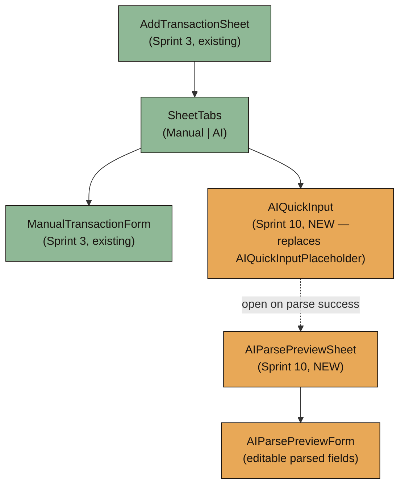
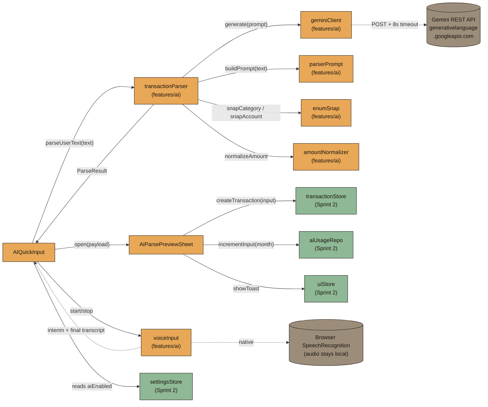
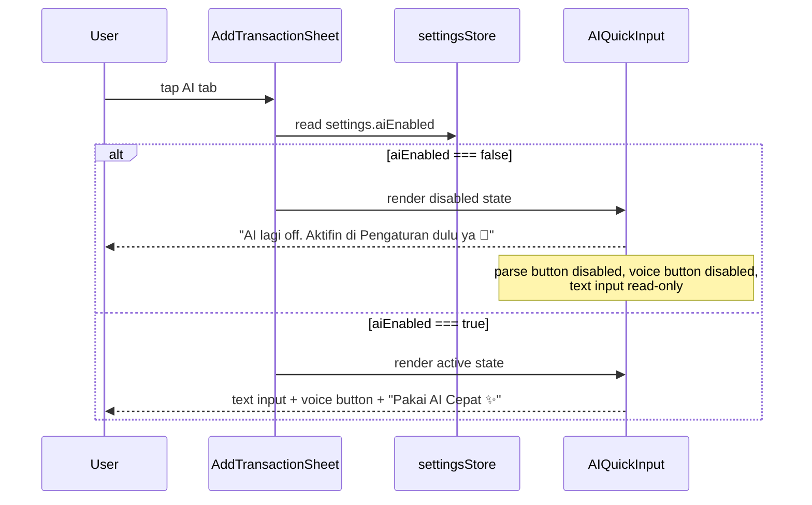
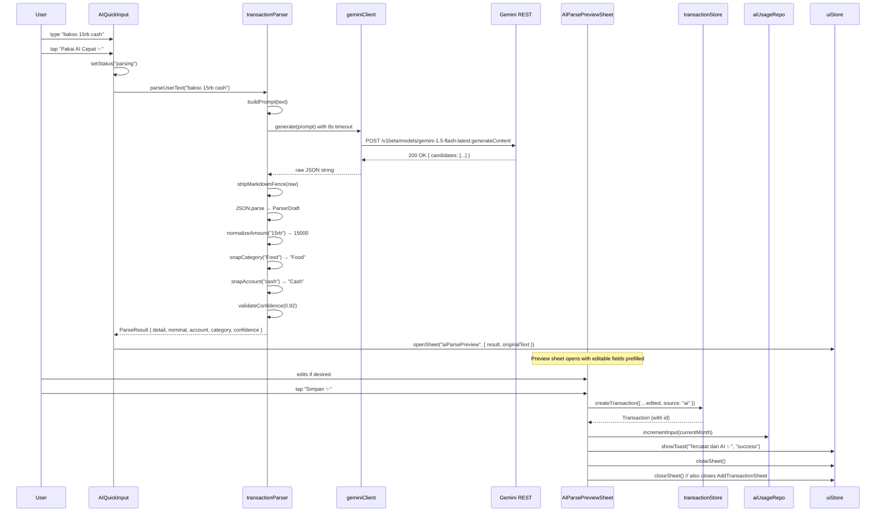
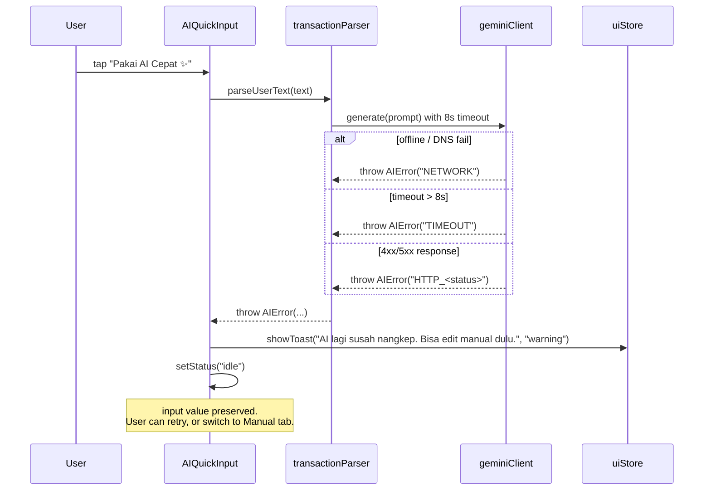
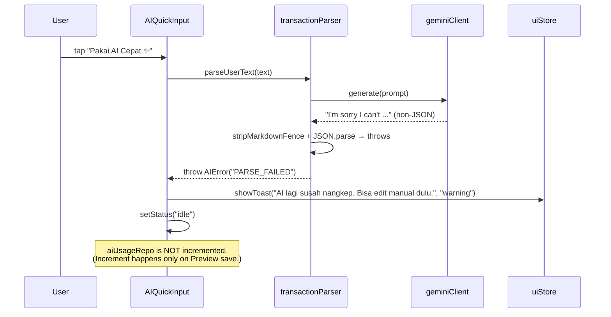
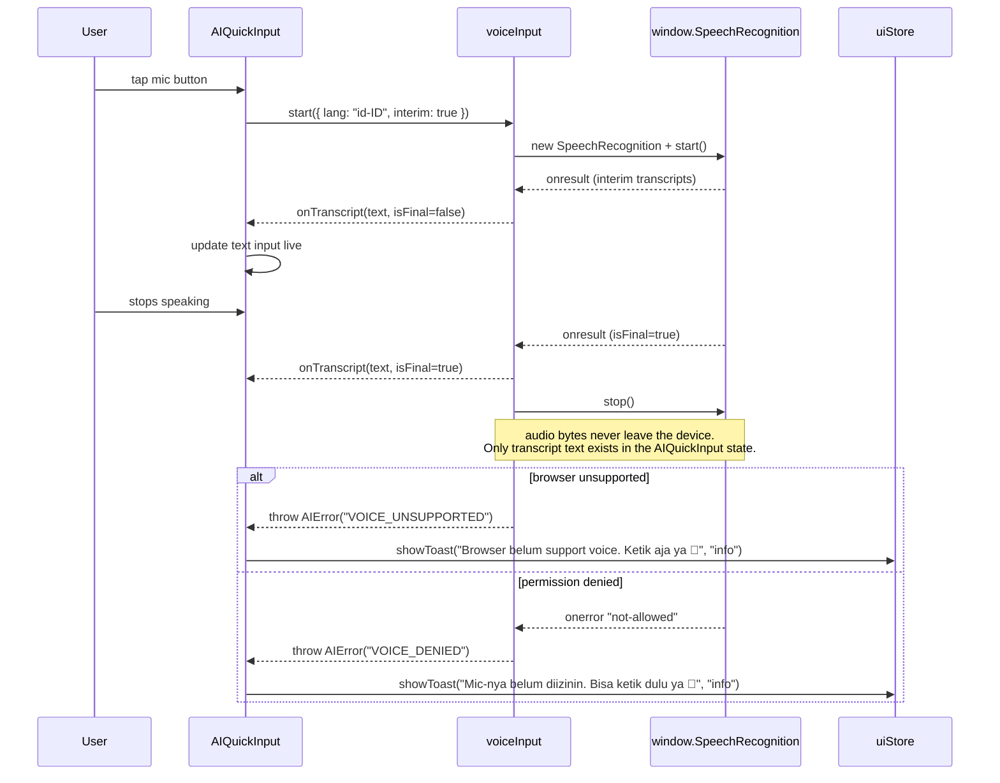
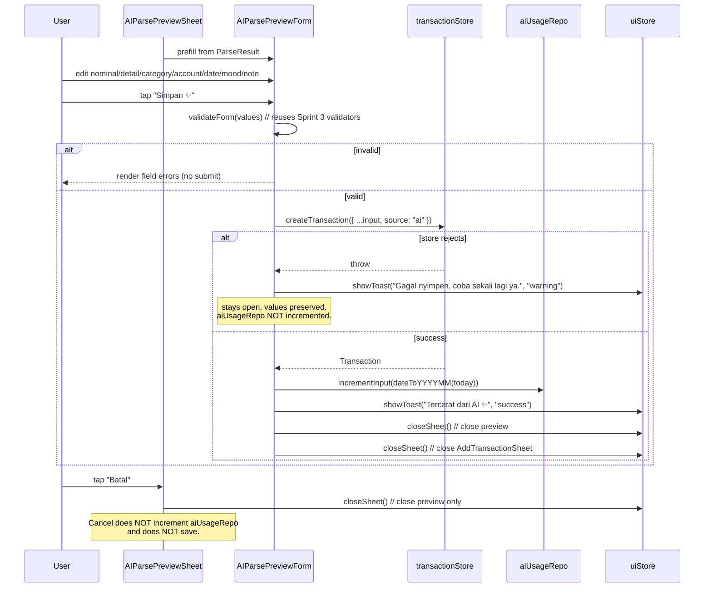

# Design Document: Sprint 10 — Gemini AI Parser

## Overview

Sprint 10 turns Luma's AI from a "Segera hadir" placeholder into a working **shortcut for transaction input**. Per `BUILD_PLAN §17`, `PRD §9.1`, `TECHNICAL_ARCHITECTURE §12/§24`, and `AGENTS.md` core UX rules, AI is **secondary** — manual input remains the default and AI never blocks the manual flow. This sprint replaces `AIQuickInputPlaceholder` (Sprint 3 stub inside `AddTransactionSheet`'s AI tab) with a real `AIQuickInput` component, adds a `geminiClient` for the Gemini REST API, a `transactionParser` that normalizes parser output, an `AIParsePreviewSheet` that lets the user edit the parsed result before saving, and a small `voiceInput` adapter over the browser-native Web Speech API.

The design follows three guardrails:

1. **AI is a shortcut, not a dependency.** Every AI failure path (off, network down, timeout, validation error, invalid JSON) returns control to the user with a soft Indonesian toast — typically `"AI lagi susah nangkep. Bisa edit manual dulu."` — and keeps the AI tab usable. Manual input is always one tap away via the Manual tab.

2. **Always preview before save.** The Gemini response never persists directly. It always lands in `AIParsePreviewSheet` where the user can edit nominal, detail, category, account, date, mood, and note before tapping "Simpan ✨". On save, the transaction is written via `transactionStore.createTransaction` with `source: "ai"` and `aiUsageRepo.incrementInput(currentMonth)` is called exactly once per successful parse.

3. **Privacy by default.** Only the user's free text plus the static parser prompt is sent to Gemini. Transaction history is never sent. Voice audio never leaves the device — `SpeechRecognition` produces a transcript locally and that transcript is what the user sees and can edit before tapping the parse button. A network timeout of 8 seconds bounds every request, and the API key is read from `import.meta.env.VITE_GEMINI_API_KEY` (dev only; `TECHNICAL_ARCHITECTURE §24` notes the production proxy as future work).

The AI tab is gated by `settings.aiEnabled` (existing `UserSettings` field from Sprint 2). When `aiEnabled === false`, the AI tab is rendered but visually disabled with copy `"AI lagi off. Aktifin di Pengaturan dulu ya 💛"`. The Manual tab remains the default and fully functional.

This sprint introduces no new IndexedDB stores. It reuses Sprint 2's `transactionStore`, `settingsStore`, `aiUsageRepo`, and `uiStore` (for toasts and sheet management). It introduces one new feature module (`features/ai/`), one new sheet (`AIParsePreviewSheet`), one new form-style component (`AIQuickInput`), and one small voice adapter.

---

## Architecture

### High-Level Component Composition



### Module / Service Layer



### File Layout

```txt
src/
├── components/
│   ├── forms/
│   │   └── AIQuickInput.tsx                  [new — replaces AIQuickInputPlaceholder]
│   └── sheets/
│       ├── AIParsePreviewSheet.tsx           [new]
│       └── AIParsePreviewForm.tsx            [new]
├── features/
│   └── ai/
│       ├── geminiClient.ts                   [new]
│       ├── parserPrompt.ts                   [new]
│       ├── transactionParser.ts              [new]
│       ├── amountNormalizer.ts               [new]
│       ├── enumSnap.ts                       [new]
│       ├── voiceInput.ts                     [new]
│       ├── errors.ts                         [new]
│       └── types.ts                          [new]
├── components/
│   └── forms/
│       └── AIQuickInputPlaceholder.tsx       [DELETED]
└── ...
```

> Sprint 3's `AIQuickInputPlaceholder.tsx` is deleted as part of this sprint. `AddTransactionSheet` now imports `AIQuickInput` for the AI tab body.

---

## Sequence Diagrams

### AI Tab Activation and Gating



### Happy Path — Text → Parse → Preview → Save



### Error — Network / Timeout / Off



### Error — Invalid JSON or Missing Fields



### Voice Input Pipeline



### Preview Edit and Save



---

## Components and Interfaces

### Component: AIQuickInput

**Purpose:** The body of the AI tab inside `AddTransactionSheet`. Hosts the text input, voice button, "Pakai AI Cepat ✨" button, and orchestrates the parse → preview transition.

```typescript
// src/components/forms/AIQuickInput.tsx
export interface AIQuickInputProps {
  // No props — reads aiEnabled from settingsStore and dispatches via uiStore.
}

export function AIQuickInput(props: AIQuickInputProps): JSX.Element;
```

**Responsibilities:**
- Subscribe to `settingsStore.settings.aiEnabled` to gate the UI.
- Hold local state: `{ text: string, status: "idle" | "parsing" | "listening", lastError: AIErrorCode | null }`.
- Render disabled state with copy `"AI lagi off. Aktifin di Pengaturan dulu ya 💛"` when `aiEnabled === false`.
- Render active state with: textarea (placeholder `"Contoh: bakso 15rb cash"`), mic button, primary button `"Pakai AI Cepat ✨"`.
- On mic tap, toggle `voiceInput.start/stop`. Mic button reflects `status === "listening"`.
- On primary tap, dispatch `parseUserText(text)` via `transactionParser`. Show inline spinner inside button while `status === "parsing"`.
- On parse success, call `uiStore.openSheet("aiParsePreview", { result, originalText })`.
- On parse failure (any `AIError`), call `uiStore.showToast("AI lagi susah nangkep. Bisa edit manual dulu.", "warning")` and reset to `idle` while preserving the input text.

**Visual spec:**
- Card layout: padding 16px, gap 12px between rows.
- Textarea: `min-height: 80px`, radius 16px, `bg-card-soft`, focus ring `--accent-primary`.
- Mic button and parse button row: mic (44×44 round, secondary), parse (flex 1, primary).
- Disabled state: text input read-only, both buttons disabled, soft helper card with copy.

---

### Component: AIParsePreviewSheet

**Purpose:** Bottom sheet shown after a successful parse. Hosts `AIParsePreviewForm` and the "Simpan ✨" / "Batal" actions.

```typescript
// src/components/sheets/AIParsePreviewSheet.tsx
export interface AIParsePreviewSheetPayload {
  result: ParseResult;
  originalText: string;
}

export function AIParsePreviewSheet(): JSX.Element;
```

**Responsibilities:**
- Subscribe to `uiStore.activeSheet === "aiParsePreview"` and `activeSheetPayload`.
- Render header with title "Cek dulu ya 👀" and a small chip showing `"Confidence: ${Math.round(confidence * 100)}%"` (color-coded: ≥0.8 success, 0.5–0.79 neutral, <0.5 warning).
- Render `AIParsePreviewForm` prefilled with the parser's output.
- Show `originalText` as muted helper above the form: `"Dari: \"<originalText>\""`.

**Visual spec:**
- BottomSheet variant matches Sprint 1 conventions.
- Confidence chip: 24px tall, padding 0 12px, radius 999px.
- Helper text: DM Sans 13/400 `text-muted`.

---

### Component: AIParsePreviewForm

**Purpose:** Editable form that prefills from a `ParseResult` and calls `transactionStore.createTransaction({ ...values, source: "ai" })` on save.

```typescript
// src/components/sheets/AIParsePreviewForm.tsx
export interface AIParsePreviewFormProps {
  initial: ParseResult;
  originalText: string;
}

export function AIParsePreviewForm(props: AIParsePreviewFormProps): JSX.Element;
```

**Responsibilities:**
- Reuse Sprint 3's field components: `NominalField`, `DetailField`, `CategorySelector`, `AccountChipSelector`, `DateField`, `MoodSelector`, `NoteField`.
- Reuse Sprint 3's `validateForm(values, today)` validator.
- Prefill state from `initial`:
  - `nominalRaw = formatIDR(initial.nominal)` minus the `Rp` prefix
  - `detail = initial.detail`
  - `category = initial.category`
  - `account = initial.account`
  - `date = today (YYYY-MM-DD)`
  - `mood = undefined`
  - `note = ""`
- Display formatted preview at top: `formatIDR(nominal)` (Fraunces 24/700 + accent).
- On submit: validate; if valid, call `transactionStore.createTransaction({ ...input, source: "ai" })`.
- On success: call `aiUsageRepo.incrementInput(dateToYYYYMM(today))`, show toast `"Tercatat dari AI ✨"`, close preview sheet, then close the parent `AddTransactionSheet`.
- On failure: show toast `"Gagal nyimpen, coba sekali lagi ya."`, preserve values, do **not** increment `aiUsageRepo`.
- "Batal" button closes only the preview sheet, leaving `AddTransactionSheet` open with the AI tab still showing the original text.

**Visual spec:**
- Same layout/density as `ManualTransactionForm` for consistency.
- Submit button label: `"Simpan ✨"`. Cancel: `"Batal"` (secondary).

---

### Component: SettingsAIToggle (small addition)

**Purpose:** Add an "AI" row to `SettingsPage` that toggles `settings.aiEnabled`. This sprint adds the toggle; full Settings page exists from Sprint 9.

```typescript
// src/components/customization/SettingsAIToggle.tsx
export interface SettingsAIToggleProps {
  enabled: boolean;
  onChange: (next: boolean) => void;
}

export function SettingsAIToggle(props: SettingsAIToggleProps): JSX.Element;
```

**Visual spec:**
- Row card: padding 16px, radius 20px, `bg-card`.
- Title: `"Bantuan AI"` (Fraunces 16/700).
- Helper: `"Pakai AI buat parse teks/voice jadi transaksi. Bisa dimatiin kapan aja."` (DM Sans 13/400 muted).
- Switch on the right (44×24 toggle).

---

## Data Models

Sprint 10 introduces no new IndexedDB stores. It defines the runtime types below and reuses `Transaction`, `UserSettings`, `AIUsage`, and `CreateTransactionInput` from Sprint 2.

```typescript
// src/features/ai/types.ts

export type AIStatus = "idle" | "parsing" | "listening";

/** The narrow shape Gemini is asked to return. Always validated before use. */
export interface ParserDraft {
  detail: string;
  nominal: number;
  account: string;        // pre-snap, free string from Gemini
  category: string;       // pre-snap, free string from Gemini
  confidence: number;     // 0..1
}

/** The shape AIQuickInput hands to AIParsePreviewSheet — fully snapped + validated. */
export interface ParseResult {
  detail: string;
  nominal: number;        // positive integer IDR
  account: AccountType;   // ∈ enum
  category: CategoryType; // ∈ enum
  confidence: number;     // clamped to [0, 1]
}

export type AIErrorCode =
  | "AI_DISABLED"           // settings.aiEnabled === false
  | "EMPTY_INPUT"           // text trimmed is empty
  | "MISSING_API_KEY"       // VITE_GEMINI_API_KEY missing or empty
  | "NETWORK"               // fetch failed (offline, DNS, CORS)
  | "TIMEOUT"               // > 8 seconds
  | "HTTP_4XX"              // 400..499 from Gemini
  | "HTTP_5XX"              // 500..599 from Gemini
  | "EMPTY_RESPONSE"        // candidates empty or text empty
  | "PARSE_FAILED"          // JSON.parse threw
  | "VALIDATION_FAILED"     // missing/invalid fields after JSON.parse
  | "VOICE_UNSUPPORTED"     // SpeechRecognition undefined
  | "VOICE_DENIED"          // mic permission denied
  | "VOICE_FAILED";         // generic voice error

/** Thrown by parser/client/voice modules. */
export class AIError extends Error {
  constructor(public readonly code: AIErrorCode, message?: string);
}

export interface VoiceTranscriptEvent {
  transcript: string;
  isFinal: boolean;
}

export interface VoiceController {
  start(opts?: { lang?: string; interim?: boolean }): Promise<void>;
  stop(): void;
  isListening(): boolean;
  onTranscript(handler: (e: VoiceTranscriptEvent) => void): () => void;
  onError(handler: (e: AIError) => void): () => void;
}

export interface GeminiRequestOptions {
  prompt: string;
  signal?: AbortSignal;
  /** Defaults to 8000ms. */
  timeoutMs?: number;
}

/** Toast keys used by AIQuickInput / AIParsePreviewSheet. */
export const AI_TOAST_COPY = {
  PARSE_FAILED: "AI lagi susah nangkep. Bisa edit manual dulu.",
  AI_DISABLED: "AI lagi off. Aktifin di Pengaturan dulu ya 💛",
  EMPTY_INPUT: "Tulis dulu transaksinya, contoh: bakso 15rb cash 🙏",
  MISSING_API_KEY: "AI lagi belum nyala di build ini. Pakai manual dulu ya 💛",
  VOICE_UNSUPPORTED: "Browser belum support voice. Ketik aja ya 🙏",
  VOICE_DENIED: "Mic-nya belum diizinin. Bisa ketik dulu ya 🙏",
  SAVE_OK: "Tercatat dari AI ✨",
  SAVE_FAILED: "Gagal nyimpen, coba sekali lagi ya.",
} as const;
```

### Allowed enums (reused from Sprint 2)

```typescript
type AccountType = "Cash" | "E-wallet" | "BNI" | "BCA" | "Mandiri" | "Other";
type CategoryType =
  | "Food" | "Transport" | "Entertainment" | "Shopping"
  | "Health" | "Giving" | "Saving" | "Other";
```

---

## Algorithmic Pseudocode

### Build Parser Prompt

```pascal
ALGORITHM buildParserPrompt(userText)
INPUT:  userText: String (already trimmed and non-empty)
OUTPUT: prompt: String

PRECONDITION:
  - userText.length > 0
  - userText is plain text (no JSON / no code-block markers)

POSTCONDITION:
  - prompt is the static template with userText interpolated exactly once
  - prompt instructs Gemini to output JSON only with required fields
  - prompt enumerates allowed CategoryType and AccountType values
  - prompt instructs slang normalization rules
  - prompt does NOT include any transaction history

BEGIN
  template ← """
You are Luma's transaction parser. Convert this Indonesian natural language
sentence to a SINGLE JSON object only. No markdown. No code fences. No prose.

Rules:
- nominal MUST be a positive integer IDR with no thousand separators.
- Normalize slang amounts:
    "15rb" / "15k" → 15000
    "1.5jt" / "1.5jt" → 1500000
    "250k" → 250000
- Snap category to the closest of:
    Food, Transport, Entertainment, Shopping, Health, Giving, Saving, Other.
- Snap account to the closest of:
    Cash, E-wallet, BNI, BCA, Mandiri, Other.
- detail is a short human label (e.g., "Bakso", "Album IU"), 1..120 chars.
- confidence is a number in [0, 1] reflecting how sure you are.
- If anything is unclear, DO NOT invent. Use Other for category/account
  and lower the confidence accordingly.

Return JSON shape:
{ "detail": string, "nominal": integer, "account": string, "category": string, "confidence": number }

Input:
"""
  prompt ← template + userText
  RETURN prompt
END
```

**Postcondition (formal):** For all `userText`, `prompt` contains `userText` exactly once and contains the literal substrings `"Cash"`, `"E-wallet"`, `"Food"`, `"Other"`, `"confidence"`. The function is pure and deterministic.

---

### Gemini REST Client

```pascal
ALGORITHM geminiGenerate(opts)
INPUT:  opts.prompt: String
        opts.signal: AbortSignal | undefined
        opts.timeoutMs: integer (default 8000)
OUTPUT: rawText: String   (the model's text candidate, untouched)

PRECONDITION:
  - opts.prompt.length > 0
  - import.meta.env.VITE_GEMINI_API_KEY is non-empty

POSTCONDITION:
  - On success: returns the first candidate's text (a String).
  - On failure: throws AIError with one of:
      MISSING_API_KEY, NETWORK, TIMEOUT, HTTP_4XX, HTTP_5XX, EMPTY_RESPONSE
  - Network call is bounded by min(opts.timeoutMs, signal abort).
  - At most ONE network request is initiated per call.

BEGIN
  apiKey ← import.meta.env.VITE_GEMINI_API_KEY
  IF apiKey IS EMPTY OR UNDEFINED THEN
    THROW AIError(MISSING_API_KEY)
  END IF

  url ← "https://generativelanguage.googleapis.com/v1beta/models/" +
        "gemini-1.5-flash-latest:generateContent?key=" + apiKey

  body ← {
    contents: [{ role: "user", parts: [{ text: opts.prompt }] }],
    generationConfig: { temperature: 0.1, responseMimeType: "application/json" }
  }

  // Compose abort: caller signal OR 8s timeout
  controller ← new AbortController()
  timer ← setTimeout(() => controller.abort("TIMEOUT"), opts.timeoutMs ?? 8000)
  IF opts.signal ≠ NULL THEN
    opts.signal.addEventListener("abort", () => controller.abort("CALLER_ABORT"))
  END IF

  TRY
    response ← AWAIT fetch(url, {
      method: "POST",
      headers: { "Content-Type": "application/json" },
      body: JSON.stringify(body),
      signal: controller.signal
    })
  CATCH e
    IF controller.signal.reason = "TIMEOUT" THEN
      THROW AIError(TIMEOUT)
    ELSE
      THROW AIError(NETWORK, e.message)
    END IF
  FINALLY
    clearTimeout(timer)
  END TRY

  IF response.status >= 400 AND response.status < 500 THEN
    THROW AIError(HTTP_4XX, "status=" + response.status)
  END IF
  IF response.status >= 500 THEN
    THROW AIError(HTTP_5XX, "status=" + response.status)
  END IF

  json ← AWAIT response.json()
  rawText ← json.candidates?[0]?.content?.parts?[0]?.text
  IF rawText IS EMPTY OR UNDEFINED THEN
    THROW AIError(EMPTY_RESPONSE)
  END IF

  RETURN rawText
END
```

**Loop invariants:** N/A (no loops).

---

### Strip Markdown Fence

```pascal
ALGORITHM stripMarkdownFence(raw)
INPUT:  raw: String
OUTPUT: cleaned: String

POSTCONDITION:
  - If raw matches /^\s*```(?:json)?\s*\n([\s\S]*?)\n```\s*$/i,
    cleaned is the captured group (the inner content trimmed).
  - Otherwise, cleaned === raw.trim().
  - Idempotent: stripMarkdownFence(stripMarkdownFence(s)) === stripMarkdownFence(s).

BEGIN
  trimmed ← raw.trim()
  match ← trimmed.match(/^```(?:json)?\s*\n([\s\S]*?)\n```$/i)
  IF match ≠ NULL THEN
    RETURN match[1].trim()
  END IF
  RETURN trimmed
END
```

---

### Normalize Slang Amount

```pascal
ALGORITHM normalizeAmount(value)
INPUT:  value: number | string
OUTPUT: nominal: positive integer

PRECONDITION:
  - value is either a finite number or a string

POSTCONDITION:
  - If value is a finite number ≥ 1: nominal = round(value)
  - If value is a string of the form ⟨decimal⟩⟨suffix?⟩ where:
        ⟨decimal⟩ ∈ /^\d+(?:[.,]\d+)?$/
        ⟨suffix⟩  ∈ {"", "k", "rb", "ribu", "jt", "juta", "m"} (case-insensitive)
    nominal is the integer IDR equivalent:
        no suffix       → round(decimal)
        "k"|"rb"|"ribu" → round(decimal * 1000)
        "jt"|"juta"|"m" → round(decimal * 1_000_000)
  - On any other input: throw AIError(VALIDATION_FAILED, "amount").
  - nominal is always a positive integer; throw VALIDATION_FAILED if result ≤ 0.

BEGIN
  IF typeof value = "number" THEN
    IF NOT isFinite(value) OR value < 1 THEN
      THROW AIError(VALIDATION_FAILED, "amount")
    END IF
    RETURN round(value)
  END IF

  s ← value.trim().toLowerCase().replace(/\s+/g, "").replace(",", ".")

  // Strip "rp" prefix and thousand separator dots like "Rp1.500"
  IF s startsWith "rp" THEN s ← s.substring(2) END IF

  match ← s.match(/^(\d+(?:\.\d+)?)(k|rb|ribu|jt|juta|m)?$/)
  IF match = NULL THEN
    // fallback: dotted thousand separator without suffix, e.g. "1.500.000"
    digitsOnly ← s.replace(/\./g, "")
    IF digitsOnly.match(/^\d+$/) THEN
      n ← parseInt(digitsOnly, 10)
      IF n >= 1 THEN RETURN n END IF
    END IF
    THROW AIError(VALIDATION_FAILED, "amount")
  END IF

  decimal ← parseFloat(match[1])
  suffix  ← match[2] ?? ""
  multiplier ← CASE suffix OF
    "" → 1
    "k", "rb", "ribu" → 1000
    "jt", "juta", "m" → 1_000_000
  END CASE

  result ← Math.round(decimal * multiplier)
  IF result < 1 THEN THROW AIError(VALIDATION_FAILED, "amount") END IF
  RETURN result
END
```

---

### Snap to Enum

```pascal
ALGORITHM snapEnum(input, allowed, fallback)
INPUT:  input: String (free-form from Gemini)
        allowed: readonly String[]   (exact enum values)
        fallback: String              (always equal to "Other" for our enums)
OUTPUT: value: String   (∈ allowed)

PRECONDITION:
  - allowed is non-empty and contains fallback.

POSTCONDITION:
  - returned value ∈ allowed.
  - If input case-insensitively equals an entry in allowed, that entry is returned.
  - Else if any entry's lowercase startsWith / contains the input's lowercase
    (or vice versa), the first such entry is returned.
  - Else fallback is returned.
  - Pure and deterministic.

BEGIN
  IF input IS EMPTY OR NOT String THEN RETURN fallback END IF
  needle ← input.trim().toLowerCase()
  IF needle = "" THEN RETURN fallback END IF

  // 1. Exact match (case-insensitive)
  FOR each candidate IN allowed DO
    IF candidate.toLowerCase() = needle THEN RETURN candidate END IF
  END FOR

  // 2. Containment in either direction
  FOR each candidate IN allowed DO
    cand ← candidate.toLowerCase()
    IF cand.includes(needle) OR needle.includes(cand) THEN RETURN candidate END IF
  END FOR

  // 3. Common synonyms (Indonesian + casual)
  synonyms ← {
    "makanan": "Food", "makan": "Food", "minum": "Food", "kuliner": "Food",
    "transport": "Transport", "ojek": "Transport", "gojek": "Transport",
    "grab": "Transport", "bensin": "Transport", "parkir": "Transport",
    "hiburan": "Entertainment", "konser": "Entertainment", "film": "Entertainment",
    "belanja": "Shopping", "shopping": "Shopping", "baju": "Shopping",
    "kesehatan": "Health", "obat": "Health", "klinik": "Health",
    "donasi": "Giving", "sedekah": "Giving", "amal": "Giving",
    "tabungan": "Saving", "nabung": "Saving",
    "cash": "Cash", "tunai": "Cash",
    "ewallet": "E-wallet", "e-wallet": "E-wallet", "gopay": "E-wallet",
    "ovo": "E-wallet", "dana": "E-wallet", "shopeepay": "E-wallet",
    "bni": "BNI", "bca": "BCA", "mandiri": "Mandiri"
  }
  IF synonyms[needle] IN allowed THEN RETURN synonyms[needle] END IF

  // 4. Fallback
  RETURN fallback
END
```

The snap helpers expose:
- `snapCategory(input: string): CategoryType` — `snapEnum(input, CATEGORY_VALUES, "Other")`
- `snapAccount(input: string): AccountType` — `snapEnum(input, ACCOUNT_VALUES, "Other")`

---

### Parse User Text (top-level orchestration)

```pascal
ALGORITHM parseUserText(text)
INPUT:  text: String
OUTPUT: result: ParseResult

PRECONDITION:
  - settings.aiEnabled === true   (caller checked)

POSTCONDITION:
  - On success:
      result.detail ≠ "" AND result.detail.length ≤ 120
      result.nominal is a positive integer
      result.account ∈ AccountType
      result.category ∈ CategoryType
      0 ≤ result.confidence ≤ 1
  - On failure: throws AIError with one of:
      EMPTY_INPUT, MISSING_API_KEY, NETWORK, TIMEOUT, HTTP_4XX, HTTP_5XX,
      EMPTY_RESPONSE, PARSE_FAILED, VALIDATION_FAILED
  - At most ONE network request is initiated per call.
  - aiUsageRepo is NEVER touched here (only on Preview save).

BEGIN
  trimmed ← text.trim()
  IF trimmed.length = 0 THEN THROW AIError(EMPTY_INPUT) END IF

  prompt ← buildParserPrompt(trimmed)
  raw ← AWAIT geminiGenerate({ prompt, timeoutMs: 8000 })
  cleaned ← stripMarkdownFence(raw)

  TRY
    draft ← JSON.parse(cleaned)
  CATCH
    THROW AIError(PARSE_FAILED, "json")
  END TRY

  // Field-by-field validation
  IF typeof draft.detail ≠ "string" OR draft.detail.trim() = "" THEN
    THROW AIError(VALIDATION_FAILED, "detail")
  END IF
  detail ← draft.detail.trim().slice(0, 120)

  nominal ← normalizeAmount(draft.nominal)   // throws VALIDATION_FAILED if bad

  IF typeof draft.confidence ≠ "number" OR isNaN(draft.confidence) THEN
    confidence ← 0.5     // safe default: middle of road, prompts user to review
  ELSE
    confidence ← clamp(draft.confidence, 0, 1)
  END IF

  category ← snapCategory(String(draft.category ?? ""))   // returns ∈ enum, fallback "Other"
  account  ← snapAccount(String(draft.account ?? ""))

  RETURN { detail, nominal, account, category, confidence }
END
```

**Loop invariants:** N/A.

---

### Voice Input Lifecycle

```pascal
ALGORITHM voiceController.start(opts)
INPUT:  opts.lang: String (default "id-ID")
        opts.interim: boolean (default true)
OUTPUT: void

POSTCONDITION:
  - On success: a single SpeechRecognition instance is active and emitting events.
  - On unsupported browser: throws AIError(VOICE_UNSUPPORTED) WITHOUT instantiating anything.
  - On permission denied: emits AIError(VOICE_DENIED) via onError handler.
  - At most ONE active recognition instance per controller.

BEGIN
  IF state.recognition ≠ NULL THEN RETURN END IF       // idempotent re-entry guard

  Speech ← window.SpeechRecognition OR window.webkitSpeechRecognition
  IF Speech IS UNDEFINED THEN
    THROW AIError(VOICE_UNSUPPORTED)
  END IF

  rec ← new Speech()
  rec.lang ← opts.lang ?? "id-ID"
  rec.continuous ← false
  rec.interimResults ← opts.interim ?? true

  rec.onresult ← (event) => {
    last ← event.results[event.results.length - 1]
    transcript ← last[0].transcript
    isFinal ← last.isFinal
    state.transcriptHandlers.forEach(h => h({ transcript, isFinal }))
  }

  rec.onerror ← (event) => {
    code ← (event.error = "not-allowed" OR event.error = "service-not-allowed")
           ? VOICE_DENIED : VOICE_FAILED
    state.errorHandlers.forEach(h => h(new AIError(code, event.error)))
    state.recognition ← NULL
  }

  rec.onend ← () => {
    state.recognition ← NULL
  }

  state.recognition ← rec
  rec.start()
END

ALGORITHM voiceController.stop()
POSTCONDITION:
  - state.recognition is NULL after this call returns (idempotent).
  - No new audio is captured after stop() returns.

BEGIN
  IF state.recognition ≠ NULL THEN
    state.recognition.stop()
    state.recognition ← NULL
  END IF
END
```

---

### Save from Preview

```pascal
ALGORITHM saveFromPreview(values)
INPUT:  values: form values (validated by Sprint 3 validator)
OUTPUT: void   (side effects only)

PRECONDITION:
  - validateForm(values, today).valid === true

POSTCONDITION:
  - Exactly ONE Transaction is persisted with source="ai" and the submitted values.
  - aiUsageRepo.incrementInput(currentMonth) is invoked exactly ONCE (only after successful persist).
  - Toast "Tercatat dari AI ✨" is queued.
  - Both the preview sheet and the parent AddTransactionSheet are closed.
  - On store rejection: NO transaction persisted, aiUsageRepo NOT incremented,
    toast "Gagal nyimpen, coba sekali lagi ya." queued, both sheets stay open.

BEGIN
  result ← validateForm(values, today)
  ASSERT result.valid = true

  TRY
    tx ← AWAIT transactionStore.createTransaction({ ...result.input, source: "ai" })
  CATCH e
    uiStore.showToast("Gagal nyimpen, coba sekali lagi ya.", "warning")
    RETURN
  END TRY

  TRY
    AWAIT aiUsageRepo.incrementInput(dateToYYYYMM(parseISO(values.date)))
  CATCH e
    // Soft-fail usage tracking; do NOT undo the transaction.
    console.warn("aiUsage increment failed:", e)
  END TRY

  uiStore.showToast("Tercatat dari AI ✨", "success")
  uiStore.closeSheet()   // close preview
  uiStore.closeSheet()   // close AddTransactionSheet
END
```

---

## Key Functions with Formal Specifications

### geminiGenerate()

```typescript
// src/features/ai/geminiClient.ts
export async function geminiGenerate(opts: GeminiRequestOptions): Promise<string>;
```

**Preconditions:**
- `opts.prompt.length > 0`.
- `import.meta.env.VITE_GEMINI_API_KEY` is a non-empty string.

**Postconditions:**
- On success: returns a non-empty string containing the model's first candidate text.
- On failure: throws an `AIError` whose `code` is exactly one of `MISSING_API_KEY`, `NETWORK`, `TIMEOUT`, `HTTP_4XX`, `HTTP_5XX`, `EMPTY_RESPONSE`.
- Initiates **at most one** outbound HTTP request.
- The request is bounded by `min(opts.timeoutMs ?? 8000, opts.signal abort)`.
- The request body contains `opts.prompt` and **no** transaction history.

**Loop invariants:** N/A.

---

### parseUserText()

```typescript
// src/features/ai/transactionParser.ts
export async function parseUserText(text: string): Promise<ParseResult>;
```

**Preconditions:**
- The caller has verified `settings.aiEnabled === true`.

**Postconditions:**
- On success: returns a `ParseResult` satisfying:
  - `detail.length ≥ 1 && detail.length ≤ 120`
  - `Number.isInteger(nominal) && nominal ≥ 1`
  - `account` ∈ `AccountType` enum
  - `category` ∈ `CategoryType` enum
  - `0 ≤ confidence ≤ 1`
- On failure: throws an `AIError` with `code` ∈ { `EMPTY_INPUT`, `MISSING_API_KEY`, `NETWORK`, `TIMEOUT`, `HTTP_4XX`, `HTTP_5XX`, `EMPTY_RESPONSE`, `PARSE_FAILED`, `VALIDATION_FAILED` }.
- The function does **not** read or write IndexedDB.
- The function does **not** call `aiUsageRepo`.
- The function does **not** include any transaction history in the network request body.

**Loop invariants:** N/A.

---

### normalizeAmount()

```typescript
// src/features/ai/amountNormalizer.ts
export function normalizeAmount(value: number | string): number;
```

**Preconditions:**
- None (handles all inputs by throwing on invalid).

**Postconditions:**
- Returns a positive integer (`Number.isInteger(result) && result ≥ 1`).
- For canonical inputs, returns:
  - `15000` for inputs `15000`, `"15000"`, `"15rb"`, `"15k"`, `"15 ribu"`, `"Rp15.000"`, `"15.000"`.
  - `1500000` for inputs `1500000`, `"1.5jt"`, `"1.5 juta"`, `"1500k"`, `"1.500.000"`.
  - `250000` for inputs `"250k"`, `"250rb"`.
- On any other input: throws `AIError(VALIDATION_FAILED, "amount")`.
- Pure, deterministic, idempotent (`normalizeAmount(normalizeAmount(x)) === normalizeAmount(x)` for valid `x`).

**Loop invariants:** N/A.

---

### snapCategory() / snapAccount()

```typescript
// src/features/ai/enumSnap.ts
export function snapCategory(input: string): CategoryType;
export function snapAccount(input: string): AccountType;
```

**Preconditions:**
- `input` is any string (including empty).

**Postconditions:**
- `snapCategory(input)` always returns a value ∈ `CategoryType`.
- `snapAccount(input)` always returns a value ∈ `AccountType`.
- For canonical inputs (case-insensitive equality), returns the matching enum.
- For unknown inputs (after exact, containment, and synonym lookups), returns `"Other"`.
- Pure, deterministic, side-effect-free.

**Loop invariants:**
- After examining `n` candidates in step 1 (exact match), no candidate at indices `0..n-1` exactly matches `needle`.
- After examining `n` candidates in step 2 (containment), no candidate at indices `0..n-1` matches by containment in either direction.

---

### voiceInput controller

```typescript
// src/features/ai/voiceInput.ts
export function createVoiceController(): VoiceController;
```

**Preconditions:**
- A browser environment (`typeof window !== "undefined"`).

**Postconditions:**
- The returned controller maintains **at most one** active `SpeechRecognition` instance at any time.
- `start()` is idempotent: calling it while already listening is a no-op.
- `stop()` is idempotent: calling it when not listening is a no-op.
- `start()` throws `AIError(VOICE_UNSUPPORTED)` synchronously when neither `SpeechRecognition` nor `webkitSpeechRecognition` exists on `window` — without instantiating anything.
- `onTranscript` and `onError` handlers receive events strictly between `start()` resolving and `stop()` being called (or the recognition ending naturally).
- Audio bytes are **never** sent to any network endpoint by this module.

**Loop invariants:** N/A.

---

## Example Usage

### Parsing a typed transaction

```typescript
// Inside AIQuickInput.tsx
const handleParse = async () => {
  if (!settings.aiEnabled) return;
  const text = inputText.trim();
  if (!text) {
    showToast(AI_TOAST_COPY.EMPTY_INPUT, "info");
    return;
  }
  setStatus("parsing");
  try {
    const result = await parseUserText(text);
    openSheet("aiParsePreview", { result, originalText: text });
  } catch (err) {
    const code = (err as AIError).code;
    const msg =
      code === "MISSING_API_KEY"
        ? AI_TOAST_COPY.MISSING_API_KEY
        : AI_TOAST_COPY.PARSE_FAILED;
    showToast(msg, "warning");
  } finally {
    setStatus("idle");
  }
};
```

### Voice input wiring

```typescript
// Inside AIQuickInput.tsx
useEffect(() => {
  const off1 = voice.onTranscript(({ transcript, isFinal }) => {
    setInputText(transcript);
    if (isFinal) setStatus("idle");
  });
  const off2 = voice.onError((err) => {
    setStatus("idle");
    const msg =
      err.code === "VOICE_UNSUPPORTED"
        ? AI_TOAST_COPY.VOICE_UNSUPPORTED
        : err.code === "VOICE_DENIED"
          ? AI_TOAST_COPY.VOICE_DENIED
          : AI_TOAST_COPY.PARSE_FAILED;
    showToast(msg, "info");
  });
  return () => {
    off1();
    off2();
    voice.stop();
  };
}, []);

const toggleMic = () => {
  if (status === "listening") {
    voice.stop();
    setStatus("idle");
    return;
  }
  try {
    voice.start({ lang: "id-ID", interim: true });
    setStatus("listening");
  } catch (err) {
    showToast(AI_TOAST_COPY.VOICE_UNSUPPORTED, "info");
  }
};
```

### Preview save

```typescript
// Inside AIParsePreviewForm.tsx
const handleSave = async () => {
  const result = validateForm(values, todayYYYYMMDD());
  if (!result.valid) { setErrors(result.errors); return; }
  try {
    await transactionStore.createTransaction({ ...result.input, source: "ai" });
    await aiUsageRepo.incrementInput(dateToYYYYMM(values.date)).catch(console.warn);
    showToast(AI_TOAST_COPY.SAVE_OK, "success");
    closeSheet();   // preview
    closeSheet();   // AddTransactionSheet
  } catch {
    showToast(AI_TOAST_COPY.SAVE_FAILED, "warning");
  }
};
```

---

## Correctness Properties

These properties are universal claims that any property-based or example-based test must uphold.

### Property 1: Manual flow is independent of AI

> ∀ `aiEnabled ∈ {true, false}`, ∀ AI module state ∈ {available, broken, network-down, key-missing}:
> the user can open `AddTransactionSheet`, switch to the Manual tab, fill the form, and persist a `Transaction` with `source: "manual"`.

**Justification:** The Manual tab uses only Sprint 3's `ManualTransactionForm`, which has no dependency on `geminiClient`, `transactionParser`, `voiceInput`, or any environment variable.

---

### Property 2: AI never auto-saves

> For every successful `parseUserText(text)` call, no `Transaction` is written to IndexedDB until the user taps "Simpan ✨" inside `AIParsePreviewForm`.

**Justification:** `parseUserText` returns a value; only `AIParsePreviewForm.handleSave` calls `transactionStore.createTransaction`.

---

### Property 3: Saved AI transactions carry `source: "ai"`

> For every Transaction persisted via `AIParsePreviewForm.handleSave`, `transaction.source === "ai"`.

---

### Property 4: `aiUsageRepo.incrementInput` is invoked exactly once per saved AI transaction

> Across any execution trace, `count(aiUsageRepo.incrementInput calls) === count(Transactions written with source==="ai")` and the increments target the month derived from the saved transaction's `date`.

> Specifically, for a parse-only flow that fails or is cancelled, `count(aiUsageRepo.incrementInput) === 0`.

---

### Property 5: Output enums are always valid

> ∀ `text` such that `parseUserText(text)` resolves with `result`:
> `result.account ∈ ACCOUNT_VALUES` and `result.category ∈ CATEGORY_VALUES`.

**Justification:** `snapAccount` / `snapCategory` always return a value in their respective enum (post-condition of `snapEnum`).

---

### Property 6: Output nominal is always a positive integer

> ∀ `text` such that `parseUserText(text)` resolves with `result`:
> `Number.isInteger(result.nominal) && result.nominal ≥ 1`.

---

### Property 7: Confidence is always in `[0, 1]`

> ∀ `text` such that `parseUserText(text)` resolves with `result`:
> `0 ≤ result.confidence ≤ 1`.

---

### Property 8: Slang normalization round-trip

> ∀ canonical pair `(input, expected)` in the table below, `normalizeAmount(input) === expected`.

| input | expected |
|---|---|
| `15000` | `15000` |
| `"15rb"` | `15000` |
| `"15k"` | `15000` |
| `"15 ribu"` | `15000` |
| `"Rp15.000"` | `15000` |
| `"1.5jt"` | `1500000` |
| `"1.5 juta"` | `1500000` |
| `"250k"` | `250000` |
| `"1.500.000"` | `1500000` |

---

### Property 9: Network request never includes transaction history

> Across any execution trace, every outbound POST body to `generativelanguage.googleapis.com` contains exactly one `parts[].text` field whose content is the parser prompt template plus the user's free text. No `Transaction` object, no `transactionStore` state, and no IndexedDB read result is included.

---

### Property 10: Voice audio never leaves the device

> The `voiceInput` module makes **zero** network calls. It only constructs `SpeechRecognition`, attaches handlers, and calls `start/stop`. Across any trace, `count(fetch calls within voiceInput.ts) === 0` and `count(XMLHttpRequest opens within voiceInput.ts) === 0`.

---

### Property 11: Network timeout bound

> Every call to `geminiGenerate` either resolves or rejects within `opts.timeoutMs + ε` milliseconds (default 8000ms + small jitter for AbortController teardown).

---

### Property 12: AI off ⇒ no AI surface usable

> When `settings.aiEnabled === false`:
> - `AIQuickInput`'s parse button is disabled (`aria-disabled="true"`).
> - `AIQuickInput`'s mic button is disabled.
> - The text input is rendered read-only OR the parse handler returns early without dispatching `parseUserText`.
> - `parseUserText` is never invoked from any handler bound by `AIQuickInput`.

---

### Property 13: Preview cancel is a no-op

> Tapping "Batal" in `AIParsePreviewSheet`:
> - Does not call `transactionStore.createTransaction`.
> - Does not call `aiUsageRepo.incrementInput`.
> - Closes only the preview sheet, leaving the parent `AddTransactionSheet` open with the AI tab still selected and the original text still in the input.

---

### Property 14: Idempotent voice controller

> ∀ sequence of `start()` and `stop()` calls on a `VoiceController`, at most one `SpeechRecognition` instance exists at any time, and `stop()` while idle is a no-op.

---

## Error Handling

### Scenario 1: AI is disabled

**Condition:** `settings.aiEnabled === false`.
**Response:** `AddTransactionSheet` still allows tapping the AI tab; the AI tab body shows the disabled `AIQuickInput` with copy `"AI lagi off. Aktifin di Pengaturan dulu ya 💛"` and a small `"Buka Pengaturan"` link button.
**Recovery:** User toggles `aiEnabled` in Settings, returns to the sheet.

---

### Scenario 2: API key missing in build

**Condition:** `import.meta.env.VITE_GEMINI_API_KEY` is empty/undefined.
**Response:** `geminiGenerate` throws `AIError(MISSING_API_KEY)`. `AIQuickInput` shows toast `"AI lagi belum nyala di build ini. Pakai manual dulu ya 💛"`.
**Recovery:** User switches to Manual tab; manual flow is unaffected.

---

### Scenario 3: Network failure or timeout

**Condition:** `fetch` rejects, the device is offline, DNS fails, or the request exceeds 8000ms.
**Response:** Toast `"AI lagi susah nangkep. Bisa edit manual dulu."`. `AIQuickInput` resets to `idle` state with the original text preserved.
**Recovery:** User retries, or switches to Manual tab.

---

### Scenario 4: Gemini returns non-JSON

**Condition:** Gemini responds with prose, an apology, or malformed JSON.
**Response:** `transactionParser.stripMarkdownFence` + `JSON.parse` throws. `parseUserText` re-throws as `AIError(PARSE_FAILED)`. Same toast as Scenario 3.
**Recovery:** User retries with rephrased input, or switches to Manual tab.

---

### Scenario 5: Validation fails after parse

**Condition:** Gemini returns JSON, but `nominal` is not a positive integer or `detail` is empty.
**Response:** `parseUserText` throws `AIError(VALIDATION_FAILED)`. Same toast as Scenario 3.
**Recovery:** User retries or switches to Manual tab.

---

### Scenario 6: Voice unsupported / permission denied

**Condition:** Browser lacks `SpeechRecognition`, or user denies mic permission.
**Response:** Toasts `"Browser belum support voice. Ketik aja ya 🙏"` or `"Mic-nya belum diizinin. Bisa ketik dulu ya 🙏"`. Mic button returns to idle. Text input remains usable.
**Recovery:** User types instead.

---

### Scenario 7: Preview save fails

**Condition:** `transactionStore.createTransaction` rejects (IDB quota, etc.).
**Response:** Toast `"Gagal nyimpen, coba sekali lagi ya."`. Preview stays open with values preserved. **`aiUsageRepo` is NOT incremented.**
**Recovery:** User retries save, or taps "Batal" to return to AI input.

---

### Scenario 8: `aiUsageRepo.incrementInput` rejects

**Condition:** Usage repo write fails after a successful transaction write.
**Response:** Soft-fail. Transaction is still saved. `console.warn` logs the error. UI proceeds as success.
**Recovery:** None needed (counter is best-effort tracking).

---

## Testing Strategy

### Unit Testing Approach

Pure functions are unit-tested with example tables and property tests:

- `buildParserPrompt(text)` — example tests for prompt content, idempotency.
- `stripMarkdownFence(raw)` — example tests for fenced/unfenced/whitespace inputs, idempotency.
- `normalizeAmount(value)` — table-driven tests for canonical pairs (P8) plus property test for round-trip and integer postcondition.
- `snapEnum(input, allowed, fallback)` — table-driven tests, plus property test that the result is always ∈ `allowed`.
- `snapCategory(input)`, `snapAccount(input)` — table-driven tests for synonyms, exact match, fallback.

### Property-Based Testing Approach

**Property test library:** `fast-check` (matches sprint-9 convention).

Properties to encode as `fc` tests:
- **P5 (enum totality):** `fc.string()` → `snapCategory(s)` ∈ enum and `snapAccount(s)` ∈ enum.
- **P6 / P8 (amount integer + slang):** `fc.oneof(fc.integer({min:1,max:1e9}), fc.constantFrom(...table inputs))` → `Number.isInteger(normalizeAmount(x)) && normalizeAmount(x) ≥ 1`.
- **P7 (confidence clamp):** for arbitrary `confidence ∈ [-10, 10]`, the parse result clamps to `[0, 1]`.
- **P14 (voice idempotency):** arbitrary sequences of `start()`/`stop()` keep `recognition` count ≤ 1.

### Integration Testing Approach

Mock `fetch` and `SpeechRecognition`. Use `fake-indexeddb` for repo writes.

- **AI happy path:** mock `fetch` to return canned JSON; assert `AIParsePreviewSheet` opens with prefilled fields; tap save; assert IDB row with `source: "ai"`; assert `aiUsageRepo` incremented once.
- **Network error:** mock `fetch` to reject; assert toast and no IDB write; assert `aiUsageRepo` not incremented.
- **Timeout:** stub `fetch` to a never-resolving promise; advance fake timers past 8000ms; assert `AIError(TIMEOUT)` and toast.
- **Non-JSON response:** mock `fetch` returning prose; assert `AIError(PARSE_FAILED)` and toast.
- **AI off:** set `settings.aiEnabled = false`; assert AI tab shows disabled state; assert `parseUserText` is never called.
- **Cancel preview:** open preview; tap "Batal"; assert no IDB write, no `aiUsageRepo` call, parent sheet stays open.
- **Manual still works when AI broken:** set `aiEnabled = true`, mock `fetch` to throw; switch to Manual tab; assert manual save succeeds.
- **Voice unsupported:** delete `window.SpeechRecognition`; tap mic; assert toast and no instantiation.

### Network Privacy Test

- Spy on `fetch`. Run the full AI parse flow. Assert exactly one POST to `generativelanguage.googleapis.com` whose body's `contents[0].parts[0].text` does **not** contain any substring from a fixture transaction list.

---

## Performance Considerations

- **Lazy load:** `features/ai/*` modules are dynamically `import()`ed on first AI tab activation, keeping the initial bundle lean.
- **Single request per parse:** `geminiGenerate` initiates exactly one `fetch`. No retry-on-failure (user re-taps if needed).
- **Timeout bound:** 8 seconds caps every parse. The UI never spins indefinitely.
- **Voice continuous=false:** `SpeechRecognition.continuous = false` so the browser stops capture after one utterance, conserving battery.
- **No transaction history:** only the user's free text is sent, keeping payload sizes small.

---

## Security Considerations

- **API key:** read from `import.meta.env.VITE_GEMINI_API_KEY`. This is a **dev-only** approach. `TECHNICAL_ARCHITECTURE §24` documents the production proxy as future work. The key is never written to IndexedDB or `localStorage`. The `.env` file is gitignored.
- **No history exfiltration:** the parser prompt is a static template plus the user's free text. `transactionStore` and IndexedDB reads are never included in the request body. This is enforced by the parser code path: `parseUserText` does not import `transactionStore` or any repo.
- **Voice audio stays local:** `SpeechRecognition` runs in-browser. The `voiceInput` module never calls `fetch` or any network API. Tests assert this invariant.
- **HTTPS only:** the Gemini endpoint URL is fixed at `https://generativelanguage.googleapis.com/...`. No fallback to HTTP.
- **Prompt injection awareness:** the user's free text is interpolated into the prompt. The prompt's instruction set is short and the response is parsed strictly as JSON; if the user types adversarial text and Gemini complies, the JSON shape validation in `parseUserText` rejects malformed output and shows a soft toast. No code from the response is executed.

---

## Dependencies

### Existing (no new installs required)

- **Sprint 1:** `BottomSheet`, `Button`, `Input`, `Card`, `Toast` UI primitives.
- **Sprint 2:** `transactionStore`, `settingsStore`, `uiStore`, `aiUsageRepo`, `dateToYYYYMM`, `dateToYYYYMMDD`, `parseISO`-style helpers, `formatIDR`, `Transaction`, `CreateTransactionInput`, `AccountType`, `CategoryType`, `AIUsage`, `UserSettings`.
- **Sprint 3:** `AddTransactionSheet`, `ManualTransactionForm`, field components (`NominalField`, `DetailField`, `CategorySelector`, `AccountChipSelector`, `DateField`, `MoodSelector`, `NoteField`), `validateForm`.
- **Sprint 9:** `SettingsPage` (extended with `SettingsAIToggle`).

### Browser APIs

- `fetch` + `AbortController` + `setTimeout` for the Gemini request.
- `window.SpeechRecognition` / `window.webkitSpeechRecognition` for voice (capability-detected; absence is handled gracefully).

### Environment Variables

- `VITE_GEMINI_API_KEY` — dev-only secret, read via `import.meta.env`. Documented in `README.md` for local setup.

### No new npm dependencies are introduced by Sprint 10.
