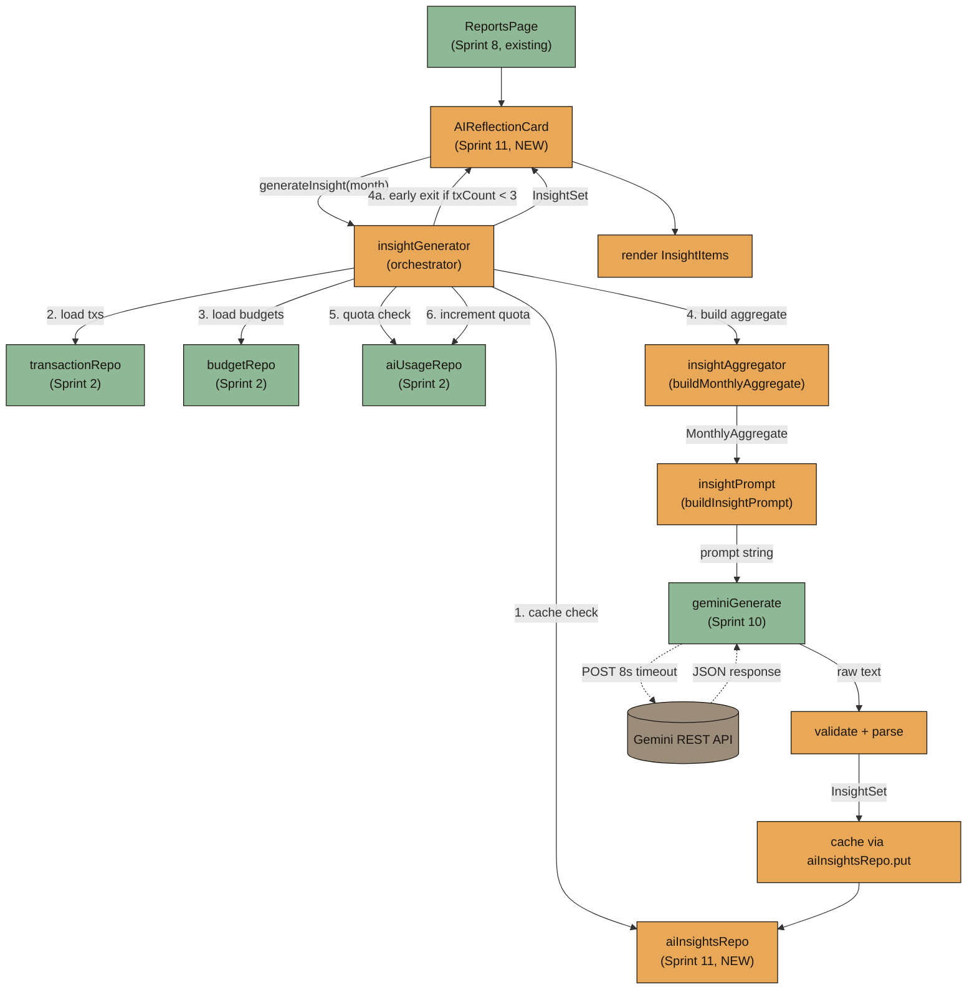
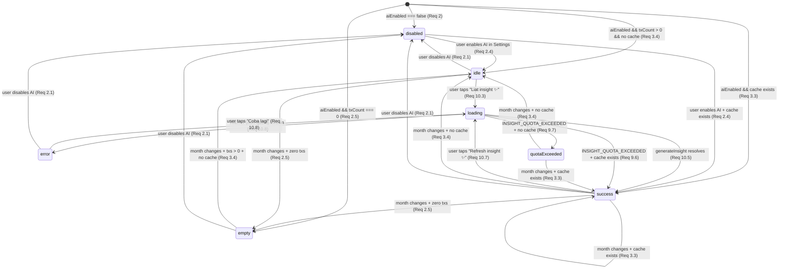
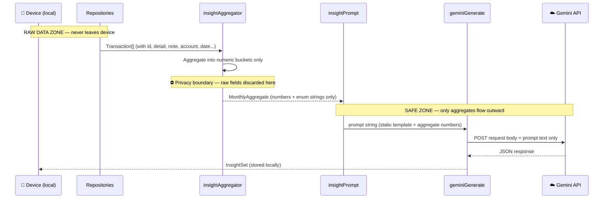
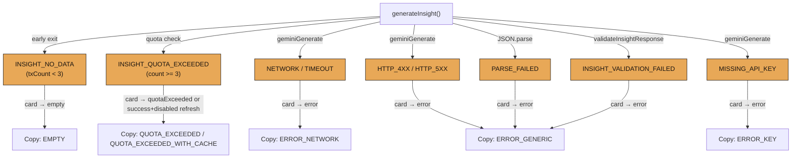

# Design Document: Sprint 11 — AI Behavioral Insights

## Overview

Sprint 11 turns the disabled `AIReflectionCard` placeholder on the Sprint 8 Reports page into a working **AI Behavioral Insights** surface. It adds a pure aggregation pipeline that distills raw transactions into privacy-safe numeric summaries, a prompt builder that interpolates those summaries into a behavioral-instruction template, an orchestrator that manages cache/quota/generation, a new IndexedDB cache repository, and the visible `AIReflectionCard` component.

**Privacy invariant (one sentence):** Only aggregated numeric stats and category/time bucket summaries ever leave the device — no raw `Transaction` records, no PII, no free-form user text reaches Gemini.

**What this sprint adds (new):**
- `insightAggregator` — pure aggregation of transactions into `MonthlyAggregate`
- `insightPrompt` — pure prompt builder (distinct from Sprint 10's `parserPrompt`)
- `insightGenerator` — orchestrator (cache → aggregate → prompt → geminiGenerate → validate → persist → quota)
- `aiInsightsRepo` — new repository over new `aiInsights` IndexedDB store
- `AIReflectionCard` — visible UI component with 7 states
- `insightConstants` / `insightCopy` — constants and frozen Indonesian copy
- Types: `MonthlyAggregate`, `InsightSet`, `InsightItem`, `InsightTone`, `InsightCardState`
- 3 new `AIErrorCode` additions: `INSIGHT_QUOTA_EXCEEDED`, `INSIGHT_VALIDATION_FAILED`, `INSIGHT_NO_DATA`

**What this sprint reuses (must not re-implement):**
- Sprint 10: `geminiClient`, `geminiGenerate`, `AIError`, `AIErrorCode`, `stripMarkdownFence`
- Sprint 2: `aiUsageRepo`, `transactionRepo`, `budgetRepo`, `settingsRepo`, `uiStore`
- Sprint 8: `ReportsPage` composition (mounts `AIReflectionCard` in placeholder slot)

---

## Architecture

### Data Flow Diagram



---

## New Files

```txt
src/
├── types/
│   └── ai-insight.ts                         — MonthlyAggregate, InsightSet, InsightItem, InsightTone, InsightCardState types
├── features/
│   └── ai/
│       ├── insightConstants.ts               — INSIGHT_MONTHLY_QUOTA, INSIGHT_TIMEOUT_MS, thresholds, bucket constants
│       ├── insightCopy.ts                    — INSIGHT_TOAST_COPY and INSIGHT_CARD_COPY frozen objects (Indonesian)
│       ├── insightAggregator.ts              — buildMonthlyAggregate, hashAggregate (pure functions)
│       ├── insightPrompt.ts                  — buildInsightPrompt (pure function)
│       └── insightGenerator.ts               — generateInsight orchestrator (async)
├── db/
│   └── ai-insights.repo.ts                   — aiInsightsRepo: get, put, remove, listAll
└── components/
    └── cards/
        └── AIReflectionCard.tsx               — UI component with 7-state machine
```

**DB schema migration:** Additive upgrade to `luma-db` adding `aiInsights` object store with keyPath `"month"`. No existing stores modified.

---

## Components and Interfaces

### Component: AIReflectionCard

**Purpose:** The visible AI insight surface on `ReportsPage`. Replaces the Sprint 8 disabled placeholder. Manages a 7-state machine and orchestrates calls to `insightGenerator`.

```typescript
// src/components/cards/AIReflectionCard.tsx
export function AIReflectionCard(): JSX.Element;
```

**Responsibilities:**
- Read `settings.aiEnabled` from `settingsStore` to gate the surface.
- Read the selected month from the same source `ReportsPage` uses (Sprint 8 month selector state).
- Manage local state: `InsightCardState` discriminated union.
- On mount / month change: evaluate state (disabled → empty → idle → success if cached).
- On user tap "Liat insight ✨": call `generateInsight(selectedMonth)`, transition through loading → success/error/quotaExceeded.
- On user tap "Refresh insight ✨": call `generateInsight(selectedMonth, { force: true })`.
- Render tone-appropriate accents per `InsightItem.tone` (positive=sage, neutral=cream, soft-warning=amber).
- Never block, suspend, or delay other ReportsPage components.

**Visual spec:**
- Reuses Sprint 1 `Card` primitive. Padding 16px, radius 20px, `bg-card`.
- Title: "Refleksi AI ✨" (Fraunces 16/700).
- Insight items: vertical stack, gap 12px, each with emoji + text (DM Sans 14/400).
- Touch targets: ≥ 44×44 CSS px for all action buttons.
- Max width follows ReportsPage container (≤ 480px). No horizontal scroll at 360/390/430/480px.

---

### Module: insightGenerator

**Purpose:** Orchestrates the full insight generation pipeline: cache check → data load → aggregate → quota check → prompt → geminiGenerate → validate → cache → quota increment.

```typescript
// src/features/ai/insightGenerator.ts
export async function generateInsight(
  month: string,
  opts?: { force?: boolean }
): Promise<InsightSet>;
```

**Dependencies (imports):**
- `aiInsightsRepo` (cache read/write)
- `transactionRepo.listByMonth` (data load)
- `budgetRepo.getMonthlyBudget`, `budgetRepo.listCategoryBudgets` (data load)
- `aiUsageRepo.get`, `aiUsageRepo.incrementInsight` (quota)
- `buildMonthlyAggregate` from `insightAggregator`
- `buildInsightPrompt` from `insightPrompt`
- `geminiGenerate` from Sprint 10's `geminiClient`
- `stripMarkdownFence` from Sprint 10
- `INSIGHT_MONTHLY_QUOTA`, `INSIGHT_TIMEOUT_MS` from `insightConstants`

---

### Module: insightAggregator

**Purpose:** Pure functions that transform raw transaction and budget data into a privacy-safe `MonthlyAggregate`.

```typescript
// src/features/ai/insightAggregator.ts
export function buildMonthlyAggregate(
  currentMonthTxs: Transaction[],
  priorMonthTxs: Transaction[],
  monthlyBudget: MonthlyBudget | null,
  categoryBudgets: CategoryBudget[],
  month: string
): MonthlyAggregate;

export function hashAggregate(aggregate: MonthlyAggregate): string;
```

**Constraints:**
- Pure and deterministic — no I/O, no `Date.now()`, no `Math.random`.
- SHALL NOT import any store, repo, or client module.
- `hashAggregate` uses FNV-1a, returns hex string ≤ 16 chars.

---

### Module: insightPrompt

**Purpose:** Pure function that interpolates a `MonthlyAggregate` into a static behavioral-instruction template.

```typescript
// src/features/ai/insightPrompt.ts
export function buildInsightPrompt(aggregate: MonthlyAggregate): string;
```

**Constraints:**
- Pure and deterministic.
- SHALL NOT import any store, repo, or client module.
- Output contains only values from the aggregate or the static template — no invented numbers.

---

### Repository: aiInsightsRepo

```typescript
// src/db/ai-insights.repo.ts
export const aiInsightsRepo = {
  get(month: string): Promise<InsightSet | undefined>;
  put(month: string, set: InsightSet): Promise<InsightSet>;
  remove(month: string): Promise<void>;
  listAll(): Promise<InsightSet[]>;
};
```

**Validation rules:**
- `put` throws `RepoError("INVALID_INPUT")` if `set.month !== month`.
- `put` throws `RepoError("INVALID_INPUT")` if `set.items.length === 0`.
- `put` overwrites any existing entry for the same `month` key.

---

## Data Models

### New Types (`src/types/ai-insight.ts`)

```typescript
import type { CategoryType, MoodType } from './transaction';

// --- Aggregator output ---

export interface MonthlyAggregate {
  month: string; // YYYY-MM
  txCount: number;
  totalSpending: number;

  // Category breakdown
  categoryTotals: Record<CategoryType, number>;

  // Time-of-day buckets
  nightCount: number;
  dayCount: number;
  nightSpending: number;
  daySpending: number;

  // Day-of-week buckets
  weekendCount: number;
  weekdayCount: number;
  weekendSpending: number;
  weekdaySpending: number;

  // Small-but-frequent pattern
  smallTxCount: number;
  smallTxTotal: number;

  // Mood × category correlation (only pairs with count ≥ 2)
  moodCategoryCounts: Array<{
    mood: MoodType;
    category: CategoryType;
    count: number;
  }>;

  // Month-over-month category deltas (only |deltaPct| ≥ 25% or new categories)
  categoryDeltasFromPriorMonth: Array<{
    category: CategoryType;
    priorTotal: number;
    currentTotal: number;
    deltaPct: number | null; // null when priorTotal === 0 (represents Infinity)
  }>;

  // Budget context
  monthlyBudgetTotal: number | null;
  categoryBudgets: Array<{
    category: CategoryType;
    limit: number;
    actual: number;
  }>;
}

// --- Insight output ---

export type InsightTone = 'positive' | 'neutral' | 'soft-warning';

export interface InsightItem {
  id: string;
  tone: InsightTone;
  emoji: string; // 1..4 chars
  text: string;  // 1..200 chars, trimmed
}

export interface InsightSet {
  month: string;          // YYYY-MM
  generatedAt: string;    // ISO 8601
  items: InsightItem[];   // 1..5 items
  sourceAggregateHash: string; // FNV-1a hex ≤ 16 chars
}

// --- Card state ---

export type InsightCardState =
  | 'disabled'
  | 'empty'
  | 'idle'
  | 'loading'
  | 'success'
  | 'error'
  | 'quotaExceeded';
```

### New AIErrorCode Additions

Added to the existing `AIErrorCode` union in `src/features/ai/errors.ts` (Sprint 10):

```typescript
// Additive — existing codes unchanged
export type AIErrorCode =
  | 'AI_DISABLED'
  | 'EMPTY_INPUT'
  | 'MISSING_API_KEY'
  | 'NETWORK'
  | 'TIMEOUT'
  | 'HTTP_4XX'
  | 'HTTP_5XX'
  | 'EMPTY_RESPONSE'
  | 'PARSE_FAILED'
  | 'VALIDATION_FAILED'
  | 'VOICE_UNSUPPORTED'
  | 'VOICE_DENIED'
  | 'VOICE_FAILED'
  // Sprint 11 additions ↓
  | 'INSIGHT_QUOTA_EXCEEDED'
  | 'INSIGHT_VALIDATION_FAILED'
  | 'INSIGHT_NO_DATA';
```

---

## Aggregator Design

### Input / Output Signatures

```typescript
function buildMonthlyAggregate(
  currentMonthTxs: Transaction[],
  priorMonthTxs: Transaction[],
  monthlyBudget: MonthlyBudget | null,
  categoryBudgets: CategoryBudget[],
  month: string
): MonthlyAggregate;
```

### Bucket Classification

**Night hours (21–5 wraparound):**
```typescript
const NIGHT_HOUR_START = 21; // inclusive
const NIGHT_HOUR_END = 5;    // exclusive

function isNight(hour: number): boolean {
  return hour >= NIGHT_HOUR_START || hour < NIGHT_HOUR_END;
}
// A transaction is "night" when its createdAt local hour ∈ [21, 24) ∪ [0, 5)
```

**Weekend days:**
```typescript
const WEEKEND_DAYS = new Set([0, 6]); // Sunday=0, Saturday=6 per JS Date.getDay()

function isWeekend(dayOfWeek: number): boolean {
  return WEEKEND_DAYS.has(dayOfWeek);
}
```

### Category Deltas (Prior Month Comparison)

```typescript
// For each CategoryType present in either month:
//   priorTotal = Σ nominal for that category in priorMonthTxs
//   currentTotal = Σ nominal for that category in currentMonthTxs
//   deltaPct = ((currentTotal - priorTotal) / priorTotal) * 100
//
// Include in output ONLY when:
//   - |deltaPct| >= MoM_DELTA_PCT_THRESHOLD (25%) AND priorTotal > 0
//   - OR priorTotal === 0 AND currentTotal > 0 → deltaPct = null (represents ∞)
//
// Exclude when:
//   - priorTotal > 0 AND |deltaPct| < 25%
//   - priorTotal === 0 AND currentTotal === 0
const MoM_DELTA_PCT_THRESHOLD = 25;
```

### Mood × Category Correlation

```typescript
// Count occurrences of each (mood, category) pair in currentMonthTxs
// Only include pairs where count >= 2
const MOOD_CATEGORY_MIN_COUNT = 2;
```

### Small-but-Frequent Pattern

```typescript
const SMALL_TX_THRESHOLD_IDR = 25_000;
const SMALL_FREQUENT_MIN_COUNT = 5;

// smallTxCount = count of txs where nominal ≤ SMALL_TX_THRESHOLD_IDR
// smallTxTotal = sum of those txs' nominals
// The SMALL_FREQUENT_MIN_COUNT threshold is used by the prompt to decide
// whether to highlight this pattern (not by the aggregator itself).
```

### hashAggregate — FNV-1a

```typescript
function hashAggregate(aggregate: MonthlyAggregate): string {
  const json = JSON.stringify(aggregate); // canonical (keys in insertion order)
  // FNV-1a 32-bit hash
  let hash = 0x811c9dc5;
  for (let i = 0; i < json.length; i++) {
    hash ^= json.charCodeAt(i);
    hash = Math.imul(hash, 0x01000193);
  }
  return (hash >>> 0).toString(16); // hex, ≤ 8 chars (well within 16)
}
```

**Pure, deterministic, no crypto, no network.**

### Invariants

For ALL valid inputs:
1. `txCount === currentMonthTxs.length`
2. `totalSpending === Σ tx.nominal` for all `tx ∈ currentMonthTxs`
3. `Σ categoryTotals[c]` over all `c` === `totalSpending`
4. `nightCount + dayCount === txCount`
5. `weekendCount + weekdayCount === txCount`
6. `nightSpending + daySpending === totalSpending`
7. `weekendSpending + weekdaySpending === totalSpending`
8. `smallTxCount === count(tx where tx.nominal ≤ 25_000)`
9. `smallTxTotal === Σ tx.nominal where tx.nominal ≤ 25_000`

---

## Prompt Template

### Static Template with Placeholder Slots

```typescript
const INSIGHT_PROMPT_TEMPLATE = `Kamu adalah Luma, companion keuangan yang cozy dan supportive.
Analisis data agregat keuangan bulan {MONTH} di bawah ini dan berikan observasi BEHAVIORAL — bukan statistik umum.

ATURAN KETAT:
1. DILARANG mengulang fakta yang sudah terlihat di chart/summary:
   - JANGAN bilang "kategori terbesar adalah X"
   - JANGAN bilang "total pengeluaran bulan ini sekian"
   - JANGAN bilang "kamu menghabiskan X% untuk Y"
2. FOKUS pada pola PERILAKU:
   - Pola spending malam hari vs siang
   - Impulse spending di weekend vs weekday
   - Korelasi mood × kategori (misal: mood sedih → delivery food)
   - Spending kecil tapi sering (latte factor)
   - Perubahan kategori bulan ini vs bulan lalu
3. TONE: casual Indonesian, soft, supportive, companion-like.
   - JANGAN pakai nada financial advisor
   - JANGAN bilang "sebaiknya kurangi pengeluaran" atau "buat budget lebih ketat"
   - Boleh observasi lembut seperti "kamu lebih sering checkout malam hari 🌙"
4. FORMAT: Return JSON ONLY. No markdown. No code fences. No prose outside JSON.
5. JSON SHAPE:
   {
     "items": [
       { "tone": "positive" | "neutral" | "soft-warning", "emoji": "🌙", "text": "observasi max 200 karakter" }
     ]
   }
   - items.length: 1..5
   - text.length: 1..200
   - emoji: 1..4 characters
   - tone: exactly one of "positive", "neutral", "soft-warning"

DATA AGREGAT BULAN {MONTH}:
- Total transaksi: {txCount}
- Total spending: Rp{totalSpending}
- Spending malam (21:00-05:00): {nightCount} transaksi, Rp{nightSpending}
- Spending siang: {dayCount} transaksi, Rp{daySpending}
- Spending weekend: {weekendCount} transaksi, Rp{weekendSpending}
- Spending weekday: {weekdayCount} transaksi, Rp{weekdaySpending}
- Transaksi kecil (≤Rp25.000): {smallTxCount} kali, total Rp{smallTxTotal}
- Kategori totals: {categoryTotalsJSON}
- Perubahan dari bulan lalu: {categoryDeltasJSON}
- Mood × kategori: {moodCategoryJSON}
- Budget bulanan: {monthlyBudgetTotal}
- Budget per kategori: {categoryBudgetsJSON}

Berikan 2-4 observasi behavioral yang insightful dan tidak obvious.`;
```

### Interpolated Example

For a month `2025-06` with 47 transactions, Rp3.2M total, 12 night transactions (Rp890K), 18 weekend transactions (Rp1.4M), 15 small transactions (Rp280K), Food up 42% from prior month:

```
DATA AGREGAT BULAN 2025-06:
- Total transaksi: 47
- Total spending: Rp3200000
- Spending malam (21:00-05:00): 12 transaksi, Rp890000
- Spending siang: 35 transaksi, Rp2310000
- Spending weekend: 18 transaksi, Rp1400000
- Spending weekday: 29 transaksi, Rp1800000
- Transaksi kecil (≤Rp25.000): 15 kali, total Rp280000
- Kategori totals: {"Food":1200000,"Transport":450000,"Entertainment":800000,"Shopping":500000,"Health":150000,"Giving":0,"Saving":0,"Other":100000}
- Perubahan dari bulan lalu: [{"category":"Food","priorTotal":845000,"currentTotal":1200000,"deltaPct":42}]
- Mood × kategori: [{"mood":"😭","category":"Food","count":5},{"mood":"😬","category":"Shopping","count":3}]
- Budget bulanan: 4000000
- Budget per kategori: [{"category":"Food","limit":1500000,"actual":1200000}]
```

### Behavioral Focus Enforcement (Req 17)

The template explicitly:
- **Forbids** chart-stat restatement ("kategori terbesar", "total pengeluaran")
- **Forbids** financial-advisor wording ("sebaiknya kurangi", "buat budget lebih ketat")
- **Requires** behavioral angles: night/day, weekend/weekday, mood×category, small-but-frequent, MoM deltas
- **Allows** soft observation copy per PRD §11 examples

---

## Generator Orchestration

### Pseudocode: `generateInsight(month, opts?)`

```pascal
ALGORITHM generateInsight(month, opts)
INPUT:  month: String (YYYY-MM)
        opts?: { force?: boolean }
OUTPUT: InsightSet

BEGIN
  // Step 1: Cache check (skip if force)
  IF opts?.force !== true THEN
    cached ← AWAIT aiInsightsRepo.get(month)
    IF cached ≠ undefined THEN
      RETURN cached
    END IF
  END IF

  // Step 2: Load transactions (current + prior month)
  currentTxs ← AWAIT transactionRepo.listByMonth(month)
  priorMonth ← previousMonth(month)
  priorTxs ← AWAIT transactionRepo.listByMonth(priorMonth)

  // Step 3: Load budgets
  monthlyBudget ← AWAIT budgetRepo.getMonthlyBudget(month)
  categoryBudgets ← AWAIT budgetRepo.listCategoryBudgets(month)

  // Step 4: Build aggregate → early exit if txCount < 3
  aggregate ← buildMonthlyAggregate(currentTxs, priorTxs, monthlyBudget, categoryBudgets, month)
  IF aggregate.txCount < 3 THEN
    THROW AIError("INSIGHT_NO_DATA")
  END IF

  // Step 5: Quota check → INSIGHT_QUOTA_EXCEEDED
  usage ← AWAIT aiUsageRepo.get(month)
  IF usage.aiInsightCount >= INSIGHT_MONTHLY_QUOTA THEN
    THROW AIError("INSIGHT_QUOTA_EXCEEDED")
  END IF

  // Step 6: Build prompt
  prompt ← buildInsightPrompt(aggregate)

  // Step 7: Call geminiGenerate (8000ms timeout)
  rawText ← AWAIT geminiGenerate({ prompt, timeoutMs: INSIGHT_TIMEOUT_MS })

  // Step 8: Strip fence, parse JSON, validate
  cleaned ← stripMarkdownFence(rawText)
  TRY
    parsed ← JSON.parse(cleaned)
  CATCH
    THROW AIError("PARSE_FAILED")
  END TRY

  validateInsightResponse(parsed)  // throws INSIGHT_VALIDATION_FAILED

  // Step 9: Build InsightSet
  insightSet ← {
    month: month,
    generatedAt: new Date().toISOString(),
    items: parsed.items.map(item => ({
      id: crypto.randomUUID(),
      tone: item.tone,
      emoji: item.emoji,
      text: item.text.trim().slice(0, 200)
    })),
    sourceAggregateHash: hashAggregate(aggregate)
  }

  // Step 10: Cache via aiInsightsRepo.put
  AWAIT aiInsightsRepo.put(month, insightSet)

  // Step 11: Increment quota via aiUsageRepo.incrementInsight
  AWAIT aiUsageRepo.incrementInsight(month)

  // Step 12: Return InsightSet
  RETURN insightSet
END
```

### Validation Function

```pascal
ALGORITHM validateInsightResponse(parsed)
INPUT:  parsed: unknown
OUTPUT: void (throws on invalid)

BEGIN
  IF parsed.items IS NOT Array THEN
    THROW AIError("INSIGHT_VALIDATION_FAILED")
  END IF

  IF parsed.items.length < 1 OR parsed.items.length > 5 THEN
    THROW AIError("INSIGHT_VALIDATION_FAILED")
  END IF

  FOR EACH item IN parsed.items DO
    IF item.tone NOT IN {"positive", "neutral", "soft-warning"} THEN
      THROW AIError("INSIGHT_VALIDATION_FAILED")
    END IF
    IF typeof item.emoji !== "string" OR item.emoji.length < 1 OR item.emoji.length > 4 THEN
      THROW AIError("INSIGHT_VALIDATION_FAILED")
    END IF
    IF typeof item.text !== "string" OR item.text.trim().length === 0 OR item.text.trim().length > 200 THEN
      THROW AIError("INSIGHT_VALIDATION_FAILED")
    END IF
  END FOR
END
```

### Error Mapping Table

| Source Error | Mapped AIErrorCode | Card State | User Copy |
|---|---|---|---|
| `txCount < 3` | `INSIGHT_NO_DATA` | `empty` | "Belum ada transaksi bulan ini..." |
| `aiInsightCount >= 3` | `INSIGHT_QUOTA_EXCEEDED` | `quotaExceeded` (or `success` if cached) | "Quota AI bulan ini udah penuh..." |
| `geminiGenerate` → `MISSING_API_KEY` | `MISSING_API_KEY` | `error` | "AI lagi belum nyala di build ini..." |
| `geminiGenerate` → `NETWORK` / `TIMEOUT` | `NETWORK` / `TIMEOUT` | `error` | "Koneksi lagi ngambek..." |
| `geminiGenerate` → `HTTP_4XX` / `HTTP_5XX` / `EMPTY_RESPONSE` | passthrough | `error` | "AI lagi susah baca polanya..." |
| `JSON.parse` fails | `PARSE_FAILED` | `error` | "AI lagi susah baca polanya..." |
| validation fails | `INSIGHT_VALIDATION_FAILED` | `error` | "AI lagi susah baca polanya..." |

---

## AIReflectionCard State Machine



### State → Render Mapping

| State | Title | Body Copy | Primary Action | Secondary Action |
|---|---|---|---|---|
| `disabled` | Refleksi AI ✨ | "AI lagi off. Aktifin di Pengaturan dulu ya 💛" | — | — |
| `empty` | Refleksi AI ✨ | "Belum ada transaksi bulan ini. Catat dulu yuk, nanti Luma bantu liat polanya ✨" | — | — |
| `idle` | Refleksi AI ✨ | Helper explaining behavioral insights | "Liat insight ✨" | — |
| `loading` | Refleksi AI ✨ | "Lagi liat-liat polanya ✨" + skeleton | — (disabled) | — |
| `success` | Refleksi AI ✨ | Rendered InsightItems (emoji + text) | — | "Refresh insight ✨" (enabled if quota < 3) |
| `error` | Refleksi AI ✨ | Error-specific copy (see Error Mapping) | "Coba lagi" | — |
| `quotaExceeded` | Refleksi AI ✨ | "Quota AI bulan ini udah penuh. Bisa coba bulan depan ya 💛" | — | — |

---

## Repository Design

### `aiInsightsRepo` API

```typescript
export const aiInsightsRepo = {
  /** Returns cached InsightSet for month, or undefined */
  get(month: string): Promise<InsightSet | undefined>,

  /** Persists InsightSet, overwrites existing entry for same month.
   *  Throws RepoError("INVALID_INPUT") if set.month !== month or items.length === 0 */
  put(month: string, set: InsightSet): Promise<InsightSet>,

  /** Removes cached entry for month (no-op if not found) */
  remove(month: string): Promise<void>,

  /** Returns all cached InsightSets */
  listAll(): Promise<InsightSet[]>,
};
```

### Validation Rules

- `put(month, set)` → throws `RepoError("INVALID_INPUT")` if `set.month !== month`
- `put(month, set)` → throws `RepoError("INVALID_INPUT")` if `set.items.length === 0`
- `get(month)` → returns `undefined` when no record exists (never throws for missing data)

### Migration Step

```typescript
// In luma-db upgrade handler (additive, version bump)
if (!db.objectStoreNames.contains('aiInsights')) {
  db.createObjectStore('aiInsights', { keyPath: 'month' });
}
// No modification to existing stores: transactions, budgets, savingGoals,
// savingGoalContributions, recurringRules, settings, backgrounds, characters, themes, aiUsage
```

---

## Privacy Boundary



**Key guarantees:**
- `buildMonthlyAggregate` is the single chokepoint. It accepts `Transaction[]` and outputs only numbers/enums.
- `buildInsightPrompt` accepts only `MonthlyAggregate` — it cannot access raw data even if it wanted to.
- `insightGenerator` passes the prompt to `geminiGenerate` — the only outbound call.
- No `Transaction.detail`, `.note`, `.id`, `.account`, `.date`, `.createdAt`, `.updatedAt`, `.recurringRuleId` appears in the aggregate or prompt.

**Sentinel-injection test idea (Req 18.2):** Generate transactions with unique random sentinel strings (e.g., `"SENTINEL_abc123"`) in `detail` and `note` fields. Build the aggregate. Assert `JSON.stringify(aggregate)` does not contain any sentinel substring.

---

## Copy Catalogue

### `INSIGHT_TOAST_COPY` (frozen object in `src/features/ai/insightCopy.ts`)

```typescript
export const INSIGHT_TOAST_COPY = Object.freeze({
  DISABLED: 'AI lagi off. Aktifin di Pengaturan dulu ya 💛',           // Req 2.2
  EMPTY: 'Belum ada transaksi bulan ini. Catat dulu yuk, nanti Luma bantu liat polanya ✨', // Req 2.5
  LOADING: 'Lagi liat-liat polanya ✨',                                // Req 10.4
  ERROR_GENERIC: 'AI lagi susah baca polanya. Coba sebentar lagi ya 💛', // Req 11.4
  ERROR_NETWORK: 'Koneksi lagi ngambek. Coba sebentar lagi ya 🌧️',     // Req 11.3
  ERROR_KEY: 'AI lagi belum nyala di build ini. Laporan manual tetap bisa kamu pakai ya 💛', // Req 11.2
  QUOTA_EXCEEDED: 'Quota AI bulan ini udah penuh. Bisa coba bulan depan ya 💛', // Req 9.7
  QUOTA_EXCEEDED_WITH_CACHE: 'Quota AI bulan ini udah penuh. Insight tersimpan tetap bisa kamu liat ya 💛', // Req 9.6
});
```

### `INSIGHT_CARD_COPY` (frozen object for card UI labels)

```typescript
export const INSIGHT_CARD_COPY = Object.freeze({
  TITLE: 'Refleksi AI ✨',                                             // Req 10.2
  IDLE_HELPER: 'Luma bisa bantu liat pola spending kamu bulan ini — kapan sering belanja, mood apa yang sering muncul, dan kebiasaan kecil lainnya.',
  ACTION_GENERATE: 'Liat insight ✨',                                   // Req 10.2
  ACTION_REFRESH: 'Refresh insight ✨',                                 // Req 10.6
  ACTION_RETRY: 'Coba lagi',                                           // Req 10.8
});
```

All values are:
- Indonesian ✓
- Casual and soft ✓
- Supportive and non-judgmental ✓
- Free of denylist words (`GAGAL DIKONTROL`, `MELEBIHI BATAS`, `WARNING:`, `ERROR:`, `DILARANG`, `WAJIB`, `HARUS`) ✓ (Req 13.3)

---

## Mobile / Visual

### Layout

- `AIReflectionCard` sits inside `ReportsPage`'s existing vertical stack.
- Max width: inherits from page container (≤ 480px). No explicit `max-width` on the card itself.
- Padding: 16px. Border radius: 20px. Background: `var(--bg-card)`.
- No horizontal scroll at 360px, 390px, 430px, 480px viewports (Req 14.2).

### Touch Targets

- "Liat insight ✨" button: full-width, min-height 44px (Req 14.4).
- "Refresh insight ✨" button: full-width, min-height 44px.
- "Coba lagi" button: full-width, min-height 44px.

### Text Wrapping

- `InsightItem.text` renders in a `<p>` with `word-wrap: break-word` and `overflow-wrap: break-word`.
- No `white-space: nowrap` on insight text (Req 14.3).

### Tone Colors

| InsightTone | Accent Color | CSS Variable |
|---|---|---|
| `positive` | Sage `#8FB896` | `var(--color-sage)` |
| `neutral` | Cream `#FFF3DC` | `var(--color-cream)` |
| `soft-warning` | Amber `#E8A857` | `var(--color-amber)` |

Applied as a left-border or subtle background tint on each `InsightItem` row.

### Reuse

- Reuses Sprint 1 `Card` component for the outer container.
- Reuses Sprint 1 `Button` component for actions.
- Does NOT inject global CSS, theme tokens, or document-level styles (Req 14.5).

---

## Correctness Properties

*A property is a characteristic or behavior that should hold true across all valid executions of a system — essentially, a formal statement about what the system should do. Properties serve as the bridge between human-readable specifications and machine-verifiable correctness guarantees.*

### Property 1: Aggregator Purity and Determinism

*For any* valid inputs `(currentMonthTxs, priorMonthTxs, monthlyBudget, categoryBudgets, month)`, two consecutive calls to `buildMonthlyAggregate` with structurally equal inputs SHALL return structurally equal outputs.

**Validates: Requirements 4.1, 18.1**

### Property 2: No Raw Data Leak (Sentinel Injection)

*For any* set of `Transaction[]` where each transaction's `detail`, `note`, and `id` fields contain unique sentinel substrings (≥ 8 random alphanumeric characters), `JSON.stringify(buildMonthlyAggregate(txs, priorTxs, budget, catBudgets, month))` SHALL NOT contain any of those sentinel substrings.

**Validates: Requirements 4.4, 12.3, 18.2**

### Property 3: Aggregator Totals Invariant

*For any* valid `currentMonthTxs`, the resulting `MonthlyAggregate` SHALL satisfy: `Σ categoryTotals[c]` over all categories `c` === `totalSpending` AND `nightSpending + daySpending === totalSpending` AND `weekendSpending + weekdaySpending === totalSpending`.

**Validates: Requirements 4.7, 4.8, 4.9, 18.3**

### Property 4: Aggregator Counts Invariant

*For any* valid `currentMonthTxs`, the resulting `MonthlyAggregate` SHALL satisfy: `nightCount + dayCount === txCount` AND `weekendCount + weekdayCount === txCount` AND `txCount === currentMonthTxs.length`.

**Validates: Requirements 4.6, 4.9, 18.4**

### Property 5: Prompt Closure (No Invented Numbers)

*For any* valid `MonthlyAggregate` value `a`, every digit-bearing token in `buildInsightPrompt(a)` SHALL also appear in `JSON.stringify(a)` or in the static template string — no numeric data is invented by the prompt builder.

**Validates: Requirements 5.10, 5.12, 18.5**

### Property 6: Prompt Isolation from Stores

*For any* `MonthlyAggregate` value `a`, the output of `buildInsightPrompt(a)` is determined solely by `a` and the static template. Mutating any store or repository after the call SHALL NOT change the returned string (the function is pure).

**Validates: Requirements 5.1, 5.11, 18.6**

### Property 7: Quota Equals Successes

*For any* sequence of `generateInsight(month)` calls for a fixed month, `aiUsageRepo.aiInsightCount(month)` SHALL equal the number of successful `aiInsightsRepo.put(month, set)` invocations triggered by that sequence. Failed calls contribute zero to both counts.

**Validates: Requirements 9.3, 9.4, 9.5, 18.7**

### Property 8: Quota Soft-Block

*For any* month where `aiInsightCount(month) >= 3`, calling `generateInsight(month, { force: true })` SHALL throw `AIError("INSIGHT_QUOTA_EXCEEDED")` AND SHALL NOT call `geminiGenerate` AND SHALL NOT change `aiInsightCount(month)`.

**Validates: Requirements 9.2, 18.8**

### Property 9: Cache Idempotence

*For any* month where `aiInsightsRepo.get(month) !== undefined`, two successive calls to `generateInsight(month)` (without `force`) SHALL produce structurally equal `InsightSet` values AND SHALL each result in zero calls to `geminiGenerate` AND zero increments to `aiInsightCount(month)`.

**Validates: Requirements 8.2, 8.9, 18.9**

### Property 10: Manual Report Independence

*For any* `InsightCardState` value, the rendered output of `SummaryCards`, `CategoryChart`, `SpendingTrendChart`, `BudgetComparisonSection`, and `ExportActions` SHALL be identical to their Sprint 8 baseline — no prop drift, no state coupling.

**Validates: Requirements 1.2, 1.3, 1.5, 1.6, 18.10**

### Property 11: Copy Denylist Compliance

*For any* value in `INSIGHT_TOAST_COPY` or `INSIGHT_CARD_COPY`, the string SHALL NOT contain (case-insensitive substring match) any of: `"GAGAL DIKONTROL"`, `"MELEBIHI BATAS"`, `"WARNING:"`, `"ERROR:"`, `"DILARANG"`, `"WAJIB"`, `"HARUS"`.

**Validates: Requirements 13.3**

---

## Error Handling

### Design Principles

1. **Soft and recoverable.** Every AI failure shows casual Indonesian copy and a retry path. No destructive toasts, no scolding.
2. **Isolated.** AI errors never propagate to manual report components. `AIReflectionCard` handles all `AIError` paths internally (Req 11.8).
3. **Cache-preserving.** Error paths never clear or overwrite cached insights (Req 11.6).
4. **Quota-safe.** Failed calls never increment `aiInsightCount` (Req 9.4, 11.7).

### Error Flow



### Recovery Actions

| Error State | User Action | Result |
|---|---|---|
| `error` (any) | Tap "Coba lagi" | Re-calls `generateInsight(month, { force: true })` |
| `quotaExceeded` (no cache) | Wait for next month | Quota resets per YYYY-MM |
| `quotaExceeded` (with cache) | View cached insight | Cached items displayed, refresh disabled |
| `empty` | Add transactions | Card re-evaluates on next render |
| `disabled` | Enable AI in Settings | Card transitions to idle/success |

---

## Testing Strategy

### Unit Tests (Pure Modules)

| Module | Test Focus |
|---|---|
| `insightAggregator` | Bucket classification, category totals, delta filtering, mood×category filtering, hash determinism |
| `insightPrompt` | Template interpolation, month presence, numeric field presence, no extra data |
| `insightConstants` | Constant values match spec (QUOTA=3, TIMEOUT=8000, thresholds) |
| `insightCopy` | All copy strings are Indonesian, soft, denylist-free |
| Validation logic | Accept valid shapes, reject invalid (wrong tone, empty text, too many items, etc.) |

### Property-Based Tests (Requirement 18)

**Library:** [fast-check](https://github.com/dubzzz/fast-check) (already available via existing devDependencies from Sprint 10).

**Configuration:** Minimum 100 iterations per property test.

**Tag format:** `// Feature: sprint-11-ai-behavioral-insights, Property {N}: {title}`

| Property # | Test Description | Generator Strategy |
|---|---|---|
| 1 | Aggregator purity | Generate random `Transaction[]` (0..100 items), random budgets, call twice, assert deep equality |
| 2 | No raw data leak | Generate transactions with unique 12-char sentinel strings in detail/note/id, assert no sentinel in `JSON.stringify(aggregate)` |
| 3 | Totals invariant | Generate random transactions, verify `Σ categoryTotals === totalSpending`, `night+day === total`, `weekend+weekday === total` |
| 4 | Counts invariant | Generate random transactions, verify `night+day === txCount`, `weekend+weekday === txCount`, `txCount === input.length` |
| 5 | Prompt closure | Generate random aggregates, extract digit tokens from prompt, verify each exists in `JSON.stringify(aggregate)` or static template |
| 6 | Prompt isolation | Generate aggregate, call `buildInsightPrompt`, mutate a mock store, call again, assert same output |
| 7 | Quota equals successes | Generate sequences of generate calls (mock geminiGenerate), verify `incrementInsight` count === `put` count |
| 8 | Quota soft-block | Set `aiInsightCount >= 3`, call with `force: true`, assert throws and no `geminiGenerate` call |
| 9 | Cache idempotence | Pre-populate cache, call twice without force, assert same result and zero network calls |
| 10 | Manual report independence | Render ReportsPage with various `InsightCardState` values, snapshot manual components, assert identical |
| 11 | Copy denylist | Iterate all copy values, assert none contain denylist substrings |

### Component Tests (AIReflectionCard)

- Render in each of the 7 states, assert correct copy and action buttons.
- Simulate user taps on "Liat insight ✨", verify loading → success transition.
- Simulate error responses, verify error state and "Coba lagi" action.
- Simulate quota exceeded with and without cache.
- Verify month change triggers state re-evaluation.
- Verify disabled state shows no action buttons.

### Privacy Sentinel Test

Generate transactions with unique random strings in `detail`, `note`, and `id`. Run through `buildMonthlyAggregate`. Assert `JSON.stringify(result)` contains zero sentinel matches. This is the concrete implementation of Property 2.

### Quota Equality Test

Mock `geminiGenerate` to alternate between success and failure. Run N `generateInsight` calls. Assert `aiUsageRepo.aiInsightCount` === number of successful `aiInsightsRepo.put` calls. This is the concrete implementation of Property 7.

---

## Out of Scope

- **No insight history UI** — only the current month's cached insight is displayed.
- **No sharing/export of insights** — insights are view-only within the card.
- **No premium gating** — quota is soft (3/month), no paywall.
- **No auto-fetch on month change** — user must tap "Liat insight ✨" to generate.
- **Character reaction is optional soft hook** — the card renders fully without character integration. Sprint 6's character MAY react to dominant tone but is not required (Req 13.6).
- **No new npm dependencies** (Req 16).
- **No login/cloud sync** — all data stays local.
- **No modification to Sprint 10 parser path** (Req 19).
