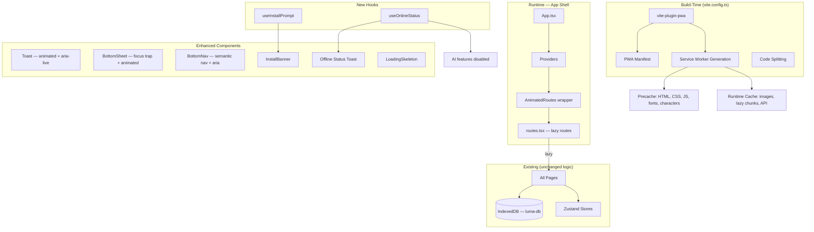
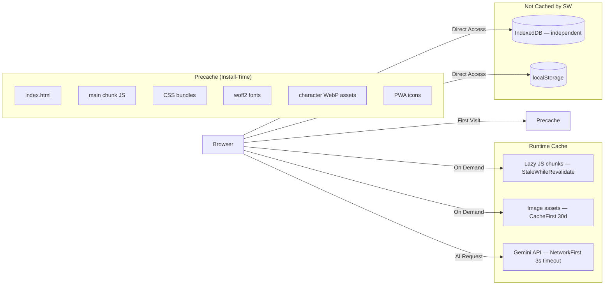
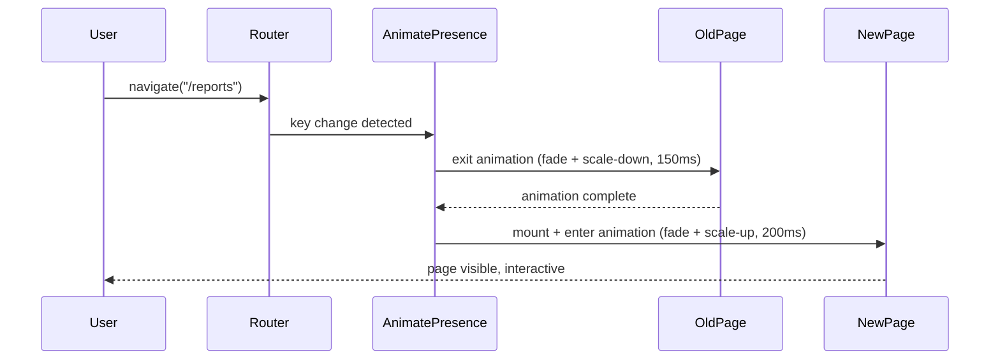
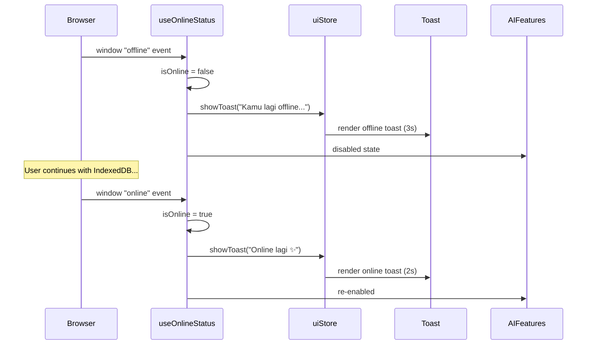
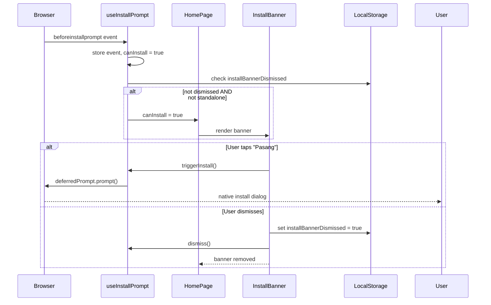

# Design Document: Sprint 12 — PWA + Polish + QA

## Overview

Sprint 12 finalizes Luma into a production-ready, installable Progressive Web App. This sprint activates the `vite-plugin-pwa` configuration that was stubbed in Sprint 0, implements full offline-first caching, adds polish microinteractions via Framer Motion, ensures accessibility compliance, and validates mobile viewport compatibility across 360px–480px.

**Key design decisions:**
1. **No new dependencies** — everything uses already-installed packages (`vite-plugin-pwa`, `framer-motion`, Zustand, existing Toast/BottomSheet).
2. **No new IndexedDB stores** — offline finance functionality already works via Sprint 2's data layer.
3. **Configuration-driven PWA** — all manifest and workbox config lives in `vite.config.ts` via `vite-plugin-pwa`.
4. **Hooks-based connectivity** — a `useOnlineStatus` hook centralizes offline detection for all components.
5. **AnimatePresence wrapper** — page transitions are injected at the router level without modifying individual pages.
6. **Accessibility-first upgrades** — semantic HTML and focus management are applied to existing Sprint 1 components (BottomSheet, Toast, BottomNav).
7. **Lazy loading at route/feature level** — `React.lazy` for ReportsPage; dynamic `import()` for AI, export, and chart modules.

**What this sprint does NOT do:**
- No push notifications, cloud sync, background sync, or login
- No new npm dependencies
- No IndexedDB schema changes
- No BottomNav structure changes

## Architecture

### High-Level Sprint 12 Integration



### Service Worker Caching Architecture



### Lazy Loading Module Graph

```mermaid
graph TD
    MainBundle[Main Bundle ≤200KB gzipped]
    MainBundle --> HomePage
    MainBundle --> TransactionsPage
    MainBundle --> TargetPage
    MainBundle --> SettingsPage
    MainBundle --> BudgetDetailPage
    MainBundle --> BottomNav
    MainBundle --> PageWrapper
    MainBundle --> CoreUI[Button, Input, Card, Toast, BottomSheet]

    ReportsChunk[Reports Chunk — lazy]
    ReportsChunk --> ReportsPage
    ReportsChunk --> Recharts
    ReportsChunk --> ChartComponents[CategoryChart, TrendChart]

    AIParserChunk[AI Parser Chunk — lazy]
    AIParserChunk --> GeminiClient[geminiClient]
    AIParserChunk --> ParserPrompt[parserPrompt]
    AIParserChunk --> GeminiGenerate[geminiGenerate]

    AIInsightsChunk[AI Insights Chunk — lazy]
    AIInsightsChunk --> InsightGenerator[insightGenerator]
    AIInsightsChunk --> InsightAggregator[insightAggregator]

    ExportChunk[Export Chunk — lazy]
    ExportChunk --> jsPDF
    ExportChunk --> html2canvas
    ExportChunk --> xlsx

    MainBundle -.->|React.lazy| ReportsChunk
    MainBundle -.->|dynamic import on AI tab| AIParserChunk
    MainBundle -.->|dynamic import on insight request| AIInsightsChunk
    MainBundle -.->|dynamic import on export click| ExportChunk
```



### Page Transition Animation Flow



### Offline Detection Flow



### Install Prompt Flow



## Components and Interfaces

### New Hook: `useOnlineStatus`

**File:** `src/lib/useOnlineStatus.ts`

**Purpose:** Centralized connectivity detection hook that exposes online/offline state and fires transition toasts via `uiStore`.

```ts
interface UseOnlineStatusReturn {
  /** Current connectivity state */
  isOnline: boolean;
}

function useOnlineStatus(): UseOnlineStatusReturn;
```

**Behavior:**
- Initializes with `navigator.onLine`
- Listens to `window` `online`/`offline` events
- On transition to offline: triggers toast "Kamu lagi offline — data tetap aman kok 🔒" (3s)
- On transition to online: triggers toast "Online lagi ✨" (2s)
- Does NOT fire toast on initial mount (only transitions)
- Cleans up event listeners on unmount

---

### New Hook: `useInstallPrompt`

**File:** `src/lib/useInstallPrompt.ts`

**Purpose:** Manages PWA install prompt lifecycle — intercepts `beforeinstallprompt`, stores it, and provides trigger/dismiss functions.

```ts
interface UseInstallPromptReturn {
  /** Whether the install prompt is available and banner should show */
  canInstall: boolean;
  /** Trigger the native install prompt */
  triggerInstall: () => Promise<void>;
  /** Dismiss the banner permanently */
  dismiss: () => void;
}

function useInstallPrompt(): UseInstallPromptReturn;
```

**Behavior:**
- Listens for `beforeinstallprompt` event, stores the event reference
- `canInstall` is `true` only when:
  - `beforeinstallprompt` has fired
  - `localStorage.getItem('installBannerDismissed') !== 'true'`
  - `window.matchMedia('(display-mode: standalone)').matches === false`
- `triggerInstall()` calls `deferredPrompt.prompt()` and awaits the user choice
- `dismiss()` sets `localStorage.installBannerDismissed = 'true'` and sets `canInstall = false`
- Cleans up event listeners on unmount

---

### New Component: `InstallBanner`

**File:** `src/components/ui/InstallBanner.tsx`

**Purpose:** Dismissible card shown at top of HomePage inviting users to install the PWA.

```ts
interface InstallBannerProps {
  onInstall: () => void;
  onDismiss: () => void;
}
```

**Visual spec:**
- Positioned at top of HomePage content area (before budget card)
- Card style matching existing `bg-bg-card` + `rounded-card`
- Message: "Pasang Luma di home screen biar makin cepat dibuka ✨"
- Primary button: "Pasang" (uses existing Button component)
- Close icon button (top-right, `aria-label="Tutup"`)
- Enter animation: fade + slide-down, 200ms, Framer Motion

---

### New Component: `AnimatedRoutes`

**File:** `src/app/AnimatedRoutes.tsx`

**Purpose:** Wraps route outlet with `AnimatePresence` for page transitions.

```ts
interface AnimatedRoutesProps {
  children: React.ReactNode;
}
```

**Behavior:**
- Uses `AnimatePresence mode="wait"`
- Each page is wrapped in a `motion.div` with:
  - `initial`: `{ opacity: 0, scale: 0.98 }`
  - `animate`: `{ opacity: 1, scale: 1 }` — 200ms
  - `exit`: `{ opacity: 0, scale: 0.98 }` — 150ms
- Uses `will-change: opacity, transform` for GPU hint
- Respects `prefers-reduced-motion` — disables animation when enabled
- Key is derived from `location.pathname`

---

### New Component: `LoadingSkeleton`

**File:** `src/components/ui/LoadingSkeleton.tsx`

**Purpose:** Lightweight fallback for `React.lazy` suspense boundaries.

```ts
interface LoadingSkeletonProps {
  /** Optional label for accessibility */
  label?: string;
}
```

**Visual spec:**
- Centered spinner (CSS animation, no heavy library)
- Subtle pulse animation on placeholder rectangles
- `role="status"` with `aria-label` for screen readers
- Matches `bg-bg-card-soft` color scheme

---

### Enhanced Component: `BottomSheet` (accessibility upgrade)

**File:** `src/components/ui/BottomSheet.tsx` (modify existing)

**Additions:**
- `role="dialog"` + `aria-modal="true"` + `aria-labelledby={titleId}`
- Focus trap: Tab key cycles within sheet (first/last focusable element wrapping)
- On open: focus moves to first focusable element inside
- On close: focus returns to triggering element (stored via ref)
- Animation upgrade: Framer Motion `translateY(100%) → 0` (250ms ease-out open, 200ms ease-in close)
- Backdrop: fade in 0→opacity over 200ms, fade out 150ms

```ts
interface BottomSheetProps {
  isOpen: boolean;
  onClose: () => void;
  title: string;
  /** Ref to the element that triggered opening — focus returns here on close */
  triggerRef?: React.RefObject<HTMLElement>;
  children: React.ReactNode;
}
```

---

### Enhanced Component: `Toast` (accessibility + animation upgrade)

**File:** `src/components/ui/Toast.tsx` (modify existing)

**Additions:**
- `role="status"` + `aria-live="polite"`
- Framer Motion enter: `translateY(20px)→0` + `opacity 0→1` (200ms)
- Framer Motion exit: `opacity 1→0` (150ms)
- Sequential display: one toast at a time (queue in `uiStore`)
- Auto-dismiss after configured duration (default 3s)

```ts
interface ToastProps {
  message: string;
  duration?: number; // ms, default 3000
  variant?: 'info' | 'success' | 'warning';
}
```

---

### Enhanced Component: `BottomNav` (accessibility upgrade)

**File:** `src/components/layout/BottomNav.tsx` (modify existing)

**Additions:**
- Wrap in `<nav aria-label="Navigasi utama">`
- Each nav item: min-height 44px touch target
- Keyboard accessible: Enter/Space activates navigation
- `tabIndex={0}` on each item

---

### Enhanced Component: `FAB` (animation upgrade)

**File:** existing FAB component (modify)

**Additions:**
- Tap animation: scale pulse `1→0.9→1` (150ms) via Framer Motion `whileTap`
- Idle animation: gentle floating `translateY` oscillation (2px, 3s loop) via `animate` with `repeat: Infinity`
- Min size: 56×56px
- Respects `prefers-reduced-motion`

---

### Utility: `useReducedMotion`

**File:** `src/lib/useReducedMotion.ts`

**Purpose:** Detects user's `prefers-reduced-motion` preference.

```ts
function useReducedMotion(): boolean;
```

**Behavior:**
- Returns `true` if `window.matchMedia('(prefers-reduced-motion: reduce)').matches`
- Listens for media query changes
- Used by all animation components to disable/simplify animations

## Data Models

Sprint 12 introduces **no new data models or IndexedDB stores**. All finance data (transactions, budgets, savings, settings) remains in `luma-db` as defined in Sprint 2.

### localStorage Additions

| Key | Type | Purpose |
|-----|------|---------|
| `installBannerDismissed` | `"true" \| absent` | Prevents re-showing PWA install banner after user dismisses |

### uiStore Additions (Zustand)

Extend existing `uiStore` with toast queue support:

```ts
interface ToastItem {
  id: string;
  message: string;
  duration: number; // ms
  variant: 'info' | 'success' | 'warning';
}

interface UIStoreAdditions {
  /** Queue of toasts to show sequentially */
  toastQueue: ToastItem[];
  /** Add toast to queue */
  showToast: (message: string, duration?: number, variant?: 'info' | 'success' | 'warning') => void;
  /** Remove current (first) toast from queue */
  dismissCurrentToast: () => void;
}
```

### vite-plugin-pwa Configuration (in `vite.config.ts`)

```ts
interface PWAManifestConfig {
  name: "Luma";
  short_name: "Luma";
  description: "Ruang keuangan nyaman yang bisa kamu custom sesukamu";
  display: "standalone";
  orientation: "portrait";
  start_url: "/";
  scope: "/";
  theme_color: "#1A1410";
  background_color: "#1A1410";
  icons: [
    { src: "/icons/icon-192x192.png", sizes: "192x192", type: "image/png" },
    { src: "/icons/icon-512x512.png", sizes: "512x512", type: "image/png" },
    { src: "/icons/icon-512x512-maskable.png", sizes: "512x512", type: "image/png", purpose: "maskable" }
  ];
}

interface WorkboxConfig {
  globPatterns: ["**/*.{js,css,html,ico,png,webp,woff2}"];
  cleanupOutdatedCaches: true;
  clientsClaim: true;
  navigateFallback: "index.html";
  navigateFallbackDenylist: [/^\/api/];
  runtimeCaching: RuntimeCachingEntry[];
}
```

## Testing Rationale: Why PBT Does Not Apply

Property-based testing is **not applicable** to this sprint. Sprint 12 consists of:

1. **Infrastructure configuration** (PWA manifest, service worker, Workbox caching) — declarative config, not functions with varied inputs. Use smoke tests and Lighthouse audits.
2. **UI rendering and animations** (Framer Motion transitions, accessibility attributes) — visual/DOM behavior. Use example-based tests and manual QA.
3. **Performance optimization** (code splitting, lazy loading) — build output metrics. Use bundle analysis and Lighthouse.
4. **Integration testing** (offline mode, connectivity events) — browser API interaction. Use example-based integration tests.

None of these domains have pure functions where behavior varies meaningfully with randomized inputs such that 100+ iterations would find more bugs than 2–3 examples. The appropriate testing strategies are smoke tests, integration tests, accessibility audits, and Lighthouse scoring — covered in the Testing Strategy section below.

## Error Handling

### Error: Lazy Module Load Failure

**Condition:** Network error or uncached chunk when loading a lazy module (Reports, AI, Export).
**Detection:** React's error boundary catches the `import()` rejection.
**Response:** Display soft error message: "Gagal memuat modul, coba refresh ya" with a "Coba Lagi" button that retries the dynamic import.
**Recovery:** User taps retry → re-triggers `import()`. If online/cached, succeeds. If still offline and not cached, error persists with same soft message.

### Error: Service Worker Registration Failure

**Condition:** Browser doesn't support service workers, or registration throws.
**Detection:** `vite-plugin-pwa`'s registration wrapper catches the error.
**Response:** App continues to function normally. No error shown to user. Console warning for debugging.
**Recovery:** Automatic — app works without caching. All IndexedDB operations unaffected.

### Error: Install Prompt Not Available

**Condition:** Browser doesn't support `beforeinstallprompt` (iOS Safari, Firefox).
**Detection:** `useInstallPrompt` hook never sets `canInstall = true`.
**Response:** Install banner never renders. No error shown.
**Recovery:** N/A — graceful degradation.

### Error: Offline AI Request

**Condition:** User activates AI Quick Input or requests AI Insights while offline.
**Detection:** `useOnlineStatus` returns `isOnline === false`.
**Response:**
- AI Quick Input tab: shows "AI butuh internet — pakai manual dulu ya ✨", disables parse button.
- AI Insights section: shows "Insight AI butuh koneksi internet 🌐" placeholder.
**Recovery:** When connectivity returns (`online` event fires), AI features re-enable automatically without refresh.

### Error: Gemini API Timeout (Online but slow)

**Condition:** Gemini API call exceeds 3-second timeout.
**Detection:** Workbox NetworkFirst strategy times out and checks cache.
**Response:** If cached response exists, serve it. If no cache, the AI module handles the network error with existing Sprint 10/11 error handling ("AI lagi susah nangkep. Bisa edit manual dulu.").
**Recovery:** User can retry or fall back to manual input.

### Error: Animation Performance Degradation

**Condition:** Device struggles with Framer Motion animations (low FPS).
**Detection:** `prefers-reduced-motion` media query OR manual performance observation.
**Response:** When `prefers-reduced-motion: reduce` is active, all animations are instant state changes (no transition).
**Recovery:** Automatic via media query hook.

### Error: Focus Trap Edge Case

**Condition:** Bottom sheet has no focusable elements inside.
**Detection:** Focus trap logic finds zero focusable elements.
**Response:** Focus remains on the sheet container itself (which has `tabIndex={-1}`).
**Recovery:** Sheet can still be closed via backdrop tap or Escape key.

## Testing Strategy

### Testing Approach

Since this sprint is configuration, UI polish, and infrastructure, the testing strategy uses:
- **Smoke tests** for configuration validation (manifest, service worker registration, build output)
- **Example-based unit tests** for hook logic (useOnlineStatus, useInstallPrompt)
- **Integration tests** for offline scenarios and lazy loading
- **Accessibility audits** for ARIA, focus management, contrast
- **Manual QA** for viewport compatibility and animation smoothness
- **Lighthouse CI** for performance budget validation

Property-based testing is not used because none of the acceptance criteria involve pure functions with meaningfully varied input spaces.

### Smoke Tests

| Test | Validates |
|------|-----------|
| Build produces valid manifest.webmanifest | Req 1 |
| Manifest includes required icons (192, 512, maskable) | Req 1.5 |
| Service worker file exists in build output | Req 2 |
| Main bundle ≤ 200KB gzipped | Req 19.1 |
| Total precache ≤ 2MB uncompressed | Req 19.2 |
| Character assets are WebP ≤ 30KB each | Req 9.1 |
| PWA icons total ≤ 100KB | Req 9.3 |
| No new dependencies in package.json | Req 20.5 |

### Unit Tests (Example-Based)

| Test | Validates |
|------|-----------|
| `useOnlineStatus` returns `true` when `navigator.onLine` is `true` | Req 5.5 |
| `useOnlineStatus` fires offline toast on transition (not on mount) | Req 6.1, 6.4 |
| `useOnlineStatus` fires online toast on recovery | Req 6.2 |
| `useInstallPrompt` stores beforeinstallprompt event | Req 7.1 |
| `useInstallPrompt` canInstall is false when dismissed | Req 7.4, 7.6 |
| `useInstallPrompt` canInstall is false in standalone mode | Req 7.5 |
| Toast queue shows one toast at a time | Req 17.4 |
| `useReducedMotion` returns correct preference | Req 18.4 |

### Integration Tests

| Test | Validates |
|------|-----------|
| ReportsPage loads via React.lazy (chunk separation) | Req 8.1 |
| AI parser module loads only on AI tab activation | Req 8.2 |
| Export modules load only on export action | Req 8.4 |
| Lazy load failure shows retry UI | Req 8.7 |
| Offline: transaction CRUD works via IndexedDB | Req 4.1 |
| Offline: AI Quick Input shows disabled message | Req 5.1 |
| Online recovery: AI features re-enable | Req 5.4 |

### Accessibility Audit Checklist

| Check | Validates |
|-------|-----------|
| BottomNav uses `<nav aria-label="Navigasi utama">` | Req 12.1 |
| All icon buttons have `aria-label` | Req 12.2 |
| BottomSheet has `role="dialog" aria-modal="true"` | Req 12.3 |
| Toast has `role="status" aria-live="polite"` | Req 12.4 |
| All inputs have `<label>` or `aria-label` | Req 12.5 |
| Heading hierarchy h1→h2 is logical | Req 12.6 |
| Focus moves into BottomSheet on open | Req 13.1 |
| Focus is trapped in open BottomSheet | Req 13.2 |
| Focus returns to trigger on BottomSheet close | Req 13.3 |
| BottomNav items are keyboard-navigable | Req 13.5 |
| Touch targets ≥ 44×44px | Req 11.1 |
| Interactive element gap ≥ 8px | Req 11.5 |

### Viewport QA Matrix

| Viewport | Test Method | Validates |
|----------|-------------|-----------|
| 360px | Chrome DevTools responsive | Req 10 |
| 390px | Chrome DevTools responsive | Req 10 |
| 430px | Chrome DevTools responsive | Req 10 |
| 480px | Chrome DevTools responsive | Req 10 |

Manual checks per viewport:
- No horizontal overflow
- BottomNav fully visible
- HomePage sections stack without overlap
- BottomSheets don't exceed viewport width
- Text remains readable (amounts, categories not truncated)
- Filter row wraps or scrolls within container
- Charts resize within content area

### Lighthouse CI Targets

| Metric | Target | Validates |
|--------|--------|-----------|
| Performance score (mobile) | ≥ 90 | Req 19.3 |
| PWA installability | Pass | Req 1.7 |
| Accessibility score | ≥ 90 | Req 11–14 |
| Best Practices | ≥ 90 | General |

### Animation QA

All animation tests are manual visual verification:
- Page transitions: smooth fade + scale, no jank
- BottomSheet: slide up/down without layout reflow
- Toast: slide-up + fade entry, fade exit
- FAB: tap pulse + idle float
- Card press: subtle scale feedback
- All animations disabled with `prefers-reduced-motion: reduce`
