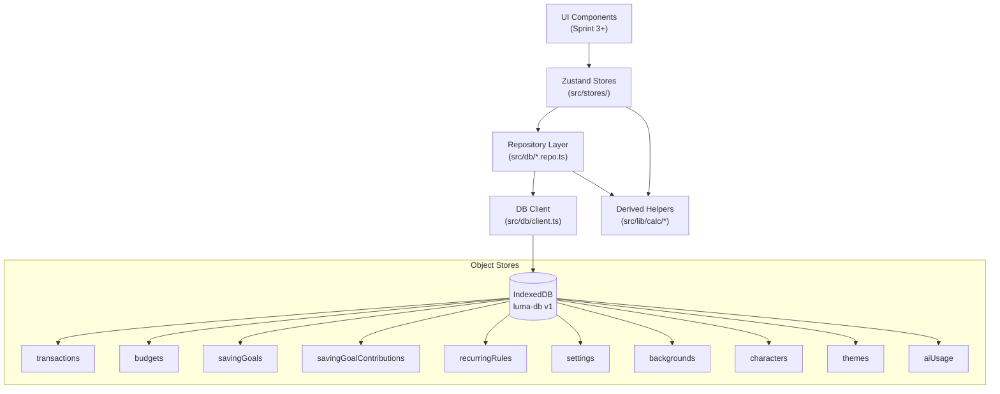
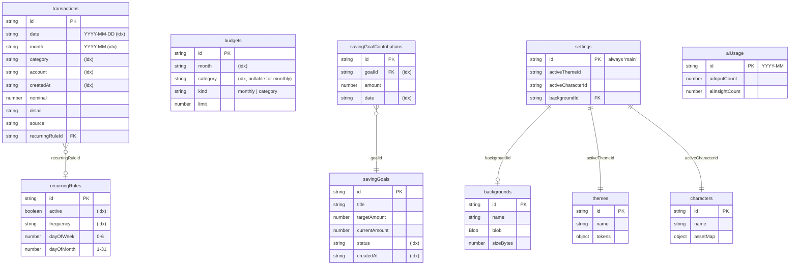
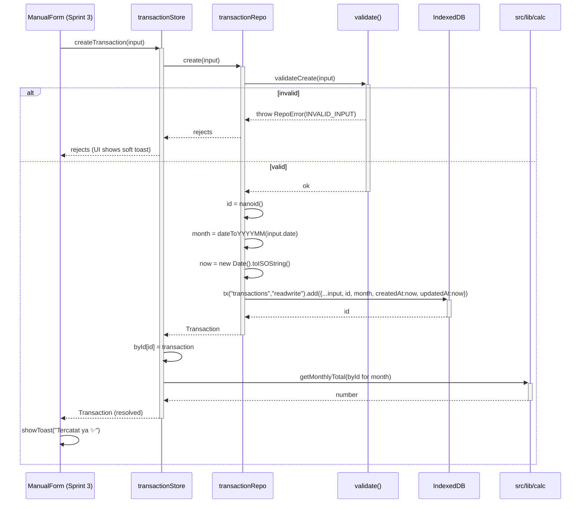

# Design Document: Sprint 2 — IndexedDB + Data Layer

## Overview

Sprint 2 builds Luma's local-first data foundation: an IndexedDB client (via `idb`), strongly-typed domain models, a repository layer that owns all DB access, derived calculation helpers, and Zustand stores that expose state to (future) UI. This sprint produces zero UI — only data primitives that subsequent sprints (manual transactions, home dashboard, budgets, saving goals, reports) consume.

The architecture enforces a strict one-way flow: **UI → Store → Repository → IndexedDB**. Components never touch IndexedDB directly. Repositories are stateless async functions that validate input and return `Promise<T>`. Stores are Zustand slices that cache repo results in memory and expose actions + selectors. Helper functions in `src/lib/` compute derived values (monthly totals, budget usage, saving progress) as pure functions over arrays — they have no side effects and no DB access.

The design covers the schema (10 object stores with indexes), repository APIs for all entities, store interfaces, boot/hydration sequence, write-path sequence, derived calculation algorithms with pre/postconditions, the migration path (v1 baseline + placeholder for v2+), and correctness properties for property-based testing in later tasks.

---

## Architecture



**Layering rules:**
- `src/db/client.ts` — exports a single `getDB()` returning `Promise<IDBPDatabase<LumaDBSchema>>`. Owns schema and migrations.
- `src/db/*.repo.ts` — pure async functions. No React, no Zustand. Validate input, throw typed errors.
- `src/stores/*.ts` — Zustand stores. Call repos, cache results, expose actions and selectors.
- `src/lib/calc/*.ts` — pure functions over plain data. No DB, no async.
- `src/lib/date.ts`, `src/lib/id.ts` — small utilities (date-fns wrappers, nanoid wrapper).
- `src/types/*.ts` — domain model interfaces (mirrors TECHNICAL_ARCHITECTURE §7).

---

## Database Schema Diagram



**Object stores and indexes (v1):**

| Store | keyPath | Indexes |
|---|---|---|
| `transactions` | `id` | `date`, `month`, `category`, `account`, `createdAt` |
| `budgets` | `id` | `month`, `category`, `[month+category]` (compound, unique), `[month+kind]` (compound) |
| `savingGoals` | `id` | `status`, `createdAt` |
| `savingGoalContributions` | `id` | `goalId`, `date` |
| `recurringRules` | `id` | `active`, `frequency` |
| `settings` | `id` | — (singleton, id is always `"main"`) |
| `backgrounds` | `id` | `createdAt` |
| `characters` | `id` | — |
| `themes` | `id` | — |
| `aiUsage` | `id` | — (id is `YYYY-MM`, naturally unique) |

**Schema notes:**
- `budgets` unifies `MonthlyBudget` and `CategoryBudget` from §7 via a `kind` discriminator. Compound unique index `[month+category]` enforces "one category budget per month per category"; for `kind="monthly"`, `category` is the literal string `"__total__"` so the same uniqueness rule prevents duplicate monthly budgets.
- `settings` is a singleton: `id === "main"` is the only valid record. Repo enforces this.
- `aiUsage` uses `YYYY-MM` as id, making it naturally unique per month — no separate index needed.

---

## Data Models

Models live in `src/types/`. They mirror TECHNICAL_ARCHITECTURE §7 verbatim, with one consolidation for `budgets`:

```typescript
// src/types/transaction.ts
export type AccountType = "Cash" | "E-wallet" | "BNI" | "BCA" | "Mandiri" | "Other";
export type CategoryType = "Food" | "Transport" | "Entertainment" | "Shopping" | "Health" | "Giving" | "Saving" | "Other";
export type MoodType = "😊" | "😐" | "😬" | "😭" | "🤩";
export type TransactionSource = "manual" | "ai" | "recurring";

export interface Transaction {
  id: string;
  date: string;          // YYYY-MM-DD
  month: string;         // YYYY-MM (derived from date)
  createdAt: string;     // ISO 8601
  updatedAt: string;     // ISO 8601
  detail: string;
  nominal: number;       // > 0
  account: AccountType;
  category: CategoryType;
  mood?: MoodType;
  note?: string;
  source: TransactionSource;
  isRecurring?: boolean;
  recurringRuleId?: string;
}

// src/types/budget.ts
export type BudgetKind = "monthly" | "category";

export interface BudgetRecord {
  id: string;
  month: string;                // YYYY-MM
  kind: BudgetKind;
  category: CategoryType | "__total__"; // "__total__" when kind="monthly"
  limit: number;                // > 0
  createdAt: string;
  updatedAt: string;
}

// View types exposed by the repo (kept compatible with PRD §7):
export type MonthlyBudget = Omit<BudgetRecord, "kind" | "category"> & { totalBudget: number };
export type CategoryBudget = Omit<BudgetRecord, "kind" | "limit"> & { category: CategoryType; limit: number };

// src/types/saving.ts
export interface SavingGoal {
  id: string;
  title: string;
  targetAmount: number;
  currentAmount: number;
  icon: string;
  deadline?: string;
  note?: string;
  status: "active" | "completed" | "archived";
  createdAt: string;
  updatedAt: string;
}

export interface SavingGoalContribution {
  id: string;
  goalId: string;
  amount: number;
  date: string;
  note?: string;
  createdAt: string;
}

// src/types/recurring.ts
export interface RecurringRule {
  id: string;
  detail: string;
  nominal: number;
  account: AccountType;
  category: CategoryType;
  mood?: MoodType;
  frequency: "daily" | "weekly" | "monthly";
  dayOfWeek?: number;   // 0-6, required iff frequency === "weekly"
  dayOfMonth?: number;  // 1-31, required iff frequency === "monthly"
  active: boolean;
  lastRunDate?: string;
  createdAt: string;
  updatedAt: string;
}

// src/types/settings.ts
export interface UserSettings {
  id: "main";
  name: string;
  currency: "IDR";
  themeMode: "dark" | "light" | "auto";
  activeThemeId: string;
  activeCharacterId: string;
  backgroundId?: string;
  backgroundBlur: number;        // 0..20
  backgroundOverlayOpacity: number; // 0..1
  mascotEnabled: boolean;
  aiEnabled: boolean;
  createdAt: string;
  updatedAt: string;
}

// src/types/asset.ts
export interface BackgroundAsset {
  id: string;
  name: string;
  blob: Blob;
  mimeType: "image/webp" | "image/jpeg" | "image/png";
  width: number;
  height: number;
  sizeBytes: number;
  createdAt: string;
}

export interface CharacterConfig {
  id: string;
  name: string;
  type: "default" | "custom" | "premium";
  style: "cute" | "cozy" | "idol" | "anime" | "pixel" | "minimal";
  assetMap: {
    happy: string;
    chill: string;
    worried: string;
    panic: string;
    thinking?: string;
    success?: string;
  };
}

export interface ThemeConfig {
  id: string;
  name: string;
  mode: "dark" | "light";
  tokens: Record<string, string>;
  decorativeStyle: "blob" | "soft" | "minimal" | "stage" | "cafe";
}

// src/types/ai.ts
export interface AIUsage {
  id: string;             // YYYY-MM
  aiInputCount: number;
  aiInsightCount: number;
  updatedAt: string;
}
```

---

## DB Client and Schema

```typescript
// src/db/client.ts
import { openDB, IDBPDatabase, DBSchema } from "idb";

export const DB_NAME = "luma-db";
export const DB_VERSION = 1;

export interface LumaDBSchema extends DBSchema {
  transactions: {
    key: string;
    value: Transaction;
    indexes: {
      date: string;
      month: string;
      category: string;
      account: string;
      createdAt: string;
    };
  };
  budgets: {
    key: string;
    value: BudgetRecord;
    indexes: {
      month: string;
      category: string;
      "month+category": [string, string]; // unique
      "month+kind": [string, string];
    };
  };
  savingGoals: {
    key: string;
    value: SavingGoal;
    indexes: { status: string; createdAt: string };
  };
  savingGoalContributions: {
    key: string;
    value: SavingGoalContribution;
    indexes: { goalId: string; date: string };
  };
  recurringRules: {
    key: string;
    value: RecurringRule;
    indexes: { active: string; frequency: string }; // booleans stored as "1"/"0" strings for index compat
  };
  settings: { key: "main"; value: UserSettings };
  backgrounds: { key: string; value: BackgroundAsset; indexes: { createdAt: string } };
  characters: { key: string; value: CharacterConfig };
  themes: { key: string; value: ThemeConfig };
  aiUsage: { key: string; value: AIUsage };
}

let dbPromise: Promise<IDBPDatabase<LumaDBSchema>> | null = null;

export function getDB(): Promise<IDBPDatabase<LumaDBSchema>> {
  if (!dbPromise) {
    dbPromise = openDB<LumaDBSchema>(DB_NAME, DB_VERSION, {
      upgrade(db, oldVersion, newVersion, tx) {
        runMigrations(db, oldVersion, newVersion ?? DB_VERSION, tx);
      },
    });
  }
  return dbPromise;
}

// For tests
export function __resetDBSingleton(): void {
  dbPromise = null;
}
```

**Migration entry point:**

```typescript
// src/db/migrations.ts
export function runMigrations(
  db: IDBPDatabase<LumaDBSchema>,
  oldVersion: number,
  newVersion: number,
  tx: IDBPTransaction<LumaDBSchema, ArrayLike<StoreNames<LumaDBSchema>>, "versionchange">,
): void {
  if (oldVersion < 1) migrateToV1(db);
  // Placeholder for future versions:
  // if (oldVersion < 2) migrateToV2(db, tx);
  // if (oldVersion < 3) migrateToV3(db, tx);
}
```

---

## Components and Interfaces

### Repository APIs

All repos: `Promise<T>` returning, validate input, throw `RepoError` on bad input.

#### `transactionRepo` (src/db/transactions.repo.ts)

```typescript
export interface CreateTransactionInput {
  date: string;             // YYYY-MM-DD
  detail: string;           // non-empty
  nominal: number;          // > 0
  account: AccountType;
  category: CategoryType;
  mood?: MoodType;
  note?: string;
  source: TransactionSource;
  recurringRuleId?: string;
}
export type UpdateTransactionInput = Partial<Omit<CreateTransactionInput, "source">>;

export interface TransactionSearchParams {
  month?: string;
  dateFrom?: string;
  dateTo?: string;
  category?: CategoryType;
  account?: AccountType;
  query?: string;     // matches detail substring (case-insensitive)
  sort?: "newest" | "oldest" | "highest" | "lowest";
  limit?: number;
}

export const transactionRepo = {
  create(input: CreateTransactionInput): Promise<Transaction>;
  update(id: string, input: UpdateTransactionInput): Promise<Transaction>;
  remove(id: string): Promise<void>;
  getById(id: string): Promise<Transaction | undefined>;
  listAll(): Promise<Transaction[]>;
  listByMonth(month: string): Promise<Transaction[]>;
  listByDate(date: string): Promise<Transaction[]>;
  listByCategory(category: CategoryType, month?: string): Promise<Transaction[]>;
  listByAccount(account: AccountType, month?: string): Promise<Transaction[]>;
  search(params: TransactionSearchParams): Promise<Transaction[]>;
};
```

#### `budgetRepo` (src/db/budgets.repo.ts)

```typescript
export const budgetRepo = {
  // Monthly (one per month)
  setMonthlyBudget(month: string, totalBudget: number): Promise<MonthlyBudget>;
  getMonthlyBudget(month: string): Promise<MonthlyBudget | undefined>;
  removeMonthlyBudget(month: string): Promise<void>;

  // Category (one per month per category)
  setCategoryBudget(month: string, category: CategoryType, limit: number): Promise<CategoryBudget>;
  getCategoryBudget(month: string, category: CategoryType): Promise<CategoryBudget | undefined>;
  listCategoryBudgets(month: string): Promise<CategoryBudget[]>;
  removeCategoryBudget(month: string, category: CategoryType): Promise<void>;
};
```

#### `savingsRepo` (src/db/savings.repo.ts)

```typescript
export interface CreateSavingGoalInput {
  title: string;
  targetAmount: number;     // > 0
  icon: string;
  deadline?: string;
  note?: string;
}
export type UpdateSavingGoalInput = Partial<CreateSavingGoalInput> & {
  status?: SavingGoal["status"];
};

export const savingsRepo = {
  createGoal(input: CreateSavingGoalInput): Promise<SavingGoal>;
  updateGoal(id: string, input: UpdateSavingGoalInput): Promise<SavingGoal>;
  archiveGoal(id: string): Promise<SavingGoal>;
  removeGoal(id: string): Promise<void>;
  getGoal(id: string): Promise<SavingGoal | undefined>;
  listGoals(status?: SavingGoal["status"]): Promise<SavingGoal[]>;

  addContribution(goalId: string, amount: number, date: string, note?: string): Promise<{
    contribution: SavingGoalContribution;
    goal: SavingGoal;
  }>;
  listContributions(goalId: string): Promise<SavingGoalContribution[]>;
  removeContribution(contributionId: string): Promise<SavingGoal>;
};
```

`addContribution` is transactional (single IDB readwrite tx over both stores): it inserts a contribution **and** updates `goal.currentAmount`, flipping `status` to `"completed"` if `currentAmount >= targetAmount`.

#### `settingsRepo` (src/db/settings.repo.ts)

```typescript
export const settingsRepo = {
  get(): Promise<UserSettings>;                         // returns default if absent
  update(patch: Partial<Omit<UserSettings, "id" | "createdAt">>): Promise<UserSettings>;
  reset(): Promise<UserSettings>;                       // restore defaults
};
```

`get()` lazily initializes: if no `settings.main` row exists, it inserts `DEFAULT_SETTINGS` and returns it. This makes hydration safe on first launch.

#### `backgroundsRepo` (src/db/backgrounds.repo.ts)

```typescript
export interface CreateBackgroundInput {
  name: string;
  blob: Blob;
  mimeType: BackgroundAsset["mimeType"];
  width: number;
  height: number;
}
export const backgroundsRepo = {
  create(input: CreateBackgroundInput): Promise<BackgroundAsset>;
  getById(id: string): Promise<BackgroundAsset | undefined>;
  list(): Promise<BackgroundAsset[]>;
  remove(id: string): Promise<void>;
};
```

#### `recurringRepo` (src/db/recurring.repo.ts)

> Sprint 2 only stores the data shape. The executor (running rules to create transactions) is deferred to Sprint 3.

```typescript
export interface CreateRecurringRuleInput {
  detail: string;
  nominal: number;
  account: AccountType;
  category: CategoryType;
  mood?: MoodType;
  frequency: RecurringRule["frequency"];
  dayOfWeek?: number;     // required iff frequency === "weekly"
  dayOfMonth?: number;    // required iff frequency === "monthly"
  active?: boolean;       // default true
}
export type UpdateRecurringRuleInput = Partial<CreateRecurringRuleInput>;

export const recurringRepo = {
  create(input: CreateRecurringRuleInput): Promise<RecurringRule>;
  update(id: string, input: UpdateRecurringRuleInput): Promise<RecurringRule>;
  remove(id: string): Promise<void>;
  getById(id: string): Promise<RecurringRule | undefined>;
  listActive(): Promise<RecurringRule[]>;
  listAll(): Promise<RecurringRule[]>;
  setLastRunDate(id: string, date: string): Promise<RecurringRule>;
};
```

#### `aiUsageRepo` (src/db/ai-usage.repo.ts)

```typescript
export const aiUsageRepo = {
  get(month: string): Promise<AIUsage>;                 // returns zeroed if absent (does not insert)
  incrementInput(month: string, by?: number): Promise<AIUsage>;   // upsert
  incrementInsight(month: string, by?: number): Promise<AIUsage>; // upsert
  reset(month: string): Promise<void>;
};
```

### Validation Rules (shared by repos)

| Field | Rule |
|---|---|
| `id` | nanoid(); never empty |
| `nominal`, `targetAmount`, `limit`, `amount` | finite number > 0 |
| `date` | matches `^\d{4}-\d{2}-\d{2}$` and represents a real calendar date |
| `month` | matches `^\d{4}-(0[1-9]\|1[0-2])$` |
| `detail`, `name`, `title` | non-empty after `.trim()` |
| `account`, `category` | member of the union type |
| `dayOfWeek` | integer 0..6, required iff `frequency==="weekly"` |
| `dayOfMonth` | integer 1..31, required iff `frequency==="monthly"` |
| `settings.id` | always `"main"` |
| `aiUsage.id` | matches `^\d{4}-(0[1-9]\|1[0-2])$` |
| Background `sizeBytes` | > 0 and ≤ 5_000_000 (soft cap) |

Repos throw `RepoError` (single error class with `code` + `message`) on violation. Codes: `INVALID_INPUT`, `NOT_FOUND`, `DUPLICATE`.

---

### Zustand Stores

#### `transactionStore`

```typescript
export interface TransactionStoreState {
  // State
  byId: Record<string, Transaction>;
  currentMonth: string;                  // YYYY-MM
  loaded: { [month: string]: boolean };  // tracks which months are hydrated
  loading: boolean;
  error?: string;

  // Actions
  setCurrentMonth(month: string): Promise<void>;
  loadMonth(month: string): Promise<void>;
  createTransaction(input: CreateTransactionInput): Promise<Transaction>;
  updateTransaction(id: string, input: UpdateTransactionInput): Promise<Transaction>;
  deleteTransaction(id: string): Promise<void>;

  // Selectors (computed via helpers)
  selectMonth(month: string): Transaction[];
  selectMonthlyTotal(month: string): number;
  selectTodayTotal(today: string): number;
  selectCategoryTotals(month: string): Record<CategoryType, number>;
  selectTopCategory(month: string): { category: CategoryType; amount: number } | null;
}
```

#### `budgetStore`

```typescript
export interface BudgetStoreState {
  monthlyBudgets: Record<string, MonthlyBudget>;            // keyed by month
  categoryBudgets: Record<string, CategoryBudget[]>;        // keyed by month
  loading: boolean;
  error?: string;

  loadMonth(month: string): Promise<void>;
  setMonthlyBudget(month: string, total: number): Promise<void>;
  setCategoryBudget(month: string, category: CategoryType, limit: number): Promise<void>;
  removeCategoryBudget(month: string, category: CategoryType): Promise<void>;

  selectMonthlyBudget(month: string): MonthlyBudget | undefined;
  selectCategoryBudgets(month: string): CategoryBudget[];
  selectBudgetUsage(month: string, transactions: Transaction[]): BudgetUsage;
  selectCategoryBudgetUsage(month: string, category: CategoryType, transactions: Transaction[]): CategoryBudgetUsage;
}
```

#### `savingGoalStore`

```typescript
export interface SavingGoalStoreState {
  byId: Record<string, SavingGoal>;
  contributionsByGoal: Record<string, SavingGoalContribution[]>;
  loading: boolean;
  error?: string;

  loadAll(): Promise<void>;
  createGoal(input: CreateSavingGoalInput): Promise<SavingGoal>;
  updateGoal(id: string, input: UpdateSavingGoalInput): Promise<SavingGoal>;
  archiveGoal(id: string): Promise<void>;
  addContribution(goalId: string, amount: number, date: string, note?: string): Promise<void>;

  selectActive(): SavingGoal[];
  selectCompleted(): SavingGoal[];
  selectProgress(goalId: string): number;       // 0..1, clamped
}
```

#### `settingsStore`

```typescript
export interface SettingsStoreState {
  settings: UserSettings | null;
  loading: boolean;
  error?: string;

  hydrate(): Promise<void>;                                  // called on app boot
  update(patch: Partial<Omit<UserSettings, "id" | "createdAt">>): Promise<void>;
  setActiveTheme(themeId: string): Promise<void>;
  setActiveCharacter(characterId: string): Promise<void>;
  setBackground(backgroundId: string | undefined): Promise<void>;
}
```

#### `uiStore`

Pure in-memory client state, no persistence in Sprint 2.

```typescript
export interface UIStoreState {
  activeSheet: "addTransaction" | "editTransaction" | "addBudget" | "createGoal" | "addContribution" | null;
  activeSheetPayload?: unknown;
  toast: { id: string; message: string; tone: "info" | "success" | "warning" } | null;
  selectedMonth: string;                 // YYYY-MM, current month by default

  openSheet(sheet: UIStoreState["activeSheet"], payload?: unknown): void;
  closeSheet(): void;
  showToast(message: string, tone?: "info" | "success" | "warning"): void;
  dismissToast(): void;
  setSelectedMonth(month: string): void;
}
```

---

## Sequence Diagrams

### App Boot → Settings Load → Store Hydration

```mermaid
sequenceDiagram
    participant App as App.tsx
    participant SS as settingsStore
    participant SR as settingsRepo
    participant DB as IndexedDB (luma-db)
    participant TS as transactionStore
    participant TR as transactionRepo
    participant BS as budgetStore
    participant BR as budgetRepo

    App->>+SS: hydrate()
    SS->>+SR: get()
    SR->>+DB: open(luma-db, v1)
    DB-->>-SR: db (runs upgrade if needed)
    SR->>DB: tx("settings", "readonly").get("main")
    DB-->>SR: undefined (first launch)
    SR->>DB: tx("settings", "readwrite").put(DEFAULT_SETTINGS)
    DB-->>-SR: UserSettings
    SR-->>-SS: UserSettings
    SS-->>-App: ready
    App->>App: applyTheme(settings.activeThemeId)

    par Load current month data
        App->>+TS: setCurrentMonth(currentMonth)
        TS->>+TR: listByMonth(currentMonth)
        TR->>DB: tx("transactions", "readonly").index("month").getAll(month)
        DB-->>TR: Transaction[]
        TR-->>-TS: Transaction[]
        TS-->>-App: hydrated
    and
        App->>+BS: loadMonth(currentMonth)
        BS->>+BR: getMonthlyBudget(month) + listCategoryBudgets(month)
        BR->>DB: index queries
        DB-->>BR: results
        BR-->>-BS: budgets
        BS-->>-App: hydrated
    end
```

### createTransaction (UI → Store → Repo → DB)



---

## Algorithmic Pseudocode

All calc helpers are pure: input is a plain `Transaction[]` (or domain object), output is a number/object. They live in `src/lib/calc/`.

### Date Helpers (src/lib/date.ts)

```typescript
import { format, parse, isValid, parseISO } from "date-fns";

export function dateToYYYYMMDD(d: Date): string {
  return format(d, "yyyy-MM-dd");
}

export function dateToYYYYMM(dateOrYYYYMMDD: Date | string): string {
  const d = typeof dateOrYYYYMMDD === "string" ? parseISO(dateOrYYYYMMDD) : dateOrYYYYMMDD;
  return format(d, "yyyy-MM");
}

export function parseMonth(month: string): Date {
  // "2025-03" → first day of March 2025 (local)
  return parse(month, "yyyy-MM", new Date());
}

export function isValidYYYYMMDD(s: string): boolean {
  if (!/^\d{4}-\d{2}-\d{2}$/.test(s)) return false;
  return isValid(parse(s, "yyyy-MM-dd", new Date()));
}

export function isValidYYYYMM(s: string): boolean {
  if (!/^\d{4}-(0[1-9]|1[0-2])$/.test(s)) return false;
  return isValid(parse(s, "yyyy-MM", new Date()));
}
```

### ID Generation (src/lib/id.ts)

```typescript
import { nanoid } from "nanoid";
export const newId = (): string => nanoid();
```

### Monthly Total

```pascal
ALGORITHM getMonthlyTotal(transactions, month)
INPUT:  transactions: Transaction[], month: String (YYYY-MM)
OUTPUT: total: Number ≥ 0

PRECONDITION:
  - month matches /^\d{4}-(0[1-9]|1[0-2])$/
  - ∀ t ∈ transactions: t.nominal > 0

POSTCONDITION:
  - total = Σ { t.nominal | t ∈ transactions, t.month = month }
  - total ≥ 0
  - total = 0 iff no transaction has t.month = month

BEGIN
  total ← 0
  FOR each t IN transactions DO
    INVARIANT: total = Σ { s.nominal | s ∈ processed, s.month = month } ∧ total ≥ 0
    IF t.month = month THEN
      total ← total + t.nominal
    END IF
  END FOR
  RETURN total
END
```

### Today Total

```pascal
ALGORITHM getTodayTotal(transactions, today)
INPUT:  transactions: Transaction[], today: String (YYYY-MM-DD)
OUTPUT: total: Number ≥ 0

PRECONDITION:  isValidYYYYMMDD(today) = true
POSTCONDITION: total = Σ { t.nominal | t ∈ transactions, t.date = today }

BEGIN
  RETURN sum(t.nominal for t in transactions where t.date = today)
END
```

### Category Totals

```pascal
ALGORITHM getCategoryTotals(transactions)
INPUT:  transactions: Transaction[]
OUTPUT: totals: Map<CategoryType, Number>

POSTCONDITION:
  - ∀ c ∈ CategoryType: totals[c] = Σ { t.nominal | t ∈ transactions, t.category = c }
  - Σ totals[c] over all c = Σ t.nominal over all t

BEGIN
  totals ← empty map with 0 default for every CategoryType
  FOR each t IN transactions DO
    INVARIANT: Σ totals[c] = Σ { s.nominal | s ∈ processed }
    totals[t.category] ← totals[t.category] + t.nominal
  END FOR
  RETURN totals
END
```

### Top Category

```pascal
ALGORITHM getTopCategory(transactions)
INPUT:  transactions: Transaction[]
OUTPUT: { category: CategoryType, amount: Number } | NULL

POSTCONDITION:
  - if transactions = ∅ → return NULL
  - else: result.amount = max(getCategoryTotals(transactions))
  -       result.amount > 0
  -       ties broken by stable order (alphabetical category name)

BEGIN
  IF transactions = ∅ THEN RETURN NULL END IF
  totals ← getCategoryTotals(transactions)
  best ← NULL
  FOR each (category, amount) IN totals SORTED BY category ASC DO
    IF amount > 0 AND (best = NULL OR amount > best.amount) THEN
      best ← { category, amount }
    END IF
  END FOR
  RETURN best
END
```

### Budget Usage

```pascal
ALGORITHM getBudgetUsage(monthlyBudget, transactions)
INPUT:  monthlyBudget: MonthlyBudget, transactions: Transaction[]
OUTPUT: { used: Number, remaining: Number, percentage: Number, isOver: Boolean }

PRECONDITION:
  - monthlyBudget.totalBudget > 0
  - All transactions are for the same month as monthlyBudget.month
    (caller filters; helper does NOT re-filter to keep it composable)

POSTCONDITION:
  - used      = Σ t.nominal for t ∈ transactions
  - remaining = monthlyBudget.totalBudget − used   (may be negative)
  - percentage = used / monthlyBudget.totalBudget  (≥ 0; uncapped)
  - isOver    = (used > monthlyBudget.totalBudget)
  - used + remaining = monthlyBudget.totalBudget   (algebraic identity)

BEGIN
  used ← Σ t.nominal for t ∈ transactions
  remaining ← monthlyBudget.totalBudget − used
  percentage ← used / monthlyBudget.totalBudget
  isOver ← used > monthlyBudget.totalBudget
  RETURN { used, remaining, percentage, isOver }
END
```

### Category Budget Usage

```pascal
ALGORITHM getCategoryBudgetUsage(categoryBudget, transactions)
INPUT:  categoryBudget: CategoryBudget, transactions: Transaction[]
OUTPUT: { used: Number, remaining: Number, percentage: Number, isOver: Boolean }

PRECONDITION: categoryBudget.limit > 0
POSTCONDITION:
  - used = Σ t.nominal for t ∈ transactions
           where t.month = categoryBudget.month ∧ t.category = categoryBudget.category
  - remaining = categoryBudget.limit − used
  - percentage = used / categoryBudget.limit
  - isOver = used > categoryBudget.limit

BEGIN
  used ← Σ t.nominal for t in transactions
         where t.month = categoryBudget.month AND t.category = categoryBudget.category
  remaining ← categoryBudget.limit − used
  percentage ← used / categoryBudget.limit
  isOver ← used > categoryBudget.limit
  RETURN { used, remaining, percentage, isOver }
END
```

### Saving Goal Progress

```pascal
ALGORITHM getSavingGoalProgress(goal)
INPUT:  goal: SavingGoal
OUTPUT: progress: Number in [0, 1]

PRECONDITION: goal.targetAmount > 0 ∧ goal.currentAmount ≥ 0
POSTCONDITION:
  - progress = min(1, goal.currentAmount / goal.targetAmount)
  - progress = 1 iff goal.currentAmount ≥ goal.targetAmount

BEGIN
  IF goal.currentAmount ≥ goal.targetAmount THEN RETURN 1 END IF
  RETURN goal.currentAmount / goal.targetAmount
END
```

### Add Contribution (transactional)

```pascal
ALGORITHM addContribution(goalId, amount, date, note)
INPUT:  goalId: String, amount: Number > 0, date: String (YYYY-MM-DD), note: String?
OUTPUT: { contribution: SavingGoalContribution, goal: SavingGoal }

PRECONDITION:
  - goal exists with id = goalId
  - amount > 0 AND finite
  - isValidYYYYMMDD(date)

POSTCONDITION:
  - new contribution persisted with goalId, amount, date
  - goal.currentAmount_new = goal.currentAmount_old + amount
  - if goal.currentAmount_new ≥ goal.targetAmount: goal.status = "completed"
  - both writes committed atomically (single readwrite tx)

BEGIN
  tx ← db.transaction(["savingGoals", "savingGoalContributions"], "readwrite")
  goal ← tx.objectStore("savingGoals").get(goalId)
  IF goal = ∅ THEN ABORT tx; THROW NOT_FOUND END IF

  contribution ← {
    id: newId(), goalId, amount, date,
    note, createdAt: now()
  }
  tx.objectStore("savingGoalContributions").add(contribution)

  goal.currentAmount ← goal.currentAmount + amount
  goal.updatedAt ← now()
  IF goal.currentAmount ≥ goal.targetAmount AND goal.status = "active" THEN
    goal.status ← "completed"
  END IF
  tx.objectStore("savingGoals").put(goal)

  AWAIT tx.done
  RETURN { contribution, goal }
END
```

---

## Migration Path

### Migration Strategy

- Single source of truth: `src/db/migrations.ts` exports `runMigrations(db, oldVersion, newVersion, tx)`.
- Each version-bump function is **idempotent**: calling `migrateToVN` on an already-vN database is a no-op (it checks `db.objectStoreNames.contains(...)` and `store.indexNames.contains(...)` before creating).
- Migrations run inside the `versionchange` transaction provided by `idb`'s `upgrade` callback. Both schema changes and data backfills happen there.
- Bumping `DB_VERSION` in `src/db/client.ts` is the only trigger.

### v1 (this sprint) — baseline

```typescript
function migrateToV1(db: IDBPDatabase<LumaDBSchema>): void {
  if (!db.objectStoreNames.contains("transactions")) {
    const s = db.createObjectStore("transactions", { keyPath: "id" });
    s.createIndex("date", "date");
    s.createIndex("month", "month");
    s.createIndex("category", "category");
    s.createIndex("account", "account");
    s.createIndex("createdAt", "createdAt");
  }
  if (!db.objectStoreNames.contains("budgets")) {
    const s = db.createObjectStore("budgets", { keyPath: "id" });
    s.createIndex("month", "month");
    s.createIndex("category", "category");
    s.createIndex("month+category", ["month", "category"], { unique: true });
    s.createIndex("month+kind", ["month", "kind"]);
  }
  if (!db.objectStoreNames.contains("savingGoals")) {
    const s = db.createObjectStore("savingGoals", { keyPath: "id" });
    s.createIndex("status", "status");
    s.createIndex("createdAt", "createdAt");
  }
  if (!db.objectStoreNames.contains("savingGoalContributions")) {
    const s = db.createObjectStore("savingGoalContributions", { keyPath: "id" });
    s.createIndex("goalId", "goalId");
    s.createIndex("date", "date");
  }
  if (!db.objectStoreNames.contains("recurringRules")) {
    const s = db.createObjectStore("recurringRules", { keyPath: "id" });
    s.createIndex("active", "active");
    s.createIndex("frequency", "frequency");
  }
  if (!db.objectStoreNames.contains("settings")) {
    db.createObjectStore("settings", { keyPath: "id" });
  }
  if (!db.objectStoreNames.contains("backgrounds")) {
    const s = db.createObjectStore("backgrounds", { keyPath: "id" });
    s.createIndex("createdAt", "createdAt");
  }
  if (!db.objectStoreNames.contains("characters")) {
    db.createObjectStore("characters", { keyPath: "id" });
  }
  if (!db.objectStoreNames.contains("themes")) {
    db.createObjectStore("themes", { keyPath: "id" });
  }
  if (!db.objectStoreNames.contains("aiUsage")) {
    db.createObjectStore("aiUsage", { keyPath: "id" });
  }
}
```

### v2+ (placeholder pattern)

```typescript
// Future, when (e.g.) we add a `tags` index on transactions or a `transactionType` field:
//
// function migrateToV2(
//   db: IDBPDatabase<LumaDBSchema>,
//   tx: IDBPTransaction<LumaDBSchema, ArrayLike<StoreNames<LumaDBSchema>>, "versionchange">,
// ): void {
//   const txnStore = tx.objectStore("transactions");
//   if (!txnStore.indexNames.contains("tags")) {
//     txnStore.createIndex("tags", "tags", { multiEntry: true });
//   }
//   // Backfill: every existing row gets `tags: []` (idempotent).
//   let cursor = await txnStore.openCursor();
//   while (cursor) {
//     if (!Array.isArray(cursor.value.tags)) {
//       await cursor.update({ ...cursor.value, tags: [] });
//     }
//     cursor = await cursor.continue();
//   }
// }
```

**Migration documentation lives in `src/db/MIGRATIONS.md`** (created in tasks): each version gets a section describing what changed, why, and any backfill notes. The "Done when" criteria is satisfied by this file plus the placeholder above.

---

## Data Models — Validation Rules Summary

| Entity | Field | Rule |
|---|---|---|
| Transaction | `nominal` | finite number, > 0 |
| Transaction | `date` | matches `YYYY-MM-DD`, real date |
| Transaction | `month` | derived from `date`; not user-supplied |
| Transaction | `detail` | trim().length > 0 |
| Transaction | `category`, `account` | enum membership |
| BudgetRecord | `limit` | finite, > 0 |
| BudgetRecord | `[month, category]` | unique within store |
| SavingGoal | `targetAmount` | finite, > 0 |
| SavingGoal | `currentAmount` | finite, ≥ 0; only mutated via contributions or update |
| SavingGoalContribution | `amount` | finite, > 0 |
| RecurringRule | `dayOfWeek` | required iff `frequency==="weekly"`, integer 0..6 |
| RecurringRule | `dayOfMonth` | required iff `frequency==="monthly"`, integer 1..31 |
| UserSettings | `id` | always `"main"` |
| UserSettings | `backgroundOverlayOpacity` | 0..1 |
| AIUsage | `id` | matches `YYYY-MM` |
| BackgroundAsset | `sizeBytes` | > 0; warn if > 5MB |

---

## Error Handling

| Scenario | Response | Recovery |
|---|---|---|
| Invalid input to repo (e.g. nominal ≤ 0) | Throws `RepoError(INVALID_INPUT, msg)` | Caller (store) catches, sets `error`, surfaces soft Indonesian copy via `uiStore.showToast` |
| Record not found on update/delete | Throws `RepoError(NOT_FOUND)` | Store reconciles by reloading the affected slice |
| Duplicate compound key (e.g. two budgets for same month+category) | Throws `RepoError(DUPLICATE)` | Store falls back to `set*Budget` (upsert) instead of `add` — repos always use `put` for upsert semantics |
| IDB blocked / version mismatch | `getDB()` rejects | App boot shows recoverable error with retry; existing data preserved |
| Browser without IDB (e.g. Firefox private mode) | `getDB()` rejects with `RepoError(INVALID_INPUT, "IndexedDB unavailable")` | App degrades to read-only memory mode (out of scope this sprint; just log) |
| Background blob too large | Repo accepts but logs warning; UI compresses earlier (Sprint 9) | — |
| Settings absent on first launch | `settingsRepo.get()` lazily inserts defaults | Transparent to caller |
| AI usage record absent for month | `aiUsageRepo.get()` returns `{id, aiInputCount: 0, aiInsightCount: 0}` without inserting; `incrementXxx` upserts | — |

All errors carry a stable `code` so stores can map them to soft Indonesian copy:
- `INVALID_INPUT` → "Datanya belum lengkap nih."
- `NOT_FOUND` → "Datanya nggak ketemu, coba refresh ya."
- `DUPLICATE` → "Sudah ada datanya, kita update aja."
- DB error → "Gagal nyimpen, coba sekali lagi ya."

---

## Correctness Properties

These properties drive property-based tests in tasks (using `fast-check` per testing strategy below). Each is testable against in-memory `fake-indexeddb` so tests run fast and deterministically.

### Property 1: Persistence (write-then-read identity)
For any valid `CreateTransactionInput`:
```
∀ input ∈ ValidCreateTransactionInput:
  let t = await transactionRepo.create(input)
  let t' = await transactionRepo.getById(t.id)
  ⟹ t' deep-equals t
```
Same property holds for every entity (budget, savingGoal, recurringRule, settings, backgrounds, aiUsage).

### Property 2: Persistence across reopen
```
∀ input ∈ ValidCreateTransactionInput:
  await transactionRepo.create(input)
  __resetDBSingleton()
  let all = await transactionRepo.listAll()
  ⟹ all contains a transaction with the same id and field values as input
```
Models the "data persists after refresh" Done-when.

### Property 3: Settings singleton uniqueness
```
∀ patches: array of partial settings updates:
  for p in patches: await settingsRepo.update(p)
  let all = (db.transaction("settings").objectStore("settings").getAll())
  ⟹ all.length = 1 ∧ all[0].id = "main"
```

### Property 4: AIUsage id uniqueness per month
```
∀ month ∈ ValidYYYYMM, ∀ N ≥ 1 increments:
  for i in 1..N: await aiUsageRepo.incrementInput(month)
  let all = (db.transaction("aiUsage").objectStore("aiUsage").getAll())
  ⟹ all.filter(u => u.id = month).length = 1
  ⟹ all.find(u => u.id = month).aiInputCount = N
```

### Property 5: Budget compound uniqueness
```
∀ month, category, limits L1, L2:
  await budgetRepo.setCategoryBudget(month, category, L1)
  await budgetRepo.setCategoryBudget(month, category, L2)
  let bs = await budgetRepo.listCategoryBudgets(month)
  ⟹ bs.filter(b => b.category = category).length = 1
  ⟹ bs.find(b => b.category = category).limit = L2
```
(Same property: `setMonthlyBudget` is upsert — only one monthly budget per month.)

### Property 6: Migration idempotence
```
let db1 = await openDB(DB_NAME, 1, { upgrade: runMigrations })
db1.close()
let db2 = await openDB(DB_NAME, 1, { upgrade: runMigrations })
⟹ schema(db1) = schema(db2)  (same store names, same indexes)
⟹ all data preserved
```
And for future versions:
```
∀ V ≥ 1:
  open at v1 → write data → reopen at vV
  ⟹ all v1 data is still present and readable through vV repos
```

### Property 7: Derived totals match sum of transactions
```
∀ transactions: Transaction[]:
  getMonthlyTotal(transactions, m)
  = Σ { t.nominal | t ∈ transactions, t.month = m }
```
And:
```
∀ transactions:
  Σ { getCategoryTotals(transactions)[c] | c ∈ CategoryType }
  = Σ { t.nominal | t ∈ transactions }
```

### Property 8: Budget usage algebraic identity
```
∀ monthlyBudget, transactions:
  let u = getBudgetUsage(monthlyBudget, transactions)
  ⟹ u.used + u.remaining = monthlyBudget.totalBudget
  ⟹ u.percentage = u.used / monthlyBudget.totalBudget
  ⟹ u.isOver ⟺ u.used > monthlyBudget.totalBudget
```

### Property 9: Saving goal progress is bounded and monotonic
```
∀ goal, ∀ amounts: positive numbers:
  let p0 = getSavingGoalProgress(goal)
  for a in amounts:
    await savingsRepo.addContribution(goal.id, a, date)
  let goal' = await savingsRepo.getGoal(goal.id)
  let p1 = getSavingGoalProgress(goal')
  ⟹ 0 ≤ p0 ≤ p1 ≤ 1
  ⟹ goal'.currentAmount = goal.currentAmount + Σ amounts
  ⟹ if goal'.currentAmount ≥ goal.targetAmount: goal'.status = "completed"
```

### Property 10: Top category is the argmax of category totals
```
∀ transactions: non-empty Transaction[]:
  let top = getTopCategory(transactions)
  let totals = getCategoryTotals(transactions)
  ⟹ top.amount = max({totals[c] | c ∈ CategoryType})
  ⟹ totals[top.category] = top.amount
```

### Property 11: `addContribution` atomicity
```
∀ goal, amount > 0:
  let g0 = goal.currentAmount
  let n0 = (count of contributions for goal)
  AFTER addContribution(goal.id, amount, date):
    let g1 = (await getGoal).currentAmount
    let n1 = (count of contributions for goal)
    ⟹ g1 = g0 + amount AND n1 = n0 + 1   (both happen, or neither)
```
If the tx is forced to abort (by injecting a failing index write in tests), then `g1 = g0 ∧ n1 = n0`.

### Property 12: Validation rejects invalid inputs
```
∀ input with nominal ≤ 0 OR detail.trim() = "" OR invalid date:
  transactionRepo.create(input) throws RepoError(INVALID_INPUT)
  no record is written (verified by listAll() = unchanged)
```

### Property 13: Date helper round-trip
```
∀ d ∈ Date:
  parseISO(dateToYYYYMMDD(d))  has same Y/M/D as d
∀ d ∈ Date:
  dateToYYYYMM(d) = format(d, "yyyy-MM")
∀ s = "YYYY-MM":
  dateToYYYYMM(parseMonth(s)) = s
```

### Property 14: Repo update preserves id and createdAt
```
∀ id, valid update u:
  let t0 = await getById(id)
  let t1 = await update(id, u)
  ⟹ t1.id = t0.id
  ⟹ t1.createdAt = t0.createdAt
  ⟹ t1.updatedAt > t0.updatedAt
```

---

## Testing Strategy

### Unit Tests
- Pure helpers in `src/lib/calc/*` and `src/lib/date.ts`: deterministic example-based tests + property tests.
- ID generation: produces unique strings (sample 10k).
- Validation functions in repos: example-based pass/fail per rule.

### Property-Based Tests
- **Library**: `fast-check` (fits TypeScript, has `Arbitrary` for Date and money amounts via `fc.integer` and `fc.float`).
- **DB layer**: `fake-indexeddb` provides an in-memory IDB so repo properties run synchronously-fast and deterministically.
- Generators (arbitraries) produce: valid `Transaction`, valid `BudgetRecord`, valid `SavingGoal`, plus shrinkable invalid-input arbitraries to drive P12.
- One property test per P-property listed above (see tasks.md generated next).

### Integration Tests (DB layer)
- Each repo gets at least one happy-path integration test against `fake-indexeddb`:
  - create → list → update → get → remove cycle
  - cross-store transactional `addContribution` (P11)
- Migration test: open at v1, write a row to each store, close, reopen at v1 (and a forward-compat noop v2 stub), verify data still readable.

### Store Tests
- Test each Zustand store with mocked repos (vitest `vi.mock`):
  - state hydration on `loadMonth`/`hydrate`
  - optimistic updates roll back on repo rejection
  - selectors return values consistent with calc helpers

### Out of scope this sprint
- UI tests (no UI components in Sprint 2).
- E2E tests (Sprint 12 PWA polish).

---

## Performance Considerations

- All list queries go through indexes: `listByMonth` uses `month` index, `listByCategory(category, month)` uses `month` index then filters by category in memory (small N per month) or `category` index when month is absent.
- Settings is a singleton — `O(1)` reads.
- Stores cache by month so repeated month-switches don't re-query.
- Calc helpers are pure and memoizable; selectors in stores can wrap them with `useShallow` / `zustand/middleware` later if profiling shows recompute cost.
- Background blobs are **never** loaded eagerly — only fetched by id when the active background changes. They are excluded from any "load all" patterns.

---

## Security Considerations

- All data stays in IndexedDB on the user's device. No network calls in this sprint.
- No secrets stored in any store. Gemini API key handling is out of scope (Sprint 10).
- Validation rejects oversized blobs (> 5MB warn) to prevent quota DoS via background uploads.
- Repos sanitize string fields with `.trim()` before persistence; no eval/Function on stored data.

---

## Dependencies

Already declared in Sprint 0 `package.json`:

| Package | Use |
|---|---|
| `idb` | IndexedDB wrapper used by `src/db/client.ts` and migrations |
| `nanoid` | id generation (`src/lib/id.ts`) |
| `date-fns` | date helpers (`src/lib/date.ts`) |
| `zustand` | stores (`src/stores/*`) |

New dev dependencies to add this sprint (per testing strategy):

| Package | Use |
|---|---|
| `fast-check` | property-based testing |
| `fake-indexeddb` | in-memory IDB for repo tests |
| `vitest` | already from Sprint 0 if present, else add |

No runtime dependencies are added — Sprint 0 already covers them.
