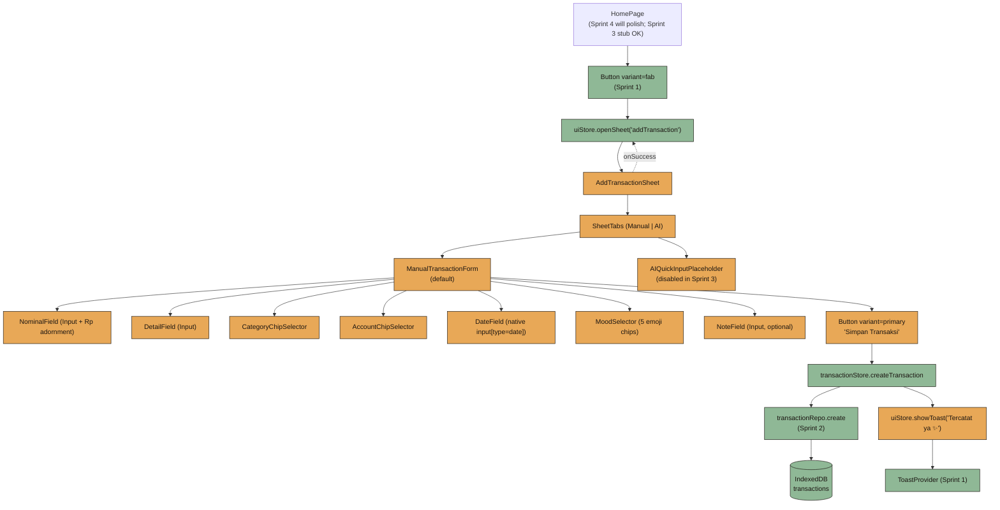
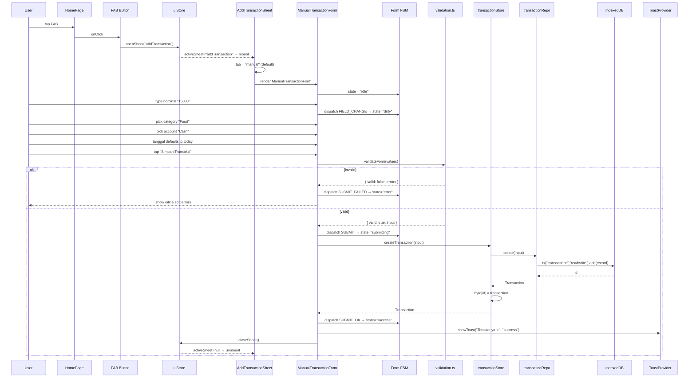
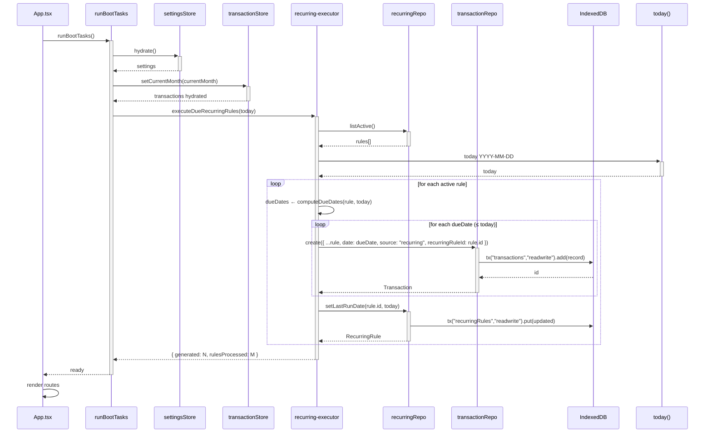

# Design Document: Sprint 3 — Manual Transaction Flow

## Overview

Sprint 3 implements Luma's most important UX flow: manual transaction entry. Per `BUILD_PLAN §10` and `PRD §9.1`, manual is the **default and primary** path; AI is a secondary shortcut deferred to Sprint 10. The user taps the FAB on Home, an `AddTransactionSheet` slides up (Sprint 1's `BottomSheet`), the Manual tab is selected by default, the `ManualTransactionForm` collects nominal, detail, kategori, akun, tanggal, mood, and optional note, validation runs with soft Indonesian copy, the form calls `transactionStore.createTransaction()` (Sprint 2), a `"Tercatat ya ✨"` toast fires, and the sheet closes. The Home dashboard's recent transactions list re-renders from the same store.

Two adjacent pieces ship in this sprint: (1) the **recurring rule executor** that was deferred from Sprint 2 — on app boot, it scans `recurringRepo.listActive()`, generates due transactions with `source: "recurring"`, and updates each rule's `lastRunDate` idempotently; (2) the **`formatIDR` helper** for displaying numbers as Indonesian Rupiah (`1500 → "Rp1.500"`, `1500000 → "Rp1.500.000"`). The AI tab exists in the sheet but is rendered as a disabled placeholder showing copy like "AI segera hadir ✨" — no Gemini calls, no parser, no preview UI. This keeps the visual structure ready for Sprint 10 without coupling.

The form is a finite state machine with five states (`idle → dirty → submitting → success | error`). Validation is field-scoped at blur and form-scoped at submit, with each field mapped to a pure validator function and a soft Indonesian error string. The flow must work fully offline because `transactionStore` writes through to IndexedDB; no network is involved on the manual path. Tap targets, numeric keyboards, and chip selectors follow `DESIGN_SYSTEM §11–§12`. Mood selector renders the five emojis from `MoodType` (`😊 😐 😬 😭 🤩`).

---

## Architecture

### Component Tree



### Folder Layout

Sprint 3 lands code in these new files, following `structure.md`:

```txt
src/
├── components/
│   ├── sheets/
│   │   └── AddTransactionSheet.tsx        ← NEW: tab host, owns Manual|AI tabs
│   └── forms/
│       ├── ManualTransactionForm.tsx      ← NEW: the FSM-driven form
│       ├── NominalField.tsx               ← NEW: Input + "Rp" adornment + numeric keyboard
│       ├── CategoryChipSelector.tsx       ← NEW: chips from CategoryType enum
│       ├── AccountChipSelector.tsx        ← NEW: chips from AccountType enum
│       ├── MoodSelector.tsx               ← NEW: 5 emoji chips
│       └── AIQuickInputPlaceholder.tsx    ← NEW: disabled placeholder for AI tab
├── features/
│   └── transactions/
│       ├── validation.ts                  ← NEW: field validators + soft copy
│       ├── form-machine.ts                ← NEW: form FSM transitions (pure)
│       └── recurring-executor.ts          ← NEW: recurring rule executor
├── lib/
│   ├── format.ts                          ← NEW: formatIDR + parseIDR
│   └── boot.ts                            ← NEW: runBootTasks() called on App mount
└── pages/
    └── HomePage.tsx                       ← MODIFIED: wire FAB to open sheet
```

No new IndexedDB stores, no new domain models — Sprint 2 already shipped `Transaction`, `RecurringRule`, repos, and `transactionStore`/`uiStore`.

### Sequence Diagram — FAB Tap → Save → Toast



### Sequence Diagram — App Boot Recurring Executor



---

## Components and Interfaces

### Component: AddTransactionSheet

**Purpose**: Host bottom sheet with two tabs (Manual default, AI placeholder). Wraps Sprint 1's `BottomSheet`. Reads open state from `uiStore.activeSheet === "addTransaction"`.

```ts
type AddTransactionTab = "manual" | "ai";

interface AddTransactionSheetProps {
  /** Optional: defaults to current month / today / no overrides. */
  defaults?: {
    date?: string;          // YYYY-MM-DD; defaults to today()
    account?: AccountType;
    category?: CategoryType;
  };
}
```

**Behavior**:
- Renders `<BottomSheet open={uiStore.activeSheet === "addTransaction"} title="Tambah Transaksi" onOpenChange={...}>`.
- Internal state: `tab: AddTransactionTab` defaulting to `"manual"`.
- Tab switcher uses pill buttons styled like `BottomNav`'s active pill.
- AI tab is **rendered but visually marked as "Segera hadir"** — `<AIQuickInputPlaceholder />`. Tapping it switches the tab but the body is a non-interactive card; primary CTA inside that body is disabled.
- On `<ManualTransactionForm onSuccess={() => uiStore.closeSheet()} />`, sheet is closed by the form; sheet does not need to re-implement close-on-success.

**Accessibility**:
- Tab list uses `role="tablist"`, each tab `role="tab"` with `aria-selected`, `aria-controls`.
- Tab panels `role="tabpanel"` with `aria-labelledby`.
- Title element id matches `BottomSheet`'s `aria-labelledby`.

### Component: AIQuickInputPlaceholder

**Purpose**: Disabled placeholder for the AI tab. Sprint 3 ships only the visual structure.

```ts
interface AIQuickInputPlaceholderProps {
  /** No-op in Sprint 3. */
  onActivate?: never;
}
```

**Behavior**:
- Renders a `Card variant="soft"` with copy:
  - Title: "Pakai AI Cepat ✨"
  - Body: "Fitur AI lagi dipersiapin. Pakai manual dulu ya 💛"
  - Disabled `Button variant="primary"` labeled "Segera hadir"
- Always disabled, never calls Gemini.
- No props because Sprint 3 has no AI integration. Sprint 10 will replace this component entirely.

### Component: ManualTransactionForm

**Purpose**: The actual form. Owns its FSM state, field values, errors, and submission.

```ts
interface ManualTransactionFormDefaults {
  date?: string;           // YYYY-MM-DD; default today()
  account?: AccountType;
  category?: CategoryType;
}

interface ManualTransactionFormProps {
  defaults?: ManualTransactionFormDefaults;
  /** Called after the transaction is persisted and toast is shown. */
  onSuccess?: (tx: Transaction) => void;
  /** Called when user dismisses (e.g., back). Optional; sheet handles close-on-backdrop. */
  onCancel?: () => void;
}

interface ManualFormValues {
  nominalRaw: string;          // user-typed digits, may include separators "1.500"
  detail: string;              // free text, trimmed at submit
  category: CategoryType | null;
  account: AccountType | null;
  date: string;                // YYYY-MM-DD; defaults to today()
  mood: MoodType | null;       // optional
  note: string;                // optional, free text
}

type FieldName = "nominal" | "detail" | "category" | "account" | "date" | "mood" | "note";
type FieldErrors = Partial<Record<FieldName, string>>;
```

**Field order** (per `DESIGN_SYSTEM §12`):
1. Nominal — `<NominalField />` (Input with `Rp` left adornment, `inputMode="numeric"`)
2. Detail — `<Input label="Detail" placeholder="Bakso, kopi, gocar..." />`
3. Kategori — `<CategoryChipSelector />`
4. Akun — `<AccountChipSelector />`
5. Tanggal — `<Input type="date" label="Tanggal" />` defaulting to `today()`
6. Mood — `<MoodSelector />` (optional)
7. Note — `<Input label="Catatan kecil (opsional)" />`
8. Sticky footer — `<Button type="submit" variant="primary" loading={state === "submitting"}>Simpan Transaksi</Button>`

**Validation timing**:
- Per-field on `blur` (after first interaction).
- Full form on submit. Submit always re-runs all validators.

### Component: NominalField

**Purpose**: Numeric input with `Rp` prefix, formatted thousands separators on display, raw digits in state.

```ts
interface NominalFieldProps {
  value: string;                          // raw user-typed (digits + dots possibly)
  onChange: (raw: string) => void;
  error?: string;
  autoFocus?: boolean;
}
```

**Behavior**:
- `inputMode="numeric"`, `type="tel"` (better numeric keyboard on iOS without spinner).
- On `change`, strip everything except digits, then re-format with `formatThousands(digits)` for display while keeping raw digits in state.
- `value` shown to user includes thousands dots: `"15000" → "15.000"`.
- Left adornment: literal `"Rp"` (text-secondary).
- Helper text: `"Cuma angka, tanpa koma."` (only when no error).

### Component: CategoryChipSelector

**Purpose**: Render category chips from `CategoryType` enum.

```ts
interface CategoryChipSelectorProps {
  value: CategoryType | null;
  onChange: (c: CategoryType) => void;
  error?: string;
}
```

**Behavior**:
- Renders chips for each value in `CategoryType` (8 values: Food, Transport, Entertainment, Shopping, Health, Giving, Saving, Other).
- Chip = pill button: 36px height, radius 999px, padding 8×14, `bg-bg-card-soft` inactive, `bg-accent-primary text-bg-main` active.
- Multi-row wrap, gap 8px.
- `role="radiogroup"`, each chip `role="radio"` with `aria-checked`.
- Indonesian labels via map:
  - Food → "Makan"
  - Transport → "Transport"
  - Entertainment → "Hiburan"
  - Shopping → "Belanja"
  - Health → "Kesehatan"
  - Giving → "Sedekah"
  - Saving → "Tabungan"
  - Other → "Lainnya"

### Component: AccountChipSelector

```ts
interface AccountChipSelectorProps {
  value: AccountType | null;
  onChange: (a: AccountType) => void;
  error?: string;
}
```

Identical structure to `CategoryChipSelector` but using `AccountType` (Cash, E-wallet, BNI, BCA, Mandiri, Other). Labels are the values themselves except `Other → "Lainnya"`.

### Component: MoodSelector

```ts
interface MoodSelectorProps {
  value: MoodType | null;
  onChange: (m: MoodType | null) => void;   // null when user toggles current mood off
  error?: string;
}
```

**Behavior**:
- Renders 5 emoji chips horizontally: `😊 😐 😬 😭 🤩` (in this order — matches `MoodType` definition).
- Chip = circular 44×44px tap target, emoji centered.
- Active chip: 2px ring `accent-primary`, slight scale 1.05.
- Tapping the active chip toggles it off (mood is optional).
- Label: "Mood (opsional)".
- `role="radiogroup"`, but selection is allowed to be empty.

### Recurring Executor (src/features/transactions/recurring-executor.ts)

**Purpose**: On app boot, generate any missing transactions from active recurring rules.

```ts
export interface RecurringExecutorResult {
  rulesProcessed: number;
  transactionsGenerated: number;
  errors: Array<{ ruleId: string; error: string }>;
}

export interface RecurringExecutorDeps {
  recurringRepo: typeof recurringRepo;
  transactionRepo: typeof transactionRepo;
  /** Override for testing. Defaults to () => dateToYYYYMMDD(new Date()). */
  today?: () => string;
}

export async function executeDueRecurringRules(
  deps?: RecurringExecutorDeps,
): Promise<RecurringExecutorResult>;
```

**Idempotency contract**: Running the executor twice on the same `today` MUST NOT create duplicate transactions for the same rule and date. Enforced two ways:
1. **Algorithmic**: only generate dates strictly greater than `rule.lastRunDate` (or, if `lastRunDate` is null, only generate `today`).
2. **Repository safeguard**: before inserting, the executor calls `transactionRepo.search({ dateFrom: dueDate, dateTo: dueDate })` filtered by `recurringRuleId === rule.id` and `category/account/nominal === rule.*`. If a match exists, skip insertion. (This handles edge cases like a rule's `lastRunDate` being out of sync due to crash mid-run.)

### `formatIDR` Helper (src/lib/format.ts)

```ts
/**
 * Formats a number as Indonesian Rupiah using thousands dot-separator.
 *   1500     → "Rp1.500"
 *   1500000  → "Rp1.500.000"
 *   0        → "Rp0"
 *   -250     → "-Rp250"     (kept for general use; Luma transactions are always positive)
 *
 * Uses Intl.NumberFormat("id-ID") under the hood, with the symbol replaced
 * by the bare "Rp" prefix and no whitespace, to match Luma's compact display
 * (e.g., "Rp1.500.000" not "Rp 1.500.000").
 */
export function formatIDR(amount: number): string;

/**
 * Inverse of formatIDR for parsing user-entered display strings back to a number.
 * Tolerates "Rp1.500", "1.500", "1500", "rp 1.500", etc.
 *
 * Returns NaN for non-parseable strings (caller validates).
 */
export function parseIDR(input: string): number;

/** Lower-level: format only the integer with thousand-separator dots. */
export function formatThousands(amount: number | string): string;
```

**Round-trip property**: For all non-negative integers `n` in the range `[0, 999_999_999_999]`, `parseIDR(formatIDR(n)) === n`. Property tests will assert this in tasks.md.

---

## Data Models

Sprint 3 introduces no new IndexedDB stores or domain types. It uses Sprint 2's:

- `Transaction` (`src/types/transaction.ts`)
- `CreateTransactionInput` (`src/db/transactions.repo.ts`)
- `RecurringRule` (`src/types/recurring.ts`)
- `MoodType`, `CategoryType`, `AccountType`, `TransactionSource` (`src/types/transaction.ts`)

New runtime-only types (form/FSM, not persisted):

```ts
// src/features/transactions/form-machine.ts
export type FormState = "idle" | "dirty" | "submitting" | "success" | "error";

export type FormEvent =
  | { type: "FIELD_CHANGE" }
  | { type: "SUBMIT" }
  | { type: "SUBMIT_OK" }
  | { type: "SUBMIT_FAILED" }
  | { type: "RESET" };

export interface FormContext {
  values: ManualFormValues;
  errors: FieldErrors;
  lastError?: string;        // top-level submit error (e.g., DB write failed)
}
```

---

## Form State Machine

```mermaid
stateDiagram-v2
    [*] --> idle
    idle --> dirty: FIELD_CHANGE
    idle --> error: SUBMIT (validation fails on empty form)
    dirty --> dirty: FIELD_CHANGE
    dirty --> submitting: SUBMIT (valid)
    dirty --> error: SUBMIT (invalid)
    submitting --> success: SUBMIT_OK
    submitting --> error: SUBMIT_FAILED
    error --> dirty: FIELD_CHANGE
    error --> submitting: SUBMIT (valid)
    error --> error: SUBMIT (invalid)
    success --> [*]: onSuccess fires; form unmounts
```



**State semantics**:

| State        | Submit button | Field editable | Visual cue                         |
|--------------|---------------|----------------|------------------------------------|
| `idle`       | enabled       | yes            | clean form, no errors              |
| `dirty`      | enabled       | yes            | per-field errors may appear        |
| `submitting` | loading       | disabled       | submit shows spinner, fields dim   |
| `success`    | n/a           | n/a            | toast fires, sheet closes (~150ms) |
| `error`      | enabled       | yes            | inline errors visible              |

**Transition rules**:
- `FIELD_CHANGE` from `idle` → `dirty`. From `error` → `dirty` (clears top-level `lastError` but keeps field-specific errors until that field is re-validated on blur).
- `SUBMIT` runs full-form validation. If invalid, → `error` (or stays `error` with refreshed errors). If valid, → `submitting` and kicks off the async write.
- `SUBMIT_OK` fires when `transactionStore.createTransaction` resolves. Side effects (toast, close, `onSuccess`) happen during the transition.
- `SUBMIT_FAILED` fires when the store/repo rejects. `lastError` set to the soft-copy mapping (e.g., `"Gagal nyimpen, coba sekali lagi ya."`). Form remains usable; user can retry.

---

## Validation Rule Table

All validators are pure functions in `src/features/transactions/validation.ts`. Each returns `string | undefined` (the soft Indonesian error message, or `undefined` when valid). Soft copy follows `TECHNICAL_ARCHITECTURE §14` and `DESIGN_SYSTEM §18`.

| Field      | Validator             | Rule                                                          | Error copy (Indonesian, soft)            |
|------------|-----------------------|---------------------------------------------------------------|------------------------------------------|
| nominal    | `validateNominal`     | After stripping non-digits, parses to integer `> 0`           | "Nominalnya belum diisi nih."            |
| nominal    | `validateNominal`     | Parsed value ≤ `999_999_999_999`                              | "Nominalnya kebesaran. Coba kurangin."   |
| detail     | `validateDetail`      | `value.trim().length > 0`                                     | "Detail transaksi belum diisi."          |
| detail     | `validateDetail`      | `value.trim().length ≤ 120`                                   | "Detail kepanjangan, ringkas dikit ya."  |
| category   | `validateCategory`    | One of `CategoryType` enum values                             | "Pilih kategorinya dulu ya."             |
| account    | `validateAccount`     | One of `AccountType` enum values                              | "Pilih akun yang dipakai."               |
| date       | `validateDate`        | Matches `^\d{4}-\d{2}-\d{2}$` and is a real calendar date     | "Tanggalnya kayanya salah."              |
| date       | `validateDate`        | Not in the future relative to local `today()`                 | "Tanggalnya belum sampe sana, ganti ya." |
| mood       | `validateMood`        | Optional. If set, must be one of `MoodType` (5 emojis)        | "Mood-nya nggak dikenal."                |
| note       | `validateNote`        | Optional. If set, `value.trim().length ≤ 280`                 | "Catatannya kepanjangan."                |

**Form-level validator**:

```ts
export interface ValidationOk {
  valid: true;
  input: CreateTransactionInput;   // ready to pass to transactionRepo.create
}
export interface ValidationFail {
  valid: false;
  errors: FieldErrors;
}
export type ValidationResult = ValidationOk | ValidationFail;

export function validateForm(values: ManualFormValues, today: string): ValidationResult;
```

`validateForm` runs all field validators, collects errors. If any error exists, returns `{ valid: false, errors }`. Otherwise builds the `CreateTransactionInput` object (parsing nominal, trimming detail/note, omitting empty optional fields, setting `source: "manual"`) and returns `{ valid: true, input }`.

---

## Algorithmic Pseudocode

### Form Submit Flow

```pascal
ALGORITHM submitManualForm(values, today, deps)
INPUT:
  values: ManualFormValues
  today:  String (YYYY-MM-DD), local today
  deps:   { transactionStore, uiStore }
OUTPUT:
  Promise<{ ok: true, tx: Transaction } | { ok: false, errors: FieldErrors } | { ok: false, lastError: String }>

PRECONDITION:
  - values is the current form values
  - state machine is in "dirty" or "error"
  - today matches /^\d{4}-\d{2}-\d{2}$/

POSTCONDITION:
  - if returned ok=true: a Transaction was inserted into IndexedDB,
                        toast "Tercatat ya ✨" was queued, sheet was closed
  - if returned ok=false with errors: no DB write happened, form errors set
  - if returned ok=false with lastError: store/repo failed, no DB write committed

BEGIN
  // Phase 1: validate
  result ← validateForm(values, today)
  IF result.valid = false THEN
    RETURN { ok: false, errors: result.errors }
  END IF

  ASSERT result.input.nominal > 0
  ASSERT result.input.detail.length > 0
  ASSERT result.input.source = "manual"

  // Phase 2: persist
  TRY
    tx ← AWAIT deps.transactionStore.createTransaction(result.input)
  CATCH e
    softMessage ← "Gagal nyimpen, coba sekali lagi ya."
    RETURN { ok: false, lastError: softMessage }
  END TRY

  ASSERT tx.id ≠ ""
  ASSERT tx.month = dateToYYYYMM(tx.date)

  // Phase 3: feedback + close
  deps.uiStore.showToast("Tercatat ya ✨", "success")
  deps.uiStore.closeSheet()

  RETURN { ok: true, tx }
END
```

**Preconditions**:
- `values` reflects current form input.
- `today` is a valid `YYYY-MM-DD`.
- Form is not already in `submitting` or `success` (caller's FSM enforces).

**Postconditions**:
- On `ok: true`: exactly one new `Transaction` exists in IndexedDB with the submitted values, `source: "manual"`, computed `month`, fresh `id`, `createdAt`, `updatedAt`. Toast queued. Sheet closed. `transactionStore.byId` contains the new transaction.
- On `ok: false, errors`: no DB write. `errors` non-empty.
- On `ok: false, lastError`: no DB write committed (idb auto-aborts transaction on throw). User can retry.

**Loop invariants**: N/A (no loops in submit).

### Validate Form

```pascal
ALGORITHM validateForm(values, today)
INPUT:  values: ManualFormValues, today: String
OUTPUT: ValidationResult

PRECONDITION:
  - values has the seven form fields (some may be null/empty)
  - today is YYYY-MM-DD

POSTCONDITION:
  - if all validators return undefined → result.valid = true,
    result.input is a fully-shaped CreateTransactionInput
  - else → result.valid = false, result.errors maps field name → soft message

BEGIN
  errors ← {}

  // Required fields
  e ← validateNominal(values.nominalRaw)
  IF e ≠ undefined THEN errors.nominal ← e END IF

  e ← validateDetail(values.detail)
  IF e ≠ undefined THEN errors.detail ← e END IF

  e ← validateCategory(values.category)
  IF e ≠ undefined THEN errors.category ← e END IF

  e ← validateAccount(values.account)
  IF e ≠ undefined THEN errors.account ← e END IF

  e ← validateDate(values.date, today)
  IF e ≠ undefined THEN errors.date ← e END IF

  // Optional fields (only validate when set)
  IF values.mood ≠ null THEN
    e ← validateMood(values.mood)
    IF e ≠ undefined THEN errors.mood ← e END IF
  END IF

  IF values.note ≠ "" THEN
    e ← validateNote(values.note)
    IF e ≠ undefined THEN errors.note ← e END IF
  END IF

  IF errors is non-empty THEN
    RETURN { valid: false, errors }
  END IF

  // Build CreateTransactionInput
  nominal ← parseIDR(values.nominalRaw)
  ASSERT nominal > 0 AND Number.isInteger(nominal)

  input ← {
    date:     values.date,
    detail:   values.detail.trim(),
    nominal:  nominal,
    account:  values.account,
    category: values.category,
    mood:     values.mood ?? undefined,
    note:     values.note.trim() = "" ? undefined : values.note.trim(),
    source:   "manual",
  }

  RETURN { valid: true, input }
END
```

### Recurring Executor

```pascal
ALGORITHM executeDueRecurringRules(today, recurringRepo, transactionRepo)
INPUT:  today: String YYYY-MM-DD,
        recurringRepo, transactionRepo
OUTPUT: { rulesProcessed: Int, transactionsGenerated: Int, errors: List }

PRECONDITION:
  - today is a valid YYYY-MM-DD in local time
  - all rules in IndexedDB satisfy their type invariants
    (frequency ∈ {daily, weekly, monthly};
     dayOfWeek ∈ [0..6] iff weekly;
     dayOfMonth ∈ [1..31] iff monthly)

POSTCONDITION:
  - For every active rule R:
    * For each calendar date D in (R.lastRunDate, today] that satisfies
      R's schedule predicate, there exists exactly one transaction T in
      IndexedDB with T.recurringRuleId = R.id AND T.date = D AND
      T.source = "recurring".
    * R.lastRunDate is updated to today (only if processing succeeded).
  - Inactive rules are not touched.
  - Running the algorithm twice with the same `today` produces the same
    final IndexedDB state (idempotent).

BEGIN
  rules ← AWAIT recurringRepo.listActive()
  generated ← 0
  errors ← []

  FOR each rule IN rules DO
    INVARIANT:
      - generated = total transactions inserted so far for previously-
        processed rules
      - For previously-processed rules, lastRunDate has been advanced
        to today (or rule is in errors[])

    TRY
      lastRun ← rule.lastRunDate ?? rule.createdAt[0..10]   // bootstrap
      dueDates ← computeDueDates(rule, lastRun, today)

      FOR each dueDate IN dueDates DO
        INVARIANT:
          - For every previously-iterated dueDate' < dueDate, either:
            * a transaction exists with (recurringRuleId=rule.id, date=dueDate'), OR
            * insertion was skipped because one already existed
          - generated has been incremented exactly once for each
            successful new insertion

        // Guard against duplicates (handles crash-mid-run cases)
        existing ← AWAIT transactionRepo.search({
          dateFrom: dueDate,
          dateTo: dueDate,
        })
        alreadyExists ← any t IN existing WHERE
          t.recurringRuleId = rule.id AND
          t.source = "recurring"

        IF alreadyExists THEN
          CONTINUE
        END IF

        AWAIT transactionRepo.create({
          date:     dueDate,
          detail:   rule.detail,
          nominal:  rule.nominal,
          account:  rule.account,
          category: rule.category,
          mood:     rule.mood,
          source:   "recurring",
          recurringRuleId: rule.id,
        })
        generated ← generated + 1
      END FOR

      AWAIT recurringRepo.setLastRunDate(rule.id, today)
    CATCH e
      errors.push({ ruleId: rule.id, error: e.message })
    END TRY
  END FOR

  RETURN {
    rulesProcessed: rules.length,
    transactionsGenerated: generated,
    errors,
  }
END
```

**Preconditions**:
- `today` is a valid `YYYY-MM-DD`.
- Repos are functional (DB open, schema v1 ready).

**Postconditions**:
- For every active rule, the IndexedDB state is consistent with "all due dates between (`lastRunDate`, `today`] have been materialized as transactions exactly once."
- Idempotency: a second invocation with the same `today` makes zero further inserts (the duplicate guard rejects all candidates).
- `lastRunDate` advancement is best-effort and doesn't roll back inserts. If `setLastRunDate` fails after some inserts, the next run's duplicate guard prevents double-inserts.

**Loop Invariants**: stated inline in the pseudocode above.

### `computeDueDates` Helper

```pascal
ALGORITHM computeDueDates(rule, lastRun, today)
INPUT:  rule: RecurringRule, lastRun: YYYY-MM-DD, today: YYYY-MM-DD
OUTPUT: List<YYYY-MM-DD> sorted ascending, all in (lastRun, today]

PRECONDITION:
  - lastRun ≤ today (string comparison works for YYYY-MM-DD)
  - rule.frequency ∈ {"daily", "weekly", "monthly"}
  - if frequency = "weekly": rule.dayOfWeek ∈ [0..6]
  - if frequency = "monthly": rule.dayOfMonth ∈ [1..31]

POSTCONDITION:
  - returned dates are strictly > lastRun and ≤ today
  - returned dates match rule.frequency schedule
  - returned list is sorted ascending and contains no duplicates

BEGIN
  results ← []
  cursor ← addDays(parseISO(lastRun), 1)
  endDate ← parseISO(today)

  WHILE cursor ≤ endDate DO
    INVARIANT:
      - all dates in `results` are > lastRun, ≤ formatISO(cursor) - 1 day,
        and match rule.frequency schedule
      - results is sorted ascending

    cursorISO ← formatISO(cursor)   // YYYY-MM-DD

    SWITCH rule.frequency
      CASE "daily":
        results.append(cursorISO)
      CASE "weekly":
        IF cursor.dayOfWeek = rule.dayOfWeek THEN
          results.append(cursorISO)
        END IF
      CASE "monthly":
        // Clamp dayOfMonth to last day of cursor's month
        // (e.g., dayOfMonth=31 in February → use 28/29).
        targetDay ← min(rule.dayOfMonth, daysInMonth(cursor))
        IF cursor.dayOfMonth = targetDay THEN
          results.append(cursorISO)
        END IF
    END SWITCH

    cursor ← addDays(cursor, 1)
  END WHILE

  RETURN results
END
```

**Edge cases**:
- Monthly rule with `dayOfMonth=31` running through February → fires on Feb 28 (or 29 in leap year). This is the standard "clamp to last day" behavior; documented in `RecurringRule` field comment.
- `lastRun = today` → returns `[]` (loop body never enters).
- `lastRun > today` (clock skew) → returns `[]` (loop body never enters).

### `formatIDR` and `parseIDR`

```pascal
ALGORITHM formatIDR(amount)
INPUT:  amount: Number (integer, may be negative)
OUTPUT: String

PRECONDITION:
  - Number.isFinite(amount) = true
  - Number.isInteger(amount) = true (caller responsibility; non-integer
    will be floored before formatting)

POSTCONDITION:
  - Result starts with "Rp" (preceded by "-" if amount < 0)
  - Digits use "." as thousands separator
  - For amount = 0 → "Rp0"
  - For amount = 1500 → "Rp1.500"
  - For amount = 1500000 → "Rp1.500.000"
  - For amount = -250 → "-Rp250"
  - parseIDR(formatIDR(n)) = n  for all valid n

BEGIN
  IF NOT Number.isFinite(amount) THEN
    RETURN "Rp0"   // defensive; caller should pre-validate
  END IF

  intAmount ← Math.trunc(amount)
  isNeg ← intAmount < 0
  abs ← Math.abs(intAmount)

  formatted ← formatThousands(abs)   // "1500" → "1.500", "0" → "0"
  RETURN (isNeg ? "-" : "") + "Rp" + formatted
END

ALGORITHM formatThousands(amount)
INPUT: amount: Number | String (digits)
OUTPUT: String with "." separator every 3 digits from the right

BEGIN
  digits ← String(amount).replace(/[^0-9]/g, "")
  IF digits.length = 0 THEN RETURN "0" END IF
  digits ← stripLeadingZeros(digits) OR "0"
  // Insert dot every 3 from right
  RETURN digits.replace(/\B(?=(\d{3})+(?!\d))/g, ".")
END

ALGORITHM parseIDR(input)
INPUT: input: String
OUTPUT: Number (NaN if not parseable as a non-negative integer)

PRECONDITION: none (defensive)

POSTCONDITION:
  - For all integers n ≥ 0: parseIDR(formatIDR(n)) = n
  - Tolerant: "Rp1.500", "rp 1.500", "1.500", "1500", " 1500 " all → 1500
  - Returns NaN for non-numeric strings

BEGIN
  cleaned ← input.toLowerCase().replace(/rp/g, "").replace(/\s/g, "")
  isNeg ← cleaned.startsWith("-")
  IF isNeg THEN cleaned ← cleaned.slice(1) END IF
  digits ← cleaned.replace(/[.,]/g, "")
  IF digits = "" OR NOT /^\d+$/.test(digits) THEN
    RETURN NaN
  END IF
  n ← parseInt(digits, 10)
  RETURN isNeg ? -n : n
END
```

### Form FSM Transition Function

```pascal
ALGORITHM transition(state, event)
INPUT:  state: FormState, event: FormEvent
OUTPUT: FormState

PRECONDITION: state ∈ {idle, dirty, submitting, success, error}

POSTCONDITION: returned state matches the transition table; for unknown
  (state, event) pairs the input state is returned unchanged.

BEGIN
  SWITCH (state, event.type)
    CASE (idle, "FIELD_CHANGE"):       RETURN "dirty"
    CASE (idle, "SUBMIT"):             RETURN "error"   // empty form fails validation
    CASE (dirty, "FIELD_CHANGE"):      RETURN "dirty"
    CASE (dirty, "SUBMIT"):            RETURN "submitting"  // validation passed (caller decides)
    CASE (dirty, "SUBMIT_FAILED"):     RETURN "error"
    CASE (submitting, "SUBMIT_OK"):    RETURN "success"
    CASE (submitting, "SUBMIT_FAILED"):RETURN "error"
    CASE (error, "FIELD_CHANGE"):      RETURN "dirty"
    CASE (error, "SUBMIT"):            RETURN "submitting"  // (or "error" if invalid; caller maps)
    CASE (_, "RESET"):                 RETURN "idle"
    DEFAULT:                            RETURN state
  END SWITCH
END
```

Note: the "valid vs invalid SUBMIT" branching is owned by `submitManualForm`; the FSM proper trusts the caller to dispatch `SUBMIT_FAILED` immediately after `SUBMIT` if validation didn't pass. This keeps the transition function pure and side-effect-free.

---

## Example Usage

### Wiring the FAB on HomePage

```tsx
// src/pages/HomePage.tsx
import { Button } from "@/components/ui/Button";
import { AddTransactionSheet } from "@/components/sheets/AddTransactionSheet";
import { useUIStore } from "@/stores/uiStore";

export function HomePage() {
  const openSheet = useUIStore((s) => s.openSheet);

  return (
    <PageWrapper header={<Header greeting="Halo" />}>
      {/* ... cards, character, recent transactions ... */}

      {/* FAB */}
      <div className="fixed bottom-20 left-1/2 -translate-x-1/2 z-40">
        <Button
          variant="fab"
          iconOnly
          aria-label="Tambah transaksi"
          onClick={() => openSheet("addTransaction")}
        >
          ＋
        </Button>
      </div>

      {/* Sheet (always mounted; controlled by uiStore) */}
      <AddTransactionSheet />
    </PageWrapper>
  );
}
```

### Form Submission

```tsx
// inside ManualTransactionForm.tsx
const onSubmit = async (e: React.FormEvent) => {
  e.preventDefault();
  if (state === "submitting") return;

  dispatch({ type: "SUBMIT" });
  const result = await submitManualForm(values, today(), {
    transactionStore,
    uiStore,
  });

  if (!result.ok && "errors" in result) {
    setErrors(result.errors);
    dispatch({ type: "SUBMIT_FAILED" });
    return;
  }
  if (!result.ok && "lastError" in result) {
    setLastError(result.lastError);
    dispatch({ type: "SUBMIT_FAILED" });
    return;
  }
  // result.ok === true: toast and close already happened in submitManualForm
  dispatch({ type: "SUBMIT_OK" });
  onSuccess?.(result.tx);
};
```

### App Boot

```tsx
// src/lib/boot.ts
import { settingsStore } from "@/stores/settingsStore";
import { transactionStore } from "@/stores/transactionStore";
import { executeDueRecurringRules } from "@/features/transactions/recurring-executor";
import { dateToYYYYMM, dateToYYYYMMDD } from "@/lib/date";

export async function runBootTasks(): Promise<void> {
  await settingsStore.getState().hydrate();

  const month = dateToYYYYMM(new Date());
  await transactionStore.getState().setCurrentMonth(month);

  // Recurring rules: best-effort, never blocks UI render past this point.
  try {
    await executeDueRecurringRules();
    // Re-hydrate current month so newly-generated tx are visible.
    await transactionStore.getState().loadMonth(month);
  } catch {
    // soft fail; boot continues
  }
}
```

### `formatIDR` Examples

```ts
formatIDR(0);          // "Rp0"
formatIDR(1500);       // "Rp1.500"
formatIDR(1_500_000);  // "Rp1.500.000"
formatIDR(123_456_789);// "Rp123.456.789"
formatIDR(-250);       // "-Rp250"

parseIDR("Rp1.500");   // 1500
parseIDR("rp 1.500");  // 1500
parseIDR("1500");      // 1500
parseIDR("abc");       // NaN
```

---

## Correctness Properties

These properties are the contract Sprint 3 must uphold. They drive the property-based tests in `tasks.md`.

### Property 1: Validation rejects bad input

**Statement**: For all `ManualFormValues v` and all `today`, `validateForm(v, today).valid === true` implies the produced `input` satisfies every repository invariant in `transactionRepo.create` (positive nominal, non-empty trimmed detail, valid enum values, valid date, optional fields trimmed/typed). Conversely, when any field validator returns a defined soft Indonesian error, `validateForm` SHALL surface it under that field name in the aggregated errors map.

**Validates: Requirements 4.1, 4.2, 4.3, 4.4, 4.5, 4.6, 4.7, 4.8, 4.9, 4.10, 4.11, 4.12, 4.13**

```ts
// fast-check (conceptual)
fc.assert(
  fc.property(arbManualFormValues(), arbTodayISO(), (values, today) => {
    const r = validateForm(values, today);
    if (r.valid) {
      expect(r.input.nominal).toBeGreaterThan(0);
      expect(Number.isInteger(r.input.nominal)).toBe(true);
      expect(r.input.detail.trim().length).toBeGreaterThan(0);
      expect(CATEGORIES).toContain(r.input.category);
      expect(ACCOUNTS).toContain(r.input.account);
      expect(/^\d{4}-\d{2}-\d{2}$/.test(r.input.date)).toBe(true);
      expect(r.input.source).toBe("manual");
    }
  }),
);
```

### Property 2: Valid input always saves

**Statement**: For all `ManualFormValues v` such that `validateForm(v, today).valid === true`, calling `submitManualForm(v, today, deps)` against a fresh `transactionStore` results in exactly one new `Transaction` in IndexedDB with `source === "manual"` and field values matching `v` (after trimming/parsing), the success toast `"Tercatat ya ✨"` is queued, and the sheet closes. When `transactionStore.createTransaction` rejects, no transaction is persisted, the success toast is not shown, the sheet stays open, and the form values are preserved.

**Validates: Requirements 6.1, 6.2, 6.3, 6.4, 6.5, 6.6, 9.5**

```ts
fc.assert(
  fc.asyncProperty(arbValidManualFormValues(), async (values) => {
    await resetDB();
    const today = "2025-03-15";
    const before = await transactionRepo.listAll();
    const result = await submitManualForm(values, today, deps);
    expect(result.ok).toBe(true);
    const after = await transactionRepo.listAll();
    expect(after.length).toBe(before.length + 1);
    const tx = after[after.length - 1];
    expect(tx.source).toBe("manual");
    expect(tx.nominal).toBe(parseIDR(values.nominalRaw));
    expect(tx.category).toBe(values.category);
    expect(tx.account).toBe(values.account);
  }),
);
```

### Property 3: Recurring executor is idempotent

**Statement**: For any state of `recurringRules` and `transactions` in IndexedDB, and any `today`, calling `executeDueRecurringRules({ today: () => today })` twice in sequence produces the same final database state as calling it once. No duplicate `(recurringRuleId, date)` pairs are created, even when one rule's processing fails on the first run (its `lastRunDate` is not advanced and the next run retries without producing duplicates for already-processed rules).

**Validates: Requirements 7.5, 7.6, 7.9**

```ts
fc.assert(
  fc.asyncProperty(arbRecurringRulesAndTxState(), arbTodayISO(), async (state, today) => {
    await resetDB();
    await loadState(state);

    const r1 = await executeDueRecurringRules({ today: () => today });
    const after1 = await transactionRepo.listAll();

    const r2 = await executeDueRecurringRules({ today: () => today });
    const after2 = await transactionRepo.listAll();

    // Same final state
    expect(after2.length).toBe(after1.length);
    expect(after2.map((t) => t.id).sort()).toEqual(after1.map((t) => t.id).sort());

    // Second run does nothing
    expect(r2.transactionsGenerated).toBe(0);

    // No duplicate (ruleId, date) pairs
    const recurring = after2.filter((t) => t.source === "recurring");
    const pairs = recurring.map((t) => `${t.recurringRuleId}|${t.date}`);
    expect(new Set(pairs).size).toBe(pairs.length);
  }),
);
```

### Property 4: Recurring executor materializes every due date exactly once

**Statement**: For an active rule `R` with `lastRunDate = L` (or `createdAt`-derived bootstrap when `L` is null) and current `today = T`, after `executeDueRecurringRules` returns successfully, for every date `D ∈ (L, T]` that satisfies `R`'s schedule predicate there exists exactly one transaction with `recurringRuleId === R.id`, `date === D`, and `source === "recurring"`. Inactive rules never produce transactions. Monthly rules with `dayOfMonth` exceeding a month's length materialize on the last day of that month. After successful processing, `R.lastRunDate` equals `T`. The executor returns an object with `rulesProcessed`, `transactionsGenerated`, and `errors` fields.

**Validates: Requirements 7.1, 7.2, 7.3, 7.4, 7.7, 7.8, 7.10**

### Property 5: `formatIDR` is round-trippable

**Statement**: For all non-negative integers `n` in `[0, 999_999_999_999]`, `parseIDR(formatIDR(n)) === n`. Additionally, for all such `n` and tolerated decorations (e.g., leading `"Rp"`, lowercase `"rp"`, surrounding whitespace, missing or present thousands dots), `parseIDR(decorated) === n`. For inputs containing no digits after stripping `"Rp"`, whitespace, and separators, `parseIDR` returns `NaN`.

**Validates: Requirements 8.5, 8.6, 8.7**

```ts
fc.assert(
  fc.property(fc.integer({ min: 0, max: 999_999_999_999 }), (n) => {
    expect(parseIDR(formatIDR(n))).toBe(n);
  }),
);
```

### Property 6: `formatIDR` produces only allowed characters

**Statement**: For all integers `n`, `formatIDR(n)` matches the regex `/^-?Rp\d{1,3}(\.\d{3})*$/`. Specifically, `formatIDR(0) === "Rp0"`, positive integers are prefixed with `"Rp"` and grouped with `"."`, and negative integers are prefixed with `"-Rp"`.

**Validates: Requirements 8.1, 8.2, 8.3, 8.4**

```ts
fc.assert(
  fc.property(fc.integer({ min: -1_000_000_000, max: 1_000_000_000 }), (n) => {
    expect(formatIDR(n)).toMatch(/^-?Rp\d{1,3}(\.\d{3})*$/);
  }),
);
```

### Property 7: Form FSM never reaches `success` without a successful write

**Statement**: For any sequence of `FormEvent`s starting from the initial state `idle`, every step of `transition(state, event)` matches the table in Requirement 5, and the FSM only transitions to `success` via the edge `submitting --SUBMIT_OK--> success`. No other event/state pair yields `success`. While in `submitting`, the form renders the submit button in a loading state and disables all input fields.

**Validates: Requirements 5.1, 5.2, 5.3, 5.4, 5.5, 5.6, 5.7, 5.8, 5.9, 5.10, 5.11, 5.12**

```ts
fc.assert(
  fc.property(arbStateEventTrace(), (trace) => {
    let state: FormState = "idle";
    let prev: FormState = "idle";
    let prevEvent: FormEvent["type"] | null = null;
    for (const e of trace) {
      prev = state;
      prevEvent = e.type;
      state = transition(state, e);
      if (state === "success") {
        expect(prev).toBe("submitting");
        expect(prevEvent).toBe("SUBMIT_OK");
      }
    }
  }),
);
```

### Property 8: Soft copy tone check on error messages

This is a "tone test" — automated lightly via a unit test over the static error strings in `validation.ts` and the submit-failure / success-toast constants, asserting they all match the soft Indonesian voice rules from `DESIGN_SYSTEM §18` (no all-caps shouting, no stacked exclamations, no scolding language) and that the exact submit-failure and success strings are `"Gagal nyimpen, coba sekali lagi ya."` and `"Tercatat ya ✨"` respectively.

**Validates: Requirements 10.1, 10.2, 10.3**

---

## Error Handling

### Error Scenario 1: Validation fails on submit

**Condition**: User taps "Simpan Transaksi" with at least one invalid field.

**Response**: FSM → `error`. Each invalid field's `errorText` (from `validation.ts`) renders below the field via `Input`'s `errorText` prop. The first invalid field receives focus (a11y). The submit button stays enabled — user fixes and retries.

**Recovery**: User edits fields → FSM goes `error → dirty` (per-field error clears on blur if that field is now valid). Subsequent submit re-runs full validation.

### Error Scenario 2: IndexedDB write fails

**Condition**: `transactionStore.createTransaction` rejects (e.g., quota exceeded, IDB unavailable, transaction aborted).

**Response**: FSM → `error`. `lastError` set to `"Gagal nyimpen, coba sekali lagi ya."` rendered as a non-field-specific error banner above the submit button. No toast (would conflict with success-tone). Sheet stays open. Form values preserved.

**Recovery**: User taps "Simpan Transaksi" again. If transient, second attempt succeeds.

### Error Scenario 3: Recurring executor partial failure

**Condition**: One rule's processing throws (e.g., malformed data) while others succeed.

**Response**: The failing rule is added to `errors[]` in the result; other rules still process. `lastRunDate` for the failing rule is NOT advanced (so a future run will retry, with the duplicate guard preventing double-inserts).

**Recovery**: User-invisible. Logged via `console.warn` for debugging. Boot continues; UI hydrates current month including any successfully-generated transactions.

### Error Scenario 4: AI tab tapped

**Condition**: User taps the AI tab.

**Response**: Tab switches; body shows the disabled `AIQuickInputPlaceholder` card with copy "Fitur AI lagi dipersiapin. Pakai manual dulu ya 💛". Primary CTA disabled.

**Recovery**: User taps Manual tab to return.

---

## Testing Strategy

### Unit Testing Approach

- `formatIDR` / `parseIDR`: example tests for stated cases (`0`, `1500`, `1500000`, negatives, malformed input).
- `validateNominal`, `validateDetail`, `validateCategory`, `validateAccount`, `validateDate`, `validateMood`, `validateNote`: example tests covering happy path, empty, oversize, wrong enum, future date.
- `transition` (FSM): exhaustive table-driven test over all (state × event) pairs.
- `computeDueDates`: example tests for daily/weekly/monthly across month boundaries, leap year Feb 29 edge, `lastRun = today`, `lastRun > today`.

### Property-Based Testing Approach

**Library**: `fast-check` (already in tech stack via Sprint 0 dependencies; if missing, Sprint 3 task will add it as a dev dependency).

**Properties** (mapped to Properties 1–8 above):
- Property 1: `validateForm` valid path produces repo-compatible input.
- Property 2: valid form values produce exactly one DB row matching the input.
- Property 3: recurring executor idempotency.
- Property 4: every due date materialized exactly once.
- Property 5: `parseIDR(formatIDR(n)) === n` for non-negative integers up to 12 digits.
- Property 6: `formatIDR` output regex shape.
- Property 7: FSM never reaches `success` outside the `submitting → SUBMIT_OK` edge.

**Arbitraries**:
- `arbManualFormValues`: random plausibly-shaped form values, including empty and oversized fields.
- `arbValidManualFormValues`: only values that pass validation (used in P2).
- `arbRecurringRulesAndTxState`: random small set of rules (mix of frequencies) and pre-existing transactions.
- `arbTodayISO`: random `YYYY-MM-DD` in plausible range.
- `arbStateEventTrace`: random sequence of `FormEvent`s.

### Integration Testing Approach

- Render `AddTransactionSheet` inside a test harness (`@testing-library/react`), with Sprint 2 stores wired to a fake-indexeddb. Drive: open sheet → fill form → submit → assert IDB row exists, toast appears, sheet closes.
- Recurring executor: seed rules + transactions in fake-indexeddb, call `executeDueRecurringRules`, assert state. Run twice to verify idempotency end-to-end.

---

## Performance Considerations

- **No expensive renders**: chip selectors render fixed-size lists (8 categories, 6 accounts, 5 moods). No virtualization needed.
- **Debouncing**: not needed for form fields; per-field validators run on blur, not on every keystroke.
- **Boot recurring**: sequential per-rule. Worst case ~10 active rules × ~30 dates each = 300 inserts. Each insert is a single IDB transaction; total under ~2 seconds on commodity mobile. If this becomes a problem in the wild, batch inserts in a single readwrite transaction in a future sprint.
- **`formatIDR` hot path**: called in render for every transaction row. The implementation is O(n) on digit count and uses a single regex; no memoization needed for typical lists (≤ 100 rows on Home).

---

## Security Considerations

- No network calls in Sprint 3. AI tab is inert — no Gemini fetches, so no API key surface.
- Input sanitization: `detail` and `note` are stored as-is in IndexedDB. They are rendered in Sprint 4+ as text (React escapes by default). No HTML rendering, no XSS surface.
- Local-only data — no PII transmission.

---

## Dependencies

- **From Sprint 1**: `BottomSheet`, `Button` (variants `primary`, `fab`, `secondary`), `Input`, `Card`, `ToastProvider` + `showToast` via `uiStore` integration.
- **From Sprint 2**: `transactionStore`, `uiStore`, `transactionRepo`, `recurringRepo`, `Transaction`, `RecurringRule`, `CreateTransactionInput`, `MoodType`, `CategoryType`, `AccountType`, `dateToYYYYMM`, `dateToYYYYMMDD`, `isValidYYYYMMDD`.
- **External libs** (already in `package.json` from Sprint 0):
  - `react`, `react-dom`
  - `framer-motion` (chip animations, mood selector)
  - `zustand` (form state lives in component, but stores already exist)
  - `idb` (transitively via repos)
  - `nanoid` (transitively via repos)
- **New dev dependency** (added by Sprint 3 task if not present): `fast-check` for property-based tests.
- **No new runtime dependencies**.

---

## Out of Scope (Sprint 3)

- Editing or deleting an existing transaction (Sprint 6).
- Voice input (Sprint 10, AI mode only).
- Real Gemini parser / AI quick input flow (Sprint 10).
- Recurring rule **creation/edit UI** — only the executor ships in Sprint 3. CRUD UI for rules can be added later (Sprint 7+ or settings).
- Budget validation feedback during entry (e.g., "you're about to blow your budget"). Sprint 4/5.
- Character reaction on save (Sprint 4).
