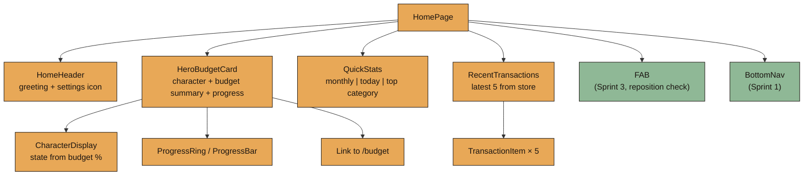
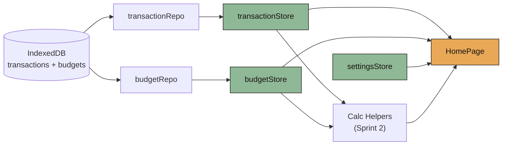
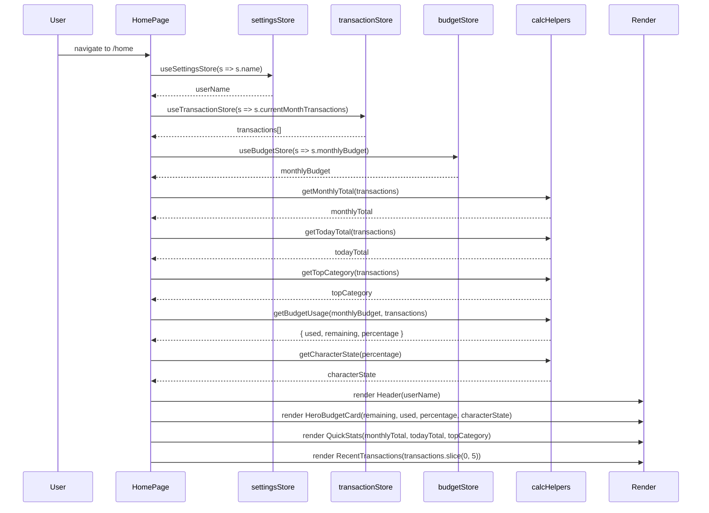
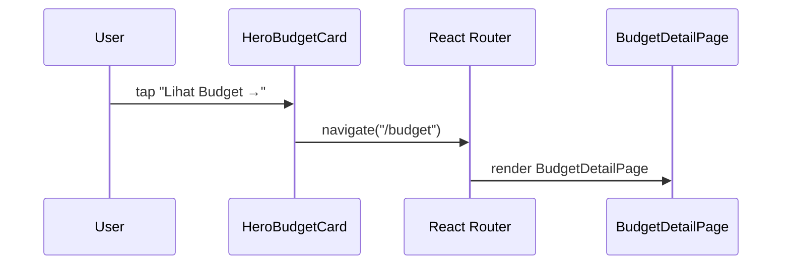
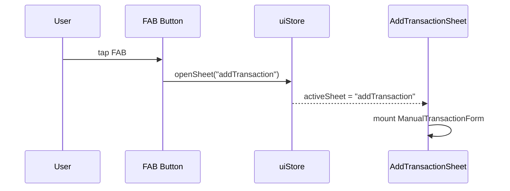

# Design Document: Sprint 4 — Home Dashboard + Budget Overview

## Overview

Sprint 4 finalizes the `HomePage` from its Sprint 1 placeholder into Luma's most important screen — the personal cozy finance dashboard. Per `BUILD_PLAN §11` and `PRD §9.4`, the Home must feel personal, not data-heavy. It surfaces a real-time finance summary drawn from `transactionStore` and `budgetStore`, wrapped in warm visual comfort.

The screen is composed of six primary sections: (1) **Header** with personalized greeting from `settingsStore.name`; (2) **HeroBudgetCard** showing character, remaining budget, total spent, progress ring/bar, and a "Lihat Budget →" shortcut linking to `/budget`; (3) **Character area** integrated into the hero card, reacting to budget state via `getCharacterState()`; (4) **QuickStats row** displaying monthly total, today total, and top category; (5) **RecentTransactions card** listing the latest 5 transactions with category icon, detail, account chip, mood badge, and nominal formatted via `formatIDR`; (6) **FAB** (already wired from Sprint 3) positioned above the BottomNav without overlap.

No budget editing happens on Home — only overview and navigation. The character state is driven by `budgetPercentageUsed` following `TECHNICAL_ARCHITECTURE §20`: `<50%` → happy, `<75%` → chill, `<100%` → worried, `≥100%` → panic. All currency amounts use `formatIDR` from Sprint 3's `src/lib/format.ts`. Layout follows `DESIGN_SYSTEM §10` (Hero Budget Card spec) with cozy dark theme tokens via CSS variables.

---

## Architecture

### Page Composition



### Data Flow



---

## Sequence Diagrams

### Home Page Mount & Data Hydration



### Budget Card → Budget Detail Navigation



### FAB → Add Transaction (Sprint 3 flow, positioning check)



---

## Components and Interfaces

### Component: HomePage

**Purpose**: The main dashboard page. Composes all Sprint 4 sections. Reads from three stores and passes derived data to children.

```typescript
// src/pages/HomePage.tsx
interface HomePageData {
  userName: string;
  monthlyTotal: number;
  todayTotal: number;
  topCategory: { category: CategoryType; total: number } | null;
  budgetUsage: {
    totalBudget: number;
    used: number;
    remaining: number;
    percentage: number;  // 0–1+ (can exceed 1 if overspent)
  };
  characterState: CharacterState;
  recentTransactions: Transaction[];
}
```

**Responsibilities**:
- Subscribe to `transactionStore`, `budgetStore`, `settingsStore`
- Derive calculations using Sprint 2 helpers
- Compose child components with derived props
- Handle empty states (no budget set, no transactions)

---

### Component: HomeHeader

**Purpose**: Top header with personalized greeting and settings navigation icon.

```typescript
interface HomeHeaderProps {
  userName: string;
}
```

**Behavior**:
- Displays time-based greeting: "Selamat pagi" / "Selamat siang" / "Selamat sore" / "Selamat malam" + userName
- Settings gear icon on the right, navigates to `/settings`
- Uses `text-primary` for greeting, `text-secondary` for the time/date line
- Height: 56px, padding inline 20px

**Greeting logic**:
- 05:00–10:59 → "Selamat pagi"
- 11:00–14:59 → "Selamat siang"
- 15:00–17:59 → "Selamat sore"
- 18:00–04:59 → "Selamat malam"

---

### Component: HeroBudgetCard

**Purpose**: The largest card on Home. Shows character, budget overview, progress visualization, and shortcut to Budget Detail.

```typescript
interface HeroBudgetCardProps {
  totalBudget: number;
  used: number;
  remaining: number;
  percentage: number;        // 0–1+ (clamped to 1 for visual ring)
  characterState: CharacterState;
  /** When no budget is set yet */
  hasBudget: boolean;
}
```

**Visual spec** (per `DESIGN_SYSTEM §10`):
- radius: 28–32px
- padding: 24px
- background: `bg-card` with optional decorative blob
- Character area: left/top section, size "large", may overlap card edge slightly
- Budget numbers: "Sisa" label + `formatIDR(remaining)` large (Fraunces, 36–44px)
- "Terpakai" label + `formatIDR(used)` secondary (DM Sans, 14px)
- Progress ring/bar: amber fill up to 75%, shifts to `danger-soft` above 100%
- Shortcut link: "Lihat Budget →" at bottom-right, navigates to `/budget`

**Empty state** (when `hasBudget === false`):
- Character shows "happy" state
- Copy: "Belum ada budget bulan ini."
- CTA: "Atur Budget →" links to `/budget`

---

### Component: CharacterDisplay

**Purpose**: Renders the active character asset based on budget-derived state.

```typescript
type CharacterState = "happy" | "chill" | "worried" | "panic";

interface CharacterDisplayProps {
  state: CharacterState;
  size: "small" | "medium" | "large";
  className?: string;
}
```

**Behavior**:
- Reads `settingsStore.activeCharacterId` to determine which character pack
- Looks up the `assetMap[state]` URL from character config
- Renders `` with appropriate sizing (large = 120–160px, medium = 80px, small = 48px)
- Graceful fallback if asset not found (renders emoji placeholder)
- Subtle entrance animation via Framer Motion (scale 0.9 → 1, opacity 0 → 1, spring)

---

### Component: ProgressRing

**Purpose**: Circular progress indicator for budget usage.

```typescript
interface ProgressRingProps {
  percentage: number;   // 0–1, clamped visually
  size?: number;        // diameter in px, default 64
  strokeWidth?: number; // default 6
  /** Color shifts based on percentage thresholds */
  colorMode?: "auto" | "accent" | "danger";
}
```

**Behavior**:
- SVG-based circular progress
- Color: `accent-primary` (amber) when percentage < 0.75, `warning-soft` at 0.75–0.99, `danger-soft` at ≥1.0
- Shows percentage text centered: "42%" (DM Sans, 14px, 700)
- Animate on mount from 0 to target via Framer Motion

---

### Component: QuickStats

**Purpose**: Horizontal row of three stat items below the hero card.

```typescript
interface QuickStatsProps {
  monthlyTotal: number;
  todayTotal: number;
  topCategory: { category: CategoryType; total: number } | null;
}
```

**Visual spec**:
- Three mini-cards in a row (flex, gap 8–12px)
- Each card: `bg-card-soft`, radius 16px, padding 12px
- Label (Caption size, text-muted): "Bulan ini" / "Hari ini" / "Top kategori"
- Value (Body size, text-primary, 700): `formatIDR(amount)` or category name
- When `topCategory` is null: show "—"

---

### Component: RecentTransactions

**Purpose**: Card listing the latest 5 transactions.

```typescript
interface RecentTransactionsProps {
  transactions: Transaction[];
  /** Max items to show */
  limit?: number;  // default 5
}
```

**Behavior**:
- Card with title "Transaksi Terakhir" (Section Title size)
- List of `TransactionItem` children
- Empty state: "Belum ada transaksi. Yuk mulai catat! ✨"
- No "see all" link needed (user uses bottom nav → Transaksi)

---

### Component: TransactionItem

**Purpose**: Single transaction row inside RecentTransactions.

```typescript
interface TransactionItemProps {
  transaction: Transaction;
}
```

**Visual spec** (per `DESIGN_SYSTEM §10 — Transaction Card`):
- Left: category icon (emoji or icon from category map)
- Middle: detail (Body, text-primary, single line truncate), account chip below (Micro Label, `bg-card-soft`, radius 8px)
- Right: nominal (`formatIDR`, Body 700, text-primary), mood badge below (if set)
- Row height: ~56–64px, vertical center aligned
- Divider: 1px `bg-card-soft` between items (no divider after last)

**Category icon map**:
- Food → 🍜
- Transport → 🚗
- Entertainment → 🎬
- Shopping → 🛍️
- Health → 💊
- Giving → 💝
- Saving → 🏦
- Other → 📝

---

## Data Models

Sprint 4 introduces no new IndexedDB stores or domain types. It uses Sprint 2's existing models:

- `Transaction` (src/types/transaction.ts)
- `MonthlyBudget` (src/types/budget.ts)
- `UserSettings` (src/types/settings.ts)
- `CharacterConfig` (src/types/character.ts)

New runtime-only types (not persisted):

```typescript
// src/features/budgets/types.ts (or inline in calc helpers)
export interface BudgetUsage {
  totalBudget: number;
  used: number;
  remaining: number;
  percentage: number;  // used / totalBudget, 0 if no budget
}

// src/features/transactions/types.ts
export interface TopCategoryResult {
  category: CategoryType;
  total: number;
}
```

---

## Algorithmic Pseudocode

### Main Processing: HomePage Data Derivation

```typescript
ALGORITHM deriveHomePageData(transactionStore, budgetStore, settingsStore)
INPUT:
  transactionStore.currentMonthTransactions: Transaction[]
  budgetStore.monthlyBudget: MonthlyBudget | null
  settingsStore: { name: string, activeCharacterId: string }
OUTPUT:
  HomePageData

BEGIN
  transactions ← transactionStore.currentMonthTransactions
  budget ← budgetStore.monthlyBudget

  // Derive stats
  monthlyTotal ← getMonthlyTotal(transactions)
  todayTotal ← getTodayTotal(transactions)
  topCategory ← getTopCategory(transactions)

  // Derive budget usage
  IF budget ≠ null THEN
    budgetUsage ← getBudgetUsage(budget, transactions)
  ELSE
    budgetUsage ← { totalBudget: 0, used: monthlyTotal, remaining: 0, percentage: 0 }
  END IF

  // Derive character state
  characterState ← getCharacterState(budgetUsage.percentage)

  // Recent transactions (latest 5 by createdAt descending)
  recentTransactions ← transactions
    .sort(byCreatedAtDesc)
    .slice(0, 5)

  RETURN {
    userName: settingsStore.name,
    monthlyTotal,
    todayTotal,
    topCategory,
    budgetUsage,
    characterState,
    recentTransactions,
  }
END
```

### Character State Resolver

```typescript
ALGORITHM getCharacterState(budgetPercentageUsed)
INPUT:  budgetPercentageUsed: number (0–∞)
OUTPUT: CharacterState

PRECONDITION:
  - budgetPercentageUsed ≥ 0
  - If no budget is set, caller passes 0

POSTCONDITION:
  - Returns exactly one of: "happy" | "chill" | "worried" | "panic"
  - Monotonically transitions as percentage increases

BEGIN
  IF budgetPercentageUsed < 0.5 THEN
    RETURN "happy"
  ELSE IF budgetPercentageUsed < 0.75 THEN
    RETURN "chill"
  ELSE IF budgetPercentageUsed < 1.0 THEN
    RETURN "worried"
  ELSE
    RETURN "panic"
  END IF
END
```

**Preconditions**:
- `budgetPercentageUsed` is a non-negative number
- Percentage is `used / totalBudget`; if no budget set, the caller defaults to 0 (returns "happy")

**Postconditions**:
- Exactly one state returned
- State transitions are monotonic: as spending increases, character never goes backward to a happier state

**Loop Invariants**: N/A (no loops)

### Greeting Resolver

```typescript
ALGORITHM getGreeting(hour)
INPUT:  hour: number (0–23)
OUTPUT: string

PRECONDITION:
  - hour is an integer in [0, 23]

POSTCONDITION:
  - Returns one of the four Indonesian time-based greetings
  - Every integer in [0,23] maps to exactly one greeting

BEGIN
  IF hour >= 5 AND hour <= 10 THEN
    RETURN "Selamat pagi"
  ELSE IF hour >= 11 AND hour <= 14 THEN
    RETURN "Selamat siang"
  ELSE IF hour >= 15 AND hour <= 17 THEN
    RETURN "Selamat sore"
  ELSE
    RETURN "Selamat malam"
  END IF
END
```

### Budget Usage Calculation

```typescript
ALGORITHM getBudgetUsage(monthlyBudget, transactions)
INPUT:
  monthlyBudget: MonthlyBudget
  transactions: Transaction[] (filtered to same month)
OUTPUT: BudgetUsage

PRECONDITION:
  - monthlyBudget.totalBudget > 0
  - all transactions have month === monthlyBudget.month

POSTCONDITION:
  - used = sum of all transaction nominals in the month
  - remaining = totalBudget - used (can be negative if overspent)
  - percentage = used / totalBudget (can exceed 1.0)
  - remaining + used = totalBudget (identity holds)

BEGIN
  used ← getMonthlyTotal(transactions)
  remaining ← monthlyBudget.totalBudget - used
  percentage ← used / monthlyBudget.totalBudget

  RETURN {
    totalBudget: monthlyBudget.totalBudget,
    used,
    remaining,
    percentage,
  }
END
```

**Loop Invariants** (inside `getMonthlyTotal`):
- Partial sum is non-negative (all nominals > 0)
- Partial sum ≤ total sum

### Top Category Calculation

```typescript
ALGORITHM getTopCategory(transactions)
INPUT:  transactions: Transaction[]
OUTPUT: TopCategoryResult | null

PRECONDITION:
  - transactions is an array (may be empty)
  - each transaction has category ∈ CategoryType and nominal > 0

POSTCONDITION:
  - If transactions is empty → returns null
  - Otherwise returns the category with the highest sum of nominals
  - If tie, returns the first category encountered alphabetically

BEGIN
  IF transactions.length = 0 THEN
    RETURN null
  END IF

  categoryTotals ← {}  // Map<CategoryType, number>

  FOR each tx IN transactions DO
    INVARIANT: categoryTotals contains running sums for all
               categories seen in previously-processed transactions
    categoryTotals[tx.category] ← (categoryTotals[tx.category] ?? 0) + tx.nominal
  END FOR

  ASSERT Object.values(categoryTotals).every(v => v > 0)

  topEntry ← entry with maximum value in categoryTotals
  RETURN { category: topEntry.key, total: topEntry.value }
END
```

### Today Total Calculation

```typescript
ALGORITHM getTodayTotal(transactions)
INPUT:  transactions: Transaction[]
OUTPUT: number

PRECONDITION:
  - transactions is an array (may be empty)
  - each transaction has date field in YYYY-MM-DD format

POSTCONDITION:
  - Returns sum of nominals where transaction.date === today()
  - Returns 0 if no transactions match today

BEGIN
  today ← currentDateYYYYMMDD()
  total ← 0

  FOR each tx IN transactions DO
    INVARIANT: total = sum of nominals for all previously-processed
               transactions with date === today
    IF tx.date = today THEN
      total ← total + tx.nominal
    END IF
  END FOR

  RETURN total
END
```

---

## Key Functions with Formal Specifications

### getCharacterState()

```typescript
// src/lib/character.ts
export function getCharacterState(budgetPercentageUsed: number): CharacterState
```

**Preconditions:**
- `budgetPercentageUsed` is a finite number ≥ 0
- If no budget is set, caller passes 0

**Postconditions:**
- Returns exactly one of `"happy" | "chill" | "worried" | "panic"`
- `percentage < 0.5` ⟹ `"happy"`
- `0.5 ≤ percentage < 0.75` ⟹ `"chill"`
- `0.75 ≤ percentage < 1.0` ⟹ `"worried"`
- `percentage ≥ 1.0` ⟹ `"panic"`

**Loop Invariants:** N/A

---

### getGreeting()

```typescript
// src/lib/greeting.ts
export function getGreeting(hour: number): string
```

**Preconditions:**
- `hour` is an integer in the range [0, 23]

**Postconditions:**
- Returns one of: "Selamat pagi", "Selamat siang", "Selamat sore", "Selamat malam"
- Function is pure and deterministic for same input
- All 24 values in [0,23] map to exactly one greeting (total function)

**Loop Invariants:** N/A

---

### getBudgetUsage()

```typescript
// src/lib/budget-calc.ts (or src/features/budgets/calc.ts)
export function getBudgetUsage(
  monthlyBudget: MonthlyBudget,
  transactions: Transaction[]
): BudgetUsage
```

**Preconditions:**
- `monthlyBudget.totalBudget > 0`
- `transactions` is an array (may be empty)
- All transactions belong to the same month as the budget

**Postconditions:**
- `result.used === sum(tx.nominal for tx in transactions)`
- `result.remaining === result.totalBudget - result.used`
- `result.percentage === result.used / result.totalBudget`
- Identity: `result.remaining + result.used === result.totalBudget`
- `result.percentage` can exceed 1.0 (overspent) or be 0 (no transactions)

**Loop Invariants:**
- Running sum accumulator is non-negative

---

### getMonthlyTotal()

```typescript
// src/lib/calc.ts (Sprint 2)
export function getMonthlyTotal(transactions: Transaction[]): number
```

**Preconditions:**
- `transactions` is an array (may be empty)
- Each `transaction.nominal > 0`

**Postconditions:**
- Returns sum of all `nominal` values
- Returns 0 for empty array
- Result ≥ 0

**Loop Invariants:**
- Partial sum ≥ 0 and ≤ final result at each iteration

---

### getTodayTotal()

```typescript
// src/lib/calc.ts (Sprint 2)
export function getTodayTotal(transactions: Transaction[]): number
```

**Preconditions:**
- `transactions` is an array (may be empty)
- Each `transaction.date` is a valid YYYY-MM-DD string

**Postconditions:**
- Returns sum of `nominal` for transactions where `date === today()`
- Returns 0 if none match today
- Result ≥ 0

**Loop Invariants:**
- Running sum includes only transactions with `date === today`

---

### getTopCategory()

```typescript
// src/lib/calc.ts (Sprint 2)
export function getTopCategory(transactions: Transaction[]): TopCategoryResult | null
```

**Preconditions:**
- `transactions` is an array (may be empty)
- Each transaction has a valid `CategoryType` and `nominal > 0`

**Postconditions:**
- Returns `null` if `transactions.length === 0`
- Otherwise returns `{ category, total }` where `total` is the maximum category sum
- For any other category C: `totalMap[C] ≤ result.total`

**Loop Invariants:**
- `categoryTotals` map always reflects correct partial sums

---

## Example Usage

```typescript
// HomePage.tsx — main hook composition
import { useTransactionStore } from "@/stores/transactionStore";
import { useBudgetStore } from "@/stores/budgetStore";
import { useSettingsStore } from "@/stores/settingsStore";
import { getMonthlyTotal, getTodayTotal, getTopCategory } from "@/lib/calc";
import { getBudgetUsage } from "@/lib/budget-calc";
import { getCharacterState } from "@/lib/character";
import { getGreeting } from "@/lib/greeting";
import { formatIDR } from "@/lib/format";

export function HomePage() {
  const userName = useSettingsStore((s) => s.name);
  const transactions = useTransactionStore((s) => s.currentMonthTransactions);
  const monthlyBudget = useBudgetStore((s) => s.monthlyBudget);

  const monthlyTotal = getMonthlyTotal(transactions);
  const todayTotal = getTodayTotal(transactions);
  const topCategory = getTopCategory(transactions);

  const budgetUsage = monthlyBudget
    ? getBudgetUsage(monthlyBudget, transactions)
    : { totalBudget: 0, used: monthlyTotal, remaining: 0, percentage: 0 };

  const characterState = getCharacterState(budgetUsage.percentage);
  const greeting = getGreeting(new Date().getHours());

  const recentTransactions = [...transactions]
    .sort((a, b) => b.createdAt.localeCompare(a.createdAt))
    .slice(0, 5);

  return (
    <PageWrapper>
      <HomeHeader userName={userName} greeting={greeting} />
      <HeroBudgetCard
        totalBudget={budgetUsage.totalBudget}
        used={budgetUsage.used}
        remaining={budgetUsage.remaining}
        percentage={budgetUsage.percentage}
        characterState={characterState}
        hasBudget={monthlyBudget !== null}
      />
      <QuickStats
        monthlyTotal={monthlyTotal}
        todayTotal={todayTotal}
        topCategory={topCategory}
      />
      <RecentTransactions transactions={recentTransactions} />
      {/* FAB already wired from Sprint 3 */}
    </PageWrapper>
  );
}
```

```typescript
// HeroBudgetCard usage
<HeroBudgetCard
  totalBudget={2000000}
  used={850000}
  remaining={1150000}
  percentage={0.425}
  characterState="happy"
  hasBudget={true}
/>
// Renders: character happy, "Sisa Rp1.150.000", progress ring at 42%, "Lihat Budget →"

// QuickStats usage
<QuickStats
  monthlyTotal={850000}
  todayTotal={45000}
  topCategory={{ category: "Food", total: 320000 }}
/>
// Renders three mini cards: "Rp850.000" | "Rp45.000" | "🍜 Makan"

// Empty state when no budget
<HeroBudgetCard
  totalBudget={0}
  used={0}
  remaining={0}
  percentage={0}
  characterState="happy"
  hasBudget={false}
/>
// Renders: character happy, "Belum ada budget bulan ini.", "Atur Budget →"
```

---

## Correctness Properties

*A property is a characteristic or behavior that should hold true across all valid executions of a system — essentially, a formal statement about what the system should do. Properties serve as the bridge between human-readable specifications and machine-verifiable correctness guarantees.*

### Property 1: Character state monotonicity

*For all* pairs `(p1, p2)` where `p1 < p2` and both are in `[0, ∞)`, `stateIndex(getCharacterState(p1)) ≤ stateIndex(getCharacterState(p2))` where stateIndex maps happy→0, chill→1, worried→2, panic→3.

**Validates: Requirements 5.1, 5.2, 5.3, 5.4, 5.5**

### Property 2: Budget identity

*For all* valid `(budget, transactions)` pairs where `budget.totalBudget > 0`: `getBudgetUsage(budget, transactions).remaining + getBudgetUsage(budget, transactions).used === budget.totalBudget`.

**Validates: Requirements 9.1, 9.2, 9.4**

### Property 3: Monthly total non-negativity

*For all* `transactions: Transaction[]` (including empty arrays): `getMonthlyTotal(transactions) ≥ 0`.

**Validates: Requirement 9.5**

### Property 4: Today total ≤ Monthly total

*For all* transaction arrays representing the current month: `getTodayTotal(transactions) ≤ getMonthlyTotal(transactions)`.

**Validates: Requirement 7.5**

### Property 5: Top category dominance

*For all* non-empty `transactions` arrays: if `getTopCategory(transactions) = { category: C, total: T }`, then for every other category `C'` in the transactions, `getCategoryTotal(transactions, C') ≤ T`.

**Validates: Requirement 7.6**

### Property 6: Greeting totality

*For all* integers `h ∈ [0, 23]`: `getGreeting(h)` returns a non-empty string that is one of the four valid greetings — the function is total with no undefined/null paths.

**Validates: Requirements 2.1, 2.2, 2.3, 2.4, 2.5**

### Property 7: Recent transactions limit

*For all* transaction arrays of any length: after sorting and slicing, the result has length `≤ 5`.

**Validates: Requirement 8.1**

### Property 8: formatIDR round-trip

*For all* non-negative integers `n ∈ [0, 999_999_999_999]`: `parseIDR(formatIDR(n)) === n` — serialization then deserialization produces the original value.

**Validates: Requirement 10.2**

### Property 9: Character state completeness

*For all* `p ≥ 0`: `getCharacterState(p) ∈ {"happy", "chill", "worried", "panic"}` — every non-negative input produces exactly one valid state with no undefined return path.

**Validates: Requirements 5.1, 5.2, 5.3, 5.4**

### Property 10: Progress ring visual clamping

*For all* `percentage` values (including those exceeding 1.0): the rendered visual fill equals `min(percentage, 1.0)` — the ring never exceeds a full circle even when overspent.

**Validates: Requirement 6.4**

---

## Error Handling

### Error Scenario 1: No Budget Set

**Condition**: User hasn't created a `MonthlyBudget` for the current month
**Response**: HeroBudgetCard shows empty state with friendly copy and "Atur Budget →" CTA; character shows "happy" state; QuickStats still shows monthly/today totals (these don't depend on budget)
**Recovery**: User taps CTA → navigates to `/budget` → sets budget → returns to Home with full budget card

### Error Scenario 2: No Transactions This Month

**Condition**: `transactionStore.currentMonthTransactions` is empty
**Response**: QuickStats show "Rp0" for amounts, "—" for top category; RecentTransactions shows empty state: "Belum ada transaksi. Yuk mulai catat! ✨"; Budget card still shows full remaining budget
**Recovery**: User taps FAB → adds transaction → Home auto-updates from store subscription

### Error Scenario 3: Store Hydration Failure

**Condition**: IndexedDB read fails during store initialization (rare: corrupt data, quota exceeded)
**Response**: Stores expose `error` state; HomePage shows soft error card: "Gagal baca data, coba refresh ya."; Layout still renders with zeroed values rather than crashing
**Recovery**: User refreshes page; if persistent, Settings → Data → Reset option

### Error Scenario 4: Character Asset Not Found

**Condition**: Active character config references an asset URL that fails to load
**Response**: CharacterDisplay renders fallback emoji (🦦 for otter, 🐱 for cat, etc.) at same size; no visual break in layout
**Recovery**: Automatic — next render attempt may succeed; or user changes character in Settings

### Error Scenario 5: FAB/BottomNav Overlap

**Condition**: FAB position conflicts with BottomNav on smaller viewports
**Response**: FAB uses `bottom: calc(env(safe-area-inset-bottom) + 72px)` to sit above BottomNav with minimum 12px clearance
**Recovery**: CSS-driven — no user action needed

---

## Testing Strategy

### Unit Testing Approach

Key pure functions to unit test:
- `getCharacterState()` — all threshold boundaries (0, 0.49, 0.5, 0.74, 0.75, 0.99, 1.0, 1.5)
- `getGreeting()` — all 24 hours, especially boundaries (4, 5, 10, 11, 14, 15, 17, 18)
- `getBudgetUsage()` — normal, overspent, zero transactions cases
- `getMonthlyTotal()` — empty array, single item, multiple items
- `getTodayTotal()` — no match, partial match, all match
- `getTopCategory()` — empty, single category, tie-breaking
- `formatIDR()` — already covered in Sprint 3

### Property-Based Testing Approach

**Property Test Library**: fast-check

Properties to test:
1. `getCharacterState` monotonicity: for random pairs (p1, p2) where p1 < p2, state index doesn't decrease
2. `getBudgetUsage` identity: for random budgets and transaction lists, `remaining + used === totalBudget`
3. `getGreeting` totality: for random hour in [0,23], result is always a valid greeting string
4. `getTopCategory` dominance: for random non-empty transaction arrays, returned category total ≥ all others
5. `getTodayTotal` ≤ `getMonthlyTotal`: for any transaction array, today's total never exceeds monthly

### Integration Testing Approach

- Mount `HomePage` with mocked stores (various states) and verify all sections render
- Test store subscription reactivity: add transaction → verify QuickStats and RecentTransactions update
- Test navigation: tap "Lihat Budget →" → verify router navigates to `/budget`
- Test FAB positioning: render on 360px viewport, verify no overlap with BottomNav
- Test empty states: render with no transactions and no budget, verify friendly messages

---

## Performance Considerations

- **Memoize calculations**: `getMonthlyTotal`, `getTodayTotal`, `getTopCategory` results should be memoized via Zustand selectors or `useMemo` since they only change when transactions change
- **Limit re-renders**: Use granular Zustand selectors (subscribe only to needed slices)
- **Character image**: Lazy-load character assets; show skeleton/placeholder during load
- **ProgressRing animation**: Use CSS/SVG animation (not JS-driven frame loop); respect `prefers-reduced-motion`
- **Recent transactions**: Only slice last 5 — no virtualization needed for this small list
- **Sort optimization**: Sort transactions once at store level (not on every render)

---

## Security Considerations

- No sensitive data leaves the device in Sprint 4 (all local computation)
- `formatIDR` output is display-only and cannot be used for injection (rendered as text nodes, never `dangerouslySetInnerHTML`)
- Navigation links use React Router `<Link>` — no raw `window.location` manipulation
- Character asset URLs are from local config, not user-generated URLs (no XSS vector)

---

## Dependencies

Sprint 4 builds on:
- **Sprint 1**: `PageWrapper`, `BottomNav`, `Card`, `Button`, `BottomSheet`, `Toast`
- **Sprint 2**: `transactionStore`, `budgetStore`, `settingsStore`, repositories, TypeScript models, calc helpers (`getMonthlyTotal`, `getTodayTotal`, `getTopCategory`, `getCategoryTotals`)
- **Sprint 3**: `FAB` wiring, `AddTransactionSheet`, `formatIDR`/`parseIDR`, `uiStore`

New libraries: None. Sprint 4 uses only what's already installed (React, Zustand, Framer Motion, Tailwind, React Router).

### Folder Layout — New Files

```txt
src/
├── pages/
│   └── HomePage.tsx                     ← MODIFIED: full implementation
├── components/
│   ├── cards/
│   │   ├── HeroBudgetCard.tsx           ← NEW
│   │   ├── QuickStats.tsx               ← NEW
│   │   ├── RecentTransactions.tsx       ← NEW
│   │   └── TransactionItem.tsx          ← NEW
│   ├── character/
│   │   └── CharacterDisplay.tsx         ← NEW
│   ├── layout/
│   │   └── HomeHeader.tsx               ← NEW
│   └── ui/
│       └── ProgressRing.tsx             ← NEW
├── lib/
│   ├── character.ts                     ← NEW: getCharacterState()
│   ├── greeting.ts                      ← NEW: getGreeting()
│   └── budget-calc.ts                   ← NEW: getBudgetUsage()
└── features/
    └── budgets/
        └── types.ts                     ← NEW: BudgetUsage, TopCategoryResult
```
