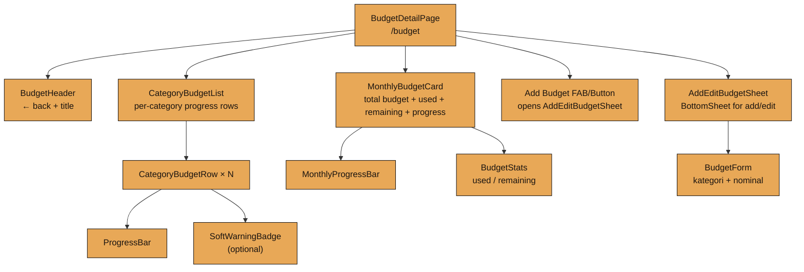
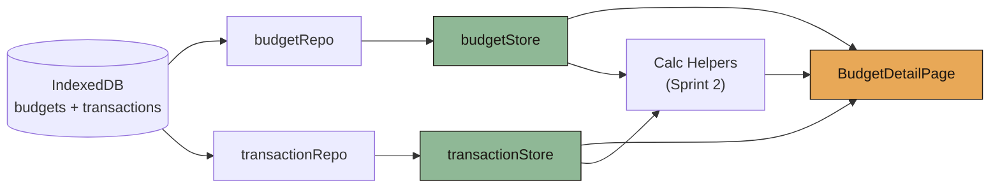
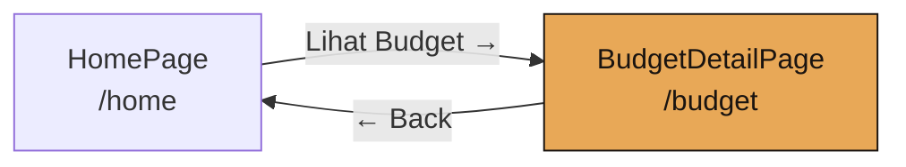
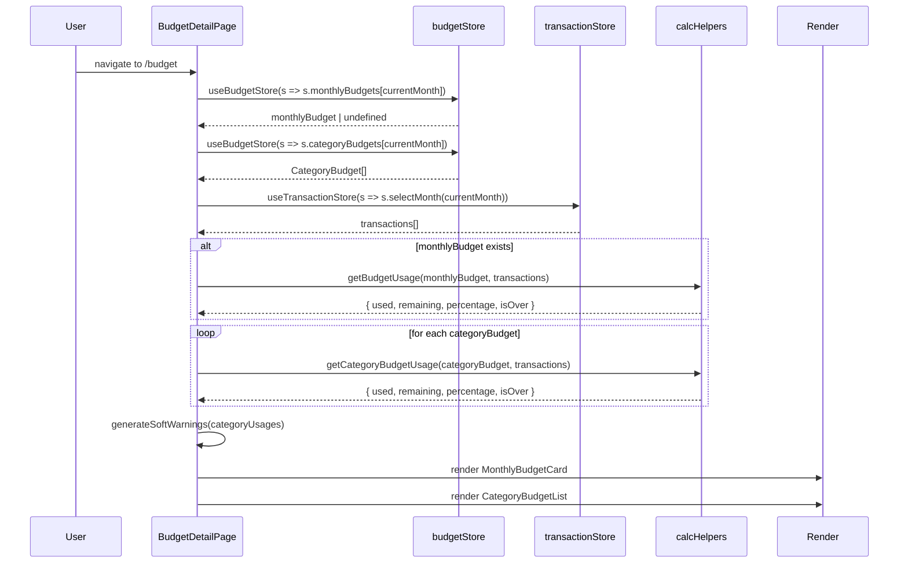
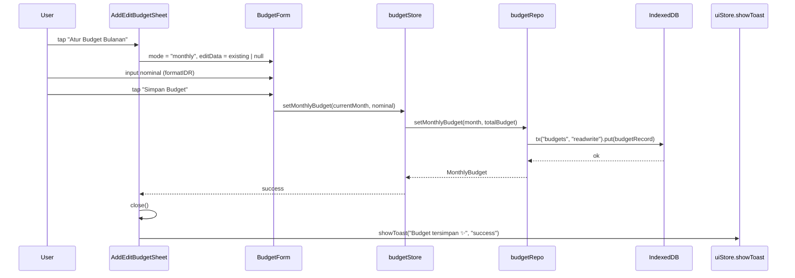
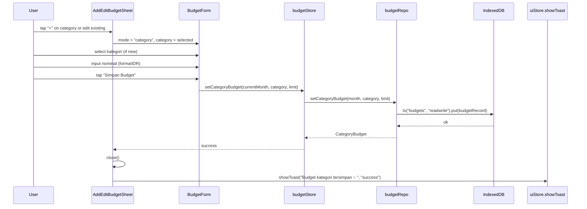
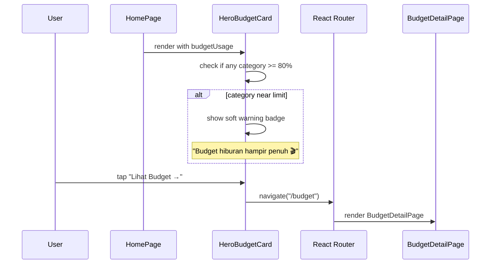

# Design Document: Sprint 5 — Budget Detail + Category Budgets

## Overview

Sprint 5 delivers the full Budget Detail experience per `BUILD_PLAN §12`. The goal: **budgeting bisa dipakai tanpa terasa berat**. Budget is accessed exclusively from Home → HeroBudgetCard "Lihat Budget →" — it is NOT in the bottom navigation.

The sprint creates `BudgetDetailPage` (route `/budget`) containing three primary sections: (1) **MonthlyBudgetCard** displaying total monthly budget, total used, remaining amount, and a progress bar; (2) **CategoryBudgetList** rendering per-category budget rows with individual progress indicators; (3) **AddEditBudgetSheet** — a BottomSheet for creating or editing both monthly and category budgets.

Budget data is managed entirely through Sprint 2's existing `budgetRepo` and `budgetStore` — no new IndexedDB stores are created. Calculation of used/remaining amounts leverages Sprint 2's `getBudgetUsage` and `getCategoryBudgetUsage` helpers, fed by `transactionStore` data for the current month. Soft budget warnings follow `DESIGN_SYSTEM §18` ("Budget hiburan hampir penuh 🎬") — no aggressive copy. Budget resets automatically per month: a new month simply starts with no spending against existing budget templates.

---

## Architecture

### Page Composition



### Data Flow



### Navigation Context



---

## Sequence Diagrams

### BudgetDetailPage Mount & Data Hydration



### Set Monthly Budget Flow



### Set Category Budget Flow



### Home → Budget Navigation with Soft Warning



---

## Components and Interfaces

### Component: BudgetDetailPage

**Purpose**: The main budget management page. Composes MonthlyBudgetCard, CategoryBudgetList, and manages AddEditBudgetSheet state.

```typescript
// src/pages/BudgetDetailPage.tsx
interface BudgetPageData {
  currentMonth: string;                    // YYYY-MM
  monthlyBudget: MonthlyBudget | undefined;
  monthlyUsage: BudgetUsage | null;
  categoryBudgets: CategoryBudget[];
  categoryUsages: CategoryBudgetUsageItem[];
  softWarnings: SoftWarning[];
}

interface CategoryBudgetUsageItem {
  budget: CategoryBudget;
  usage: CategoryBudgetUsage;
}

interface SoftWarning {
  category: CategoryType;
  message: string;
  percentage: number;
}
```

**Responsibilities**:
- Subscribe to `budgetStore` and `transactionStore` for current month
- Derive budget usage calculations via Sprint 2 helpers
- Generate soft warnings for categories at ≥80% usage
- Manage AddEditBudgetSheet open/close state
- Handle back navigation to Home
- Handle empty state when no budget is set

---

### Component: BudgetHeader

**Purpose**: Top header with back arrow and page title.

```typescript
interface BudgetHeaderProps {
  onBack: () => void;
}
```

**Behavior**:
- Left: back arrow icon, navigates to `/home`
- Center/Left: "Budget Bulan Ini" title (Section Title size)
- No right action needed
- Height: 56px, padding inline 20px

---

### Component: MonthlyBudgetCard

**Purpose**: Hero card showing total monthly budget overview with progress visualization.

```typescript
interface MonthlyBudgetCardProps {
  totalBudget: number;
  used: number;
  remaining: number;
  percentage: number;        // 0–1+ (can exceed 1 if overspent)
  hasBudget: boolean;
  onEdit: () => void;
}
```

**Visual spec** (per `DESIGN_SYSTEM §10`):
- radius: 24px
- padding: 20px
- background: `bg-card`
- "Budget Bulanan" label (Caption, text-muted)
- Total budget: `formatIDR(totalBudget)` (Hero Number, Fraunces, 36px, text-primary)
- Progress bar: full width, height 8px, radius 4px
  - Fill color: `accent-primary` when < 75%, `warning-soft` at 75–99%, `danger-soft` at ≥100%
  - Background: `bg-card-soft`
- Stats row below progress bar:
  - "Terpakai" + `formatIDR(used)` (Body, text-secondary)
  - "Sisa" + `formatIDR(remaining)` (Body, text-primary, 700)
- Edit icon button top-right (pencil icon, taps opens AddEditBudgetSheet in monthly mode)

**Empty state** (when `hasBudget === false`):
- Copy: "Belum ada budget bulan ini."
- CTA: "Atur Budget Bulanan →" (triggers AddEditBudgetSheet)
- Softer card styling (dashed border optional)

---

### Component: CategoryBudgetList

**Purpose**: Vertical list of per-category budget rows with individual progress.

```typescript
interface CategoryBudgetListProps {
  items: CategoryBudgetUsageItem[];
  warnings: SoftWarning[];
  onEditCategory: (category: CategoryType) => void;
  onAddCategory: () => void;
}
```

**Behavior**:
- Section title: "Budget per Kategori" (Section Title size)
- List of `CategoryBudgetRow` for each category budget
- Add button at bottom: "+ Tambah Budget Kategori" (secondary style)
- Empty state: "Belum ada budget kategori. Yuk atur supaya lebih terkontrol 💫"

---

### Component: CategoryBudgetRow

**Purpose**: Single category budget row showing category name, progress bar, and amounts.

```typescript
interface CategoryBudgetRowProps {
  category: CategoryType;
  limit: number;
  used: number;
  remaining: number;
  percentage: number;
  isOver: boolean;
  warning?: SoftWarning;
  onEdit: () => void;
}
```

**Visual spec**:
- Left: category emoji icon (same map as Sprint 4 TransactionItem)
- Middle column:
  - Category name (Body, text-primary, 600)
  - Progress bar below (height 6px, radius 3px)
  - `formatIDR(used)` + " / " + `formatIDR(limit)` (Caption, text-secondary)
- Right: percentage text (Body, 700)
  - Color: `text-primary` when < 75%, `warning-soft` at 75–99%, `danger-soft` at ≥100%
- Tap entire row → onEdit (opens sheet for that category)
- If warning exists: soft warning badge below the row

**Category icon map** (consistent with Sprint 4):
- Food → 🍜
- Transport → 🚗
- Entertainment → 🎬
- Shopping → 🛍️
- Health → 💊
- Other → 📝

---

### Component: SoftWarningBadge

**Purpose**: Displays soft, non-aggressive budget warning copy.

```typescript
interface SoftWarningBadgeProps {
  message: string;
  // e.g. "Budget hiburan hampir penuh 🎬"
}
```

**Visual spec**:
- Background: `bg-card-soft` with slight warm tint
- radius: 12px
- padding: 8px 12px
- Text: Caption size, `text-secondary`
- Emoji at end of message
- No exclamation marks, no aggressive colors
- Appears only when category usage ≥ 80%

---

### Component: AddEditBudgetSheet

**Purpose**: BottomSheet for creating or editing monthly/category budgets.

```typescript
type BudgetSheetMode = "monthly" | "category";

interface AddEditBudgetSheetProps {
  isOpen: boolean;
  mode: BudgetSheetMode;
  editData?: {
    category?: CategoryType;
    currentLimit?: number;
  };
  onClose: () => void;
  onSave: (data: BudgetFormData) => Promise<void>;
}

interface BudgetFormData {
  mode: BudgetSheetMode;
  category?: CategoryType;      // required when mode = "category"
  nominal: number;              // > 0
}
```

**Visual spec** (per `DESIGN_SYSTEM §13`):
- max-height: 90vh
- radius top: 28px
- padding: 20px
- Handle bar at top
- Title: "Atur Budget Bulanan" or "Atur Budget Kategori" (Card Title, 700)
- Form fields (see BudgetForm below)
- Primary CTA: "Simpan Budget" (primary button, full width)

**Behavior**:
- When mode = "monthly": hide kategori field, show only nominal
- When mode = "category": show kategori selector + nominal
- When editing: pre-fill nominal (and category if applicable)
- Nominal input uses `formatIDR` live formatting
- Validates nominal > 0 before enabling save
- On save success: close sheet + show success toast
- On save error: show soft error toast, keep sheet open

---

### Component: BudgetForm

**Purpose**: Form content inside AddEditBudgetSheet.

```typescript
interface BudgetFormProps {
  mode: BudgetSheetMode;
  initialCategory?: CategoryType;
  initialNominal?: number;
  onSubmit: (data: BudgetFormData) => Promise<void>;
  isSubmitting: boolean;
}
```

**Fields**:
- **Kategori** (only when mode = "category"):
  - Dropdown/selector with CategoryType options
  - Uses category emoji + label (e.g., "🍜 Makan", "🚗 Transport")
  - Disabled when editing existing category budget
- **Nominal Budget**:
  - formatIDR input (live formatting as user types)
  - Placeholder: "Rp0"
  - Large tap target (52–56px height, 16px radius)
  - Label: "Nominal Budget"

**Category labels (Indonesian)**:
- Food → "Makan"
- Transport → "Transport"
- Entertainment → "Hiburan"
- Shopping → "Belanja"
- Health → "Kesehatan"
- Other → "Lainnya"

---

### Component: BudgetProgressBar

**Purpose**: Reusable horizontal progress bar for budget visualization.

```typescript
interface BudgetProgressBarProps {
  percentage: number;       // 0–1+, clamped visually to 1
  height?: number;          // default 8
  colorMode?: "auto" | "accent" | "danger";
  showLabel?: boolean;      // show percentage text on right
}
```

**Behavior**:
- SVG or div-based horizontal bar
- Fill: `accent-primary` when < 0.75, `warning-soft` at 0.75–0.99, `danger-soft` at ≥1.0
- Visual fill clamped to 100% (bar never overflows even when overspent)
- Animate fill on mount from 0 to target (Framer Motion, 300ms ease-out)
- Background track: `bg-card-soft`

---

## Data Models

Sprint 5 introduces **no new IndexedDB stores or domain types**. It uses Sprint 2's existing models:

- `BudgetRecord` (src/types/budget.ts) — unified model with `kind` discriminator
- `MonthlyBudget` (src/types/budget.ts) — view type
- `CategoryBudget` (src/types/budget.ts) — view type
- `Transaction` (src/types/transaction.ts) — for usage calculation

New runtime-only types (not persisted):

```typescript
// src/features/budgets/types.ts
export interface BudgetUsage {
  totalBudget: number;
  used: number;
  remaining: number;
  percentage: number;  // used / totalBudget (can exceed 1.0)
  isOver: boolean;
}

export interface CategoryBudgetUsage {
  used: number;
  remaining: number;
  percentage: number;  // used / limit (can exceed 1.0)
  isOver: boolean;
}

export interface CategoryBudgetUsageItem {
  budget: CategoryBudget;
  usage: CategoryBudgetUsage;
}

export interface SoftWarning {
  category: CategoryType;
  message: string;
  percentage: number;
}
```

**Budget storage model** (from Sprint 2, repeated for clarity):

```typescript
// budgets store uses kind discriminator
// kind = "monthly" → category = "__total__"
// kind = "category" → category = actual CategoryType
// Compound unique index [month+category] prevents duplicates
```

---

## Algorithmic Pseudocode

### Main Processing: BudgetDetailPage Data Derivation

```typescript
ALGORITHM deriveBudgetPageData(budgetStore, transactionStore, currentMonth)
INPUT:
  budgetStore: { monthlyBudgets, categoryBudgets }
  transactionStore: { selectMonth }
  currentMonth: string (YYYY-MM)
OUTPUT:
  BudgetPageData

PRECONDITION:
  - currentMonth matches /^\d{4}-(0[1-9]|1[0-2])$/
  - budgetStore and transactionStore are hydrated for currentMonth

POSTCONDITION:
  - monthlyUsage reflects actual transaction sums against monthly budget
  - categoryUsages[i].usage reflects transactions filtered by category
  - softWarnings contains entries only for categories with percentage >= 0.80
  - All monetary values use the same month scope

BEGIN
  transactions ← transactionStore.selectMonth(currentMonth)
  monthlyBudget ← budgetStore.monthlyBudgets[currentMonth]
  categoryBudgets ← budgetStore.categoryBudgets[currentMonth] ?? []

  // Monthly usage
  IF monthlyBudget ≠ undefined THEN
    monthlyUsage ← getBudgetUsage(monthlyBudget, transactions)
  ELSE
    monthlyUsage ← null
  END IF

  // Category usages
  categoryUsages ← []
  FOR each cb IN categoryBudgets DO
    INVARIANT: categoryUsages.length = number of processed budgets
    usage ← getCategoryBudgetUsage(cb, transactions)
    categoryUsages.push({ budget: cb, usage })
  END FOR

  // Soft warnings
  softWarnings ← generateSoftWarnings(categoryUsages)

  RETURN {
    currentMonth,
    monthlyBudget,
    monthlyUsage,
    categoryBudgets,
    categoryUsages,
    softWarnings,
  }
END
```

### Soft Warning Generation

```typescript
ALGORITHM generateSoftWarnings(categoryUsages)
INPUT:  categoryUsages: CategoryBudgetUsageItem[]
OUTPUT: SoftWarning[]

PRECONDITION:
  - Each item has valid usage.percentage >= 0

POSTCONDITION:
  - Result contains entries only for items where percentage >= 0.80
  - Each warning has a soft Indonesian message with category-appropriate emoji
  - No aggressive copy (per DESIGN_SYSTEM §18)
  - Result length <= categoryUsages.length

BEGIN
  warnings ← []

  FOR each item IN categoryUsages DO
    INVARIANT: warnings contains only items with percentage >= 0.80
    IF item.usage.percentage >= 0.80 THEN
      emoji ← getCategoryEmoji(item.budget.category)
      label ← getCategoryLabel(item.budget.category)

      IF item.usage.percentage >= 1.0 THEN
        message ← "Budget " + label + " sudah penuh " + emoji
      ELSE
        message ← "Budget " + label + " hampir penuh " + emoji
      END IF

      warnings.push({
        category: item.budget.category,
        message,
        percentage: item.usage.percentage,
      })
    END IF
  END FOR

  RETURN warnings
END
```

### Budget Form Validation

```typescript
ALGORITHM validateBudgetForm(formData)
INPUT:  formData: { mode, category?, nominal }
OUTPUT: { valid: boolean, errors: string[] }

PRECONDITION:
  - formData is provided (not null)

POSTCONDITION:
  - valid = true iff all validation rules pass
  - errors contains soft Indonesian messages for each violation
  - No aggressive copy

BEGIN
  errors ← []

  IF formData.nominal ≤ 0 OR NOT isFinite(formData.nominal) THEN
    errors.push("Nominalnya belum diisi nih.")
  END IF

  IF formData.mode = "category" AND formData.category = undefined THEN
    errors.push("Pilih kategori dulu ya.")
  END IF

  IF formData.mode = "category" AND formData.category ≠ undefined THEN
    IF formData.category NOT IN CategoryType THEN
      errors.push("Kategori nggak valid.")
    END IF
  END IF

  RETURN { valid: errors.length = 0, errors }
END
```

### Monthly Budget Auto-Reset Logic

```typescript
ALGORITHM getEffectiveBudget(budgetStore, currentMonth)
INPUT:  budgetStore, currentMonth: string (YYYY-MM)
OUTPUT: { monthlyBudget, categoryBudgets } for currentMonth

PRECONDITION:
  - currentMonth is valid YYYY-MM

POSTCONDITION:
  - Returns budget data specific to currentMonth
  - New month returns undefined/empty if no budget set for that month
  - Previous month budgets do NOT carry over automatically
  - User must explicitly set budget for new month (or use template in future)

NOTE:
  Budget "reset" is implicit — each month is independent.
  budgetStore.loadMonth(currentMonth) queries only records where
  BudgetRecord.month === currentMonth. A new month has zero records
  until user creates them via AddEditBudgetSheet.

BEGIN
  monthlyBudget ← budgetStore.monthlyBudgets[currentMonth]
  categoryBudgets ← budgetStore.categoryBudgets[currentMonth] ?? []
  RETURN { monthlyBudget, categoryBudgets }
END
```

### Home Soft Warning for HeroBudgetCard

```typescript
ALGORITHM getHomeBudgetWarning(categoryUsages)
INPUT:  categoryUsages: CategoryBudgetUsageItem[]
OUTPUT: string | null

PRECONDITION:
  - categoryUsages may be empty

POSTCONDITION:
  - Returns the warning message for the category closest to/over limit
  - Returns null if no category is at >= 80%
  - Only one warning shown on Home (the most critical one)

BEGIN
  IF categoryUsages.length = 0 THEN RETURN null END IF

  // Find category with highest percentage that is >= 80%
  critical ← null
  FOR each item IN categoryUsages DO
    IF item.usage.percentage >= 0.80 THEN
      IF critical = null OR item.usage.percentage > critical.usage.percentage THEN
        critical ← item
      END IF
    END IF
  END FOR

  IF critical = null THEN RETURN null END IF

  emoji ← getCategoryEmoji(critical.budget.category)
  label ← getCategoryLabel(critical.budget.category)

  IF critical.usage.percentage >= 1.0 THEN
    RETURN "Budget " + label + " sudah penuh " + emoji
  ELSE
    RETURN "Budget " + label + " hampir penuh " + emoji
  END IF
END
```

---

## Key Functions with Formal Specifications

### getBudgetUsage()

```typescript
// src/lib/calc/budget.ts (Sprint 2, used by Sprint 5)
export function getBudgetUsage(
  monthlyBudget: MonthlyBudget,
  transactions: Transaction[]
): BudgetUsage
```

**Preconditions:**
- `monthlyBudget.totalBudget > 0`
- `transactions` is an array (may be empty)
- All transactions belong to the same month as the budget (caller filters)

**Postconditions:**
- `result.used === sum(tx.nominal for tx in transactions)`
- `result.remaining === result.totalBudget - result.used` (may be negative)
- `result.percentage === result.used / result.totalBudget` (can exceed 1.0)
- `result.isOver === (result.used > result.totalBudget)`
- Identity: `result.remaining + result.used === result.totalBudget`

**Loop Invariants:**
- Running sum accumulator is non-negative (all nominals > 0)

---

### getCategoryBudgetUsage()

```typescript
// src/lib/calc/budget.ts (Sprint 2, used by Sprint 5)
export function getCategoryBudgetUsage(
  categoryBudget: CategoryBudget,
  transactions: Transaction[]
): CategoryBudgetUsage
```

**Preconditions:**
- `categoryBudget.limit > 0`
- `transactions` is an array (may be empty)
- Transactions may contain mixed categories (function filters internally)

**Postconditions:**
- `result.used === sum(tx.nominal for tx in transactions where tx.category === categoryBudget.category AND tx.month === categoryBudget.month)`
- `result.remaining === categoryBudget.limit - result.used` (may be negative)
- `result.percentage === result.used / categoryBudget.limit` (can exceed 1.0)
- `result.isOver === (result.used > categoryBudget.limit)`

**Loop Invariants:**
- Running sum only includes transactions matching both category AND month

---

### generateSoftWarnings()

```typescript
// src/features/budgets/warnings.ts
export function generateSoftWarnings(
  categoryUsages: CategoryBudgetUsageItem[]
): SoftWarning[]
```

**Preconditions:**
- `categoryUsages` is an array (may be empty)
- Each item has valid `usage.percentage >= 0`

**Postconditions:**
- Result contains only items where `percentage >= 0.80`
- Each warning message is soft Indonesian copy (no aggressive tone)
- Result is sorted by percentage descending (most critical first)
- `result.length <= categoryUsages.length`

**Loop Invariants:**
- All processed items either added to warnings (if >= 0.80) or skipped

---

### getHomeBudgetWarning()

```typescript
// src/features/budgets/warnings.ts
export function getHomeBudgetWarning(
  categoryUsages: CategoryBudgetUsageItem[]
): string | null
```

**Preconditions:**
- `categoryUsages` is an array (may be empty)

**Postconditions:**
- Returns `null` if no category has `percentage >= 0.80`
- Returns soft warning string for the most critical category (highest percentage)
- Message uses Indonesian copy with category emoji
- Only ONE warning returned (the most urgent)

**Loop Invariants:**
- `critical` always holds the item with highest percentage seen so far (or null)

---

### formatIDR()

```typescript
// src/lib/format.ts (Sprint 3, reused)
export function formatIDR(amount: number): string
```

**Preconditions:**
- `amount` is a finite number >= 0

**Postconditions:**
- Returns string in format "Rp{formatted}" with dot separators
- e.g., `formatIDR(1500000)` → `"Rp1.500.000"`
- `formatIDR(0)` → `"Rp0"`

---

### parseIDRInput()

```typescript
// src/lib/format.ts (new helper for live input formatting)
export function parseIDRInput(raw: string): number
```

**Preconditions:**
- `raw` is a string (may contain "Rp", dots, spaces)

**Postconditions:**
- Strips all non-numeric characters
- Returns parsed integer value
- Returns 0 if string contains no digits
- e.g., `parseIDRInput("Rp1.500.000")` → `1500000`
- e.g., `parseIDRInput("500000")` → `500000`

---

## Example Usage

```typescript
// BudgetDetailPage.tsx — main composition
import { useBudgetStore } from "@/stores/budgetStore";
import { useTransactionStore } from "@/stores/transactionStore";
import { getBudgetUsage, getCategoryBudgetUsage } from "@/lib/calc/budget";
import { generateSoftWarnings } from "@/features/budgets/warnings";
import { formatIDR } from "@/lib/format";
import { dateToYYYYMM } from "@/lib/date";

export function BudgetDetailPage() {
  const currentMonth = dateToYYYYMM(new Date());
  const monthlyBudget = useBudgetStore((s) => s.monthlyBudgets[currentMonth]);
  const categoryBudgets = useBudgetStore((s) => s.categoryBudgets[currentMonth] ?? []);
  const transactions = useTransactionStore((s) => s.selectMonth(currentMonth));
  const setMonthlyBudget = useBudgetStore((s) => s.setMonthlyBudget);
  const setCategoryBudget = useBudgetStore((s) => s.setCategoryBudget);

  const [sheetOpen, setSheetOpen] = useState(false);
  const [sheetMode, setSheetMode] = useState<BudgetSheetMode>("monthly");
  const [editData, setEditData] = useState<{ category?: CategoryType; currentLimit?: number }>();

  // Derive monthly usage
  const monthlyUsage = monthlyBudget
    ? getBudgetUsage(monthlyBudget, transactions)
    : null;

  // Derive category usages
  const categoryUsages: CategoryBudgetUsageItem[] = categoryBudgets.map((cb) => ({
    budget: cb,
    usage: getCategoryBudgetUsage(cb, transactions),
  }));

  // Soft warnings
  const softWarnings = generateSoftWarnings(categoryUsages);

  const handleSave = async (data: BudgetFormData) => {
    if (data.mode === "monthly") {
      await setMonthlyBudget(currentMonth, data.nominal);
    } else {
      await setCategoryBudget(currentMonth, data.category!, data.nominal);
    }
    setSheetOpen(false);
  };

  return (
    <PageWrapper>
      <BudgetHeader onBack={() => navigate("/home")} />

      <MonthlyBudgetCard
        totalBudget={monthlyUsage?.totalBudget ?? 0}
        used={monthlyUsage?.used ?? 0}
        remaining={monthlyUsage?.remaining ?? 0}
        percentage={monthlyUsage?.percentage ?? 0}
        hasBudget={monthlyBudget !== undefined}
        onEdit={() => {
          setSheetMode("monthly");
          setEditData({ currentLimit: monthlyBudget?.totalBudget });
          setSheetOpen(true);
        }}
      />

      <CategoryBudgetList
        items={categoryUsages}
        warnings={softWarnings}
        onEditCategory={(category) => {
          const existing = categoryBudgets.find((cb) => cb.category === category);
          setSheetMode("category");
          setEditData({ category, currentLimit: existing?.limit });
          setSheetOpen(true);
        }}
        onAddCategory={() => {
          setSheetMode("category");
          setEditData(undefined);
          setSheetOpen(true);
        }}
      />

      <AddEditBudgetSheet
        isOpen={sheetOpen}
        mode={sheetMode}
        editData={editData}
        onClose={() => setSheetOpen(false)}
        onSave={handleSave}
      />
    </PageWrapper>
  );
}
```

```typescript
// MonthlyBudgetCard rendering example
<MonthlyBudgetCard
  totalBudget={2000000}
  used={1500000}
  remaining={500000}
  percentage={0.75}
  hasBudget={true}
  onEdit={() => openSheet("monthly")}
/>
// Renders: "Rp2.000.000" title, progress bar at 75% (warning color),
//          "Terpakai Rp1.500.000" | "Sisa Rp500.000"

// CategoryBudgetRow example
<CategoryBudgetRow
  category="Entertainment"
  limit={400000}
  used={320000}
  remaining={80000}
  percentage={0.8}
  isOver={false}
  warning={{ category: "Entertainment", message: "Budget hiburan hampir penuh 🎬", percentage: 0.8 }}
  onEdit={() => openSheet("category", "Entertainment")}
/>
// Renders: 🎬 Hiburan | progress bar 80% | "Rp320.000 / Rp400.000" | 80%
//          + soft warning badge below

// Empty state for monthly budget
<MonthlyBudgetCard
  totalBudget={0}
  used={0}
  remaining={0}
  percentage={0}
  hasBudget={false}
  onEdit={() => openSheet("monthly")}
/>
// Renders: "Belum ada budget bulan ini." + "Atur Budget Bulanan →"

// Home HeroBudgetCard with warning integration
<HeroBudgetCard
  totalBudget={2000000}
  used={1500000}
  remaining={500000}
  percentage={0.75}
  characterState="worried"
  hasBudget={true}
  softWarning="Budget hiburan hampir penuh 🎬"
/>
// Renders: budget card + soft warning text at bottom
```

---

## Correctness Properties

*A property is a characteristic or behavior that should hold true across all valid executions of a system — essentially, a formal statement about what the system should do. Properties serve as the bridge between human-readable specifications and machine-verifiable correctness guarantees.*

### Property 1: Budget usage algebraic identity

*For all* valid `(monthlyBudget, transactions)` pairs where `monthlyBudget.totalBudget > 0`:
`getBudgetUsage(monthlyBudget, transactions).remaining + getBudgetUsage(monthlyBudget, transactions).used === monthlyBudget.totalBudget`

**Validates: Requirements 12.1**

### Property 2: Category budget usage scoping

*For all* `(categoryBudget, transactions)` pairs:
`getCategoryBudgetUsage(categoryBudget, transactions).used === sum(tx.nominal for tx in transactions where tx.category === categoryBudget.category AND tx.month === categoryBudget.month)`

**Validates: Requirements 12.2**

### Property 3: Soft warnings threshold correctness

*For all* `categoryUsages` arrays:
- Every item in `generateSoftWarnings(categoryUsages)` has `percentage >= 0.80`
- Every item NOT in warnings has `percentage < 0.80`

**Validates: Requirements 7.1, 7.2, 7.3**

### Property 4: Budget compound uniqueness

*For all* `(month, category)` pairs, calling `setCategoryBudget` twice with different limits results in exactly ONE record with the latest limit.

**Validates: Requirements 8.1, 8.2, 8.3**

### Property 5: Monthly budget singleton per month

*For all* months `m`, calling `setMonthlyBudget(m, L1)` then `setMonthlyBudget(m, L2)` results in exactly ONE monthly budget record for month `m` with `totalBudget === L2`.

**Validates: Requirements 9.1, 9.2, 9.3**

### Property 6: Category usage percentage bounds

*For all* valid `(categoryBudget, transactions)` where `categoryBudget.limit > 0`:
- `getCategoryBudgetUsage(...).percentage >= 0`
- If all transaction nominals are non-negative → `percentage >= 0`

**Validates: Requirements 3.4, 3.5, 3.6, 12.3**

### Property 7: Soft warning message format — no aggressive copy

*For all* generated warnings: each `message` string contains NO exclamation marks, NO all-caps words, and contains exactly one emoji at the end.

**Validates: Requirements 7.4, 11.1, 11.3**

### Property 8: Budget month isolation

*For all* months `m1 ≠ m2` and any budget operations on `m1`:
- `budgetStore.monthlyBudgets[m2]` is unaffected
- `budgetStore.categoryBudgets[m2]` is unaffected

**Validates: Requirements 10.2**

### Property 9: Category budget used never exceeds monthly total

*For all* valid month data: `sum(getCategoryBudgetUsage(cb, transactions).used for cb in categoryBudgets) <= getMonthlyTotal(transactions)`. Note: equality holds only when all categories are covered by budgets and all transactions match a budgeted category.

**Validates: Requirements 12.2**

### Property 10: Home warning is most critical

*For all* `categoryUsages` arrays with at least one item at >= 80%:
`getHomeBudgetWarning(categoryUsages)` returns the warning for the category with the HIGHEST percentage among all categories >= 80%.

**Validates: Requirements 7.5**

### Property 11: formatIDR round-trip for budget inputs

*For all* non-negative integers `n ∈ [0, 999_999_999_999]`:
`parseIDRInput(formatIDR(n)) === n`

**Validates: Requirements 12.4**

### Property 12: Progress bar visual clamping

*For all* percentage values (including > 1.0): the rendered progress bar fill width equals `min(percentage, 1.0) * containerWidth`. The bar never overflows its container.

**Validates: Requirements 12.5**

---

## Error Handling

### Error Scenario 1: No Monthly Budget Set

**Condition**: User navigates to /budget but has not set a monthly budget for current month
**Response**: MonthlyBudgetCard shows empty state with friendly copy and "Atur Budget Bulanan →" CTA; CategoryBudgetList still renders if category budgets exist
**Recovery**: User taps CTA → AddEditBudgetSheet opens in monthly mode → user sets budget → card updates

### Error Scenario 2: No Category Budgets

**Condition**: Monthly budget exists but no category budgets are set
**Response**: CategoryBudgetList shows empty state: "Belum ada budget kategori. Yuk atur supaya lebih terkontrol 💫" with "+ Tambah Budget Kategori" button
**Recovery**: User taps add button → sheet opens → user creates first category budget

### Error Scenario 3: Budget Save Failure

**Condition**: IndexedDB write fails (quota exceeded, corruption)
**Response**: Sheet stays open; soft toast: "Gagal nyimpen budget, coba sekali lagi ya."; form data preserved so user doesn't re-type
**Recovery**: User retries save; if persistent, Settings → Data → Reset option

### Error Scenario 4: Invalid Nominal Input

**Condition**: User enters 0 or non-numeric value in nominal field
**Response**: Save button stays disabled; inline helper text: "Nominalnya belum diisi nih." (soft copy)
**Recovery**: User enters valid positive number → button enables

### Error Scenario 5: Overspent Category

**Condition**: Transaction spending exceeds category budget limit
**Response**: Progress bar shows full (clamped at 100% width) with `danger-soft` color; percentage text shows actual value (e.g., "120%"); soft warning badge: "Budget [kategori] sudah penuh [emoji]"
**Recovery**: Informational only — no blocking action. User can increase budget via edit.

### Error Scenario 6: Store Not Hydrated

**Condition**: User deep-links to /budget before stores finish loading
**Response**: Page shows loading skeleton (shimmer cards); once hydrated, real data renders
**Recovery**: Automatic — store hydration completes and triggers re-render

---

## Testing Strategy

### Unit Testing Approach

Key pure functions to unit test:
- `getBudgetUsage()` — normal case, overspent, zero transactions, large values
- `getCategoryBudgetUsage()` — filtering by category and month, mixed transactions
- `generateSoftWarnings()` — empty input, all below threshold, some above, all above, edge at exactly 80%
- `getHomeBudgetWarning()` — no warnings, single warning, multiple (picks highest)
- `validateBudgetForm()` — valid data, zero nominal, missing category, invalid category
- `parseIDRInput()` — formatted strings, raw numbers, empty string, non-numeric
- `formatIDR()` — already covered in Sprint 3, verify consistency

### Property-Based Testing Approach

**Property Test Library**: fast-check

Properties to test with random inputs:
1. Budget usage identity: `remaining + used === totalBudget` for random budgets and transaction arrays
2. Category scoping: usage only counts transactions matching category AND month
3. Warning threshold: all generated warnings have `percentage >= 0.80`, all omitted have `< 0.80`
4. Monthly budget singleton: double-set results in exactly one record
5. Category compound uniqueness: double-set results in exactly one record per category per month
6. formatIDR/parseIDRInput round-trip: random non-negative integers survive format→parse
7. Progress clamping: visual percentage is always in [0, 1] regardless of actual percentage
8. Warning copy compliance: no exclamation marks, no caps aggression

### Integration Testing Approach

- Mount `BudgetDetailPage` with mocked stores (various states) and verify all sections render correctly
- Test AddEditBudgetSheet form submission → store method called with correct params
- Test category budget row tap → sheet opens with correct pre-filled data
- Test navigation: back button → navigates to /home
- Test store subscription reactivity: add transaction → budget usage auto-updates
- Test empty states render correctly when no budget exists

---

## Performance Considerations

- Budget calculations are pure functions over in-memory transaction arrays — no async DB calls during render
- `CategoryBudgetList` maps at most 6 categories (Food, Transport, Entertainment, Shopping, Health, Other) — minimal iteration
- `generateSoftWarnings` iterates category usages once — O(n) where n ≤ 6
- Progress bar animations use CSS transforms (GPU-accelerated) via Framer Motion
- formatIDR input formatting runs on each keystroke but is a simple string operation — negligible cost
- Budget store caches by month — switching months doesn't re-query if already loaded

---

## Security Considerations

- All budget data stays in IndexedDB on user's device — no network calls
- Nominal input is parsed as integer after stripping non-numeric chars — prevents injection
- No eval/Function on any stored budget data
- Budget amounts validated > 0 before persistence — prevents zero/negative budget exploit that could cause division by zero in percentage calculations

---

## Dependencies

Sprint 5 introduces **no new runtime dependencies**. All required packages are already available from earlier sprints:

| Package | Use | From Sprint |
|---|---|---|
| `zustand` | budgetStore, transactionStore, uiStore | Sprint 0 |
| `react-router-dom` | Navigation to /budget and back | Sprint 0 |
| `idb` | IndexedDB access via budgetRepo | Sprint 0 |
| `framer-motion` | Progress bar animations, sheet transitions | Sprint 0 |
| `date-fns` | Month helpers (dateToYYYYMM) | Sprint 0 |

Dev dependencies (already present):

| Package | Use |
|---|---|
| `fast-check` | Property-based testing for budget calculations |
| `fake-indexeddb` | In-memory IDB for repo tests |
| `vitest` | Test runner |
