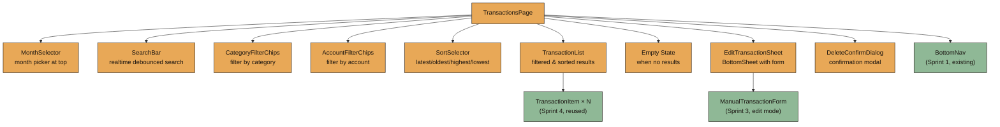
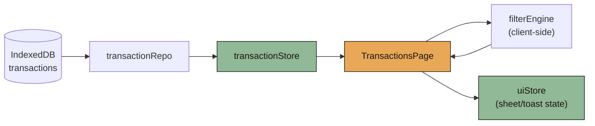
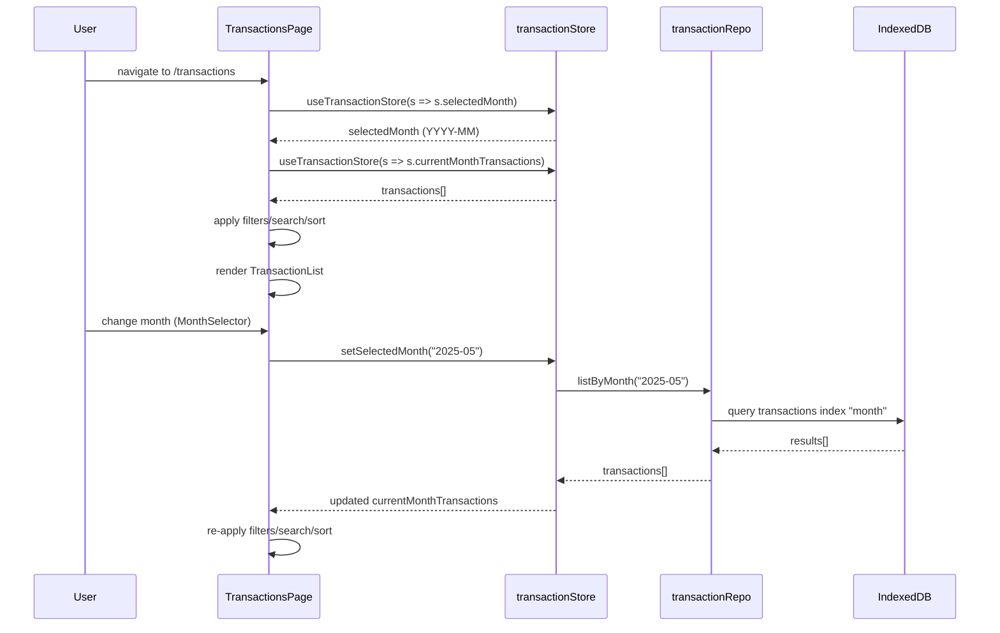
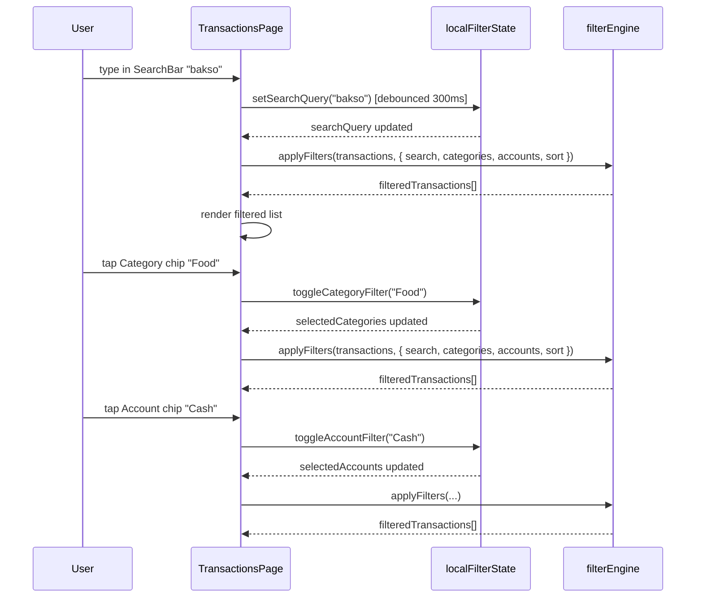
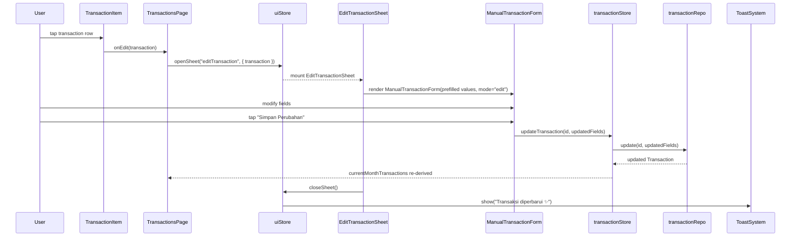
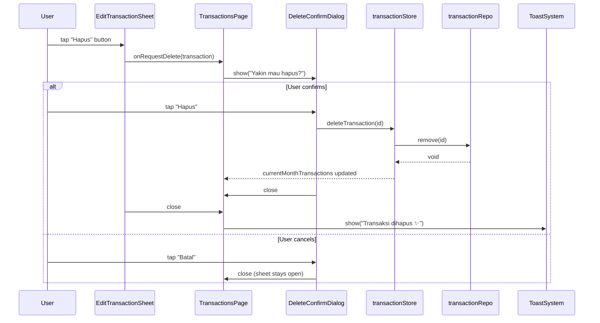

# Design Document: Sprint 6 — Transactions Page

## Overview

Sprint 6 implements the `TransactionsPage` at route `/transactions`, serving as the "Transaksi" tab in the BottomNav. Per `BUILD_PLAN §13` and `PRD §10`, this page is the functional counterpart to Home — designed for scanning, searching, filtering, editing, and deleting transactions. It prioritizes readability and speed over decoration.

The page loads the current month's transactions from `transactionStore` (hydrated from `transactionRepo.listByMonth`). Users select a month via a top month selector. They can search by detail text (client-side, debounced 300ms), filter by category and account (chip filter rows), and sort by latest/oldest/highest/lowest. Each transaction renders using the existing `TransactionItem` component from Sprint 4. Tapping a transaction opens an `EditTransactionSheet` (BottomSheet with `ManualTransactionForm` pre-filled in edit mode). A delete action triggers a confirmation dialog with soft Indonesian copy ("Yakin mau hapus?") followed by a success toast ("Transaksi dihapus ✨").

No pagination is required for MVP — monthly data typically contains fewer than 100 items. All filtering, searching, and sorting happen client-side over the loaded transactions array. All amounts are formatted using `formatIDR` from `src/lib/format.ts`.

---

## Architecture

### Page Composition



### Data Flow



---

## Sequence Diagrams

### Page Mount & Month Selection



### Search & Filter Flow



### Edit Transaction Flow



### Delete Transaction Flow



---

## Components and Interfaces

### Component: TransactionsPage

**Purpose**: Main page component at route `/transactions`. Composes month selector, search, filters, sort, transaction list, edit sheet, and delete dialog. Manages local filter/search state.

```typescript
// src/pages/TransactionsPage.tsx

interface TransactionsPageState {
  searchQuery: string;
  selectedCategories: CategoryType[];
  selectedAccounts: AccountType[];
  sortMode: SortMode;
  editingTransaction: Transaction | null;
  showDeleteConfirm: boolean;
  deletingTransaction: Transaction | null;
}

type SortMode = "latest" | "oldest" | "highest" | "lowest";
```

**Responsibilities**:
- Subscribe to `transactionStore` for current month's transactions and selected month
- Maintain local filter/search/sort state (not persisted)
- Derive filtered+sorted transaction list via `applyFilters()`
- Handle edit/delete flows by managing sheet and dialog visibility
- Render empty state when filtered results are empty

---

### Component: MonthSelector

**Purpose**: Allows user to navigate between months. Displays current selected month and provides prev/next navigation.

```typescript
interface MonthSelectorProps {
  selectedMonth: string;        // "YYYY-MM"
  onMonthChange: (month: string) => void;
}
```

**Visual spec**:
- Centered month label: "Juni 2025" (Body, 700, text-primary)
- Left arrow (◀) and right arrow (▶) buttons for prev/next month
- Height: 48px, full-width, padding inline 20px
- Background: transparent, arrows use `text-secondary` color
- Cannot navigate to future months beyond current month

---

### Component: SearchBar

**Purpose**: Realtime search input, debounced 300ms, filters transactions by `detail` field.

```typescript
interface SearchBarProps {
  value: string;
  onChange: (query: string) => void;
  placeholder?: string;  // default: "Cari transaksi..."
}
```

**Visual spec**:
- Height: 44px, radius 16px, background `bg-card-soft`
- Search icon (🔍) on the left inside input
- Clear button (✕) appears when value is non-empty
- DM Sans, 14px, `text-primary`
- Debounce handled internally or by parent via `useDebouncedValue()`

---

### Component: CategoryFilterChips

**Purpose**: Horizontal scrollable row of category filter chips. Multi-select. Tapping a chip toggles its active state.

```typescript
interface CategoryFilterChipsProps {
  selected: CategoryType[];
  onToggle: (category: CategoryType) => void;
}
```

**Visual spec**:
- Horizontal scroll (overflow-x auto, no scrollbar visible)
- Each chip: radius 999px, height 32px, padding inline 12px
- Inactive: `bg-card-soft`, `text-secondary`
- Active: `accent-primary` background, `bg-main` text (dark on amber)
- Shows all 8 categories: Food, Transport, Entertainment, Shopping, Health, Giving, Saving, Other
- Category emoji prefix: 🍜 Food, 🚗 Transport, etc.

---

### Component: AccountFilterChips

**Purpose**: Horizontal scrollable row of account filter chips. Multi-select.

```typescript
interface AccountFilterChipsProps {
  selected: AccountType[];
  onToggle: (account: AccountType) => void;
}
```

**Visual spec**:
- Same visual pattern as CategoryFilterChips
- Shows all 6 accounts: Cash, E-wallet, BNI, BCA, Mandiri, Other
- No emoji prefix (just text label)

---

### Component: SortSelector

**Purpose**: Dropdown or segmented control to select sort mode.

```typescript
interface SortSelectorProps {
  value: SortMode;
  onChange: (mode: SortMode) => void;
}
```

**Visual spec**:
- Compact dropdown/select: height 36px, radius 12px, `bg-card-soft`
- Options: "Terbaru" | "Terlama" | "Terbesar" | "Terkecil"
- Default: "Terbaru" (latest first)
- DM Sans, 13px, 600

---

### Component: TransactionList

**Purpose**: Renders the filtered and sorted list of transactions.

```typescript
interface TransactionListProps {
  transactions: Transaction[];
  onEdit: (transaction: Transaction) => void;
}
```

**Behavior**:
- Maps transactions to `TransactionItem` components
- Passes `onTap` handler to open edit sheet
- Divider between items (1px `bg-card-soft`)
- Smooth list with no virtualization (MVP, <100 items)

---

### Component: TransactionItem (Reused from Sprint 4)

**Purpose**: Single transaction row. Already implemented in Sprint 4.

```typescript
interface TransactionItemProps {
  transaction: Transaction;
  onTap?: (transaction: Transaction) => void;
}
```

**Visual spec** (per Sprint 4 design):
- Left: category emoji icon
- Middle: detail (single line truncate), account chip below
- Right: `formatIDR(nominal)` (Body 700), mood badge below
- Row height: ~56–64px
- Tap target: entire row → triggers `onTap`

---

### Component: EditTransactionSheet

**Purpose**: BottomSheet wrapper around ManualTransactionForm in edit mode.

```typescript
interface EditTransactionSheetProps {
  transaction: Transaction | null;
  isOpen: boolean;
  onClose: () => void;
  onSave: (id: string, data: UpdateTransactionInput) => void;
  onDelete: (transaction: Transaction) => void;
}
```

**Visual spec**:
- Uses existing `BottomSheet` component (Sprint 1)
- Title: "Edit Transaksi"
- Form pre-filled with transaction values
- Primary CTA: "Simpan Perubahan" (updates existing)
- Secondary/Danger action: "Hapus Transaksi" button at bottom (text-style, `danger-soft` color)
- Max height 90vh, top radius 28px

---

### Component: DeleteConfirmDialog

**Purpose**: Modal confirmation dialog before deleting a transaction.

```typescript
interface DeleteConfirmDialogProps {
  isOpen: boolean;
  transaction: Transaction | null;
  onConfirm: () => void;
  onCancel: () => void;
}
```

**Visual spec**:
- Centered modal overlay (backdrop blur + dark overlay)
- Card: radius 24px, padding 24px, `bg-card`
- Title: "Yakin mau hapus?" (Section Title, text-primary)
- Body: transaction detail + nominal preview
- Two buttons:
  - "Batal" — secondary, `text-secondary`
  - "Hapus" — danger, `danger-soft` background
- Framer Motion: scale 0.95 → 1 on enter

---

### Component: EmptyState

**Purpose**: Shown when the filtered transaction list is empty for the current month.

```typescript
interface EmptyStateProps {
  message: string;
}
```

**Visual spec**:
- Centered vertically in available space
- Illustration/emoji: 📝 (subtle, not distracting)
- Message: "Belum ada transaksi bulan ini. Yuk mulai catat! ✨"
- DM Sans, 14px, `text-muted`, text-center
- No CTA button (FAB is available)

---

## Data Models

Sprint 6 introduces no new IndexedDB stores. It uses existing Sprint 2 models:

- `Transaction` (src/types/transaction.ts)
- `CategoryType`, `AccountType` (src/types/transaction.ts)

New runtime-only types (local state, not persisted):

```typescript
// src/features/transactions/types.ts

export type SortMode = "latest" | "oldest" | "highest" | "lowest";

export interface TransactionFilters {
  searchQuery: string;
  selectedCategories: CategoryType[];
  selectedAccounts: AccountType[];
  sortMode: SortMode;
}

export interface UpdateTransactionInput {
  detail?: string;
  nominal?: number;
  category?: CategoryType;
  account?: AccountType;
  date?: string;
  mood?: MoodType;
  note?: string;
}
```

---

## Algorithmic Pseudocode

### Main Processing: Filter Engine

```typescript
ALGORITHM applyFilters(transactions, filters)
INPUT:
  transactions: Transaction[]
  filters: TransactionFilters {
    searchQuery: string,
    selectedCategories: CategoryType[],
    selectedAccounts: AccountType[],
    sortMode: SortMode
  }
OUTPUT: Transaction[] (filtered and sorted)

PRECONDITION:
  - transactions is an array (may be empty)
  - filters.searchQuery is a string (may be empty)
  - filters.selectedCategories is an array (empty = no filter = show all)
  - filters.selectedAccounts is an array (empty = no filter = show all)
  - filters.sortMode is one of "latest" | "oldest" | "highest" | "lowest"

POSTCONDITION:
  - Result is a subset of input transactions
  - Result respects all active filters (AND logic between filter types)
  - Result is sorted according to sortMode
  - Original transactions array is not mutated

BEGIN
  result ← [...transactions]

  // Step 1: Apply search filter
  IF filters.searchQuery ≠ "" THEN
    query ← filters.searchQuery.toLowerCase()
    result ← result.filter(tx => tx.detail.toLowerCase().includes(query))
  END IF

  // Step 2: Apply category filter
  IF filters.selectedCategories.length > 0 THEN
    result ← result.filter(tx => filters.selectedCategories.includes(tx.category))
  END IF

  // Step 3: Apply account filter
  IF filters.selectedAccounts.length > 0 THEN
    result ← result.filter(tx => filters.selectedAccounts.includes(tx.account))
  END IF

  // Step 4: Apply sort
  SWITCH filters.sortMode
    CASE "latest":
      result.sort((a, b) => b.createdAt.localeCompare(a.createdAt))
    CASE "oldest":
      result.sort((a, b) => a.createdAt.localeCompare(b.createdAt))
    CASE "highest":
      result.sort((a, b) => b.nominal - a.nominal)
    CASE "lowest":
      result.sort((a, b) => a.nominal - b.nominal)
  END SWITCH

  RETURN result
END
```

**Loop Invariants:**
- After each filter step, result contains only transactions that pass all previously applied filters
- Array length is monotonically non-increasing through filter steps

---

### Search Debounce Logic

```typescript
ALGORITHM useDebouncedSearch(inputValue, delay)
INPUT:
  inputValue: string (raw user input, changes on every keystroke)
  delay: number (milliseconds, default 300)
OUTPUT:
  debouncedValue: string (stable value after user stops typing)

PRECONDITION:
  - delay > 0
  - inputValue is a string

POSTCONDITION:
  - debouncedValue updates only after `delay` ms of no input changes
  - If user types continuously, only the final value propagates
  - No stale values: debouncedValue always reflects the latest stable input

BEGIN
  debouncedValue ← ""
  timer ← null

  ON inputValue CHANGE:
    IF timer ≠ null THEN
      clearTimeout(timer)
    END IF
    timer ← setTimeout(() => {
      debouncedValue ← inputValue
    }, delay)

  RETURN debouncedValue
END
```

---

### Month Navigation Logic

```typescript
ALGORITHM navigateMonth(currentMonth, direction)
INPUT:
  currentMonth: string (YYYY-MM format)
  direction: "prev" | "next"
OUTPUT: string (new YYYY-MM) or null (if next would exceed current month)

PRECONDITION:
  - currentMonth is a valid YYYY-MM string
  - direction is "prev" or "next"

POSTCONDITION:
  - "prev" always returns the previous month
  - "next" returns next month only if it does not exceed the actual current month
  - "next" returns null if already at current month (prevents future navigation)
  - Output is always a valid YYYY-MM string or null

BEGIN
  [year, month] ← parse(currentMonth)

  IF direction = "prev" THEN
    IF month = 1 THEN
      RETURN formatYYYYMM(year - 1, 12)
    ELSE
      RETURN formatYYYYMM(year, month - 1)
    END IF
  ELSE  // direction = "next"
    nowMonth ← getCurrentYYYYMM()
    nextMonth ← month = 12 ? formatYYYYMM(year + 1, 1) : formatYYYYMM(year, month + 1)
    IF nextMonth > nowMonth THEN
      RETURN null  // cannot go to future
    END IF
    RETURN nextMonth
  END IF
END
```

---

### Edit Transaction Flow

```typescript
ALGORITHM editTransaction(id, updates, transactionStore, repo)
INPUT:
  id: string (transaction ID)
  updates: UpdateTransactionInput
  transactionStore: TransactionStore
  repo: TransactionRepo
OUTPUT: Transaction (updated)

PRECONDITION:
  - id exists in the store's current transactions
  - updates contains at least one changed field
  - updates.nominal > 0 (if provided)
  - updates.detail is non-empty (if provided)

POSTCONDITION:
  - Transaction with given id is updated in IndexedDB
  - transactionStore.currentMonthTransactions reflects the update
  - updatedAt field is set to current ISO timestamp
  - Fields not in updates remain unchanged
  - If month changes due to date edit, transaction moves to correct month bucket

BEGIN
  existingTx ← repo.getById(id)
  ASSERT existingTx ≠ null

  mergedTx ← {
    ...existingTx,
    ...updates,
    month: updates.date ? extractMonth(updates.date) : existingTx.month,
    updatedAt: new Date().toISOString()
  }

  savedTx ← repo.update(id, mergedTx)
  transactionStore.refreshCurrentMonth()

  RETURN savedTx
END
```

---

### Delete Transaction Flow

```typescript
ALGORITHM deleteTransaction(id, transactionStore, repo)
INPUT:
  id: string (transaction ID)
  transactionStore: TransactionStore
  repo: TransactionRepo
OUTPUT: void

PRECONDITION:
  - id exists in IndexedDB
  - User has confirmed deletion via dialog

POSTCONDITION:
  - Transaction with given id is removed from IndexedDB
  - transactionStore.currentMonthTransactions no longer contains it
  - Deletion is permanent (no undo in MVP)

BEGIN
  ASSERT id ≠ null AND id ≠ ""

  repo.remove(id)
  transactionStore.refreshCurrentMonth()
END
```

---

## Key Functions with Formal Specifications

### applyFilters()

```typescript
// src/features/transactions/filterEngine.ts
export function applyFilters(
  transactions: Transaction[],
  filters: TransactionFilters
): Transaction[]
```

**Preconditions:**
- `transactions` is an array (may be empty)
- `filters.searchQuery` is a string (may be empty)
- `filters.selectedCategories` is an array (empty means "show all")
- `filters.selectedAccounts` is an array (empty means "show all")
- `filters.sortMode` is a valid `SortMode` value

**Postconditions:**
- Result ⊆ input transactions (subset relationship)
- Every transaction in result passes ALL active filters
- Result is sorted according to `sortMode`
- Original array is not mutated
- Empty filters (empty string / empty arrays) are treated as "no filter" (pass all)

**Loop Invariants:**
- After each filter application, intermediate result only contains elements satisfying all previously-applied predicates

---

### searchTransactions()

```typescript
// src/features/transactions/filterEngine.ts
export function searchTransactions(
  transactions: Transaction[],
  query: string
): Transaction[]
```

**Preconditions:**
- `transactions` is an array (may be empty)
- `query` is a string (may be empty)

**Postconditions:**
- If `query` is empty → returns all transactions (identity)
- If `query` is non-empty → returns only transactions where `detail.toLowerCase()` includes `query.toLowerCase()`
- Search is case-insensitive
- Result preserves original relative order

**Loop Invariants:**
- All previously-checked transactions that pass the predicate are in the result

---

### sortTransactions()

```typescript
// src/features/transactions/filterEngine.ts
export function sortTransactions(
  transactions: Transaction[],
  mode: SortMode
): Transaction[]
```

**Preconditions:**
- `transactions` is an array (may be empty)
- `mode` is one of "latest" | "oldest" | "highest" | "lowest"

**Postconditions:**
- Result has same length as input
- Result contains exactly the same elements (permutation)
- "latest": `result[i].createdAt ≥ result[i+1].createdAt` for all i
- "oldest": `result[i].createdAt ≤ result[i+1].createdAt` for all i
- "highest": `result[i].nominal ≥ result[i+1].nominal` for all i
- "lowest": `result[i].nominal ≤ result[i+1].nominal` for all i

**Loop Invariants:**
- Sort is stable for equal elements (preserves relative order of ties)

---

### navigateMonth()

```typescript
// src/features/transactions/monthNav.ts
export function navigateMonth(
  currentMonth: string,
  direction: "prev" | "next"
): string | null
```

**Preconditions:**
- `currentMonth` matches pattern /^\d{4}-\d{2}$/ (valid YYYY-MM)
- `direction` is "prev" or "next"

**Postconditions:**
- "prev" always returns a valid YYYY-MM string (never null)
- "next" returns null if result would exceed current real month
- "next" returns valid YYYY-MM string if within bounds
- Month arithmetic is correct across year boundaries (2025-01 prev → 2024-12)

**Loop Invariants:** N/A

---

### formatMonthLabel()

```typescript
// src/lib/format.ts
export function formatMonthLabel(month: string): string
```

**Preconditions:**
- `month` matches pattern /^\d{4}-\d{2}$/

**Postconditions:**
- Returns Indonesian month name + year: "Juni 2025", "Desember 2024"
- Maps month numbers correctly (01→Januari, 02→Februari, ..., 12→Desember)
- Always returns a non-empty string

**Loop Invariants:** N/A

---

## Example Usage

```typescript
// TransactionsPage.tsx — main composition
import { useTransactionStore } from "@/stores/transactionStore";
import { applyFilters } from "@/features/transactions/filterEngine";
import { navigateMonth, formatMonthLabel } from "@/features/transactions/monthNav";
import { useDebouncedValue } from "@/lib/hooks/useDebouncedValue";
import { formatIDR } from "@/lib/format";

export function TransactionsPage() {
  const selectedMonth = useTransactionStore((s) => s.selectedMonth);
  const transactions = useTransactionStore((s) => s.currentMonthTransactions);
  const setSelectedMonth = useTransactionStore((s) => s.setSelectedMonth);
  const updateTransaction = useTransactionStore((s) => s.updateTransaction);
  const deleteTransaction = useTransactionStore((s) => s.deleteTransaction);

  // Local filter state
  const [searchInput, setSearchInput] = useState("");
  const searchQuery = useDebouncedValue(searchInput, 300);
  const [selectedCategories, setSelectedCategories] = useState<CategoryType[]>([]);
  const [selectedAccounts, setSelectedAccounts] = useState<AccountType[]>([]);
  const [sortMode, setSortMode] = useState<SortMode>("latest");

  // Derive filtered list
  const filteredTransactions = useMemo(
    () => applyFilters(transactions, {
      searchQuery,
      selectedCategories,
      selectedAccounts,
      sortMode,
    }),
    [transactions, searchQuery, selectedCategories, selectedAccounts, sortMode]
  );

  // Edit state
  const [editingTransaction, setEditingTransaction] = useState<Transaction | null>(null);
  const [deletingTransaction, setDeletingTransaction] = useState<Transaction | null>(null);

  const handleMonthChange = (direction: "prev" | "next") => {
    const newMonth = navigateMonth(selectedMonth, direction);
    if (newMonth) setSelectedMonth(newMonth);
  };

  const handleSave = async (id: string, data: UpdateTransactionInput) => {
    await updateTransaction(id, data);
    setEditingTransaction(null);
    showToast("Transaksi diperbarui ✨");
  };

  const handleDelete = async () => {
    if (!deletingTransaction) return;
    await deleteTransaction(deletingTransaction.id);
    setDeletingTransaction(null);
    setEditingTransaction(null);
    showToast("Transaksi dihapus ✨");
  };

  return (
    <PageWrapper>
      <MonthSelector
        selectedMonth={selectedMonth}
        onMonthChange={handleMonthChange}
      />
      <SearchBar value={searchInput} onChange={setSearchInput} />
      <CategoryFilterChips
        selected={selectedCategories}
        onToggle={(cat) => toggleArrayItem(selectedCategories, cat, setSelectedCategories)}
      />
      <AccountFilterChips
        selected={selectedAccounts}
        onToggle={(acc) => toggleArrayItem(selectedAccounts, acc, setSelectedAccounts)}
      />
      <SortSelector value={sortMode} onChange={setSortMode} />

      {filteredTransactions.length === 0 ? (
        <EmptyState message="Belum ada transaksi bulan ini. Yuk mulai catat! ✨" />
      ) : (
        <TransactionList
          transactions={filteredTransactions}
          onEdit={setEditingTransaction}
        />
      )}

      <EditTransactionSheet
        transaction={editingTransaction}
        isOpen={editingTransaction !== null}
        onClose={() => setEditingTransaction(null)}
        onSave={handleSave}
        onDelete={(tx) => setDeletingTransaction(tx)}
      />

      <DeleteConfirmDialog
        isOpen={deletingTransaction !== null}
        transaction={deletingTransaction}
        onConfirm={handleDelete}
        onCancel={() => setDeletingTransaction(null)}
      />
    </PageWrapper>
  );
}
```

```typescript
// Filter engine usage examples
import { applyFilters } from "@/features/transactions/filterEngine";

// Example 1: No filters active (show all, sorted latest)
const result1 = applyFilters(transactions, {
  searchQuery: "",
  selectedCategories: [],
  selectedAccounts: [],
  sortMode: "latest",
});
// Returns all transactions sorted by createdAt descending

// Example 2: Search + category filter
const result2 = applyFilters(transactions, {
  searchQuery: "bakso",
  selectedCategories: ["Food"],
  selectedAccounts: [],
  sortMode: "highest",
});
// Returns only Food transactions containing "bakso", sorted by nominal desc

// Example 3: Multiple account filter
const result3 = applyFilters(transactions, {
  searchQuery: "",
  selectedCategories: [],
  selectedAccounts: ["Cash", "E-wallet"],
  sortMode: "latest",
});
// Returns transactions from Cash OR E-wallet accounts
```

```typescript
// Month navigation
import { navigateMonth, formatMonthLabel } from "@/features/transactions/monthNav";

navigateMonth("2025-06", "prev");  // → "2025-05"
navigateMonth("2025-01", "prev");  // → "2024-12"
navigateMonth("2025-06", "next");  // → null (if current month is June 2025)
navigateMonth("2025-05", "next");  // → "2025-06" (if current month is June 2025)

formatMonthLabel("2025-06");  // → "Juni 2025"
formatMonthLabel("2024-12");  // → "Desember 2024"
```

```typescript
// Edit flow
<EditTransactionSheet
  transaction={{
    id: "tx-123",
    detail: "Bakso Pak Kumis",
    nominal: 15000,
    category: "Food",
    account: "Cash",
    date: "2025-06-15",
    month: "2025-06",
    mood: "😊",
    note: "",
    source: "manual",
    createdAt: "2025-06-15T10:30:00Z",
    updatedAt: "2025-06-15T10:30:00Z",
  }}
  isOpen={true}
  onClose={() => {}}
  onSave={(id, data) => updateTransaction(id, data)}
  onDelete={(tx) => setDeletingTransaction(tx)}
/>
// Renders form pre-filled: nominal=15000, detail="Bakso Pak Kumis", category="Food", etc.
// CTA says "Simpan Perubahan"
// Has red "Hapus Transaksi" at bottom
```

---

## Correctness Properties

### Property 1: Filter subset guarantee

*For all* `(transactions, filters)` pairs: `applyFilters(transactions, filters).length ≤ transactions.length`. The filtered result is always a subset (or equal) of the input.

**Validates: Requirements 6.2**

### Property 2: Empty filter identity

*For all* `transactions` arrays: `applyFilters(transactions, { searchQuery: "", selectedCategories: [], selectedAccounts: [], sortMode: "latest" })` contains exactly the same elements as `transactions` (permutation due to sort only).

**Validates: Requirements 3.3, 4.1, 5.1**

### Property 3: Sort ordering correctness

*For all* non-empty `transactions` arrays and for each `sortMode`: the sorted result respects the ordering — "latest": descending `createdAt`, "oldest": ascending `createdAt`, "highest": descending `nominal`, "lowest": ascending `nominal`.

**Validates: Requirements 7.2, 7.3, 7.4, 7.5**

### Property 4: Sort preserves elements

*For all* `transactions` arrays and any `sortMode`: `sortTransactions(transactions, sortMode).length === transactions.length` and both contain the same set of transaction IDs.

**Validates: Requirements 7.6**

### Property 5: Search case insensitivity

*For all* `transactions` and query strings: `searchTransactions(transactions, query)` returns the same result as `searchTransactions(transactions, query.toUpperCase())`.

**Validates: Requirements 3.2**

### Property 6: Category filter OR semantics

*For all* `transactions` and non-empty `selectedCategories`: every transaction in the filtered result has its `category` ∈ `selectedCategories`. No transaction outside the selected categories appears in the result.

**Validates: Requirements 4.2**

### Property 7: Account filter OR semantics

*For all* `transactions` and non-empty `selectedAccounts`: every transaction in the filtered result has its `account` ∈ `selectedAccounts`.

**Validates: Requirements 5.2**

### Property 8: Month navigation boundary

*For all* valid month strings where month equals the actual current month: `navigateMonth(month, "next") === null`. Users cannot navigate to future months.

**Validates: Requirements 2.3**

### Property 9: Month navigation inverse

*For all* valid month strings `m` that are not the current month: if `next = navigateMonth(m, "next")` and `next ≠ null`, then `navigateMonth(next, "prev") === m`. Prev and next are inverses.

**Validates: Requirements 2.1, 2.2**

### Property 10: Filter AND composition

*For all* `transactions` where both category and account filters are active: every transaction in the result satisfies BOTH `category ∈ selectedCategories` AND `account ∈ selectedAccounts`. The filters compose with AND logic.

**Validates: Requirements 6.1**

### Property 11: Delete removes exactly one

*For all* valid transaction IDs: after `deleteTransaction(id)`, the store's transactions array has length `previousLength - 1` and does not contain any transaction with the given ID.

**Validates: Requirements 10.2**

### Property 12: Edit preserves ID and creation metadata

*For all* valid `(id, updates)` pairs: after `editTransaction(id, updates)`, the resulting transaction has the same `id`, same `createdAt`, and same `source` as before. Only explicitly updated fields change (plus `updatedAt`).

**Validates: Requirements 9.2, 9.3**

---

## Error Handling

### Error Scenario 1: No Transactions for Selected Month

**Condition**: `transactionStore.currentMonthTransactions` is empty for the selected month
**Response**: Show EmptyState: "Belum ada transaksi bulan ini. Yuk mulai catat! ✨"
**Recovery**: User can navigate to different month or add new transaction via FAB

### Error Scenario 2: Search Returns No Results

**Condition**: After applying search + filters, `filteredTransactions.length === 0` but raw transactions exist
**Response**: Show EmptyState with message: "Tidak ada transaksi yang cocok."
**Recovery**: User clears search or removes filters; chips show active state so user knows what's filtering

### Error Scenario 3: Edit Save Failure

**Condition**: `transactionRepo.update()` throws (IndexedDB write failure)
**Response**: Show error toast: "Gagal menyimpan, coba lagi ya."; Sheet stays open with user's edits preserved
**Recovery**: User can retry save; form data is not lost

### Error Scenario 4: Delete Failure

**Condition**: `transactionRepo.remove()` throws
**Response**: Show error toast: "Gagal menghapus, coba lagi ya."; Dialog closes, transaction remains in list
**Recovery**: User can retry deletion

### Error Scenario 5: Month Data Load Failure

**Condition**: `transactionRepo.listByMonth()` throws during month change
**Response**: Keep previous month's data visible; show error toast: "Gagal memuat data, coba lagi ya."
**Recovery**: User can retry month navigation or refresh page

---

## Testing Strategy

### Unit Testing Approach

Key pure functions to unit test:
- `applyFilters()` — all combinations: search only, category only, account only, combined, empty
- `searchTransactions()` — exact match, partial match, case insensitive, empty query, no match
- `sortTransactions()` — all 4 modes, empty array, single item, items with same value
- `navigateMonth()` — normal, year boundary, current month boundary, prev at 2020-01
- `formatMonthLabel()` — all 12 months, correct Indonesian names

Edge case tests:
- `applyFilters` with empty transactions array
- `sortTransactions` with all same nominal values (stability test)
- `navigateMonth("2025-01", "prev")` → "2024-12" (year rollback)
- Search with special characters (won't break)

### Property-Based Testing Approach

**Property Test Library**: fast-check

Properties to test:
1. Filter subset: for random transactions and random filters, result.length ≤ input.length
2. Sort permutation: for random arrays and any sort mode, output contains same elements as input
3. Sort ordering: for random arrays sorted "highest", every adjacent pair satisfies nominal[i] ≥ nominal[i+1]
4. Search case insensitivity: for random queries, toLowerCase and toUpperCase produce same filtered set
5. Category filter membership: for random selected categories, every result item has category in selection
6. Month navigation inverse: for random non-current months, prev(next(m)) === m
7. Empty filter identity: for random transactions with all-empty filters, result is a permutation of input

### Integration Testing Approach

- Mount `TransactionsPage` with mocked store containing various transactions
- Test search: type "bakso" → verify only matching items render
- Test category filter: tap "Food" chip → verify only Food transactions show
- Test account filter: tap "Cash" → verify only Cash transactions
- Test sort: switch to "Terbesar" → verify first item has highest nominal
- Test edit flow: tap item → verify sheet opens with correct pre-filled values → modify → save → verify store updated
- Test delete flow: tap item → tap Hapus → confirm → verify item removed from list
- Test month navigation: tap prev → verify different month loads
- Test empty state: filter to impossible combination → verify empty state message

---

## Performance Considerations

- **Client-side filtering**: All filter/search/sort operations run in-browser over the loaded month's transactions. With <100 items per month (MVP assumption), this is fast and simple.
- **Debounced search**: 300ms debounce prevents excessive re-filtering on every keystroke.
- **useMemo for derived data**: `filteredTransactions` is memoized with `useMemo` to avoid re-computation on unrelated re-renders.
- **No virtualization**: With <100 items, a flat list renders fine. If future months exceed this, react-window can be added later.
- **Month data loading**: Only one month's data is loaded at a time. Switching months triggers a single IndexedDB query on the `month` index — fast retrieval.

---

## Security Considerations

- **Input sanitization**: Search query is used only for client-side `.includes()` matching — no injection risk.
- **Delete confirmation**: Destructive actions always require explicit user confirmation via dialog.
- **No external network calls**: All operations are local IndexedDB reads/writes. No data leaves the device.

---

## Dependencies

- **Existing (from previous sprints)**:
  - `TransactionItem` component (Sprint 4)
  - `ManualTransactionForm` component (Sprint 3)
  - `BottomSheet` component (Sprint 1)
  - `Toast` component (Sprint 1)
  - `PageWrapper` and `BottomNav` (Sprint 1)
  - `transactionStore` and `transactionRepo` (Sprint 2)
  - `formatIDR` from `src/lib/format.ts` (Sprint 3)
  - `uiStore` for sheet/toast management (Sprint 1)

- **New utilities**:
  - `useDebouncedValue` hook (generic, reusable)
  - `applyFilters` / `searchTransactions` / `sortTransactions` in filter engine
  - `navigateMonth` / `formatMonthLabel` in month navigation
  - `DeleteConfirmDialog` component (reusable for future features)
