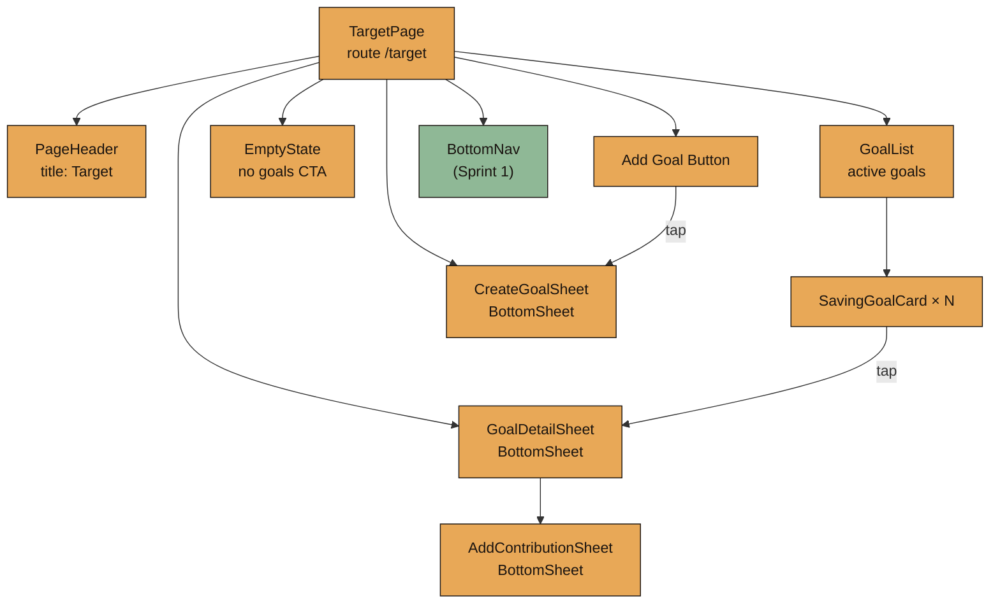
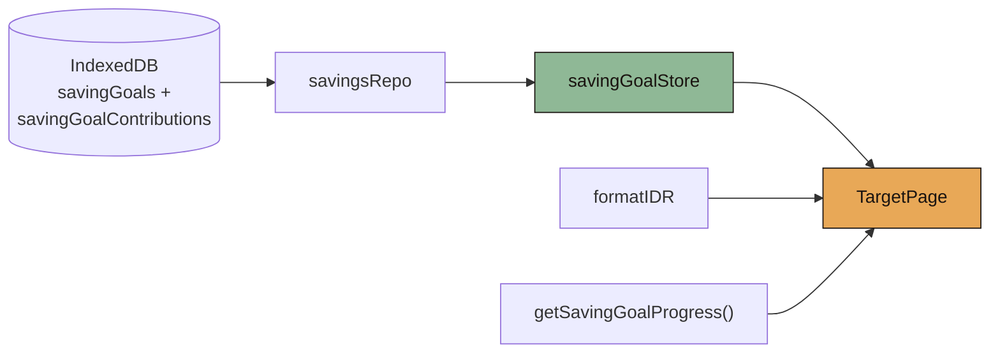
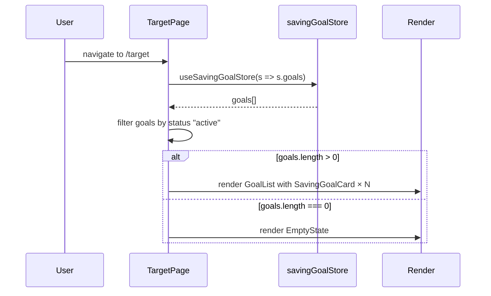
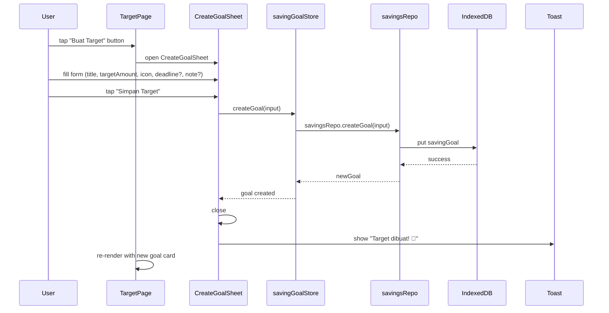
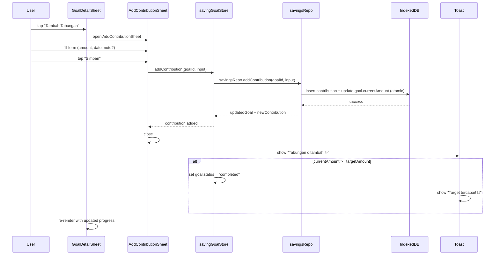
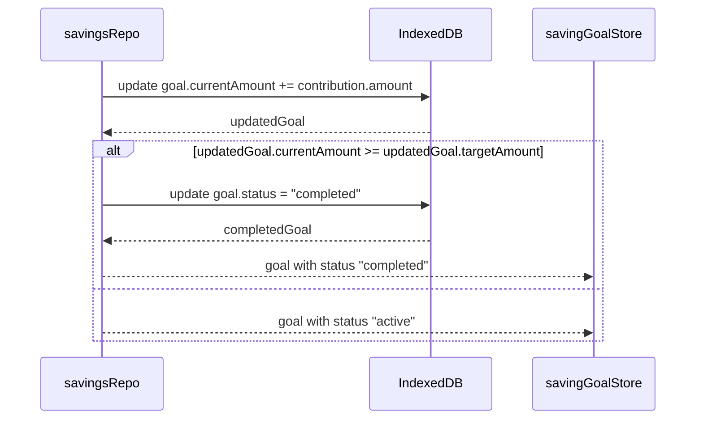

# Design Document: Sprint 7 — Saving Goals

## Overview

Sprint 7 implements the **Target** page (route `/target`) — Luma's visual saving goals feature. Per `BUILD_PLAN §14` and `PRD §9.3`, saving goals are emotional and visual, not banking-style. Users create goals with a name, target amount, emoji/icon, optional deadline, and optional note. They then add contributions over time, watching a progress bar fill up until the goal is completed.

The feature uses the existing `savingGoalStore` and `savingsRepo` from Sprint 2's data layer. Contributions are atomic operations (insert contribution + update goal currentAmount) via `savingsRepo.addContribution`. Goals are separate from expense transactions per `TECHNICAL_ARCHITECTURE §16`. The tone is soft and supportive — no gamification, no challenge-based pressure. Character reactions are optional and subtle (happy when created, excited on progress, celebration on completed).

The page composes four main UI elements: (1) **TargetPage** with goal list and empty state; (2) **SavingGoalCard** showing emoji, name, progress bar, amounts, optional deadline, and subtle character reaction; (3) **CreateGoalSheet** bottom sheet for creating new goals; (4) **GoalDetail** view/sheet showing full goal info + contribution history with ability to add contributions.

---

## Architecture

### Page Composition



### Data Flow



---

## Sequence Diagrams

### TargetPage Mount & Goal List Rendering



### Create Saving Goal Flow



### Add Contribution Flow



### Goal Completion Detection



---

## Components and Interfaces

### Component: TargetPage

**Purpose**: Main page for the Target tab. Lists active saving goals or shows empty state. Provides access to create goals and view goal details.

```typescript
// src/pages/TargetPage.tsx
interface TargetPageState {
  activeGoals: SavingGoal[];
  completedGoals: SavingGoal[];
  isCreateSheetOpen: boolean;
  selectedGoalId: string | null;
}
```

**Responsibilities**:
- Subscribe to `savingGoalStore` for goal list
- Filter and separate active vs completed goals
- Render empty state when no active goals exist
- Open CreateGoalSheet on "Buat Target" button tap
- Open GoalDetailSheet when a SavingGoalCard is tapped
- Display completed goals in a separate collapsed section (optional)

---

### Component: SavingGoalCard

**Purpose**: Card displaying a single saving goal with visual progress. Per `DESIGN_SYSTEM §10` Saving Goal Card spec.

```typescript
// src/components/cards/SavingGoalCard.tsx
interface SavingGoalCardProps {
  goal: SavingGoal;
  onTap: (goalId: string) => void;
}
```

**Visual spec** (per `DESIGN_SYSTEM §10`):
- Emoji/icon: large (24–32px) on the left
- Goal name: Card Title size (16–18px, 700)
- Progress amounts: `formatIDR(currentAmount)` / `formatIDR(targetAmount)` (Body, text-secondary)
- Progress bar: full width, height 8px, radius 4px, bg-card-soft track, accent-primary fill
- Optional deadline: Caption size, text-muted, "Target: DD MMM YYYY"
- Small character reaction: only when completed (mini celebration)
- Card: radius 24px, padding 20px, bg-card

**Behavior**:
- Tap opens GoalDetailSheet
- Progress bar width = `clamp(currentAmount / targetAmount, 0, 1) * 100%`
- Completed goals show "Target tercapai! 🎉" badge
- Active goals show percentage text next to progress bar

---

### Component: CreateGoalSheet

**Purpose**: Bottom sheet form for creating a new saving goal.

```typescript
// src/components/sheets/CreateGoalSheet.tsx
interface CreateGoalSheetProps {
  isOpen: boolean;
  onClose: () => void;
  onCreated: (goal: SavingGoal) => void;
}

interface CreateGoalInput {
  title: string;
  targetAmount: number;
  icon: string;         // emoji string
  deadline?: string;    // YYYY-MM-DD
  note?: string;
}
```

**Fields**:
- Nama target (title): text input, required
- Target nominal (targetAmount): number input, required, > 0
- Icon/emoji: emoji picker or preset grid
- Deadline: date picker, optional
- Note: textarea, optional

**Validation**:
- title: not empty, max 50 chars
- targetAmount: > 0, max 999,999,999,999
- icon: not empty (default emoji if user skips)

**CTA**: "Simpan Target"

---

### Component: GoalDetailSheet

**Purpose**: Bottom sheet showing full goal info and contribution history. Allows adding new contributions.

```typescript
// src/components/sheets/GoalDetailSheet.tsx
interface GoalDetailSheetProps {
  isOpen: boolean;
  goalId: string | null;
  onClose: () => void;
}
```

**Sections**:
- Header: icon + title + status badge
- Progress summary: progress bar + `formatIDR(currentAmount)` / `formatIDR(targetAmount)` + percentage
- Deadline (if set): "Target: DD MMM YYYY"
- Note (if set): displayed below deadline
- "Tambah Tabungan" CTA button
- Contribution history: list of contributions sorted by date descending
- Each contribution row: date, amount (formatIDR), note (if set)

**Behavior**:
- Reads goal and contributions from store
- "Tambah Tabungan" opens AddContributionSheet
- Shows celebration state when goal is completed

---

### Component: AddContributionSheet

**Purpose**: Bottom sheet form for adding a savings contribution to a goal.

```typescript
// src/components/sheets/AddContributionSheet.tsx
interface AddContributionSheetProps {
  isOpen: boolean;
  goalId: string;
  onClose: () => void;
  onAdded: (contribution: SavingGoalContribution) => void;
}

interface AddContributionInput {
  amount: number;
  date: string;       // YYYY-MM-DD, default today
  note?: string;
}
```

**Fields**:
- Nominal (amount): number input, required, > 0
- Date: date picker, default today
- Note: textarea, optional

**Validation**:
- amount: > 0
- date: valid YYYY-MM-DD, not in the future

**CTA**: "Simpan"

---

## Data Models

Sprint 7 uses existing models from Sprint 2 (`TECHNICAL_ARCHITECTURE §7`):

```typescript
// src/types/saving.ts (already exists from Sprint 2)
export interface SavingGoal {
  id: string;
  title: string;
  targetAmount: number;
  currentAmount: number;
  icon: string;
  deadline?: string;       // YYYY-MM-DD
  note?: string;
  status: "active" | "completed" | "archived";
  createdAt: string;
  updatedAt: string;
}

export interface SavingGoalContribution {
  id: string;
  goalId: string;
  amount: number;
  date: string;            // YYYY-MM-DD
  note?: string;
  createdAt: string;
}
```

New runtime-only types (not persisted):

```typescript
// src/features/savings/types.ts
export interface SavingGoalProgress {
  progress: number;        // 0–1, clamped
  percentage: number;      // 0–100, clamped
  isCompleted: boolean;
  remaining: number;       // targetAmount - currentAmount, min 0
}

export interface GoalCharacterReaction {
  type: "created" | "progress" | "completed" | "none";
  emoji?: string;
}
```

---

## Algorithmic Pseudocode

### Main Processing: Saving Goal Progress Calculation

```typescript
ALGORITHM getSavingGoalProgress(goal)
INPUT:  goal: SavingGoal
OUTPUT: SavingGoalProgress

PRECONDITION:
  - goal.targetAmount > 0
  - goal.currentAmount >= 0

POSTCONDITION:
  - progress ∈ [0, 1]
  - percentage ∈ [0, 100]
  - isCompleted = true iff currentAmount >= targetAmount
  - remaining >= 0

BEGIN
  rawProgress ← goal.currentAmount / goal.targetAmount
  progress ← clamp(rawProgress, 0, 1)
  percentage ← Math.round(progress * 100)
  isCompleted ← goal.currentAmount >= goal.targetAmount
  remaining ← Math.max(goal.targetAmount - goal.currentAmount, 0)

  RETURN {
    progress,
    percentage,
    isCompleted,
    remaining,
  }
END
```

**Loop Invariants**: N/A (no loops)

### Add Contribution with Automatic Completion

```typescript
ALGORITHM addContribution(goalId, input)
INPUT:
  goalId: string
  input: AddContributionInput { amount, date, note? }
OUTPUT:
  { updatedGoal: SavingGoal, contribution: SavingGoalContribution }

PRECONDITION:
  - goalId references an existing goal with status "active"
  - input.amount > 0
  - input.date is a valid YYYY-MM-DD string

POSTCONDITION:
  - A new SavingGoalContribution is created and persisted
  - goal.currentAmount is increased by input.amount
  - If goal.currentAmount >= goal.targetAmount → goal.status = "completed"
  - The operation is atomic (both contribution insert and goal update succeed or neither does)

BEGIN
  // Validate goal exists and is active
  goal ← savingsRepo.getGoalById(goalId)
  ASSERT goal ≠ null AND goal.status = "active"

  // Create contribution record
  contribution ← {
    id: nanoid(),
    goalId: goalId,
    amount: input.amount,
    date: input.date,
    note: input.note,
    createdAt: now(),
  }

  // Update goal amount
  newCurrentAmount ← goal.currentAmount + input.amount

  // Determine new status
  IF newCurrentAmount >= goal.targetAmount THEN
    newStatus ← "completed"
  ELSE
    newStatus ← "active"
  END IF

  // Atomic persist (transaction in IndexedDB)
  savingsRepo.addContribution(goalId, contribution, newCurrentAmount, newStatus)

  updatedGoal ← { ...goal, currentAmount: newCurrentAmount, status: newStatus, updatedAt: now() }

  RETURN { updatedGoal, contribution }
END
```

**Loop Invariants**: N/A (no loops)

### Create Goal

```typescript
ALGORITHM createGoal(input)
INPUT:  input: CreateGoalInput { title, targetAmount, icon, deadline?, note? }
OUTPUT: SavingGoal

PRECONDITION:
  - input.title is non-empty, max 50 chars
  - input.targetAmount > 0
  - input.icon is a non-empty string

POSTCONDITION:
  - A new SavingGoal is persisted in IndexedDB
  - goal.currentAmount = 0
  - goal.status = "active"
  - goal.id is a unique identifier

BEGIN
  goal ← {
    id: nanoid(),
    title: input.title,
    targetAmount: input.targetAmount,
    currentAmount: 0,
    icon: input.icon,
    deadline: input.deadline,
    note: input.note,
    status: "active",
    createdAt: now(),
    updatedAt: now(),
  }

  savingsRepo.createGoal(goal)

  RETURN goal
END
```

### Goal Character Reaction Resolver

```typescript
ALGORITHM getGoalCharacterReaction(goal, justContributed)
INPUT:
  goal: SavingGoal
  justContributed: boolean (true if contribution was just added)
OUTPUT: GoalCharacterReaction

PRECONDITION:
  - goal is a valid SavingGoal

POSTCONDITION:
  - Returns reaction type based on goal state
  - "completed" takes priority over "progress"

BEGIN
  IF goal.status = "completed" THEN
    RETURN { type: "completed", emoji: "🎉" }
  ELSE IF justContributed THEN
    RETURN { type: "progress", emoji: "✨" }
  ELSE
    RETURN { type: "none" }
  END IF
END
```

---

## Key Functions with Formal Specifications

### getSavingGoalProgress()

```typescript
// src/lib/saving-calc.ts
export function getSavingGoalProgress(goal: SavingGoal): SavingGoalProgress
```

**Preconditions:**
- `goal.targetAmount > 0`
- `goal.currentAmount >= 0`

**Postconditions:**
- `result.progress` ∈ [0, 1] (clamped)
- `result.percentage` ∈ [0, 100] (integer, clamped)
- `result.isCompleted === (goal.currentAmount >= goal.targetAmount)`
- `result.remaining === Math.max(goal.targetAmount - goal.currentAmount, 0)`
- `result.remaining >= 0`

**Loop Invariants:** N/A

---

### clampProgress()

```typescript
// src/lib/saving-calc.ts
export function clampProgress(current: number, target: number): number
```

**Preconditions:**
- `target > 0`
- `current >= 0`

**Postconditions:**
- Returns value in [0, 1]
- `clampProgress(0, target) === 0`
- `clampProgress(target, target) === 1`
- `clampProgress(target + x, target) === 1` for all x > 0
- Monotonically non-decreasing as `current` increases

**Loop Invariants:** N/A

---

### validateCreateGoalInput()

```typescript
// src/features/savings/validation.ts
export function validateCreateGoalInput(input: Partial<CreateGoalInput>): ValidationResult
```

**Preconditions:**
- `input` is an object (may have missing/invalid fields)

**Postconditions:**
- Returns `{ valid: true }` if all required fields pass validation
- Returns `{ valid: false, errors: string[] }` with specific error messages for each failing field
- Error messages use soft Indonesian copy

**Loop Invariants:** N/A

---

### validateContributionInput()

```typescript
// src/features/savings/validation.ts
export function validateContributionInput(input: Partial<AddContributionInput>): ValidationResult
```

**Preconditions:**
- `input` is an object (may have missing/invalid fields)

**Postconditions:**
- Returns `{ valid: true }` if amount > 0 and date is valid
- Returns `{ valid: false, errors: string[] }` with specific error messages
- Date must not be in the future

**Loop Invariants:** N/A

---

### formatIDR()

```typescript
// src/lib/format.ts (from Sprint 3, reused)
export function formatIDR(amount: number): string
```

**Preconditions:**
- `amount` is a non-negative number

**Postconditions:**
- Returns string in format "RpX.XXX.XXX" (Indonesian dot separator)
- `formatIDR(0)` returns "Rp0"
- Round-trip: `parseIDR(formatIDR(n)) === n` for all valid integers

---

## Example Usage

```typescript
// TargetPage.tsx — main composition
import { useSavingGoalStore } from "@/stores/savingGoalStore";
import { getSavingGoalProgress } from "@/lib/saving-calc";
import { formatIDR } from "@/lib/format";

export function TargetPage() {
  const goals = useSavingGoalStore((s) => s.goals);
  const createGoal = useSavingGoalStore((s) => s.createGoal);

  const activeGoals = goals.filter((g) => g.status === "active");
  const completedGoals = goals.filter((g) => g.status === "completed");

  const [isCreateOpen, setIsCreateOpen] = useState(false);
  const [selectedGoalId, setSelectedGoalId] = useState<string | null>(null);

  return (
    <PageWrapper>
      <PageHeader title="Target" />

      {activeGoals.length === 0 && completedGoals.length === 0 ? (
        <EmptyState
          message="Ada sesuatu yang lagi kamu pengen wujudkan?"
          ctaLabel="Buat Target"
          onCtaTap={() => setIsCreateOpen(true)}
        />
      ) : (
        <>
          {activeGoals.map((goal) => (
            <SavingGoalCard
              key={goal.id}
              goal={goal}
              onTap={() => setSelectedGoalId(goal.id)}
            />
          ))}
          {completedGoals.length > 0 && (
            <CompletedSection goals={completedGoals} />
          )}
        </>
      )}

      <AddGoalButton onTap={() => setIsCreateOpen(true)} />

      <CreateGoalSheet
        isOpen={isCreateOpen}
        onClose={() => setIsCreateOpen(false)}
        onCreated={() => setIsCreateOpen(false)}
      />

      <GoalDetailSheet
        isOpen={selectedGoalId !== null}
        goalId={selectedGoalId}
        onClose={() => setSelectedGoalId(null)}
      />
    </PageWrapper>
  );
}
```

```typescript
// SavingGoalCard usage
<SavingGoalCard
  goal={{
    id: "1",
    title: "Album IU",
    targetAmount: 1200000,
    currentAmount: 350000,
    icon: "🎧",
    status: "active",
    createdAt: "2024-01-15T00:00:00Z",
    updatedAt: "2024-02-01T00:00:00Z",
  }}
  onTap={(id) => setSelectedGoalId(id)}
/>
// Renders: 🎧 Album IU, Rp350.000 / Rp1.200.000, progress bar at 29%

// getSavingGoalProgress usage
const progress = getSavingGoalProgress(goal);
// { progress: 0.29, percentage: 29, isCompleted: false, remaining: 850000 }

// Completed goal
const completedGoal = { ...goal, currentAmount: 1200000, status: "completed" };
const completedProgress = getSavingGoalProgress(completedGoal);
// { progress: 1, percentage: 100, isCompleted: true, remaining: 0 }

// Over-saved goal (user added more than target)
const overGoal = { ...goal, currentAmount: 1500000 };
const overProgress = getSavingGoalProgress(overGoal);
// { progress: 1, percentage: 100, isCompleted: true, remaining: 0 }
```

```typescript
// AddContribution usage in GoalDetailSheet
const addContribution = useSavingGoalStore((s) => s.addContribution);

const handleAddContribution = async (input: AddContributionInput) => {
  await addContribution(selectedGoalId, input);
  // Store auto-updates goal.currentAmount
  // If completed, shows celebration toast
};
```

---

## Correctness Properties

### Property 1: Progress clamping

*For all* saving goals where `targetAmount > 0` and `currentAmount >= 0`: `getSavingGoalProgress(goal).progress ∈ [0, 1]`.

**Validates: Requirements 7.1, 7.6**

### Property 2: Progress monotonicity

*For all* pairs of goals `(g1, g2)` with same `targetAmount` where `g1.currentAmount ≤ g2.currentAmount`: `getSavingGoalProgress(g1).progress ≤ getSavingGoalProgress(g2).progress`.

**Validates: Requirements 7.1, 7.5**

### Property 3: Completion correctness

*For all* saving goals: `getSavingGoalProgress(goal).isCompleted === true` if and only if `goal.currentAmount >= goal.targetAmount`.

**Validates: Requirements 7.3, 8.2**

### Property 4: Remaining non-negativity

*For all* saving goals where `targetAmount > 0` and `currentAmount >= 0`: `getSavingGoalProgress(goal).remaining >= 0`.

**Validates: Requirements 7.4, 7.7**

### Property 5: Contribution additivity

*For all* goals with `currentAmount = c` and contribution with `amount = a` where `a > 0`: after adding contribution, `goal.currentAmount === c + a`.

**Validates: Requirements 6.3, 6.6**

### Property 6: Status transition validity

*For all* goal status transitions: a goal can only transition from `"active" → "completed"` or `"active" → "archived"`. A completed goal never reverts to active.

**Validates: Requirements 8.1, 8.2, 8.4, 8.5**

### Property 7: Progress percentage identity

*For all* saving goals: `getSavingGoalProgress(goal).percentage === Math.round(clampProgress(goal.currentAmount, goal.targetAmount) * 100)`.

**Validates: Requirements 7.1, 7.2**

### Property 8: Empty goal initial state

*For all* newly created goals: `currentAmount === 0`, `status === "active"`, and `getSavingGoalProgress(goal).progress === 0`.

**Validates: Requirements 4.3, 8.1**

---

## Error Handling

### Error Scenario 1: No Saving Goals Exist

**Condition**: User has no goals (first time on Target page)
**Response**: TargetPage shows empty state with copy "Ada sesuatu yang lagi kamu pengen wujudkan?" and CTA "Buat Target"
**Recovery**: User taps CTA → CreateGoalSheet opens → user creates goal → page re-renders with goal card

### Error Scenario 2: Invalid Goal Input

**Condition**: User submits CreateGoalSheet with missing/invalid fields
**Response**: Show inline validation errors in soft Indonesian: "Nama target belum diisi nih", "Nominalnya belum diisi nih"
**Recovery**: User corrects fields and resubmits

### Error Scenario 3: Invalid Contribution Input

**Condition**: User submits AddContributionSheet with amount ≤ 0 or missing
**Response**: Show inline validation: "Nominalnya belum diisi nih"
**Recovery**: User corrects amount and resubmits

### Error Scenario 4: IndexedDB Write Failure

**Condition**: savingsRepo fails to persist goal or contribution (quota exceeded, corruption)
**Response**: Show toast "Gagal nyimpen, coba sekali lagi ya." and keep sheet open with form data intact
**Recovery**: User can retry; if persistent, Settings → Data → Reset option

### Error Scenario 5: Goal Not Found

**Condition**: GoalDetailSheet opens but goal no longer exists (race condition, deleted elsewhere)
**Response**: Show soft error "Goal tidak ditemukan" and close sheet
**Recovery**: Automatic — user returns to goal list

### Error Scenario 6: Contributing to Completed Goal

**Condition**: User tries to add contribution to a goal that just became completed (race)
**Response**: Prevent contribution — show toast "Target sudah tercapai! 🎉"
**Recovery**: Sheet closes, goal shows completed state

---

## Testing Strategy

### Unit Testing Approach

Key pure functions to unit test:
- `getSavingGoalProgress()` — zero progress, partial, full, over-target
- `clampProgress()` — 0, mid-range, exactly 1, exceeding 1
- `validateCreateGoalInput()` — valid input, missing title, zero amount, negative amount
- `validateContributionInput()` — valid input, zero amount, future date
- `formatIDR()` — already covered in Sprint 3

### Property-Based Testing Approach

**Property Test Library**: fast-check

Properties to test:
1. Progress clamping: for random goals, progress ∈ [0, 1]
2. Progress monotonicity: for random pairs with same target, higher current = higher progress
3. Completion correctness: for random goals, isCompleted iff currentAmount >= targetAmount
4. Remaining non-negativity: for random goals, remaining >= 0
5. Contribution additivity: for random (currentAmount, contributionAmount), result = sum
6. Progress percentage identity: percentage === Math.round(clampedProgress * 100)

### Integration Testing Approach

- Mount `TargetPage` with mocked store (various states) and verify sections render
- Test create goal flow: open sheet → fill form → submit → verify new card appears
- Test add contribution flow: open detail → add contribution → verify progress updates
- Test automatic completion: add contribution that exceeds target → verify completed state
- Test empty state: no goals → verify empty state renders with CTA
- Test validation: submit invalid inputs → verify error messages appear

---

## Performance Considerations

- Goal list should be lightweight (typical user has < 20 goals)
- Contribution history in GoalDetailSheet should paginate if > 50 items (unlikely in MVP)
- Progress bar animation should use CSS transitions (not JS animation loops)
- Emoji rendering is native — no heavy icon library needed

---

## Security Considerations

- All data stays local in IndexedDB — no server communication
- Input validation prevents XSS via emoji/icon field (only emoji/string, no HTML)
- Amount fields validated as positive numbers, preventing negative manipulation

---

## Dependencies

- `savingsRepo` from Sprint 2 (`src/db/savings.repo.ts`)
- `savingGoalStore` from Sprint 2 (`src/stores/savingGoalStore.ts`)
- `formatIDR` from Sprint 3 (`src/lib/format.ts`)
- `BottomSheet` component from Sprint 1 (`src/components/ui/BottomSheet.tsx`)
- `Toast` component from Sprint 1 (`src/components/ui/Toast.tsx`)
- `PageWrapper` from Sprint 1 (`src/components/layout/PageWrapper.tsx`)
- `BottomNav` from Sprint 1 (`src/components/layout/BottomNav.tsx`)
- `nanoid` for ID generation
- `date-fns` for date formatting
