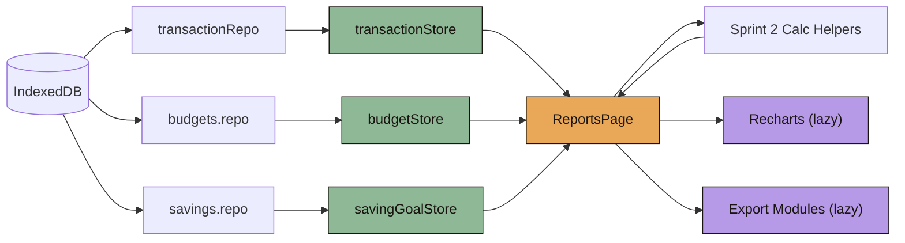
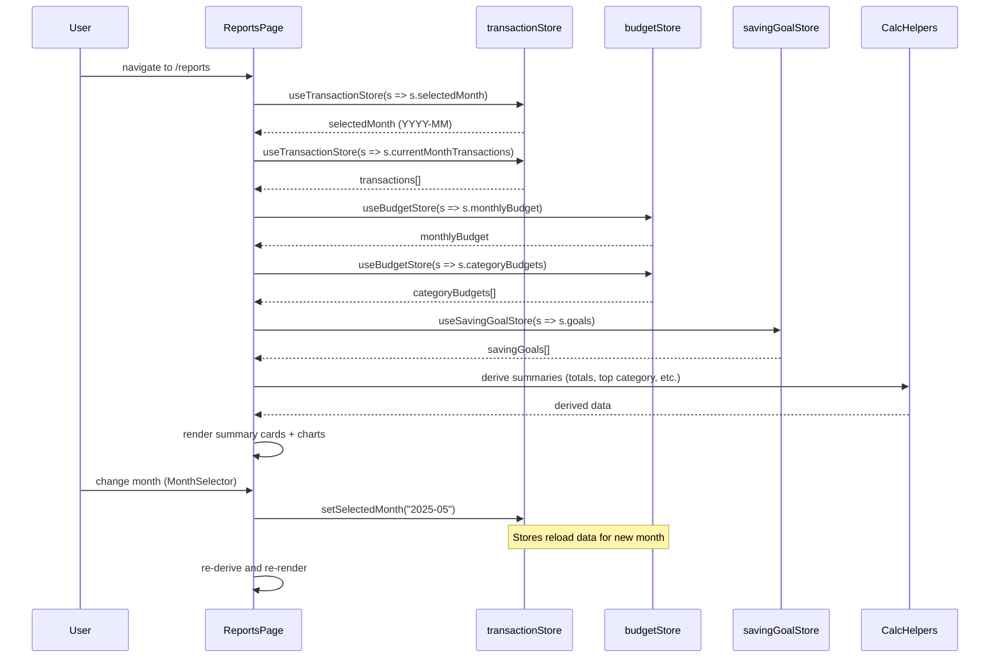
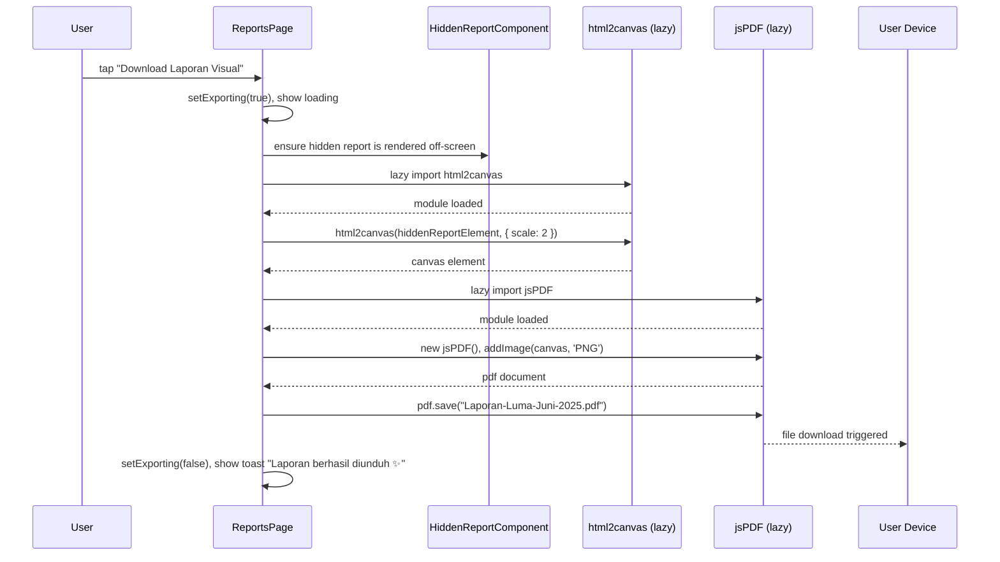
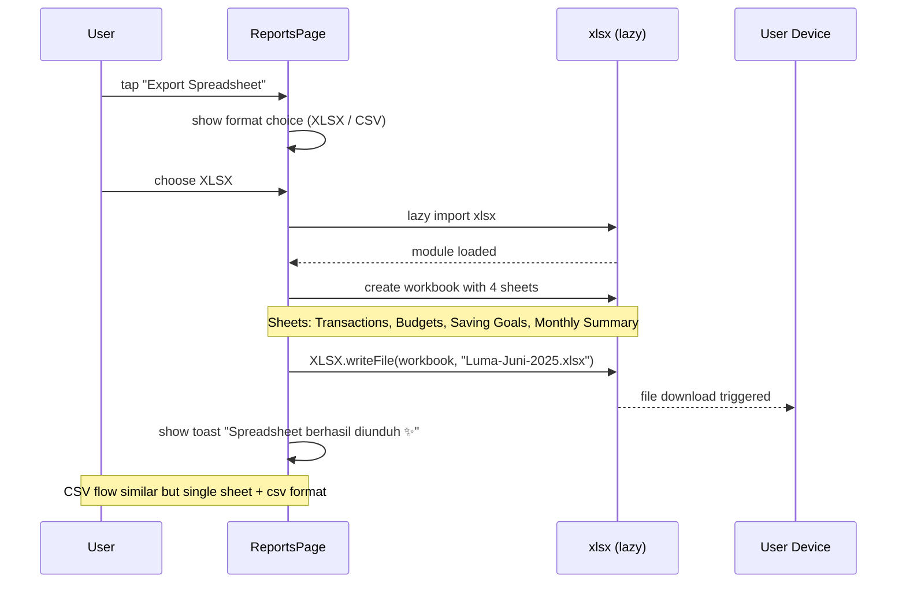

# Design Document: Sprint 8 — Reports + Exports

## Overview

Sprint 8 implements the `ReportsPage` at route `/reports`, serving as the "Laporan" tab in the BottomNav. Per `BUILD_PLAN §15` and `PRD §11, §17`, this page provides monthly financial reports that are useful for both casual and serious users — combining visual summaries, charts, budget comparisons, and exportable reports.

The page loads the selected month's transactions, budgets, and saving goals from their respective stores. A month selector at the top (same pattern as Sprint 6) allows navigation between months. Summary cards show total spending, remaining budget, top category, and biggest transaction. Two Recharts visualizations (category pie/donut chart and daily spending trend line chart) provide visual insights. A budget comparison section shows budget vs actual per category. Export options include a visual PDF report (html2canvas → jsPDF) and spreadsheet export (xlsx → .xlsx, plus .csv). An AI Reflection card placeholder is visible but disabled (Sprint 11 activates it).

All data derivation uses Sprint 2 calc helpers. All amounts are formatted via `formatIDR`. Charts and export modules are lazy-loaded for performance. The page is mobile-first (480px max), uses soft Indonesian copy, and makes no network calls.

---

## Architecture

### Page Composition

```mermaid
graph TD
    RP["ReportsPage"]
    MS["MonthSelector<br/>month picker at top"]
    SC["SummaryCards<br/>total, remaining, top category, biggest"]
    CC["CategoryChart<br/>Recharts pie/donut"]
    TC["SpendingTrendChart<br/>Recharts line chart"]
    BC["BudgetComparisonSection<br/>budget vs actual per category"]
    AI["AIReflectionCard<br/>placeholder, disabled"]
    EA["ExportActions<br/>PDF + XLSX + CSV buttons"]
    HR["HiddenReportComponent<br/>off-screen render target for PDF"]
    BN["BottomNav<br/>(Sprint 1, existing)"]

    RP --> MS
    RP --> SC
    RP --> CC
    RP --> TC
    RP --> BC
    RP --> AI
    RP --> EA
    RP --> HR
    RP --> BN

    classDef sprint8 fill:#E8A857,stroke:#1A1410,color:#1A1410
    classDef existing fill:#8FB896,stroke:#1A1410,color:#1A1410
    classDef disabled fill:#9C8D7B,stroke:#1A1410,color:#1A1410
    class RP,MS,SC,CC,TC,BC,EA,HR sprint8
    class BN existing
    class AI disabled
```



### Data Flow



---

## Sequence Diagrams

### Page Mount & Month Selection



### PDF Visual Report Export Flow



### Spreadsheet Export Flow



---

## Components and Interfaces

### Component: ReportsPage

**Purpose**: Main page component at route `/reports`. Composes month selector, summary cards, charts, budget comparison, AI placeholder, and export actions.

```typescript
// src/pages/ReportsPage.tsx

interface ReportsPageDerivedData {
  totalSpending: number;
  remainingBudget: number | null;  // null if no budget set
  topCategory: { category: CategoryType; total: number } | null;
  biggestTransaction: Transaction | null;
  categoryTotals: Record<CategoryType, number>;
  dailySpending: { date: string; total: number }[];
  budgetComparison: BudgetComparisonItem[];
}

interface BudgetComparisonItem {
  category: CategoryType;
  budgetLimit: number;
  actual: number;
  percentage: number;
}
```

**Responsibilities**:
- Subscribe to transactionStore, budgetStore, savingGoalStore
- Derive summary data using Sprint 2 calc helpers
- Lazy-load chart components and export modules
- Manage export loading states
- Render AI placeholder (disabled)

---

### Component: SummaryCards

**Purpose**: Grid of 4 summary cards showing key monthly financial stats.

```typescript
interface SummaryCardsProps {
  totalSpending: number;
  remainingBudget: number | null;
  topCategory: { category: CategoryType; total: number } | null;
  biggestTransaction: Transaction | null;
}
```

**Visual spec**:
- 2×2 grid layout on mobile
- Each card: radius 24px, padding 16px, `bg-card`
- Card 1: "Total Pengeluaran" + formatIDR(totalSpending)
- Card 2: "Sisa Budget" + formatIDR(remainingBudget) or "Belum diatur"
- Card 3: "Kategori Teratas" + category emoji + name + formatIDR(total)
- Card 4: "Transaksi Terbesar" + detail + formatIDR(nominal)
- Numbers use Fraunces 700, labels DM Sans 13px `text-muted`

---

### Component: CategoryChart

**Purpose**: Recharts pie or donut chart showing spending distribution by category.

```typescript
interface CategoryChartProps {
  categoryTotals: Record<CategoryType, number>;
}
```

**Visual spec**:
- Donut chart (PieChart with inner radius)
- Category colors per DESIGN_SYSTEM category colors
- Legend below chart with category name + percentage
- Total center label: formatIDR(sum)
- Height: ~240px
- Lazy loaded via `React.lazy()`

---

### Component: SpendingTrendChart

**Purpose**: Recharts line chart showing daily spending over the selected month.

```typescript
interface SpendingTrendChartProps {
  dailySpending: { date: string; total: number }[];
  month: string; // YYYY-MM for axis context
}
```

**Visual spec**:
- Line chart with smooth curve (type="monotone")
- X-axis: day numbers (1, 2, 3... 28/30/31)
- Y-axis: spending amount (abbreviated: "15rb", "100rb")
- Line color: `accent-primary` (#E8A857)
- Fill area below line with soft gradient
- Height: ~200px
- Tooltip on tap showing date + formatIDR(amount)
- Lazy loaded via `React.lazy()`

---

### Component: BudgetComparisonSection

**Purpose**: Shows budget vs actual spending per category with progress bars.

```typescript
interface BudgetComparisonSectionProps {
  items: BudgetComparisonItem[];
}
```

**Visual spec**:
- Section title: "Budget vs Aktual"
- Each row: category emoji + name, progress bar, "Rp X / Rp Y"
- Progress bar color: `accent-secondary` (under 75%), `warning-soft` (75-99%), `danger-soft` (100%+)
- Over-budget items show badge "Melebihi budget"
- If no budgets set: show message "Belum ada budget yang diatur"

---

### Component: AIReflectionCard

**Purpose**: Placeholder card for AI behavioral reflection (activated in Sprint 11).

```typescript
interface AIReflectionCardProps {
  disabled: boolean;  // always true for Sprint 8
}
```

**Visual spec**:
- Card with `bg-card-soft`, radius 24px, padding 20px
- Title: "Refleksi AI ✨"
- Body: "Fitur ini akan hadir di update selanjutnya. AI akan membantu kamu memahami pola pengeluaranmu."
- Opacity 0.6, no interactions
- Small sparkle/lock icon indicator

---

### Component: ExportActions

**Purpose**: Export buttons for PDF visual report and spreadsheet download.

```typescript
interface ExportActionsProps {
  onExportPDF: () => void;
  onExportXLSX: () => void;
  onExportCSV: () => void;
  isExporting: boolean;
}
```

**Visual spec**:
- Section title: "Export Laporan"
- Button 1: "📄 Download Laporan Visual" (PDF) — primary style
- Button 2: "📊 Export Spreadsheet (.xlsx)" — secondary style
- Button 3: "📋 Export CSV" — secondary style
- Buttons full-width, stacked vertically, gap 12px
- Loading spinner on active export button when `isExporting`
- Disabled state during export

---

### Component: HiddenReportComponent

**Purpose**: Off-screen rendered component used as source for html2canvas PDF generation.

```typescript
interface HiddenReportComponentProps {
  month: string;
  totalSpending: number;
  remainingBudget: number | null;
  topCategory: { category: CategoryType; total: number } | null;
  categoryTotals: Record<CategoryType, number>;
  dailySpending: { date: string; total: number }[];
  budgetComparison: BudgetComparisonItem[];
}
```

**Visual spec**:
- Positioned off-screen (position: absolute, left: -9999px)
- Fixed width 375px (mobile report width)
- White background for PDF readability
- Contains: month title, summary stats, mini pie chart (static SVG), budget breakdown, Luma branding
- No interactive elements
- Rendered only when export is triggered

---

## Data Models

Sprint 8 introduces no new IndexedDB stores. It uses existing Sprint 2 models:

- `Transaction` (src/types/transaction.ts)
- `MonthlyBudget`, `CategoryBudget` (src/types/budget.ts)
- `SavingGoal`, `SavingGoalContribution` (src/types/savingGoal.ts)
- `CategoryType`, `AccountType` (src/types/transaction.ts)

New runtime-only types (derived data, not persisted):

```typescript
// src/features/reports/types.ts

export interface MonthlyReportData {
  month: string;                        // YYYY-MM
  totalSpending: number;
  remainingBudget: number | null;
  topCategory: { category: CategoryType; total: number } | null;
  biggestTransaction: Transaction | null;
  categoryTotals: Record<CategoryType, number>;
  dailySpending: DailySpendingPoint[];
  budgetComparison: BudgetComparisonItem[];
}

export interface DailySpendingPoint {
  date: string;     // YYYY-MM-DD
  day: number;      // 1-31
  total: number;
}

export interface BudgetComparisonItem {
  category: CategoryType;
  budgetLimit: number;
  actual: number;
  percentage: number;  // actual / budgetLimit * 100
}

export type ExportFormat = "pdf" | "xlsx" | "csv";

export interface SpreadsheetTransactionRow {
  tanggal: string;
  detail: string;
  nominal: number;
  kategori: string;
  akun: string;
  mood: string;
  catatan: string;
}

export interface SpreadsheetBudgetRow {
  kategori: string;
  budget: number;
  aktual: number;
  sisa: number;
  persentase: string;
}

export interface SpreadsheetSavingGoalRow {
  target: string;
  nominal_target: number;
  terkumpul: number;
  progres: string;
  deadline: string;
  status: string;
}

export interface SpreadsheetMonthlySummaryRow {
  metrik: string;
  nilai: string;
}
```

---

## Algorithmic Pseudocode

### Main Processing: Derive Monthly Report Data

```typescript
ALGORITHM deriveMonthlyReport(transactions, monthlyBudget, categoryBudgets)
INPUT:
  transactions: Transaction[] (filtered for selected month)
  monthlyBudget: MonthlyBudget | null
  categoryBudgets: CategoryBudget[]
OUTPUT: MonthlyReportData

PRECONDITION:
  - transactions is an array (may be empty)
  - All transactions belong to the same month
  - monthlyBudget is null if no budget set for this month
  - categoryBudgets contains 0..N category budgets for this month

POSTCONDITION:
  - totalSpending = sum of all transaction nominals
  - remainingBudget = monthlyBudget.totalBudget - totalSpending (or null if no budget)
  - topCategory is the category with highest total, or null if no transactions
  - biggestTransaction is the single transaction with highest nominal, or null if empty
  - categoryTotals maps each active category to its sum
  - dailySpending contains one entry per day of the month (0 for days with no spending)
  - budgetComparison contains one entry per category that has a budget set

BEGIN
  // Step 1: Calculate total spending
  totalSpending ← getMonthlyTotal(transactions)

  // Step 2: Calculate remaining budget
  IF monthlyBudget ≠ null THEN
    remainingBudget ← monthlyBudget.totalBudget - totalSpending
  ELSE
    remainingBudget ← null
  END IF

  // Step 3: Calculate category totals
  categoryTotals ← getCategoryTotals(transactions)

  // Step 4: Find top category
  topCategory ← getTopCategory(transactions)

  // Step 5: Find biggest transaction
  IF transactions.length > 0 THEN
    biggestTransaction ← transactions.reduce((max, tx) =>
      tx.nominal > max.nominal ? tx : max
    )
  ELSE
    biggestTransaction ← null
  END IF

  // Step 6: Build daily spending array
  dailySpending ← buildDailySpending(transactions, month)

  // Step 7: Build budget comparison
  budgetComparison ← buildBudgetComparison(categoryBudgets, categoryTotals)

  RETURN {
    month, totalSpending, remainingBudget, topCategory,
    biggestTransaction, categoryTotals, dailySpending, budgetComparison
  }
END
```

**Loop Invariants:**
- categoryTotals accumulates correctly: after processing N transactions, totals reflect sum of those N
- dailySpending always has exactly daysInMonth entries

---

### Build Daily Spending Array

```typescript
ALGORITHM buildDailySpending(transactions, month)
INPUT:
  transactions: Transaction[] (same month)
  month: string (YYYY-MM)
OUTPUT: DailySpendingPoint[]

PRECONDITION:
  - All transactions have date in YYYY-MM-DD format
  - month is valid YYYY-MM

POSTCONDITION:
  - Result has exactly daysInMonth(month) entries
  - Each entry.day is 1..daysInMonth
  - Each entry.total = sum of transactions on that day
  - Days with no transactions have total = 0
  - Sum of all entry.total = totalSpending

BEGIN
  daysCount ← getDaysInMonth(month)
  dailyMap ← new Map<number, number>()

  // Initialize all days to 0
  FOR day FROM 1 TO daysCount DO
    dailyMap.set(day, 0)
  END FOR

  // Accumulate transaction totals per day
  FOR EACH tx IN transactions DO
    day ← extractDay(tx.date)
    dailyMap.set(day, dailyMap.get(day) + tx.nominal)
  END FOR

  // Convert to array
  result ← []
  FOR day FROM 1 TO daysCount DO
    result.push({
      date: formatDate(month, day),
      day: day,
      total: dailyMap.get(day)
    })
  END FOR

  RETURN result
END
```

**Loop Invariants:**
- After processing each transaction, dailyMap[day] reflects sum of all processed transactions for that day
- Result array length always equals daysInMonth

---

### Build Budget Comparison

```typescript
ALGORITHM buildBudgetComparison(categoryBudgets, categoryTotals)
INPUT:
  categoryBudgets: CategoryBudget[]
  categoryTotals: Record<CategoryType, number>
OUTPUT: BudgetComparisonItem[]

PRECONDITION:
  - categoryBudgets is an array (may be empty)
  - categoryTotals maps categories to their spending totals (0 for no spending)

POSTCONDITION:
  - Result has one entry per categoryBudget
  - Each entry.actual = categoryTotals[category] or 0 if category not in totals
  - Each entry.percentage = (actual / budgetLimit) * 100
  - percentage may exceed 100 (over-budget)

BEGIN
  result ← []

  FOR EACH budget IN categoryBudgets DO
    actual ← categoryTotals[budget.category] ?? 0
    percentage ← budget.limit > 0 ? (actual / budget.limit) * 100 : 0

    result.push({
      category: budget.category,
      budgetLimit: budget.limit,
      actual: actual,
      percentage: percentage
    })
  END FOR

  RETURN result
END
```

---

### PDF Export Algorithm

```typescript
ALGORITHM exportVisualPDF(hiddenElement, month)
INPUT:
  hiddenElement: HTMLElement (the hidden report DOM node)
  month: string (YYYY-MM, for filename)
OUTPUT: void (triggers file download)

PRECONDITION:
  - hiddenElement is rendered and has dimensions > 0
  - html2canvas and jsPDF modules are available (lazy loaded)

POSTCONDITION:
  - A PDF file is downloaded to user's device
  - Filename format: "Laporan-Luma-{MonthName}-{Year}.pdf"
  - PDF contains the rendered visual report at 2x resolution
  - No data is sent over the network

BEGIN
  // Step 1: Lazy import dependencies
  html2canvas ← await import("html2canvas")
  jsPDF ← await import("jspdf")

  // Step 2: Render element to canvas
  canvas ← await html2canvas(hiddenElement, {
    scale: 2,
    useCORS: false,
    backgroundColor: "#FFFFFF"
  })

  // Step 3: Create PDF
  imgData ← canvas.toDataURL("image/png")
  pageWidth ← 210  // A4 mm
  pageHeight ← (canvas.height * pageWidth) / canvas.width

  pdf ← new jsPDF("p", "mm", "a4")
  pdf.addImage(imgData, "PNG", 0, 0, pageWidth, pageHeight)

  // Step 4: Handle multi-page if content exceeds A4
  IF pageHeight > 297 THEN
    // Split into multiple pages
    handleMultiPagePDF(pdf, canvas, pageWidth)
  END IF

  // Step 5: Save
  filename ← `Laporan-Luma-${formatMonthLabel(month).replace(" ", "-")}.pdf`
  pdf.save(filename)
END
```

---

### Spreadsheet Export Algorithm

```typescript
ALGORITHM exportSpreadsheet(transactions, budgetComparison, savingGoals, reportData, format, month)
INPUT:
  transactions: Transaction[]
  budgetComparison: BudgetComparisonItem[]
  savingGoals: SavingGoal[]
  reportData: MonthlyReportData
  format: "xlsx" | "csv"
  month: string (YYYY-MM)
OUTPUT: void (triggers file download)

PRECONDITION:
  - xlsx module is available (lazy loaded)
  - All input arrays are valid (may be empty)

POSTCONDITION:
  - For XLSX: file with 4 sheets is downloaded
  - For CSV: single file with transactions data is downloaded
  - Filename format: "Luma-{MonthName}-{Year}.{xlsx|csv}"
  - No data is sent over the network

BEGIN
  XLSX ← await import("xlsx")

  // Step 1: Build Transactions sheet
  txSheet ← transactions.map(tx => ({
    Tanggal: tx.date,
    Detail: tx.detail,
    Nominal: tx.nominal,
    Kategori: tx.category,
    Akun: tx.account,
    Mood: tx.mood ?? "",
    Catatan: tx.note ?? ""
  }))

  IF format = "csv" THEN
    worksheet ← XLSX.utils.json_to_sheet(txSheet)
    workbook ← XLSX.utils.book_new()
    XLSX.utils.book_append_sheet(workbook, worksheet, "Transactions")
    XLSX.writeFile(workbook, filename + ".csv", { bookType: "csv" })
    RETURN
  END IF

  // Step 2: Build Budgets sheet
  budgetSheet ← budgetComparison.map(item => ({
    Kategori: item.category,
    Budget: item.budgetLimit,
    Aktual: item.actual,
    Sisa: item.budgetLimit - item.actual,
    Persentase: `${Math.round(item.percentage)}%`
  }))

  // Step 3: Build Saving Goals sheet
  goalsSheet ← savingGoals.map(goal => ({
    Target: goal.title,
    "Nominal Target": goal.targetAmount,
    Terkumpul: goal.currentAmount,
    Progres: `${Math.round((goal.currentAmount / goal.targetAmount) * 100)}%`,
    Deadline: goal.deadline ?? "-",
    Status: goal.status
  }))

  // Step 4: Build Monthly Summary sheet
  summarySheet ← [
    { Metrik: "Total Pengeluaran", Nilai: formatIDR(reportData.totalSpending) },
    { Metrik: "Sisa Budget", Nilai: reportData.remainingBudget != null ? formatIDR(reportData.remainingBudget) : "Belum diatur" },
    { Metrik: "Kategori Teratas", Nilai: reportData.topCategory ? `${reportData.topCategory.category} (${formatIDR(reportData.topCategory.total)})` : "-" },
    { Metrik: "Transaksi Terbesar", Nilai: reportData.biggestTransaction ? `${reportData.biggestTransaction.detail} (${formatIDR(reportData.biggestTransaction.nominal)})` : "-" },
    { Metrik: "Jumlah Transaksi", Nilai: String(transactions.length) }
  ]

  // Step 5: Create workbook with all sheets
  workbook ← XLSX.utils.book_new()
  XLSX.utils.book_append_sheet(workbook, XLSX.utils.json_to_sheet(txSheet), "Transactions")
  XLSX.utils.book_append_sheet(workbook, XLSX.utils.json_to_sheet(budgetSheet), "Budgets")
  XLSX.utils.book_append_sheet(workbook, XLSX.utils.json_to_sheet(goalsSheet), "Saving Goals")
  XLSX.utils.book_append_sheet(workbook, XLSX.utils.json_to_sheet(summarySheet), "Monthly Summary")

  // Step 6: Save
  filename ← `Luma-${formatMonthLabel(month).replace(" ", "-")}.xlsx`
  XLSX.writeFile(workbook, filename)
END
```

---

## Key Functions with Formal Specifications

### deriveMonthlyReport()

```typescript
// src/features/reports/reportHelpers.ts
export function deriveMonthlyReport(
  transactions: Transaction[],
  monthlyBudget: MonthlyBudget | null,
  categoryBudgets: CategoryBudget[],
  month: string
): MonthlyReportData
```

**Preconditions:**
- `transactions` is an array (may be empty)
- All transactions have `month` field matching the provided `month` parameter
- `monthlyBudget` is null or a valid MonthlyBudget for this month
- `categoryBudgets` is an array of CategoryBudget for this month
- `month` matches /^\d{4}-\d{2}$/

**Postconditions:**
- `totalSpending` = sum of all `transaction.nominal` values (≥ 0)
- `remainingBudget` = `monthlyBudget.totalBudget - totalSpending` if budget exists, else null
- `topCategory` = category with highest total spending, null if no transactions
- `biggestTransaction` = transaction with highest nominal, null if no transactions
- `categoryTotals` accurately maps each spent category to its sum
- `dailySpending` has exactly `daysInMonth(month)` entries
- `budgetComparison` has one entry per categoryBudget

**Loop Invariants:**
- Running total accumulates correctly across transactions
- Category map always reflects totals for all processed transactions

---

### buildDailySpending()

```typescript
// src/features/reports/reportHelpers.ts
export function buildDailySpending(
  transactions: Transaction[],
  month: string
): DailySpendingPoint[]
```

**Preconditions:**
- `transactions` is an array of transactions in the given month
- `month` is a valid YYYY-MM string

**Postconditions:**
- Result length = number of days in the given month
- Each point has `day` from 1 to daysInMonth
- Each point has `total` ≥ 0
- Sum of all `point.total` = sum of all `transaction.nominal`
- Days without transactions have `total` = 0

**Loop Invariants:**
- After processing N transactions, daily totals reflect exactly those N transactions' contributions

---

### buildBudgetComparison()

```typescript
// src/features/reports/reportHelpers.ts
export function buildBudgetComparison(
  categoryBudgets: CategoryBudget[],
  categoryTotals: Record<string, number>
): BudgetComparisonItem[]
```

**Preconditions:**
- `categoryBudgets` is an array (may be empty)
- `categoryTotals` maps category names to spending totals (≥ 0)
- Each budget has `limit` > 0

**Postconditions:**
- Result length = `categoryBudgets.length`
- Each item: `actual` = `categoryTotals[category]` or 0
- Each item: `percentage` = `(actual / budgetLimit) * 100`
- Percentage may exceed 100 (over-budget is valid)
- Categories without budgets are excluded from result

**Loop Invariants:** N/A (single pass)

---

### exportVisualPDF()

```typescript
// src/features/reports/exportPDF.ts
export async function exportVisualPDF(
  hiddenElement: HTMLElement,
  month: string
): Promise<void>
```

**Preconditions:**
- `hiddenElement` is a valid DOM node with rendered content
- `hiddenElement` has width > 0 and height > 0
- `month` is valid YYYY-MM for filename generation

**Postconditions:**
- A PDF file download is triggered in the browser
- Filename follows pattern: "Laporan-Luma-{Month}-{Year}.pdf"
- PDF contains rendered visual at 2x resolution on A4 page(s)
- No network requests made
- Function resolves (no throw) on success

**Loop Invariants:** N/A

---

### exportSpreadsheet()

```typescript
// src/features/reports/exportSpreadsheet.ts
export async function exportSpreadsheet(
  transactions: Transaction[],
  budgetComparison: BudgetComparisonItem[],
  savingGoals: SavingGoal[],
  reportData: MonthlyReportData,
  format: "xlsx" | "csv",
  month: string
): Promise<void>
```

**Preconditions:**
- All input arrays are valid (may be empty)
- `format` is "xlsx" or "csv"
- `month` is valid YYYY-MM

**Postconditions:**
- For "xlsx": file with 4 sheets (Transactions, Budgets, Saving Goals, Monthly Summary) is downloaded
- For "csv": single CSV file with transactions data is downloaded
- Filename follows pattern: "Luma-{Month}-{Year}.{xlsx|csv}"
- No network requests made
- Function resolves on success

**Loop Invariants:** N/A

---

## Example Usage

```typescript
// ReportsPage.tsx — main composition
import { useTransactionStore } from "@/stores/transactionStore";
import { useBudgetStore } from "@/stores/budgetStore";
import { useSavingGoalStore } from "@/stores/savingGoalStore";
import { deriveMonthlyReport } from "@/features/reports/reportHelpers";
import { navigateMonth, formatMonthLabel } from "@/features/transactions/monthNav";
import { formatIDR } from "@/lib/format";
import { lazy, Suspense, useMemo, useRef, useState } from "react";

const CategoryChart = lazy(() => import("@/components/charts/CategoryChart"));
const SpendingTrendChart = lazy(() => import("@/components/charts/SpendingTrendChart"));

export function ReportsPage() {
  const selectedMonth = useTransactionStore((s) => s.selectedMonth);
  const transactions = useTransactionStore((s) => s.currentMonthTransactions);
  const setSelectedMonth = useTransactionStore((s) => s.setSelectedMonth);
  const monthlyBudget = useBudgetStore((s) => s.monthlyBudget);
  const categoryBudgets = useBudgetStore((s) => s.categoryBudgets);
  const savingGoals = useSavingGoalStore((s) => s.goals);

  const hiddenReportRef = useRef<HTMLDivElement>(null);
  const [isExporting, setIsExporting] = useState(false);

  // Derive all report data
  const reportData = useMemo(
    () => deriveMonthlyReport(transactions, monthlyBudget, categoryBudgets, selectedMonth),
    [transactions, monthlyBudget, categoryBudgets, selectedMonth]
  );

  const handleExportPDF = async () => {
    if (!hiddenReportRef.current) return;
    setIsExporting(true);
    try {
      const { exportVisualPDF } = await import("@/features/reports/exportPDF");
      await exportVisualPDF(hiddenReportRef.current, selectedMonth);
      showToast("Laporan berhasil diunduh ✨");
    } finally {
      setIsExporting(false);
    }
  };

  const handleExportSpreadsheet = async (format: "xlsx" | "csv") => {
    setIsExporting(true);
    try {
      const { exportSpreadsheet } = await import("@/features/reports/exportSpreadsheet");
      await exportSpreadsheet(
        transactions, reportData.budgetComparison,
        savingGoals, reportData, format, selectedMonth
      );
      showToast("Spreadsheet berhasil diunduh ✨");
    } finally {
      setIsExporting(false);
    }
  };

  return (
    <PageWrapper>
      <MonthSelector
        selectedMonth={selectedMonth}
        onMonthChange={(dir) => {
          const m = navigateMonth(selectedMonth, dir);
          if (m) setSelectedMonth(m);
        }}
      />

      <SummaryCards
        totalSpending={reportData.totalSpending}
        remainingBudget={reportData.remainingBudget}
        topCategory={reportData.topCategory}
        biggestTransaction={reportData.biggestTransaction}
      />

      <Suspense fallback={<ChartSkeleton />}>
        <CategoryChart categoryTotals={reportData.categoryTotals} />
        <SpendingTrendChart
          dailySpending={reportData.dailySpending}
          month={selectedMonth}
        />
      </Suspense>

      <BudgetComparisonSection items={reportData.budgetComparison} />

      <AIReflectionCard disabled={true} />

      <ExportActions
        onExportPDF={handleExportPDF}
        onExportXLSX={() => handleExportSpreadsheet("xlsx")}
        onExportCSV={() => handleExportSpreadsheet("csv")}
        isExporting={isExporting}
      />

      {/* Hidden off-screen component for PDF rendering */}
      <HiddenReportComponent ref={hiddenReportRef} {...reportData} month={selectedMonth} />
    </PageWrapper>
  );
}
```

```typescript
// Report data derivation example
import { deriveMonthlyReport } from "@/features/reports/reportHelpers";

const transactions = [
  { id: "1", detail: "Bakso", nominal: 15000, category: "Food", date: "2025-06-01", ... },
  { id: "2", detail: "Grab", nominal: 25000, category: "Transport", date: "2025-06-01", ... },
  { id: "3", detail: "Album IU", nominal: 250000, category: "Entertainment", date: "2025-06-05", ... },
];
const monthlyBudget = { totalBudget: 2000000, month: "2025-06", ... };
const categoryBudgets = [
  { category: "Food", limit: 800000, month: "2025-06", ... },
  { category: "Entertainment", limit: 400000, month: "2025-06", ... },
];

const report = deriveMonthlyReport(transactions, monthlyBudget, categoryBudgets, "2025-06");
// report.totalSpending = 290000
// report.remainingBudget = 1710000
// report.topCategory = { category: "Entertainment", total: 250000 }
// report.biggestTransaction = { detail: "Album IU", nominal: 250000, ... }
// report.categoryTotals = { Food: 15000, Transport: 25000, Entertainment: 250000 }
// report.dailySpending = [{ day: 1, total: 40000 }, ..., { day: 5, total: 250000 }, ...]
// report.budgetComparison = [
//   { category: "Food", budgetLimit: 800000, actual: 15000, percentage: 1.875 },
//   { category: "Entertainment", budgetLimit: 400000, actual: 250000, percentage: 62.5 }
// ]
```

```typescript
// Export usage examples
import { exportVisualPDF } from "@/features/reports/exportPDF";
import { exportSpreadsheet } from "@/features/reports/exportSpreadsheet";

// PDF export
const element = document.getElementById("hidden-report")!;
await exportVisualPDF(element, "2025-06");
// → downloads "Laporan-Luma-Juni-2025.pdf"

// XLSX export
await exportSpreadsheet(transactions, budgetComparison, goals, reportData, "xlsx", "2025-06");
// → downloads "Luma-Juni-2025.xlsx" with 4 sheets

// CSV export
await exportSpreadsheet(transactions, [], [], reportData, "csv", "2025-06");
// → downloads "Luma-Juni-2025.csv" with transactions only
```

---

## Correctness Properties

### Property 1: Total spending equals sum of transactions

*For all* `transactions[]`: `deriveMonthlyReport(transactions, ...).totalSpending === transactions.reduce((sum, tx) => sum + tx.nominal, 0)`

**Validates: Requirements 1.2**

---

### Property 2: Remaining budget correctness

*For all* `(transactions, monthlyBudget)` where `monthlyBudget ≠ null`: `deriveMonthlyReport(transactions, monthlyBudget, ...).remainingBudget === monthlyBudget.totalBudget - totalSpending`

**Validates: Requirements 1.3**

---

### Property 3: Daily spending sum equals total spending

*For all* `transactions[]`: `sum(dailySpending.map(d => d.total)) === totalSpending`

**Validates: Requirements 3.1**

---

### Property 4: Daily spending array length equals days in month

*For all* `month`: `buildDailySpending(transactions, month).length === getDaysInMonth(month)`

**Validates: Requirements 3.2**

---

### Property 5: Budget comparison percentage correctness

*For all* `BudgetComparisonItem`: `item.percentage === (item.actual / item.budgetLimit) * 100`

**Validates: Requirements 5.1**

---

### Property 6: Top category is the actual maximum

*For all* `transactions[]` where `transactions.length > 0`: `topCategory.total >= categoryTotals[anyOtherCategory]`

**Validates: Requirements 1.4**

---

### Property 7: Biggest transaction is the actual maximum

*For all* `transactions[]` where `transactions.length > 0`: `biggestTransaction.nominal >= max(allOtherTransactions.nominal)`

**Validates: Requirements 1.5**

---

### Property 8: XLSX has exactly 4 sheets

*For all* exports with format "xlsx": the workbook contains sheets named "Transactions", "Budgets", "Saving Goals", "Monthly Summary".

**Validates: Requirements 7.3**

---

### Property 9: CSV contains all transactions

*For all* exports with format "csv": the output has exactly `transactions.length + 1` rows (header + data).

**Validates: Requirements 7.4**

---

### Property 10: formatIDR is applied to all displayed amounts

*For all* rendered monetary values in SummaryCards, BudgetComparisonSection, and HiddenReportComponent: the displayed string matches `formatIDR(numericValue)` pattern.

**Validates: Requirements 8.1**

---

## Error Handling

### Error Scenario 1: Export fails (html2canvas error)

**Condition**: html2canvas throws during canvas rendering (e.g., memory constraints on mobile)
**Response**: Catch error, reset `isExporting` to false, show toast "Gagal membuat laporan, coba lagi ya"
**Recovery**: User can retry; hidden component remains rendered

### Error Scenario 2: XLSX write fails

**Condition**: xlsx library throws during workbook creation or file save
**Response**: Catch error, reset `isExporting` to false, show toast "Gagal export spreadsheet, coba lagi ya"
**Recovery**: User can retry with same or different format

### Error Scenario 3: No data for selected month

**Condition**: No transactions exist for the selected month
**Response**: Show empty state message "Belum ada data untuk bulan ini. Catat transaksi dulu yuk! ✨"
**Recovery**: Charts render with empty/zero state, export buttons still functional (produces empty report)

### Error Scenario 4: Missing budget data

**Condition**: No monthly budget or category budgets set for selected month
**Response**: Summary card shows "Belum diatur" for remaining budget; budget comparison section shows helpful message
**Recovery**: Non-blocking — other report sections render normally

---

## Testing Strategy

### Unit Testing Approach

- Test `deriveMonthlyReport()` with various transaction sets
- Test `buildDailySpending()` for correct day mapping and totals
- Test `buildBudgetComparison()` for percentage calculation accuracy
- Test edge cases: empty transactions, zero budgets, single transaction months

### Property-Based Testing Approach

**Property Test Library**: fast-check

- P1: Total spending sum correctness
- P2: Remaining budget arithmetic
- P3: Daily spending sum invariant
- P4: Daily spending array length
- P5: Budget comparison percentage
- P6: Top category maximality
- P7: Biggest transaction maximality
- P8: XLSX sheet count
- P9: CSV row count

### Integration Testing Approach

- Mount ReportsPage with mocked stores
- Verify summary cards render correct values
- Verify charts receive correct props
- Verify export buttons trigger correct download flows
- Verify month navigation updates all derived data
- Verify AI placeholder is visible but non-interactive

---

## Performance Considerations

- **Lazy loading**: Charts (`CategoryChart`, `SpendingTrendChart`) and export modules (`exportPDF`, `exportSpreadsheet`) loaded via dynamic `import()` / `React.lazy()`
- **Memoization**: `deriveMonthlyReport()` wrapped in `useMemo()` to prevent recalculation on unrelated re-renders
- **Hidden report**: Rendered only when export is triggered (conditional render or always off-screen — prefer always off-screen for instant export)
- **Chart data**: Pre-computed once per month change, not on every render
- **Bundle splitting**: html2canvas (~200KB), jsPDF (~300KB), xlsx (~90KB) are heavy — lazy import keeps initial page load fast

---

## Security Considerations

- No network calls — all data stays local
- PDF/XLSX files contain user's financial data — exported to device only
- No external service receives transaction data
- File downloads use browser's native save mechanism

---

## Dependencies

- **Recharts** (existing): PieChart, LineChart components for visualizations
- **html2canvas** (existing): DOM-to-canvas rendering for PDF export
- **jsPDF** (existing): Canvas-to-PDF conversion and file save
- **xlsx** (existing): Spreadsheet workbook creation and file export
- **Sprint 2 calc helpers** (existing): `getMonthlyTotal`, `getCategoryTotals`, `getTopCategory`, `getRemainingBudget`
- **Sprint 6 MonthSelector** (existing): Reuse month navigation component
- **formatIDR** (existing): Currency formatting utility from `src/lib/format.ts`
- **date-fns** (existing): `getDaysInMonth`, date parsing utilities
