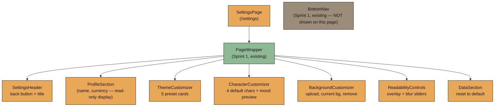
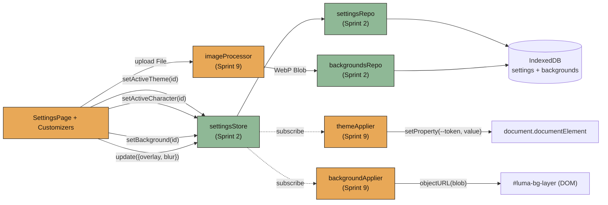
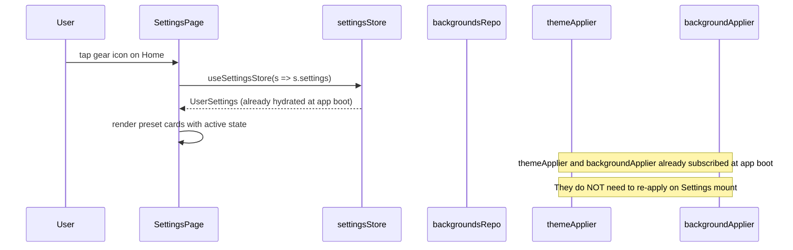
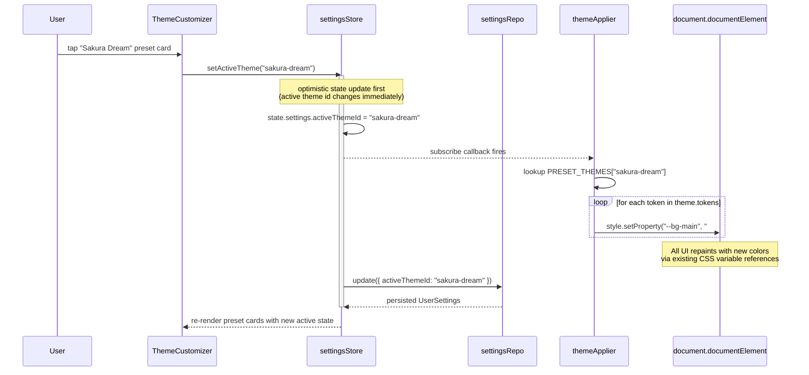
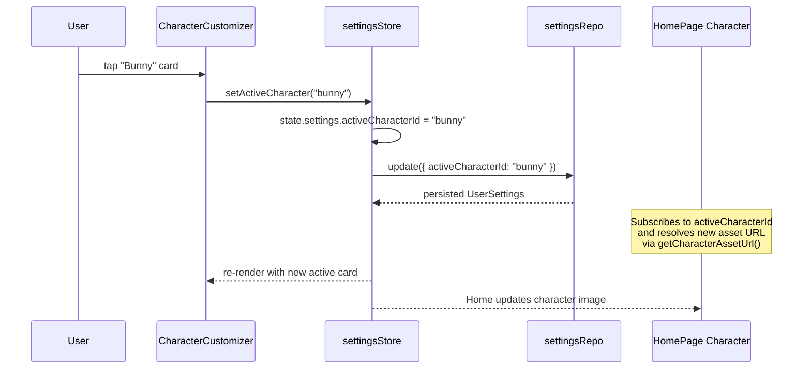
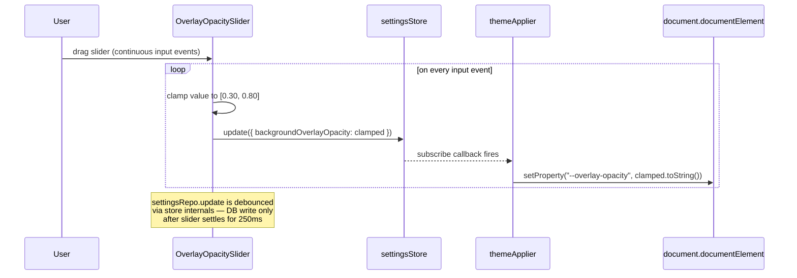
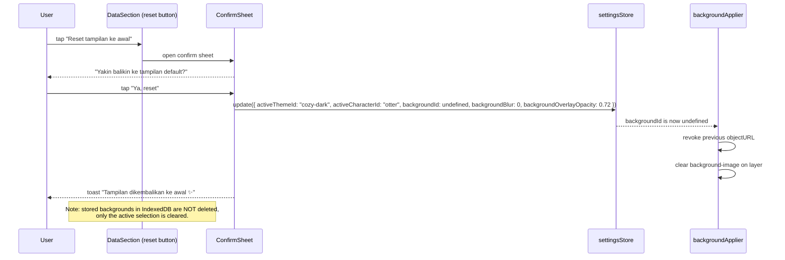

# Design Document: Sprint 9 — Customization System

## Overview

Sprint 9 implements Luma's **Customization System** — the user-facing space where the app stops being "a finance tool" and starts feeling personal. Per `BUILD_PLAN §16`, `PRD §7/§8/§12/§15`, and `WORKFLOW §10–§13`, this sprint delivers the `SettingsPage` at route `/settings` (accessed via the gear icon in the Home header — **never** from `BottomNav`), composing four customizers: **ThemeCustomizer**, **CharacterCustomizer**, **BackgroundCustomizer**, and overlay/blur sliders for readability.

The page is built around three pillars from `DESIGN_SYSTEM §3`:
1. **Live preview** — every change applies instantly. There is no "Apply" button. The user sees the impact on the next tick.
2. **Readability before decoration** — overlay opacity is mandatory and clamped to a safe range (`30–80%` per `DESIGN_SYSTEM §9`). The user cannot make text unreadable.
3. **Personal but controlled** — backgrounds are user-uploaded but processed: resized to ≤1080px wide, converted to WebP via `canvas.toBlob`, and stored as `Blob` in IndexedDB (never base64) per `TECHNICAL_ARCHITECTURE §18`.

The technical heart of the system is a thin `themeApplier` module that mutates `document.documentElement.style` directly via CSS variables (`TECHNICAL_ARCHITECTURE §19`). This means **zero component rewrites** when the theme changes — every existing card, button, and chart already reads from `--bg-main`, `--accent-primary`, etc. Theme switching is a one-liner per token.

Backgrounds use a separate `backgroundApplier` module that creates an object URL from the stored Blob and sets it on a fixed-position layer behind `PageWrapper`. Object URLs are revoked when the active background changes to prevent memory leaks. Characters are bundled SVG/PNG/WebP assets in `public/characters/{id}/{state}.{ext}`, resolved by `getCharacterAssetUrl(characterId, state)` — no IndexedDB writes for default characters in this sprint.

All persistence flows through the **Sprint 2** `settingsStore` and `backgroundsRepo`. This sprint does **not** introduce new IndexedDB stores; it only adds preset data files (`themes/presets.ts`, `characters/presets.ts`) and three feature modules (`themeApplier.ts`, `backgroundApplier.ts`, `imageProcessor.ts`).

---

## Architecture

### Page Composition



> **Note:** `BottomNav` is hidden on `/settings`. Settings is reached via the gear icon in `HomePage` header only.

### Data Flow



### File Layout

```txt
src/
├── pages/
│   └── SettingsPage.tsx                    [new]
├── features/
│   └── customization/
│       ├── themeApplier.ts                 [new]
│       ├── backgroundApplier.ts            [new]
│       ├── imageProcessor.ts               [new]
│       ├── characterAssets.ts              [new]
│       └── types.ts                        [new]
├── components/
│   └── customization/                      [new folder]
│       ├── ThemeCustomizer.tsx
│       ├── ThemePresetCard.tsx
│       ├── CharacterCustomizer.tsx
│       ├── CharacterPresetCard.tsx
│       ├── BackgroundCustomizer.tsx
│       ├── BackgroundUploader.tsx
│       ├── ReadabilityControls.tsx
│       ├── OverlayOpacitySlider.tsx
│       └── BackgroundBlurSlider.tsx
├── lib/
│   └── themes/
│       ├── presets.ts                      [new] — 5 preset themes
│       └── tokens.ts                       [new] — token name list
├── lib/
│   └── characters/
│       └── presets.ts                      [new] — 4 default characters
└── public/
    └── characters/
        ├── otter/{happy,chill,worried,panic}.webp     [new asset]
        ├── cat/...                                    [new asset]
        ├── bunny/...                                  [new asset]
        └── hamster/...                                [new asset]
```

---

## Sequence Diagrams

### Page Mount → Hydration → Apply Active Customizations



### Theme Switch (Live Preview)



### Character Switch (Live Preview)



### Background Upload Flow

```mermaid
sequenceDiagram
    participant User
    participant BU as BackgroundUploader
    participant IP as imageProcessor
    participant Canvas as HTMLCanvasElement
    participant BR as backgroundsRepo
    participant SS as settingsStore
    participant BA as backgroundApplier
    participant Layer as #luma-bg-layer DOM

    User->>BU: select File via <input type="file">
    BU->>BU: validate mime type (jpeg|png|webp)
    alt invalid type
        BU-->>User: toast "Format gambar belum didukung ya 🙏"
    else valid
        BU->>BU: setUploading(true)
        BU->>IP: processBackgroundImage(file)
        IP->>IP: createImageBitmap(file)
        IP->>Canvas: drawImage with target width 1080px
        IP->>Canvas: toBlob("image/webp", 0.85)
        Canvas-->>IP: WebP Blob
        alt blob.size > 5_000_000
            IP-->>BU: warn "Hasil kompresi masih cukup besar"
        end
        IP-->>BU: { blob, width, height, sizeBytes }
        BU->>BR: backgroundsRepo.create({ name, blob, mimeType: "image/webp", width, height })
        BR-->>BU: BackgroundAsset (with id)
        BU->>SS: setBackground(asset.id)
        SS-->>BA: subscribe callback fires
        BA->>BR: backgroundsRepo.getById(id)
        BR-->>BA: BackgroundAsset
        BA->>BA: revoke previous objectURL (if any)
        BA->>BA: url = URL.createObjectURL(blob)
        BA->>Layer: layer.style.backgroundImage = `url(${url})`
        BU->>BU: setUploading(false), toast "Background terpasang ✨"
    end
```



### Overlay/Blur Slider (Continuous Update)



### Reset to Default



---

## Components and Interfaces

### Component: SettingsPage

**Purpose:** Main page at route `/settings`. Composes header, profile, three customizers, readability controls, and reset section.

```typescript
// src/pages/SettingsPage.tsx
export interface SettingsPageProps {} // no props — reads from settingsStore

export function SettingsPage(): JSX.Element;
```

**Responsibilities:**
- Subscribe to `settingsStore` for active theme/character/background ids and overlay/blur values.
- Render in this order: SettingsHeader → ProfileSection → ThemeCustomizer → CharacterCustomizer → BackgroundCustomizer → ReadabilityControls → DataSection.
- Hide `BottomNav` (the route layout opts out).
- Show a soft loading skeleton if `settings` is null while hydrating.

**Visual spec:**
- Page padding `20px` (matches `DESIGN_SYSTEM §8`).
- Section spacing `24px` between customizers.
- Each customizer wrapped in a `Card` with title (Fraunces 18/700) and optional helper copy (DM Sans 13/400 `text-muted`).

---

### Component: ThemeCustomizer

**Purpose:** Grid of 5 preset theme cards with live-preview color swatches.

```typescript
// src/components/customization/ThemeCustomizer.tsx
export interface ThemeCustomizerProps {
  activeThemeId: string;
  onSelect: (themeId: string) => void;  // calls settingsStore.setActiveTheme
}

export function ThemeCustomizer(props: ThemeCustomizerProps): JSX.Element;
```

**Responsibilities:**
- Map `PRESET_THEMES` array to a 2-column grid of `ThemePresetCard`.
- Highlight the card whose `id === activeThemeId` with a soft accent border.
- On tap, call `onSelect(themeId)`.

**Visual spec:**
- 2-column grid, gap `12px`.
- Each card: radius `20px`, padding `12px`, height `~120px`.
- Inside card: name (Fraunces 16/700) + 4 color swatches (small rounded squares showing `bgMain`, `bgCard`, `accentPrimary`, `accentSecondary`).
- Active state: 2px border `--accent-primary`, soft inner shadow.

---

### Component: ThemePresetCard

```typescript
export interface ThemePresetCardProps {
  theme: ThemePreset;
  isActive: boolean;
  onTap: () => void;
}
```

---

### Component: CharacterCustomizer

**Purpose:** Horizontal scroll/wrap of 4 default character cards with mood preview.

```typescript
// src/components/customization/CharacterCustomizer.tsx
export interface CharacterCustomizerProps {
  activeCharacterId: string;
  onSelect: (characterId: string) => void;  // calls settingsStore.setActiveCharacter
}

export function CharacterCustomizer(props: CharacterCustomizerProps): JSX.Element;
```

**Responsibilities:**
- Map `PRESET_CHARACTERS` array (Otter, Cat, Bunny, Hamster) to `CharacterPresetCard`.
- Show each card's `happy` state image as the preview thumbnail.
- Optionally render a small "mood strip" below the active card showing the same character in all 4 mood states (`happy`, `chill`, `worried`, `panic`) for live preview.
- On tap, call `onSelect(characterId)`.

**Visual spec:**
- 2-column grid (or 4-column horizontal scroll if width permits), gap `12px`.
- Each card: radius `20px`, padding `12px`, height `~140px`.
- Image: `64×64px`, centered above the name.
- Active state: 2px border `--accent-primary`.
- Mood strip below grid (only when active changes): 4 small `32×32px` thumbnails with mood emoji label.

---

### Component: CharacterPresetCard

```typescript
export interface CharacterPresetCardProps {
  character: CharacterPreset;
  isActive: boolean;
  onTap: () => void;
}
```

---

### Component: BackgroundCustomizer

**Purpose:** Upload, preview, and remove the active background image.

```typescript
// src/components/customization/BackgroundCustomizer.tsx
export interface BackgroundCustomizerProps {
  activeBackgroundId: string | undefined;
  onUpload: (file: File) => Promise<void>;     // delegates to imageProcessor + backgroundsRepo
  onClear: () => void;                         // calls settingsStore.setBackground(undefined)
  isUploading: boolean;
}

export function BackgroundCustomizer(props: BackgroundCustomizerProps): JSX.Element;
```

**Responsibilities:**
- Show current background thumbnail (via `URL.createObjectURL(blob)`) when `activeBackgroundId` is set.
- Render `BackgroundUploader` (file input wrapped in styled button).
- Render "Hapus background" secondary button when an active background exists.
- Show loading spinner inside the upload button while `isUploading`.

**Visual spec:**
- Active thumbnail: `width: 100%, height: 140px, radius: 20px, object-fit: cover`, with overlay sample showing how text will look on top.
- Upload button: full-width primary-style "📷 Upload background".
- Clear button: full-width secondary "Hapus background".
- Helper copy: "Gambar otomatis dikompres biar app tetap ringan ✨" (DM Sans 12/400 muted).

---

### Component: BackgroundUploader

```typescript
export interface BackgroundUploaderProps {
  onFile: (file: File) => void;
  isUploading: boolean;
  acceptedTypes: readonly ["image/jpeg", "image/png", "image/webp"];
}
```

**Behavior:**
- Hidden `<input type="file" accept="image/jpeg,image/png,image/webp">`.
- Button click triggers input click.
- On change, validate file type before calling `onFile`.

---

### Component: ReadabilityControls

**Purpose:** Two sliders that protect text readability over custom backgrounds.

```typescript
// src/components/customization/ReadabilityControls.tsx
export interface ReadabilityControlsProps {
  overlayOpacity: number;        // 0.30..0.80
  backgroundBlur: number;        // 0..20
  onOverlayChange: (value: number) => void;
  onBlurChange: (value: number) => void;
}

export function ReadabilityControls(props: ReadabilityControlsProps): JSX.Element;
```

**Visual spec:**
- Section title: "Biar tetap nyaman dibaca".
- Two stacked rows, each with: label, current value chip, range slider.
- Slider 1 — "Overlay": range 30%..80%, step 5%. Disabled-looking ticks at 30 and 80 reinforce limits.
- Slider 2 — "Blur": range 0px..20px, step 1px.

---

### Component: OverlayOpacitySlider

```typescript
export interface OverlayOpacitySliderProps {
  value: number;              // 0.30..0.80
  min: 0.30;
  max: 0.80;
  step: 0.05;
  onChange: (value: number) => void;
}
```

---

### Component: BackgroundBlurSlider

```typescript
export interface BackgroundBlurSliderProps {
  value: number;              // 0..20
  min: 0;
  max: 20;
  step: 1;
  onChange: (value: number) => void;
}
```

---

### Component: DataSection (reset only for Sprint 9)

**Purpose:** Reset customizations to defaults. Other data actions (export, reset all data) are owned by other sprints.

```typescript
export interface DataSectionProps {
  onResetCustomizations: () => Promise<void>;
}
```

**Visual spec:**
- Single tertiary-style button "Reset tampilan ke awal" with subtle warning tone.
- Tapping opens a `ConfirmSheet` (reuses Sprint 1 BottomSheet) with body "Yakin balikin ke tampilan default? Theme, karakter, dan background kamu akan dikembalikan."

---

## Data Models

Sprint 9 introduces **no new IndexedDB stores**. It uses existing Sprint 2 models:

- `UserSettings` (`src/types/settings.ts`) — fields `activeThemeId`, `activeCharacterId`, `backgroundId?`, `backgroundBlur`, `backgroundOverlayOpacity`.
- `BackgroundAsset` (`src/types/asset.ts`) — `{ id, name, blob, mimeType, width, height, sizeBytes, createdAt }`.

New runtime types and presets (not persisted as user data — bundled with the app):

```typescript
// src/features/customization/types.ts

export type ThemeTokenName =
  | "bgMain"
  | "bgCard"
  | "bgCardSoft"
  | "textPrimary"
  | "textSecondary"
  | "textMuted"
  | "accentPrimary"
  | "accentSecondary"
  | "accentSoft"
  | "dangerSoft"
  | "successSoft"
  | "warningSoft";

export interface ThemePreset {
  id: string;                            // e.g. "cozy-dark"
  name: string;                          // display name "Cozy Dark"
  mode: "dark" | "light";
  tokens: Record<ThemeTokenName, string>;
  decorativeStyle: "blob" | "soft" | "minimal" | "stage" | "cafe";
}

export interface CharacterPreset {
  id: string;                            // e.g. "otter"
  name: string;                          // "Otter"
  type: "default";
  style: "cute" | "cozy" | "idol" | "anime" | "pixel" | "minimal";
  assetMap: {
    happy: string;                       // "/characters/otter/happy.webp"
    chill: string;
    worried: string;
    panic: string;
  };
}

export type CharacterMoodState = "happy" | "chill" | "worried" | "panic";

export interface ProcessedImage {
  blob: Blob;                            // image/webp
  width: number;                         // ≤ 1080
  height: number;                        // proportional
  sizeBytes: number;
}

export interface ImageProcessingError extends Error {
  code: "INVALID_TYPE" | "DECODE_FAILED" | "ENCODE_FAILED" | "EMPTY_FILE";
}
```

### Preset Themes (`src/lib/themes/presets.ts`)

Five preset themes defined per `PRD §5/§7` and `DESIGN_SYSTEM §3`:

| id | name | mode | bgMain | accentPrimary |
|---|---|---|---|---|
| `cozy-dark` | Cozy Dark | dark | `#1A1410` | `#E8A857` |
| `cream-latte` | Cream Latte | light | `#FFF3DC` | `#D88938` |
| `sakura-dream` | Sakura Dream | light | `#FFE4E9` | `#E89AB5` |
| `midnight-navy` | Midnight Navy | dark | `#0F1729` | `#89B8E8` |
| `soft-purple` | Soft Purple | light | `#F2EBFF` | `#B69AE8` |

> Full token tables are in the file itself; values follow the `DESIGN_SYSTEM §3` palette structure.

### Preset Characters (`src/lib/characters/presets.ts`)

Four default characters per `PRD §6`:

| id | name | style |
|---|---|---|
| `otter` | Otter | cozy |
| `cat` | Cat | cute |
| `bunny` | Bunny | cute |
| `hamster` | Hamster | cute |

Each character has 4 mood-state assets at `/characters/{id}/{state}.webp`.

---

## Algorithmic Pseudocode

### Apply Theme (mutate CSS variables)

```pascal
ALGORITHM applyTheme(theme)
INPUT:  theme: ThemePreset
OUTPUT: void (side-effect: document CSS variables updated)

PRECONDITION:
  - theme.tokens is a complete map of all ThemeTokenName values
  - document.documentElement is reachable (browser environment)

POSTCONDITION:
  - For every key K in theme.tokens:
      document.documentElement.style.getPropertyValue(`--${kebab(K)}`) = theme.tokens[K]
  - data-theme-mode attribute = theme.mode
  - No other DOM mutation occurs

BEGIN
  root ← document.documentElement
  FOR each (tokenName, value) IN theme.tokens DO
    INVARIANT: tokens processed so far have been written to root.style
    cssVar ← "--" + camelToKebab(tokenName)   // bgMain → --bg-main
    root.style.setProperty(cssVar, value)
  END FOR
  root.setAttribute("data-theme-mode", theme.mode)
END
```

### Apply Background (object URL lifecycle)

```pascal
ALGORITHM applyBackground(asset, layerEl, currentObjectURL)
INPUT:
  asset: BackgroundAsset | NULL
  layerEl: HTMLElement (the fixed-position background layer)
  currentObjectURL: String | NULL (previously created URL, if any)
OUTPUT: nextObjectURL: String | NULL

POSTCONDITION:
  - If asset = NULL: layerEl has no background-image; previous URL is revoked
  - If asset ≠ NULL: layerEl.style.backgroundImage = `url(<new URL>)`
  - Returned nextObjectURL is the URL currently set on layerEl, or NULL
  - Previous currentObjectURL is always revoked before returning
  - At most ONE active object URL exists at any time (no leaks)

BEGIN
  IF currentObjectURL ≠ NULL THEN
    URL.revokeObjectURL(currentObjectURL)
  END IF

  IF asset = NULL THEN
    layerEl.style.backgroundImage = ""
    RETURN NULL
  END IF

  newURL ← URL.createObjectURL(asset.blob)
  layerEl.style.backgroundImage = `url(${newURL})`
  RETURN newURL
END
```

### Process Background Image (resize → WebP → Blob)

```pascal
ALGORITHM processBackgroundImage(file)
INPUT:  file: File
OUTPUT: ProcessedImage

PRECONDITION:
  - file.size > 0
  - file.type ∈ {"image/jpeg", "image/png", "image/webp"}
  - browser supports HTMLCanvasElement.toBlob with "image/webp"

POSTCONDITION:
  - result.blob.type = "image/webp"
  - result.width ≤ 1080
  - result.height = round(srcHeight × (result.width / srcWidth))
  - result.sizeBytes = result.blob.size > 0
  - aspect ratio preserved within ±1px rounding
  - if srcWidth ≤ 1080: result.width = srcWidth (no upscaling)

BEGIN
  ASSERT file.size > 0 OTHERWISE THROW ImageProcessingError(EMPTY_FILE)
  ASSERT file.type ∈ accepted OTHERWISE THROW ImageProcessingError(INVALID_TYPE)

  // Step 1: decode
  bitmap ← AWAIT createImageBitmap(file)
  ASSERT bitmap ≠ NULL OTHERWISE THROW ImageProcessingError(DECODE_FAILED)

  // Step 2: compute target dimensions (no upscaling)
  MAX_W ← 1080
  IF bitmap.width ≤ MAX_W THEN
    targetW ← bitmap.width
    targetH ← bitmap.height
  ELSE
    targetW ← MAX_W
    targetH ← round(bitmap.height × (MAX_W / bitmap.width))
  END IF

  // Step 3: draw to canvas
  canvas ← new OffscreenCanvas(targetW, targetH)  // fallback to HTMLCanvasElement
  ctx ← canvas.getContext("2d")
  ctx.drawImage(bitmap, 0, 0, targetW, targetH)
  bitmap.close()

  // Step 4: encode to WebP
  blob ← AWAIT canvas.convertToBlob({ type: "image/webp", quality: 0.85 })
  ASSERT blob ≠ NULL AND blob.size > 0 OTHERWISE THROW ImageProcessingError(ENCODE_FAILED)

  // Step 5: soft warning if still large
  IF blob.size > 5_000_000 THEN
    console.warn("Compressed background still > 5MB:", blob.size)
  END IF

  RETURN { blob, width: targetW, height: targetH, sizeBytes: blob.size }
END
```

### Subscribe Customization Appliers (boot-time wiring)

```pascal
ALGORITHM initializeCustomizationAppliers(settingsStore, presetThemes)
INPUT:
  settingsStore: Zustand store
  presetThemes: Map<string, ThemePreset>
OUTPUT: unsubscribe: () => void

POSTCONDITION:
  - settingsStore subscription is active
  - On every settings change, themeApplier and backgroundApplier are invoked
  - Returned unsubscribe function tears down the subscription cleanly

BEGIN
  layerEl ← document.getElementById("luma-bg-layer")
  state ← { currentObjectURL: NULL, lastThemeId: NULL, lastBgId: NULL }

  unsub ← settingsStore.subscribe((settings) => {
    IF settings = NULL THEN RETURN END IF

    // 1. Theme
    IF settings.activeThemeId ≠ state.lastThemeId THEN
      theme ← presetThemes[settings.activeThemeId] OR FALLBACK presetThemes["cozy-dark"]
      applyTheme(theme)
      state.lastThemeId ← settings.activeThemeId
    END IF

    // 2. Overlay opacity (always apply — cheap)
    document.documentElement.style.setProperty("--overlay-opacity", String(settings.backgroundOverlayOpacity))

    // 3. Background blur
    document.documentElement.style.setProperty("--background-blur", `${settings.backgroundBlur}px`)

    // 4. Background image
    IF settings.backgroundId ≠ state.lastBgId THEN
      asset ← settings.backgroundId ? AWAIT backgroundsRepo.getById(settings.backgroundId) : NULL
      state.currentObjectURL ← applyBackground(asset, layerEl, state.currentObjectURL)
      state.lastBgId ← settings.backgroundId
    END IF
  })

  RETURN unsub
END
```

### Resolve Character Asset URL

```pascal
ALGORITHM getCharacterAssetUrl(characterId, mood)
INPUT:
  characterId: String
  mood: CharacterMoodState
OUTPUT: url: String

PRECONDITION:
  - characterId ∈ PRESET_CHARACTERS keys (or fallback "otter")
  - mood ∈ {"happy", "chill", "worried", "panic"}

POSTCONDITION:
  - returned URL points to a valid bundled static asset
  - never returns empty string

BEGIN
  character ← PRESET_CHARACTERS[characterId] OR PRESET_CHARACTERS["otter"]
  url ← character.assetMap[mood]
  RETURN url
END
```

### Reset Customizations

```pascal
ALGORITHM resetCustomizations(settingsStore)
INPUT:  settingsStore: Zustand store
OUTPUT: void

POSTCONDITION:
  - settings.activeThemeId   = "cozy-dark"
  - settings.activeCharacterId = "otter"
  - settings.backgroundId    = undefined
  - settings.backgroundBlur  = 0
  - settings.backgroundOverlayOpacity = 0.72
  - Stored BackgroundAssets in IndexedDB are NOT deleted (preserves uploaded library)
  - Active object URL is revoked

BEGIN
  AWAIT settingsStore.update({
    activeThemeId: "cozy-dark",
    activeCharacterId: "otter",
    backgroundId: undefined,
    backgroundBlur: 0,
    backgroundOverlayOpacity: 0.72
  })
END
```

---

## Key Functions with Formal Specifications

### applyTheme()

```typescript
// src/features/customization/themeApplier.ts
export function applyTheme(theme: ThemePreset): void;
```

**Preconditions:**
- `theme.tokens` contains every `ThemeTokenName` (compile-time enforced).
- A DOM environment exists (`typeof document !== "undefined"`).

**Postconditions:**
- For every `(tokenName, value)` in `theme.tokens`:
  `document.documentElement.style.getPropertyValue("--" + kebab(tokenName)) === value`.
- `document.documentElement.getAttribute("data-theme-mode") === theme.mode`.
- No other side effects (no network, no IndexedDB).
- Idempotent: calling `applyTheme(theme)` twice produces the same DOM state.

**Loop invariants:**
- After processing `n` tokens, the first `n` keys of `theme.tokens` are reflected on `root.style`.

---

### applyBackground()

```typescript
// src/features/customization/backgroundApplier.ts
export function applyBackground(
  asset: BackgroundAsset | null,
  layerEl: HTMLElement,
  currentObjectURL: string | null,
): string | null;
```

**Preconditions:**
- `layerEl` is attached to the document.
- If `currentObjectURL` is non-null, it was previously created by `URL.createObjectURL` and not yet revoked.

**Postconditions:**
- If `asset === null`:
  - `layerEl.style.backgroundImage === ""`.
  - Returns `null`.
- If `asset !== null`:
  - A new object URL `U = URL.createObjectURL(asset.blob)` is created.
  - `layerEl.style.backgroundImage === "url(\"" + U + "\")"`.
  - Returns `U`.
- The previous `currentObjectURL` is revoked exactly once via `URL.revokeObjectURL`.
- **At most one** live object URL exists for the background layer after the call.

**Loop invariants:** N/A.

---

### processBackgroundImage()

```typescript
// src/features/customization/imageProcessor.ts
export async function processBackgroundImage(file: File): Promise<ProcessedImage>;
```

**Preconditions:**
- `file.size > 0`.
- `file.type ∈ {"image/jpeg", "image/png", "image/webp"}`.
- Browser supports `createImageBitmap` and either `OffscreenCanvas.convertToBlob` or `HTMLCanvasElement.toBlob` with `"image/webp"`.

**Postconditions:**
- `result.blob.type === "image/webp"`.
- `result.width ≤ 1080`.
- `result.width === srcWidth` when `srcWidth ≤ 1080` (no upscaling).
- `result.height === Math.round(srcHeight * (result.width / srcWidth))`.
- `result.sizeBytes === result.blob.size > 0`.
- Aspect ratio preserved within ±1px rounding.
- Does **not** mutate the input `File`.

**Throws:**
- `ImageProcessingError("INVALID_TYPE")` when `file.type` is unsupported.
- `ImageProcessingError("EMPTY_FILE")` when `file.size === 0`.
- `ImageProcessingError("DECODE_FAILED")` when `createImageBitmap` rejects.
- `ImageProcessingError("ENCODE_FAILED")` when `toBlob` produces null or empty blob.

---

### initializeCustomizationAppliers()

```typescript
// src/features/customization/themeApplier.ts (or boot module)
export function initializeCustomizationAppliers(): () => void;
```

**Preconditions:**
- Called after `settingsStore.hydrate()` resolves.
- `#luma-bg-layer` element exists in the DOM (rendered by `App.tsx`).

**Postconditions:**
- A subscription is registered on `settingsStore`.
- On every settings change:
  - If `activeThemeId` changed → `applyTheme` runs.
  - `--overlay-opacity` is updated to `settings.backgroundOverlayOpacity`.
  - `--background-blur` is updated to `${settings.backgroundBlur}px`.
  - If `backgroundId` changed → `applyBackground` runs and the previous object URL is revoked.
- Returns an `unsubscribe` function that tears down the subscription and revokes any active object URL.

**Loop invariants:** N/A.

---

### getCharacterAssetUrl()

```typescript
// src/features/customization/characterAssets.ts
export function getCharacterAssetUrl(
  characterId: string,
  mood: CharacterMoodState,
): string;
```

**Preconditions:**
- `mood ∈ {"happy", "chill", "worried", "panic"}`.

**Postconditions:**
- Returns a non-empty string URL pointing to a bundled asset.
- If `characterId` is unknown, falls back to `"otter"` (per `PRD §6` default character).
- Pure function: no side effects, deterministic.

---

## Example Usage

### App Boot Wiring (in `App.tsx`)

```typescript
// src/app/App.tsx (excerpt — Sprint 9 wiring)
import { useEffect } from "react";
import { useSettingsStore } from "@/stores/settingsStore";
import { initializeCustomizationAppliers } from "@/features/customization/themeApplier";

export function App() {
  const hydrate = useSettingsStore((s) => s.hydrate);
  const settings = useSettingsStore((s) => s.settings);

  useEffect(() => {
    let unsub: (() => void) | undefined;
    hydrate().then(() => {
      unsub = initializeCustomizationAppliers();
    });
    return () => unsub?.();
  }, [hydrate]);

  if (!settings) return <SplashScreen />;
  return (
    <>
      {/* Background layer rendered once, lives behind everything */}
      <div id="luma-bg-layer" aria-hidden="true" />
      <RouterProvider router={router} />
    </>
  );
}
```

### SettingsPage (composition)

```typescript
// src/pages/SettingsPage.tsx
import { useSettingsStore } from "@/stores/settingsStore";
import { ThemeCustomizer } from "@/components/customization/ThemeCustomizer";
import { CharacterCustomizer } from "@/components/customization/CharacterCustomizer";
import { BackgroundCustomizer } from "@/components/customization/BackgroundCustomizer";
import { ReadabilityControls } from "@/components/customization/ReadabilityControls";
import { processBackgroundImage } from "@/features/customization/imageProcessor";
import { backgroundsRepo } from "@/db/backgrounds.repo";
import { useState } from "react";
import { useToast } from "@/stores/uiStore";

export function SettingsPage() {
  const settings = useSettingsStore((s) => s.settings);
  const setActiveTheme = useSettingsStore((s) => s.setActiveTheme);
  const setActiveCharacter = useSettingsStore((s) => s.setActiveCharacter);
  const setBackground = useSettingsStore((s) => s.setBackground);
  const update = useSettingsStore((s) => s.update);
  const showToast = useToast();
  const [isUploading, setIsUploading] = useState(false);

  if (!settings) return <SettingsSkeleton />;

  const handleUpload = async (file: File) => {
    setIsUploading(true);
    try {
      const processed = await processBackgroundImage(file);
      const asset = await backgroundsRepo.create({
        name: file.name,
        blob: processed.blob,
        mimeType: "image/webp",
        width: processed.width,
        height: processed.height,
      });
      await setBackground(asset.id);
      showToast("Background terpasang ✨", "success");
    } catch (err) {
      const code = (err as ImageProcessingError).code;
      const msg =
        code === "INVALID_TYPE"
          ? "Format gambar belum didukung ya 🙏"
          : "Gagal memproses gambar, coba lagi ya";
      showToast(msg, "warning");
    } finally {
      setIsUploading(false);
    }
  };

  const handleReset = async () => {
    await update({
      activeThemeId: "cozy-dark",
      activeCharacterId: "otter",
      backgroundId: undefined,
      backgroundBlur: 0,
      backgroundOverlayOpacity: 0.72,
    });
    showToast("Tampilan dikembalikan ke awal ✨", "success");
  };

  return (
    <PageWrapper hideBottomNav>
      <SettingsHeader />
      <ProfileSection name={settings.name} />

      <Section title="Tema">
        <ThemeCustomizer
          activeThemeId={settings.activeThemeId}
          onSelect={setActiveTheme}
        />
      </Section>

      <Section title="Karakter">
        <CharacterCustomizer
          activeCharacterId={settings.activeCharacterId}
          onSelect={setActiveCharacter}
        />
      </Section>

      <Section title="Background">
        <BackgroundCustomizer
          activeBackgroundId={settings.backgroundId}
          onUpload={handleUpload}
          onClear={() => setBackground(undefined)}
          isUploading={isUploading}
        />
      </Section>

      <Section title="Biar tetap nyaman dibaca">
        <ReadabilityControls
          overlayOpacity={settings.backgroundOverlayOpacity}
          backgroundBlur={settings.backgroundBlur}
          onOverlayChange={(v) => update({ backgroundOverlayOpacity: v })}
          onBlurChange={(v) => update({ backgroundBlur: v })}
        />
      </Section>

      <DataSection onResetCustomizations={handleReset} />
    </PageWrapper>
  );
}
```

### Home Header → Settings (navigation)

```typescript
// src/pages/HomePage.tsx (excerpt)
import { useNavigate } from "react-router-dom";

function HomeHeader() {
  const navigate = useNavigate();
  return (
    <header className="home-header">
      <Greeting />
      <button
        aria-label="Buka pengaturan"
        onClick={() => navigate("/settings")}
        className="settings-icon-btn"
      >
        <SettingsGearIcon />
      </button>
    </header>
  );
}
```

### Resolving Character Asset on Home

```typescript
// src/components/character/Character.tsx (excerpt — Sprint 4 component)
import { useSettingsStore } from "@/stores/settingsStore";
import { getCharacterAssetUrl } from "@/features/customization/characterAssets";

export function Character({ mood }: { mood: CharacterMoodState }) {
  const characterId = useSettingsStore((s) => s.settings?.activeCharacterId ?? "otter");
  const url = getCharacterAssetUrl(characterId, mood);
  return ;
}
```

---

## Correctness Properties

These properties are checked via property-based tests (using `fast-check`) and unit tests. They map directly to acceptance criteria in `requirements.md`.

### Property 1: Theme application is total and idempotent

**Validates: Requirements 2.4, 2.5**

```typescript
// For any preset theme T:
// applyTheme(T) followed by reading every CSS variable yields T.tokens
∀ T ∈ PRESET_THEMES:
  applyTheme(T)
  ∀ tokenName ∈ keys(T.tokens):
    document.documentElement.style.getPropertyValue("--" + kebab(tokenName)) === T.tokens[tokenName]

// Idempotency
∀ T ∈ PRESET_THEMES:
  applyTheme(T); applyTheme(T)
  // produces identical DOM state to single call
```

### Property 2: Overlay opacity is always in safe range

**Validates: Requirements 9.3, 9.4**

```typescript
// After any sequence of update() calls with arbitrary overlay values:
∀ raw ∈ Float:
  await update({ backgroundOverlayOpacity: clamp(raw, 0.30, 0.80) })
  settings.backgroundOverlayOpacity ∈ [0.30, 0.80]
```

### Property 3: Background blur is always in safe range

**Validates: Requirements 10.3, 10.4**

```typescript
∀ raw ∈ Float:
  await update({ backgroundBlur: clamp(raw, 0, 20) })
  settings.backgroundBlur ∈ [0, 20]
```

### Property 4: Image processor preserves aspect ratio (within rounding)

**Validates: Requirements 6.4**

```typescript
∀ file ∈ ValidImageFiles:
  result = await processBackgroundImage(file)
  src = await getDimensions(file)
  expectedRatio = src.width / src.height
  actualRatio = result.width / result.height
  |expectedRatio - actualRatio| ≤ epsilon  // ≤ 0.01
```

### Property 5: Image processor never upscales

**Validates: Requirements 6.1, 6.2**

```typescript
∀ file ∈ ValidImageFiles:
  result = await processBackgroundImage(file)
  src = await getDimensions(file)
  result.width ≤ max(src.width, 1080)
  result.width ≤ 1080
```

### Property 6: Image processor produces WebP only

**Validates: Requirements 6.3**

```typescript
∀ file ∈ ValidImageFiles:
  result = await processBackgroundImage(file)
  result.blob.type === "image/webp"
  result.sizeBytes > 0
```

### Property 7: Background applier maintains single live object URL

**Validates: Requirements 7.6, 7.7**

```typescript
// Track all created/revoked URLs across N applyBackground calls
∀ sequence ∈ AssetSequences:
  N created URLs - N-1 revoked URLs ≤ 1
  // i.e., at the end, at most one URL is live
```

### Property 8: Reset always returns to canonical defaults

**Validates: Requirements 11.3, 11.4**

```typescript
// For any settings state S:
await resetCustomizations()
settings.activeThemeId === "cozy-dark"
settings.activeCharacterId === "otter"
settings.backgroundId === undefined
settings.backgroundBlur === 0
settings.backgroundOverlayOpacity === 0.72
```

### Property 9: Character asset resolver is total

**Validates: Requirements 4.1, 4.3**

```typescript
∀ characterId ∈ String, mood ∈ CharacterMoodState:
  url = getCharacterAssetUrl(characterId, mood)
  url ≠ "" ∧ url is a valid asset path
```

### Property 10: Settings persistence round-trips

**Validates: Requirements 13.1, 13.2, 13.4**

```typescript
// After any sequence of customization changes, reload simulates app restart
await update(patch1); await update(patch2); ...
const reloaded = await settingsRepo.get()
reloaded === settingsStore.state.settings
```

---

## Error Handling

### Error Scenario: Unsupported Image Type

**Condition:** User uploads a file whose `type` is not `image/jpeg`, `image/png`, or `image/webp`.
**Response:** `BackgroundUploader` rejects synchronously before calling `processBackgroundImage`. Toast: `"Format gambar belum didukung ya 🙏"`.
**Recovery:** No state change. User can pick another file.

### Error Scenario: Image Decode Failure

**Condition:** `createImageBitmap(file)` rejects (corrupt file, browser refusal).
**Response:** `processBackgroundImage` throws `ImageProcessingError("DECODE_FAILED")`. SettingsPage shows toast `"Gagal memproses gambar, coba lagi ya"`.
**Recovery:** No state change. Active background unchanged.

### Error Scenario: WebP Encoding Failure

**Condition:** `canvas.toBlob("image/webp", 0.85)` returns `null` (very rare, mostly old browsers).
**Response:** `ImageProcessingError("ENCODE_FAILED")`. SettingsPage shows toast `"Browser belum support WebP. Coba update browser ya."`.
**Recovery:** Active background unchanged. Logged to console for diagnostics.

### Error Scenario: Compressed Blob > 5MB (soft warning)

**Condition:** Even after resize, the WebP blob is larger than 5MB.
**Response:** `processBackgroundImage` resolves successfully but logs `console.warn`. Upload still proceeds (per `TECHNICAL_ARCHITECTURE §18` — "warn if > 5MB").
**Recovery:** Background is set normally. UI may show a non-blocking note: `"Gambar lumayan besar, app mungkin sedikit lebih lambat."`.

### Error Scenario: backgroundsRepo.create Fails

**Condition:** IndexedDB write rejects (quota exceeded, db unavailable).
**Response:** Caught in `SettingsPage.handleUpload`. Toast: `"Gagal nyimpen background, coba sekali lagi ya."`.
**Recovery:** `setBackground` is **not** called. Active background unchanged. Object URL not created.

### Error Scenario: Active Background Asset Missing

**Condition:** `settings.backgroundId` references an id that no longer exists in `backgrounds` store (e.g., user cleared IDB out-of-band).
**Response:** `backgroundApplier` receives `undefined` from `backgroundsRepo.getById`, calls `applyBackground(null, ...)` which clears the layer. Logs warning.
**Recovery:** Layer is empty (no background image). User can pick another or upload again. No toast (silent recovery).

### Error Scenario: Theme Preset Missing

**Condition:** `settings.activeThemeId` is unknown (rolled back theme pack, future migration).
**Response:** `themeApplier` falls back to `"cozy-dark"` per `PRESET_THEMES` lookup default. Logs warning once.
**Recovery:** UI is functional with the default theme. User sees cozy-dark colors.

### Error Scenario: settings is null on Settings mount

**Condition:** User navigates to `/settings` before `settingsStore.hydrate()` resolves (rare race).
**Response:** Render `SettingsSkeleton` placeholder.
**Recovery:** Once `settings` is non-null, full UI renders.

---

## Testing Strategy

### Unit Testing Approach

**Pure function tests** (no DOM, no IDB):
- `themeApplier.applyTheme` — verify every token is set, mode attribute set, no extra mutations.
- `kebab` helper — `bgMain → bg-main`, `accentPrimary → accent-primary`.
- `getCharacterAssetUrl` — known characters, fallback to otter, all mood states.
- `clampOverlayOpacity`, `clampBackgroundBlur` — boundary cases.

**JSDOM tests** (DOM available, no IDB):
- `applyBackground` — single live URL invariant, revoke called on swap.
- `processBackgroundImage` — uses jsdom-compatible canvas mock or skipped in unit tests, fully covered by integration.

### Property-Based Testing Approach

**Library:** `fast-check` (already used in earlier sprints per Sprint 8 design).

**Properties tested:**
- P1 (theme totality + idempotency) — generate arbitrary token sets, apply twice, compare.
- P2/P3 (slider clamping) — generate arbitrary floats, assert value ∈ safe range after update.
- P4 (aspect ratio preservation) — generate synthetic images with varied dimensions, run processor, verify ratio within epsilon.
- P5 (no upscaling) — generate small and large images, assert width never exceeds source.
- P6 (WebP only) — assert mime type for any valid input.
- P7 (single live object URL) — simulate sequences of asset assignments, count create/revoke calls.
- P8 (reset is canonical) — apply random patches, then reset, assert canonical values.
- P9 (asset resolver totality) — random strings + mood states, assert non-empty URL.
- P10 (settings round-trip) — apply random patch sequences, reload, compare.

### Integration Testing Approach

**Setup:** `vitest` with `fake-indexeddb` (per Sprint 2 testing pattern) + `jsdom` for DOM.

**Scenarios:**
1. **Theme switch end-to-end** — mount `SettingsPage`, click each preset card, verify CSS variables on `document.documentElement`.
2. **Character switch end-to-end** — click each character card, verify `settings.activeCharacterId` persisted via `settingsRepo.get()`.
3. **Background upload end-to-end** — supply a real `Blob` (PNG fixture), call upload handler, verify:
   - `backgroundsRepo.list()` has the new asset
   - `backgroundsRepo.getById(newId).blob.type === "image/webp"`
   - `settings.backgroundId === newId`
   - `#luma-bg-layer` has `background-image` set
4. **Slider continuous update** — simulate input events, verify `--overlay-opacity` and `--background-blur` update on every event, verify final value persisted.
5. **Reset flow** — set custom theme/char/bg, trigger reset, verify all canonical defaults applied + object URL revoked.
6. **Refresh persistence** — make changes, simulate restart by re-instantiating `settingsStore`, verify `hydrate()` returns the persisted values and appliers reapply them.
7. **BottomNav hidden on Settings** — assert `BottomNav` is not in the DOM when on `/settings`.

---

## Performance Considerations

Per `PRD §14` and `DESIGN_SYSTEM §20`:

- **Theme switch is a hot path.** It only writes to `documentElement.style.setProperty` — no React re-render is triggered for components that already use CSS variables. Cost is O(N tokens), N ≈ 12.
- **Slider drag** fires many input events. The store's `update` action is debounced internally (250ms) for the IndexedDB write, but the CSS variable update is **not** debounced — it must feel instant.
- **Background processing** uses `OffscreenCanvas` when available (off-main-thread eligible) and falls back to `HTMLCanvasElement`. The `createImageBitmap` step decodes asynchronously without blocking the main thread.
- **Object URL hygiene.** Exactly one live URL at any time. The applier's lifecycle invariant (P7) prevents memory leaks.
- **Asset bundling.** Default character images are static assets in `public/characters/` so they are cache-friendly and require no IDB read. Sprint 9 does **not** seed default characters into IDB; resolution is purely path-based.
- **No animation loops** introduced by this sprint. Slider sliders use native `<input type="range">` for smoothness.
- **Lazy loading.** `processBackgroundImage` is dynamically imported (`await import("@/features/customization/imageProcessor")`) inside the upload handler, keeping the initial Settings page bundle lean.

---

## Security Considerations

- **No remote calls.** Sprint 9 makes zero network requests. Background images stay 100% local.
- **File validation.** Only `image/jpeg`, `image/png`, `image/webp` mime types accepted. The `<input accept>` attribute is a hint only; validation runs in JS before processing.
- **Blob storage.** `BackgroundAsset.blob` is stored in IndexedDB as a `Blob` (not base64 string), per `TECHNICAL_ARCHITECTURE §18`. This is more memory-efficient and avoids quota inflation.
- **Object URL leakage.** Object URLs are revoked on every swap (P7). Stale URLs cannot be used to leak references after asset removal.
- **No XSS via theme.** Theme tokens are written via `style.setProperty(name, value)` which does **not** parse HTML. CSS values are still constrained to color/length strings; presets are bundled (not user input). No `<style>` injection is performed.
- **No filesystem access.** All uploads go through the browser `File` API; no system file paths exposed.

---

## Dependencies

### Existing (Sprint 0/1/2)
- `react`, `react-router-dom` — page and navigation.
- `zustand` — `settingsStore` (Sprint 2, extends only).
- `idb` — IndexedDB, used by `backgroundsRepo` (Sprint 2).
- `nanoid` — id generation in `backgroundsRepo` (Sprint 2).

### New for Sprint 9
- **None.** No new npm dependencies.

### Browser APIs
- `createImageBitmap` (image decode).
- `OffscreenCanvas` with fallback to `HTMLCanvasElement` (resize).
- `HTMLCanvasElement.toBlob` / `OffscreenCanvas.convertToBlob` with `image/webp` (encode).
- `URL.createObjectURL` / `URL.revokeObjectURL` (background layer rendering).
- `document.documentElement.style.setProperty` (theme application).

### Static Assets (committed to repo)
- `public/characters/otter/{happy,chill,worried,panic}.webp`
- `public/characters/cat/{happy,chill,worried,panic}.webp`
- `public/characters/bunny/{happy,chill,worried,panic}.webp`
- `public/characters/hamster/{happy,chill,worried,panic}.webp`

> Total: 16 image files, target ≤ 30KB each (WebP, 256×256).

---

## Open Questions / Notes

- **Live mood preview** in `CharacterCustomizer` is included as a small mood strip. If this proves visually noisy on 360px viewports, drop it to a single thumbnail (acceptance criteria treat it as optional).
- **Custom characters** (user-uploaded mascot) are out of scope for Sprint 9. Only the 4 bundled defaults. Custom characters land in a future sprint per `PRD §6` future packs.
- **Theme packs marketplace** (downloadable themes) — out of scope per `PRD §19` (future expansion).
- The `decorativeStyle` field on `ThemePreset` is wired into the type but its visual rendering (decorative blobs) is the responsibility of `PageWrapper` from Sprint 1 — Sprint 9 only ensures the preset carries the value.
